| Imie   | Nazwisko   | Data       |
|--------|------------|------------|
| Łukasz | Gołojuch   | 06.04.2022 |

# 1. Zachowywanie stanu:
1. Stworzenie woluminów: wejściowego (v-in) i wyjściowego (v-out):

`sudo docker volume create nazwa-woluminu`
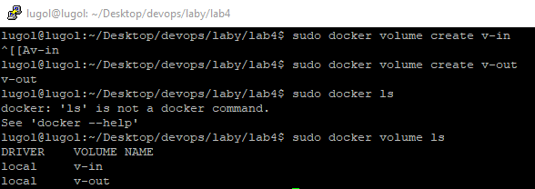

2. Stworzenie i odpalenie kontenera na bazie obrazu najnowszego ubuntu z podpiętymi woluminami:

`sudo docker run -it --name ubi --mount source=in,target=/v-in --mount source=out,target=/v-out ubuntu`
Dodatkowo zostały ponownie wykorzystane komendy instalacyjne (te same, co w laboratorium nr 3):
```
apt-get -y update
apt-get -y install sudo
apt-get -y install wget
apt-get -y install tzdata
```
Oraz komendy zawarte pod linkiem: [Link](https://docs.microsoft.com/en-us/dotnet/core/install/linux-ubuntu#2004-)
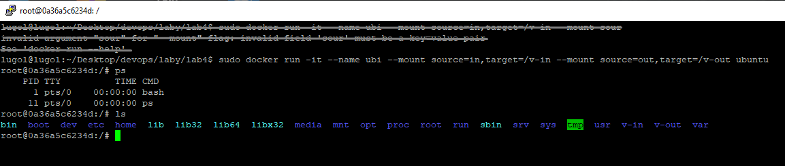

3. Sprawdzenie, czy woluminy są podpięte w drugim oknie PuTTY:

`sudo docker inspect ubu`
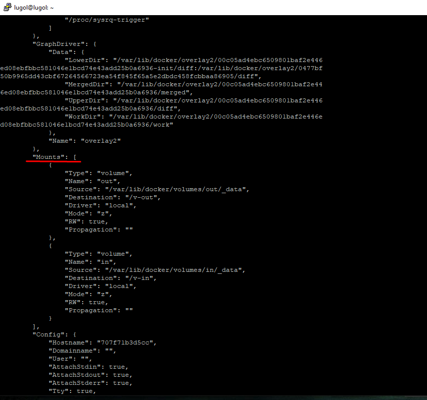

4. Przejście do katalogu */var/lib/docker/volumes/in/_data* i sklonowanie w tamtym miejscu repozytorium:

`sudo git clone https://github.com/Niemans/DevOpsLab03`
W przypadku braku możliwości dostania się do katalogu */var/lib/docker*, można:
- wejść jako root (komenda *'su'* lub *'sudo su'*)
- zmienić ustawienia katalogu *var/lib/docker*, by urzytkownicy też mogli wejsć (np. za pomocą komendy *'sudo chmod 755 /var/lib/docker'*)

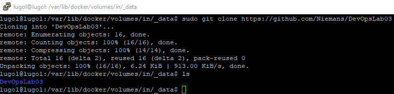

5. Sprawdzenie, czy w kontenerze widać dane repozytorium:

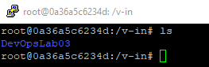

6. Zbudowanie projektu i zapisanie plików do katalogu woluminu wyjściowego:

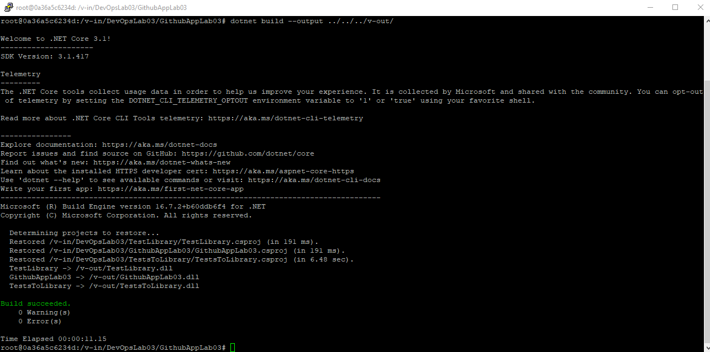


7. Sprawdzenie w katalogu */var/lib/docker/volume/out/_data*, czy widać wcześniej zapisane w kontenerze pliki:


# 2. Eksponowanie portu

1. Pobrać obraz ipers3.

`sudo docker pull iperf3`


2. Odpalenie kontenera z serwerem:

`sudo docker run  -it --rm --name=iperf3-server -p 5201:5201 networkstatic/iperf3 -s`
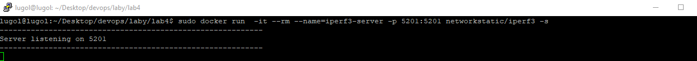

3. Sprawdzenie adresu IP serwera :

"Networks" -> "IPAddress"
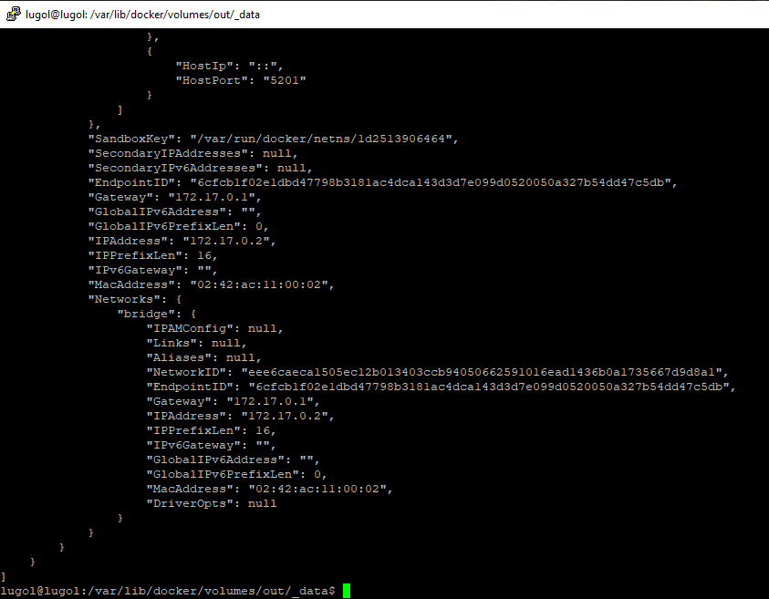

4. Połączenie się z hostem (serwer na zrzutach ekranu jest górnym oknem):
     - kontroler - kontroler:
     - 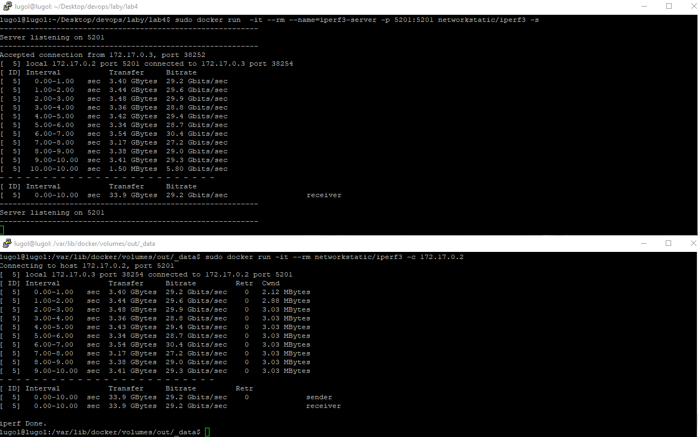
     - kontroler - host:
     - 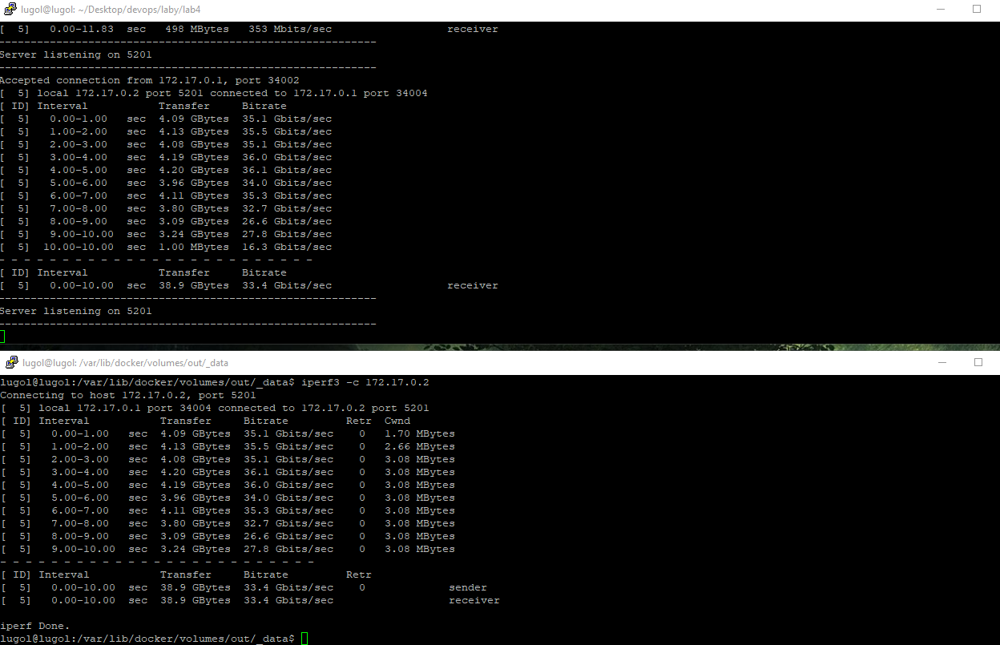
     - kontroler - poza-host (IP Wirtualnej maszyny - komenda *ifconfig* - enp0s3) 
     - 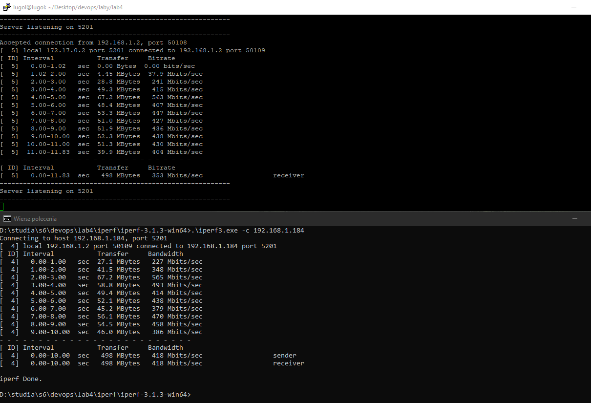
     - pobrano iperf3 na windowsa za strony: [Link](https://iperf.fr/iperf-download.php#windows)

|Wersja|Przepustowość|Jednostka|
|-|-|-|
|kontroler - kontroler|29.2| Gbits/s|
|kontroler - host|33.2|Gbits/s|
|kontroler - poza-host|418|Mbits/s|

# 3. Instancja Jenkins

1. Podążanie za dokumentacją krok po kroku: [Link]( https://www.jenkins.io/doc/book/installing/docker/)
2. Stworzenie sieci jenkinsa:

`sudo docker network create jenkins`
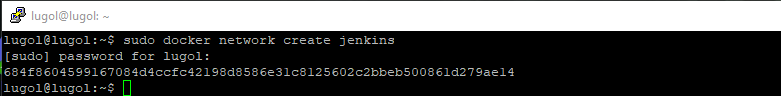

3. Pobranie i uruchomienie obrazu *dind*

```
sudo docker run \
  --name jenkins-docker \
  --rm \
  --detach \
  --privileged \
  --network jenkins \
  --network-alias docker \
  --env DOCKER_TLS_CERTDIR=/certs \
  --volume jenkins-docker-certs:/certs/client \
  --volume jenkins-data:/var/jenkins_home \
  --publish 2376:2376 \
  docker:dind \
  --storage-driver overlay2
```
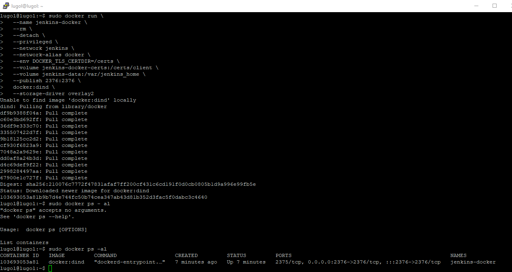

4. Stworzenie pliku *Dockerfile* dla Jenkkinsa:

```dockerfile
FROM jenkins/jenkins:2.332.2-jdk11
USER root
RUN apt-get update && apt-get install -y lsb-release
RUN curl -fsSLo /usr/share/keyrings/docker-archive-keyring.asc \
  https://download.docker.com/linux/debian/gpg
RUN echo "deb [arch=$(dpkg --print-architecture) \
  signed-by=/usr/share/keyrings/docker-archive-keyring.asc] \
  https://download.docker.com/linux/debian \
  $(lsb_release -cs) stable" > /etc/apt/sources.list.d/docker.list
RUN apt-get update && apt-get install -y docker-ce-cli
USER jenkins
RUN jenkins-plugin-cli --plugins "blueocean:1.25.3 docker-workflow:1.28"
```

5. Stworzenie obrazu dzięki dockerfile'owi:

`sudo docker build -t myjenkins-blueocean:2.332.2-1 .`
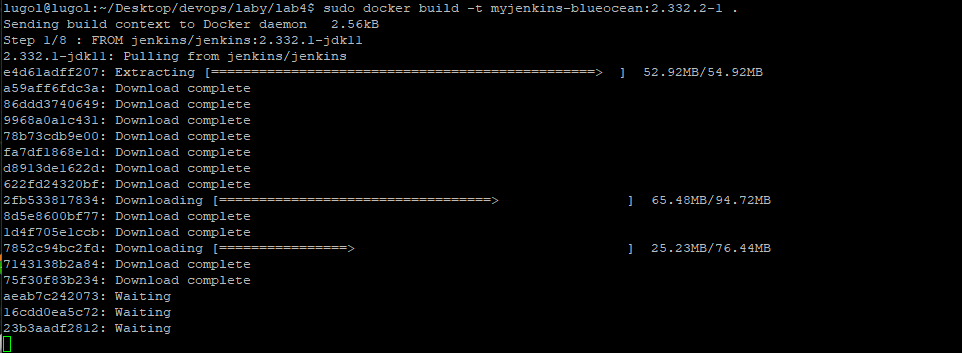

6. Sprawdzenie obrazów:

`sudo docker images`
Obraz "myjenkins-blueocean" został stworzony.
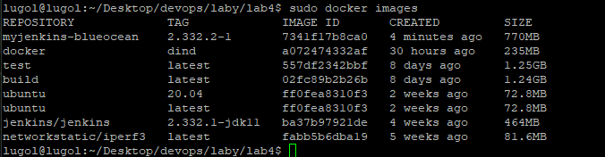

7. Odpalenie kontenera na podstawie dopiero co stworzonego obrazu:

```
docker run \
  --name jenkins-blueocean \
  --rm \
  --detach \
  --network jenkins \
  --env DOCKER_HOST=tcp://docker:2376 \
  --env DOCKER_CERT_PATH=/certs/client \
  --env DOCKER_TLS_VERIFY=1 \
  --publish 8080:8080 \
  --publish 50000:50000 \
  --volume jenkins-data:/var/jenkins_home \
  --volume jenkins-docker-certs:/certs/client:ro \
  myjenkins-blueocean:2.332.2-1 
```


8. Sprawdzenie wszystkich kontenerów:

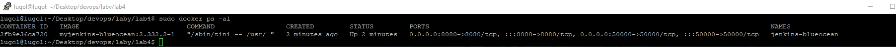

9. Podążanie za tym fragmentem dokumentacji: [Link](https://www.jenkins.io/doc/book/installing/docker/#setup-wizard)

10. znalezienie klucza do Jenkinsa:

`sudo docker exec jenkins-blueocean cat /var/jenkins_home/secrets/initialAdminPassword`

11. Odblokowanie Jenkinsa:

    - wejście w przeglądarce na: Adress_wirtualnej_maszyny:8080 (8080 jest standardowym portem dla Jenkinsa)
    - wpisanie wcześniej znalezionego hasła.
    
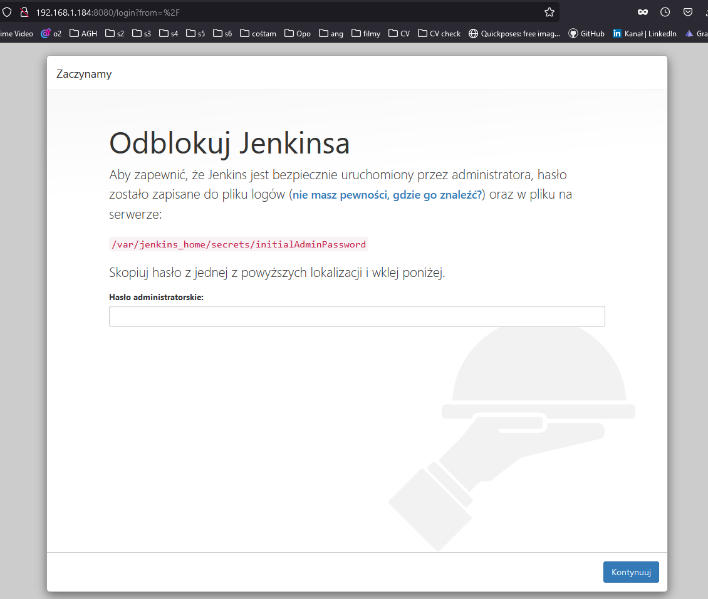

12. Stworzenie administratora i wejście do Jenkinsa:

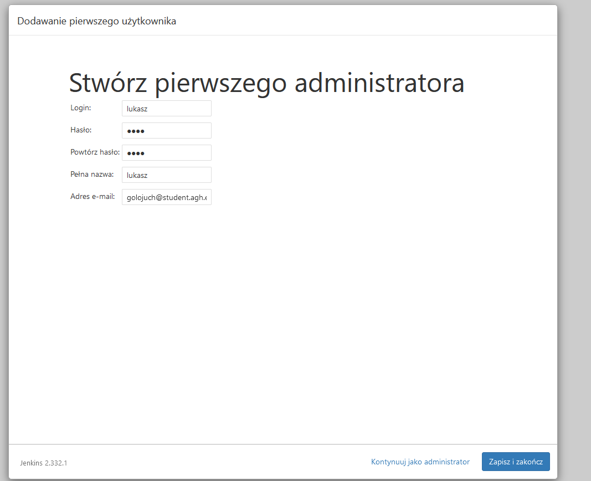
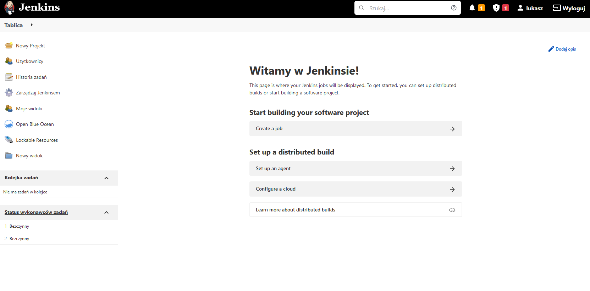