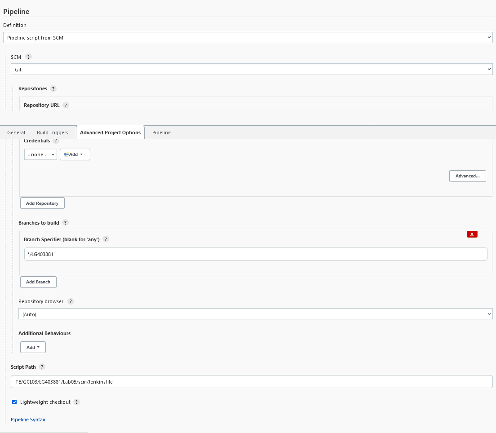
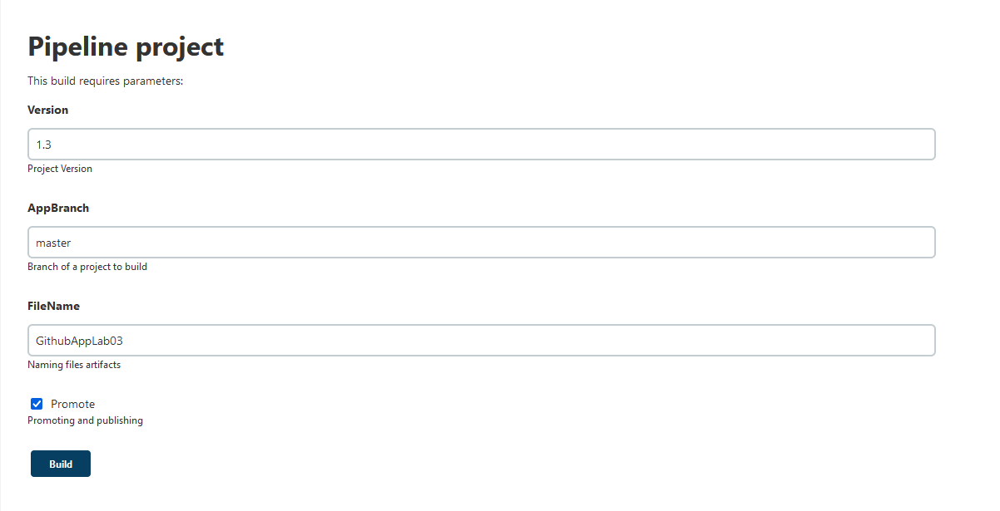
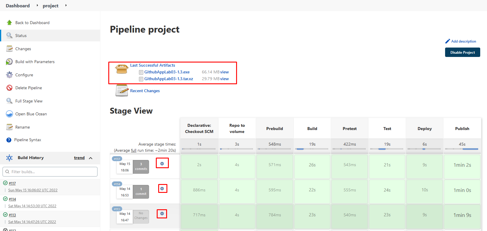
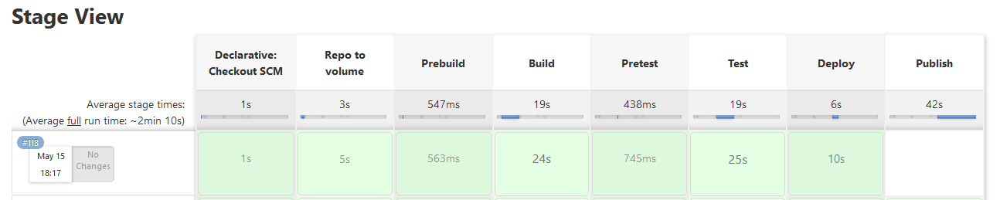
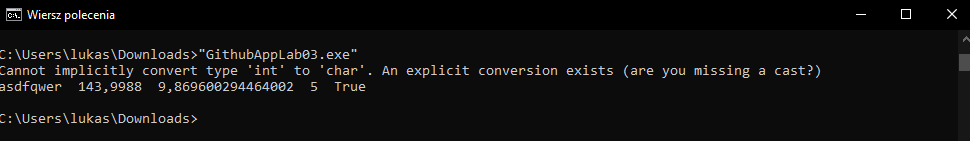
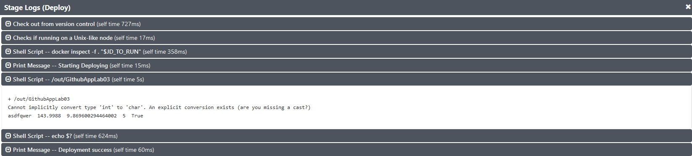
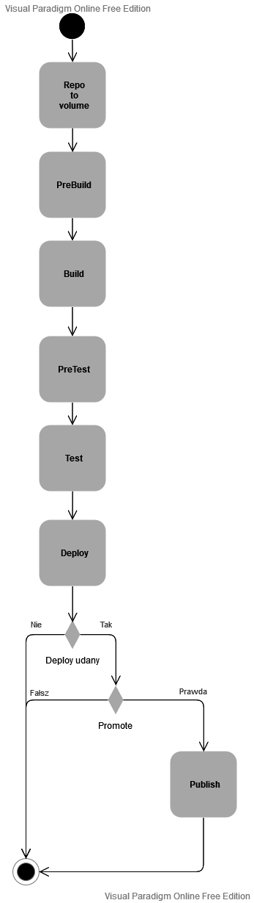
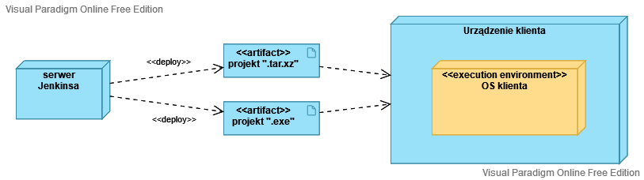

| Imie   | Nazwisko   | Data       |
|--------|------------|------------|
| Łukasz | Gołojuch   | 15.05.2022 |

# Wstęp

## Informacja wstępna
Słowo "**Projekt**" zapisany z wielkiej litery będzie odnosić się do projektu w Jenkinsie, "**projekt**" oznaczać będzie wybrany projekt z gitHuba.

## Cel Projektu
Zastosowanie przetwarzania potokowego (pipeline'a) do realizacji zadań takich jak: budowanie, testowanie, wdrożenia i publikowania wybranego na gitHubie projektu.

## Wykorzystywane technologie
1. **Jenkins**, gdzie projekt jest ustawiony jako pipeline.

2. **Docker**, na którym działa Jenkins.

3. **Github**:
    - z którego pobierane są Dockerfile'e, Jenkinsfile'a (https://github.com/InzynieriaOprogramowaniaAGH/MDO2022_S.git).
    - z którego sklonowany będzie projekt (https://github.com/Niemans/DevOpsLab05).


## Krótkie omówienie
Cały Projekt podzielony jest na mniejsze etapy (stage'e), które są łatwiejsze do realizacji. Zwiększa to nie tylko czytelność całego pipeline'u, lecz również przyspiesza debugowanie.
W tym przypadku zostały stworzone takie stage'e:

  - **Declarative: Checkout SCM** - klonowanie repozytorium, które zostało podane w ustawieniach Projektu.
  - **Repo to volume** - tworzenie voluminów wejściowego (in) i wyjściowego (out), klonowanie repozytorium z projektem i przeniesienie go do voluminu wejściowego.
  - **Prebuild** - zbudowanie obrazu dockera, który będzie wykorzystany w następnym stage'u.
  - **Build** - zbudowanie projektu (będącego w "in") i zapisanie wyniku buildu do voluminu wyjściowego.
  - **PreTest** - zbudowanie obrazu dockera, który będzie wykorzystany w następnym stage'u.
  - **Test** - Sprawdzenie, czy wszystkie testy wykonują się poprawnie w projekcie.
  - **Deploy** - uruchomienie zbudowanego projentu, by sprawdzić, czy działa.
  - **Publish** - stworzenie artefaktów i ich archiwizacja w Projekcie.

## Przygotowania wstępne
1. Trzeba mieć zainstalowanego dockera.

2. By zainstalować Jenkinsa, by ten działał, należy wykonać wszystkie punkty ze sprawozdania z lab04, z części nr 3 "Instalacja Jankins". W przypadku ponownego uruchamiania Jenkinsa, należy wykonać tylko komendy "docker run" z tej samej części. [link](https://github.com/InzynieriaOprogramowaniaAGH/MDO2022_S/blob/%C5%81G403881/ITE/GCL03/%C5%81G403881/Lab04/Sprawozdanie.md)

3. Wybierając nowy projekt należy wybrać "pipeline".

4. W ustawieniach projektu w ostatniej zakładce ("Pipeline"), należy wybrać:
    - Definition: "Pipeline script from SCM",
    - SCM: "Git",
    - Repository URL: "https://github.com/InzynieriaOprogramowaniaAGH/MDO2022_S.git" (repozytorium z wykorzystywanymi Dockerfile'ami i Jenkinsfile'em)
    - Credentials należy ustawić, jeśli repozytorium zostało zmienione na jakieś niepubliczne,
    - Branch Specifier: "*/ŁG403881" (gałąź, na na której można znaleźć potrzebne pliki),
    - Script Path: "ITE/GCL03/ŁG403881/Lab05/scm/Jenkinsfile" (ścieżka wraz z nazwą pliku Jenkinsfile'a, z którego będzie wykonywany pipeline).



5. (***nieobowiązkowe***) Jeżeli mieszanina języka polskiego i angielskiego przeszkadza, można doinstalować już na samej stronie z jenkinsem plugin "Locale plugin", który umożliwia zmianę języka. Po zainstalowaniu należy wtedy znaleźć ustawienie "Default Language" i ustawić wartość na "ENG-US". Spowoduje to zmianę języka na amerykański angielski.

# Jenkinsfile'a

W przypadku wątpliwości dotyczącej składni Jenkinsfile'a: [link](https://www.jenkins.io/doc/book/pipeline/syntax/#agent)

W przypadku potrzeby wykorzystania innych argumentów przy publikowaniu: [link](https://docs.microsoft.com/pl-pl/dotnet/core/tools/dotnet-publish)

## Przygotowania

całość Projektu w Jenkinsfile'u wykonywana jest w `pipeline{(...)}`.

Przed wykonaniem jakiegokolwiek stage'u, ustawiono agenta oraz stworzono parametry: 
```groovy
agent any
parameters {
    string(name: 'Version', defaultValue: '1.0.0', description: 'Project Version')
    string(name: 'AppBranch', defaultValue: 'master', description: 'Branch of a project to build')
    string(name: 'FileName', defaultValue: 'GithubAppLab03', description: 'Naming files artifacts')
    booleanParam(name: 'Promote', defaultValue: false, description: 'Promoting and publishing')
}
```
Dyrektywa "*agent*" określa, gdzie całość skryptu będzie wykonywana w środowisku Jenkinsa. Jest ona obowiązkowa, jednakże poprzez ustawienie jej na "*any*" powoduje wybranie podstawowego dostępnego agenta. Przy późniejszym wykorzytaniu tej dyrektywy, zostanie ona nadpisana na potrzeby konkretnego stage'a.

Dyrektywa "*parameters*" zapewnia listę parametrów, które urzytkownik może wprowadzić przy próbie zbudowania Projektu przed rozpoczęciem budowania. Są one dostępne dla każdego kroku pipeline'a dzięki objektowi "params":
 - **Version** - parametr typu string (ciąg znaków). Określa wersję opublikowanego projektu.
 - **AppBranch** - parametr typu string. Określa gałąź repozytorium projektu. Na GitHubie podstawową gałęzią jest "master".
 - **FileName** - parametr typu string. Nazwa artefaktów projektu.
 - **Promote** - parametr typu booleanParam (typ logiczny). Określa, czy wykonywać etap publikacji (Publish).

## Etapy (stage'e)

### 0. Ogólne:
Poza pierwszym stage'em wszystkie etapy zapisane są w skrypcie w sekcji `stages {(...)}`

Stage może być podzielony na dwie sekcje lub posiadać tylko pierwszą z nich:
  - "**steps**" - wykonywane są kolejne kroki, komendy. 
  - "**post**"  - wykonywane są komendy po zakończeniu działania sekcji "steps":
    - "**success**" - kroki tu wykonają się, gdy wszystkie ktoki w "steps" zakończą się powodzeniem.
    - "**unsuccessful**" - kroki tu się wykonają, gdy coś pójdzie nie tak w sekcji "steps".

Krok "echo" wypisuje ciąg znaków do terminala Jenkinsa.

Krok "sh" jest używany do wykonywania poleceń shellowych na Linuxach, BDS i MacOS-ach.

Wszystkie komendy wykonujące 'rm' są po to, by się zabezpieczyć przed niepotrzebnym nagromadzeniem plików lub by usunąć już niepotrzebny kontener.

### 1. Declarative: Checkout SCM
    
Etap ten nie znajduje się w skrypcie, jest wykonywany wcześniej.

Wszystko pod wykonanie się w tym etapie zostało już przygotowane w przygotowaniach wstępnych, w podpunkcie nr 4.Chodzi tu przede wszystkim o to, by podać Projektowi, skąd ma wziąć skrypt pipeline'u. W tym przypadku pobieramy Jenkinsfile'a z gitowego repozytorium. Gdyby jednak zamienić w "Definition" na "Pipeline script", możnaby wtedy pisać cały skrypt w samym Jenkinsie.

### 2. Repo to volumes

```groovy
stage('Repo to volume'){
    steps{
        sh 'docker volume rm in || true'
        sh 'docker volume rm out || true'
        sh 'docker volume create in'
        sh 'docker volume create out'

        sh 'rm -rf app || true'
        sh 'mkdir -p app'

        dir('app'){                  
            git branch: "${params.AppBranch}", url: 'https://github.com/Niemans/DevOpsLab05.git'
            sh 'docker container create --name rtv_agd -v in:/in busybox'
            sh 'docker cp ./. rtv_agd:/in'
            sh 'docker rm rtv_agd'
        }
    }
    post{
        success{
            echo 'Volumes made successfully \nRepository cloned and transferred to the volume successfully'
        }
        unsuccessful{
            echo 'Failed to make volumes or clone/transfer git repository'
        }
    }
}
```
W sekcji `steps`:
 - pierwsza porcja odpowiedzialna jest za usunięcie i stworzenie ponowne woluminów "in" i "out".
 - druga odpowiedzialna jest za stworzenie pustego katalogu "app"
 - trzecia najpierw zmienia katalog roboczy na "app" dzięki sekcji `dir('app')`. 
    - Klonowane jest tam repozytorium z projektem dzięki komendzie "git". Podawana jest gałąź (zawarta w parametrze) i url projektu. Gdyby projekt ten był prywatny, trzebaby było podać jeszcze "credentialsid". 
    - Tworzony jest kontener busybox połączony z voluminem "in".
    - Kontener ten kopiuje zawartość aktualnego katalogu i wkleja do katalogu woluminu "in".
    - po zakończonej pracy kontener zostaje usunięty.

W sekcji `post`:
  - zostaje wypisana stosowna wiadomość w zależności od powodzenia tego etapu.

### 3. Prebuild
```groovy
stage('Prebuild'){
    steps{
        dir('./ITE/GCL03/ŁG403881/Lab05/dockerfiles/build'){
            echo 'build image'
            sh 'docker build -t dev_build:latest . -f Dockerfile'
        }
    }
}
``` 
Komnsy w sekcji `steps`:
  - zmiana katalogu roboczego na `./ITE/GCL03/ŁG403881/Lab05/dockerfiles/build`, gdzie znajduje się dockerfile.
  - wypisanie informacji do terminala.
  - zbudowanie obrazu dockera i nadanie mu nazwy "dev_build" przy pomocy Dockerfile'a.

Obraz ten będzie służyć do zbudowania projektu. Sam dockerfile jednak nie zawiera wiele:
```dockerfile
FROM mcr.microsoft.com/dotnet/sdk:3.1
#sprawdzenie, czy dockerfile zadziałał
RUN echo '🍆 bakłażan 🍆'
```
Obrazem startowym jest obraz stworzony przez Microsoft do wykorzystywania .NET SDK (wersji 3.1, gdyż na tej wercji stworzony jest projekt). Więcej informacji na temat tego obrazu można znaleźć tu: [link](https://hub.docker.com/_/microsoft-dotnet-sdk).

### 4. Build
```groovy
stage('Build') {
  agent {
      docker {
          image 'dev_build:latest'
          args '--mount source=in,target=/in --mount source=out,target=/out -u root:root'
      }
  }
  steps {
      echo 'Starting building'
      sh 'cd /in/GithubAppLab03 && dotnet build --output /out'               
  }
  post{
      success{
          echo 'Built successfully'
      }
      unsuccessful{
          echo 'Failed to build'
      }
  }
}
```
W sekcji `agent`:
  - Został tu zmieniony agent na dockera. Środowisko wykonujące zostało zmienione na kontener stworzony na podstaiwe obrazu "dev_build".
  - dzięki dodaniu argumentów "--mount" możliwe było podpięcie woluminów do kontenera. Zostału podpięte woluminy "in" i "out"
  - polecenia dotnet wymagają często uprawnień administratora, stąd argumentem jest `-u root:root`

W sekcji `steps`:
  - przejście do katalogu z błównym plikiem projektu oraz zbudowanie projektu za pomocą `dotnet build`. Wyniki budowania zapisane są w woluminie "out".

W sekcji `post`:
  - wypisanie stosownej informacji.

### 5. PreTest
```groovy
stage('Pretest'){
    steps{
        dir('./ITE/GCL03/ŁG403881/Lab05/dockerfiles/test'){
            echo 'test image'
            sh 'docker build -t dev_test:latest . -f Dockerfile'      
        }
    }
}
```
Stege ten wygląda i wykonuje te same czynności co "Prebuild", jednakże do stworzenia obrazu wykorzystuje dockerfile'a z katalogu: `./ITE/GCL03/ŁG403881/Lab05/dockerfiles/test`. Tworzony jest obraz o naziwe "dev_test".

Wykorzystywany Dockerfile wygląda następująco:
```dockerfile
FROM dev_build:latest
#sprawdzenie, czy dockerfile zadziałał
RUN echo '🥚 jajo 🥚'
```
Podstawą tego obrazu jest poprzednio stworzony "dev_build". W ten sposób jestem pewny zachowania wszystkiego, co się stało na tym obrazie. Możliwe jednak, że możnaby wykorzystać obraz microsoftu do tego samego i wynik byłby ten sam.

### 6. Test
```groovy
stage('Test') {
    agent{
        docker{
            image 'dev_test:latest'
            args '--mount source=in,target=/in -u root:root'
        }
    }
    steps {
        echo 'Starting Testing'
        sh 'cd /in/GithubAppLab03 && dotnet test'  
    }
    post{
        success{
            echo 'Tested successfully'
        }
        unsuccessful{
            echo 'Failed to make tests'
        }
    }

}
```
W sekcji `agent`:
  - agent zmienia się na dockera, a środowisko wykonujące zostało zamienione na kontener obrazu "dev_test".
  - tym razem podpięty został tylko wylumin "in", gdyż nie było potrzeby zapisywania wyników testu.
  - polecenia dotnet wymagają często uprawnień administratora, stąd argumentem jest `-u root:root`

W sekcji `steps`:
  - przejście do katalogu z błównym plikiem projektu oraz odpalenie tesów tego projektu za pomocą `dotnet test`.

W sekcji `post`:
  - wypisanie adekwatnej wiadomości.

### 7. Deploy
```groovy
stage('Deploy'){
    agent{
        docker{
            image 'dev_test:latest'
            args '--mount source=out,target=/out'
        }
    }
    steps {
        echo 'Starting Deploying'
        sh '/out/GithubAppLab03'
        script{
            if(sh (script: 'echo $?',returnStdout: true).trim() != "0"){
                currentBuild.result = 'ABORTED' 
            }
        }
    }
    post{
        success{
            echo "Deployment success"
        }
        unsuccessful{
            echo "Failed to deploy"
            error('Doployment failue')
        }
    }
}
```
W sekcji `agent`:
  - agent zmienia się na dockera, a środowisko wykonujące zostało zamienione na kontener obrazu "dev_test". Nie ma potrzeby tworzyć nowego obrazu, a trzeba się dostać do woluminu "out", więc wykorzystany zostaje ten obraz.
  - podpięty został wolumin "out", gdyż to w nim znajdują się pliki zbudowanego projektu.

W sekcji `steps`:
  - zostaje odpalony plik wykonywalny "GithubAppLab03".
  - w sekcji "script" (zmienia składnię "Declarative Pipeline" na "Script Pipeline"):
    - sprawdzane jest, czy odpalony wcześniej program zwraca "0". jeśli nie (wykrzuciło niechciany błąd), jeśli nie, to aktualny build Projektu zostaje uznany za przerwany dzięki `currentBuild.result = 'ABORTED'`.

W sekcji `post`:
  - zostaje wypisana adekwatna wiadomość.
  - w przypadku wykonania się `currentBuild.result = 'ABORTED'` wykona się sekcja `unsuccessful`, która dodatkowo wysyła error.

### 8. Publish
```groovy
stage('Publish'){
    when{
        expression{
            return params.Promote == true; 
        }
    }
    agent{
        docker{
            image 'mcr.microsoft.com/dotnet/sdk:3.1'
            args '--mount source=in,target=/in --mount source=out,target=/out -u root:root'
        }
    }
    steps{
        echo 'Starting Publishing'
        sh 'rm -rf /out/publish || true'
        sh 'mkdir /out/publish'

        sh 'cd /in/GithubAppLab03 && \
            dotnet publish GithubAppLab03.csproj -c Release \
            -r linux-x64 -p:PublishSingleFile=true -p:UseAppHost=true \
            --self-contained true --output /out/publish'
        sh "cd /out/publish/ && tar -czvf ${params.FileName}-${params.Version}.tar.xz /out/publish/*"

        sh 'cd /in/GithubAppLab03 && \
            dotnet publish GithubAppLab03.csproj -c Release \
            -r win-x64 -p:PublishSingleFile=true -p:UseAppHost=true \
            --self-contained true --output /out/publish'
        sh "mv /out/publish/GithubAppLab03.exe /out/publish/${params.FileName}-${params.Version}.exe"

        sh "rm ${WORKSPACE}/publish/${params.FileName}* || true"
        sh "rm ${WORKSPACE}/publish/publish/${params.FileName}* || true"

        sh "cp -R /out/publish/*.xz ${WORKSPACE}/publish/"
        sh "cp -R /out/publish/*.exe ${WORKSPACE}/publish/"

        archiveArtifacts 'publish/*'
    }
    post{
        success{
            echo "Publishment success"
        }
        unsuccessful{
            echo "Failed to publish"
        }
    }
}
```
Sekcja "**when**" sprawdza, czy każdy warunek wewnątrz jest prawdą. W przypadku znalezienia fałszu, dany stage się nie wykona.

Zmienna `${WORKSPACE}` jest jedną z podstawowych zmiennych Jenkinsa i wyznacza ona absolutną ścieżkę do katalogu "workspace".  


W sekcji `when`:
  - sprawdzany jest, czy paramets "Promote" jest prawdą. Jeśli nie, publish nie następuje, gdyż tego właśnie sobie życzy urzytkownik.

W sekcji `steps`:
  - w pierwszej części usuwany i tworzony jest nowy katalog w woluminie "out", do którego przesyłane będą pliki do publikacji.
  - w drugiej części w katalogu z głównym plikiem projektu następuje stworzenie pliku do publikacji za pomocą komendy `dotnet publish` dla środowiska "linux x64":
    - zaznaczony plik projektu do publikacji,
    - `-c` definiuje konfiguracje buildu przy publikowaniu. Została wybrana konfiguracje "Release", gdyż będzie to wersja wypuszczana dla innych.
    - `-r` publikuje aplikację dla danego "runtime". Wybrany został "linux-x64"
    - `--self-contained` - publikuje środowisko uruchomieniowe .NET z aplikacją, więc środowisko to nie musi być zainstalowane na maszynie docelowej,
    - `-p` jest to sposób odwołania się do danych właściwości:
      - `PublishSingleFile` - pakuje aplikacje do pojedynczego pliku (specyficznego dla danej platformy). Wcześniej ustalona została platforma, więc można było to wykorzystać.
      - `UseAppHost` - jest to w tym przypadku niezbędny parametr, by można było dodać "--self-contained",
    - `--output` - przesyłą plik z programem do podanego katalogu
    - przy takim tworzeniu publisha stworzony został plik wykonywalny dla linuxa (bez typu)
  - dodatkowo tworzony jest plik .pdb (Program database), który przechowuje informacje debugowania programu. Nie ma potrzeby publikowania go, więc został usunięty.
  - plik wykonuwanly programu zastał zapakowany do pliku tar.xz o nazwie zbudoowanej z parametrów określonych przez urzytkownika: "\<nazwa>-\<wersja>.tar.xz"
  - w trzeciej części najpierw sworzony jest plik do publikacji tyle że dla środowiska "windows x64":
    - `-r` wybrane zostało "win-64x",
    - został stworzony plik z o typie ".exe".
  - dodatkowo został stworzony plik .pdb, jednakże teraz już wszystkie pliki się wyróżniają końcówkami, więc nie ma potrzeby usuwania pliku.
  - za pomocą komendy "mv" została zmieniona nazwa pliku na "\<nazwa>-\<wersja>.exe"
  - w czwartej części zostają usunięte wszystki pliki w katalogu ${WORKSPACE}/publish, które zaczynają się od "NameFile"  - jednego z parametrów. Jest to na wszelki wypadek, by nie publikować artefaktów wielu plików .tar.xz i wielu plików .exe, lecz tylko najnowszą wersję.
  - W piątej części, po wyczyszczeniu katalogów nowe pliki do publikacji zostają tam przeniesione.
  - w ostatniej części zostaje wykoanan komenda Jenkinsa, która archiwizuje artefakty, by te były widoczne w projekcie.

W sekcji `post`:
  - zostaje wypisana adekwatna wiadomość.

# Wyniki

## Jenkinsfile

W przypadku powodzenia budowania Projektu i ustawienia danych parametrów w taki sposób:



Wynik powinien wyglądać następująco:



Gdzie miejsce z możliwością pobrania artefaktó zostały zakreślone na czerwono (możliwe, że będzie trzeba odświerzyć stronę).

Przy zmienie parametru "Promote" na "false", wynik powinien wyglądać tak:



## wypróbowanie pliku ".exe":

1. Pobranie pliku ".exe" poprzez kliknięcie na ten plik w liście artefaktów.
2. Przejście do folderu "Downloads" w wierszu poleceń.
3. Odpalenie programu:



Dokłanie taka sama wiadomość została wypisana w stage'u "Deploy":



# Uwagi

1. W przypadku działania na Ubuntu 20.04.3 może zajść błąd "error during connect: Get "LINK": dial tcp: lookup docker: Temporary failure in name resolution".
    - Nie znam przyczyny tego błędu ani jego rozwiązania. Przy zmianie maszyny z tego Ubuntu na Fedorę, błąd się już więcej nie pokazał.
2. W przypadku niedziałania linijki nr 23: `git branch: "${params.AppBranch}", url: 'https://github.com/Niemans/DevOpsLab05.git'`
    - Możliwe jest to, że trzeba doinstalować plugin do Jenkinsa.

# Diagramy

## Diagram aktywności:



## Diagram wdrożenia

