| Imie   | Nazwisko   | Data       |
|--------|------------|------------|
| Łukasz | Gołojuch   | 15.05.2022 |

# 1. Przygotowanie systemu pod uruchomienie

## I. Maszyny wirtualne z Fedorą

1. Należy pobrać obraz fedory ze strony: [link](https://getfedora.org/en/server/download/)
2. Konfigurowanie przy instalacji:

  - UstawienieUstawienie klawiatury najepiej takie, by zawierało polskie znaki, np. Polish-legacy,
  - Język pozostawić na amerykańskim angielskim,
  - Wybrać minimalną instalację w "Software Selection",
  - Stworzyć urzytkownika z możliwościami administratorskimi, root jest niepotrzebny,

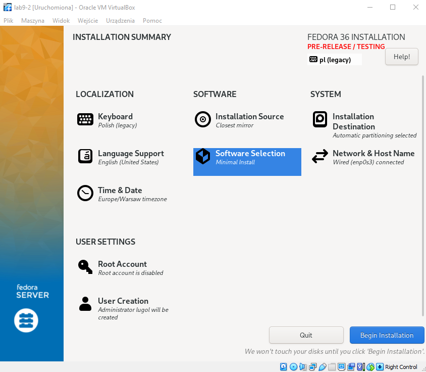

3. Poczekać na zakończenie instalacji i wciśnięcie "Reboot System".
4. Należy przygotować rónież drugą maszynę wirtualną w analogiczny sposób, lub sklonować tę dopiero stworzoną.

## II. Serwer nginx
Ta część odbywa się na VM nr 1:
1. Maszyna wirtualna nr 1 posłuży jako serwowanie repozytorium przez HTTP. Został wybrany serwer nginx. By jednak zainstalować nginx tak, by działał, należy wykonać komendy:

```
sudo dnf module enable nginx:mainline
sudo dnf install nginx
```

2.  Można sprawdzić wersję zainstalowanego nginx-a za pomocą `nginx -v`, a jeśli komenda działa, to można go włączyć:
```
sudo systemctl enable nginx --now
``` 
3. Na koniec należy skonfigurować firewalla, by ten pozwolił użytkownikowi na połączenie się i pobieranie plików:
```
sudo firewall-cmd --permanent --zone=public --add-service=http
sudo firewall-cmd --permanent --zone=public --add-service=https
sudo firewall-cmd --reload
```

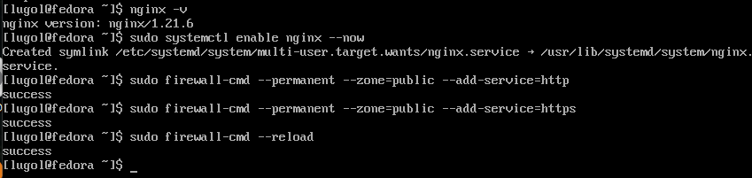

## III. Wspólna sieć NAT
1. Aby maszyny wirtualne się widziały, należy dodać je do wspólnej sieci. Trzeba więc ją najpierw utworzyć w VirtualBox-ie (kroki na poniższym obrazku):

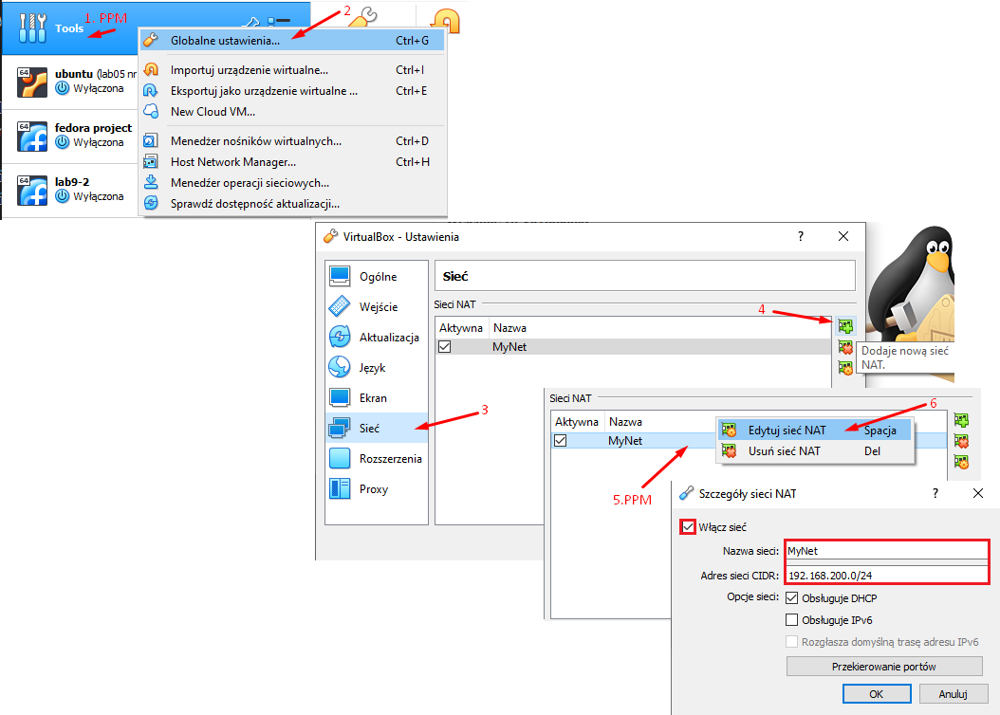

2. Jeśli maszyny wirtualne są uruchomione, należy nie przez VB Menadżera wejść w ustawienia danych maszyn, a w oknie maszyny, z zakładki maszyna wybrać "Ustawienia":

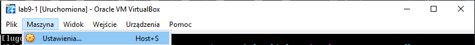

3. W zakładce "Sieć" zmienić z "NAT" na "Sieć NAT" oraz wybrać utworzoną przez siebie sieć:

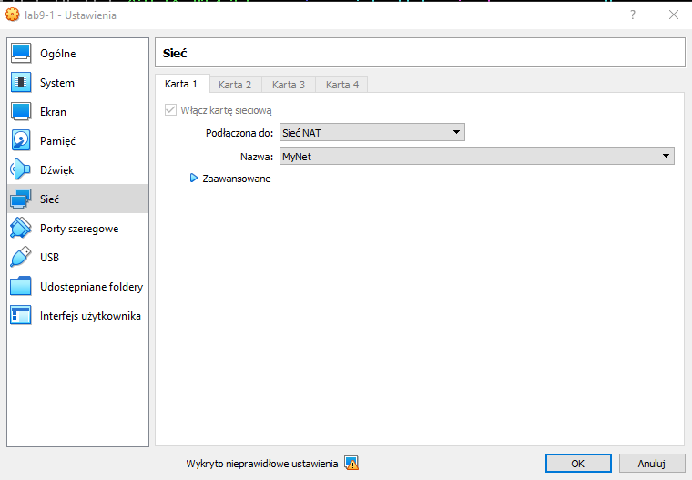

4. Przypomnienie - należy podpiąć do tej sieci NAT obie maszyny wirtualne.
5. Po wykonianiu tego można sprawdzić, czy maszyny się widzą. Najłatwiej tego dokonać wykonując komendę `ping <sieć>` do maszyny z nginxem, czyli od VM nr 2 do VM nr 1. Należy jednak najpierw sprawdzić adres ip sieci na maszynie z serwerem. Dokonać tego można za pomocą `ip addr` lub `ifconfig` (jeśli był dodatkowo pobrany). W tym wypadku adres to `192.168.200.7`:

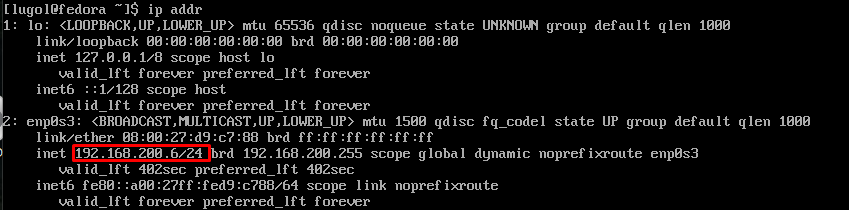

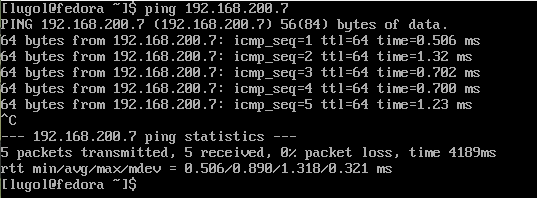

6. W przypadku powodzenia oznacza to, że maszyny się widzą.

## IV. Umieszczenie artefaktu z projektu na serwerze HTTPS
Ta część odbywa się na VM nr 1:
1. By umieścić jakiekolwiek pliki na serwerze, najpierw trzeba wiedzieć gdzie. Sprawdzić to można w pliku `/ect/nginx/nginx.conf`:

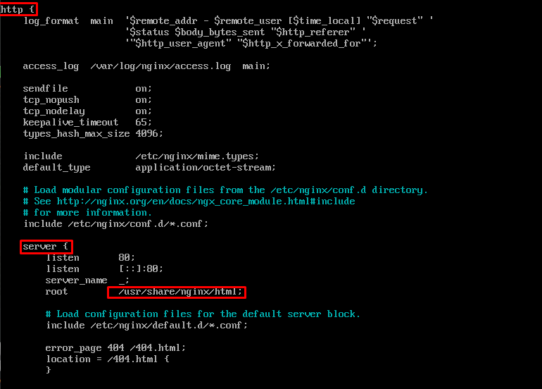

2. Wszyło, że jest to katalog `usr/share/nginx/html`. Trzeba tam więc przejść (`cd usr/share/nginx/html`). Trzeba jednak zainstalować polecenie, dzięki któremu się pobierze artefakt: `sudo dnf install wget`.
3. Artefakt został zapisany przeze mnie na google drive'ie. Link do pliku: [link](https://drive.google.com/file/d/1mxrUVIqPTYhsj5M2kgdXKEBkDRqeRBqS/view?usp=sharing). Jest on za duży, by google go zbadało, więc by go z tamtąd pobrać, należy wprowadzić tę dość długą komendę:
```
wget --load-cookies /tmp/cookies.txt "https://docs.google.com/uc?export=download&confirm=$(wget --quiet --save-cookies /tmp/cookies.txt --keep-session-cookies --no-check-certificate 'https://docs.google.com/uc?export=download&id=1mxrUVIqPTYhsj5M2kgdXKEBkDRqeRBqS' -O- | sed -rn 's/.*confirm=([0-9A-Za-z_]+).*/\1\n/p')&id=1mxrUVIqPTYhsj5M2kgdXKEBkDRqeRBqS" -O GithubApp03-1.3.tar.xz && rm -rf /tmp/cookies.txt
```
4. Zawiłość tego spowodowane dodatkowym pytaniem od google, czy na pewno chce się pobrać dany plik, gdyż moze być on niebezpieczny. `-O` daje możliwość ustawienia nazwy pliku pobranego. próba pobierania powinna wyglądać następująco:

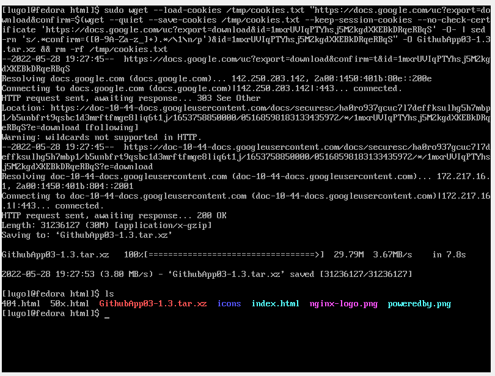

5. Plik pobrany waży 29.79, a google wskazuje, że plik do google drive'ie waży podobnie:

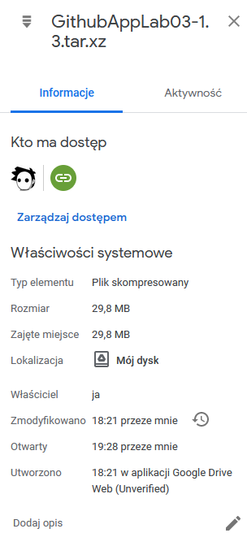

6. By jednak ten plik był możliwy do pobrania dla każdego, należy zmienić mu jeszcze uprawnienia: 
```
chmod 777 GithubApp03-1.3.tar.xz
```

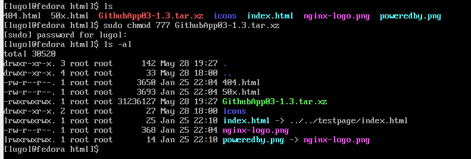

## V. Pobranie artefaktu z serwera:
Ta część odbywa się na VM nr 2:

1. W przypadku wykorzystania komendy `wget`, należy najpierw ją zainstalować na VM nr 2: `sudo dnf install wget`, a następnie wykonać komendę:
```
wget --user-agent="Mozilla" http://192.168.200.7/GithubApp03-1.3.tar.xz
```
2. W przypadku niepowodzenia z wykorzystaniem tej komendy (mi wyrzucało błąd: "Permission denied"), można spróbować wykorzystać komendę:
```
curl -LO 'http://192.168.200.7/GithubApp03-1.3.tar.xz'
```
3. Ze względu na niepowodzenie wgeta, dalszą część będę robić właśnie dzięki komendzie `curl`

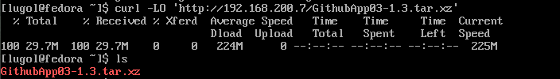

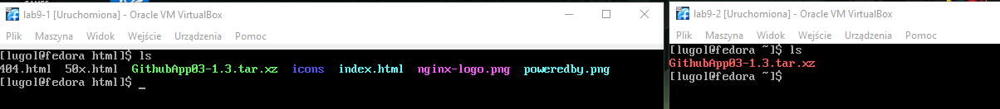


## V. Sprawdzenie działania artefaktu:
Ta część odbywa się na VM nr 2:

1. By rozpakować program, należy najpierw zainstalować program wypakowujący: `sudo dnf install tar`.
2. Wypakowanie wykonuje się następująco:
```  
tar -xf GithubApp03-1.3.tar.xz
```
3. Wewnątrz znajdowało sie: 'out/publish/GithubAppLab03'.
4. Uruchomienie programu (wyświetla dokładnie to samo, co zawsze):

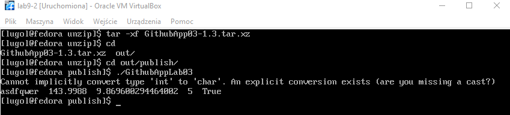

# 2. Instalacja nienadzorowana
Ta część prowadzona jest na VM nr 2.

1. Lokalizacja i nazwa pliku jest następująca: `/root/anaconda-ks.cfg`

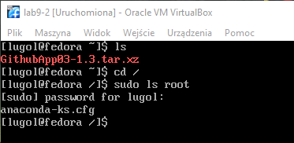

2. Dodane elementy do pliku:
  - niezbędne dependencje:
```
%packages
@^minimal-environment
curl

%end
```
  - zdefiniowanie repozytoriów:
```
# Repo
url --mirrorlist=http://mirrors.fedoraproject.org/mirrorlist?repo=fedora-$releasever&arch=x86_64
repo --name=updates --mirrorlist=http://mirrors.fedoraproject.org/mirrorlist?repo=updates-released-f$releasever&arch=x86_64
```
  - pobieranie artefaktu:
```
%post
curl -LO 'http://192.168.200.7/GithubApp03-1.3.tar.xz'

%end
```

# 3. Infrastructure as a code
1. Plik "anaconda-ks.cfg" został umieszczony w repozytoriach za pomocą komend gitowych:
https://github.com/InzynieriaOprogramowaniaAGH/MDO2022_S/blob/%C5%81G403881/ITE/GCL03/%C5%81G403881/Lab09/anaconda-ks.cfg oraz https://github.com/Niemans/DevOpsLab05/blob/master/anaconda-ks.cfg.
2. Stworzenie nowej maszyny wirtualnej, na której przed rozpoczęciem konfiguracji przed instalacją należy wcisnąć "Tab", a następnie wpisać:
```
vmlinuz initrd=initrd.img inst.stage2=hd:LABEL=Fedora-S-dvd-x86_64-36 rd.live.check quiet inst.ks=https://raw.githubusercontent.com/InzynieriaOprogramowaniaAGH/MDO2022_S/ŁG403881/ITE/GCL03/ŁG403881/Lab09/anaconda-ks.cfg
```
3. W przypadku braku możliwości wpisania polskich liter (po to plik został dodany na drugie repozytorium):
```
vmlinuz initrd=initrd.img inst.stage2=hd:LABEL=Fedora-S-dvd-x86_64-36 rd.live.check quiet inst.ks=https://raw.githubusercontent.com/Niemans/DevOpsLab05/master/anaconda-ks.cfg
```

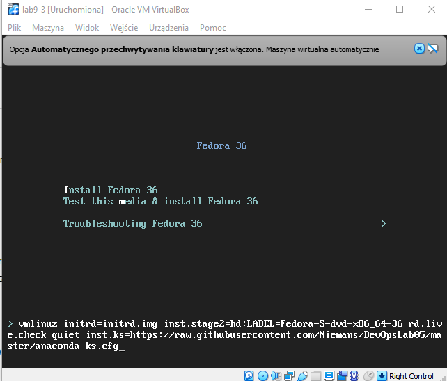

4. Po Wciśnięciu "Enter" zaczyna się instalacja. Pomyślna instalacja kończy się następująco:

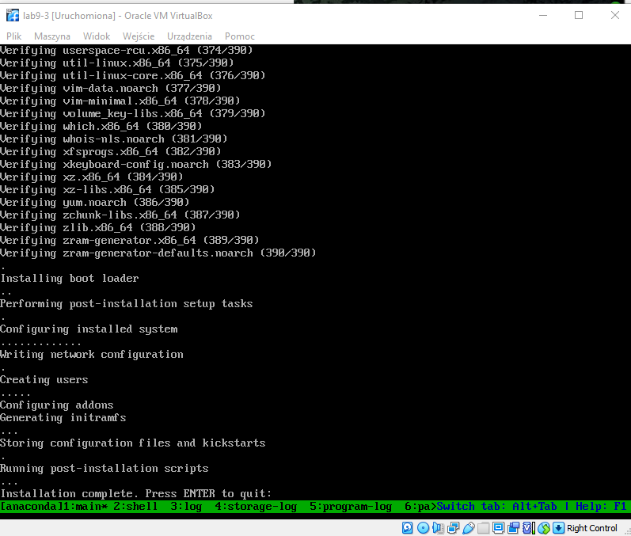

5. Po wciśnięciu "Enter" należy wyłączyć szybko maszynę i usunąć płytkę instalacyjną '.iso'. Po wykonaniu tego można bezpiecznie ponownie włączyć maszynę. Wynik powienien wyglądać następująco po odpaleniu maszyny i przejściu do katalogu `/`:

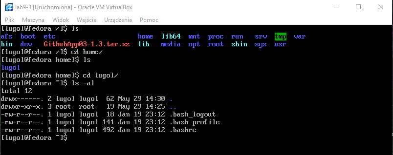

6. Nie udało mi się połączyć pliku odpowiedzi z ISO instalacyjnym.