| Imie   | Nazwisko   | Data       |
|--------|------------|------------|
| Łukasz | Gołojuch   | 15.05.2022 |

Zadania były przeprowadzone na Ubuntu.

# 1. Instalacja klastra Kubernetes:
następujące kroki były wykonywane na podstawie instrukcji na tej stronie: [link](https://minikube.sigs.k8s.io/docs/start/)
 - Wykorzystano do tego komendy:
```
curl -LO https://storage.googleapis.com/minikube/releases/latest/minikube-linux-amd64
sudo install minikube-linux-amd64 /usr/local/bin/minikube
```
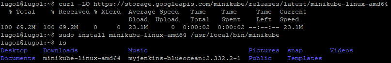
- wersję można sprawdzić za pomocą komendy `kubectl version --short` (jeśli nie działą, możliwe, że zostało już zamienione i wystarczy zapisać `kubectl version`):
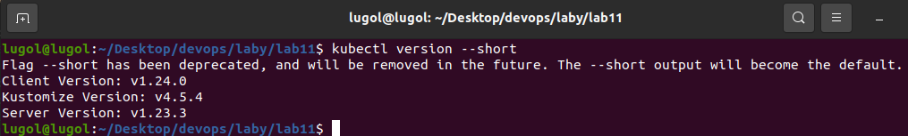
 - by móc uruchomić klaster, trzeba najpierw dać uprawnienia urzytkownikowi, by tego dokonał:
 `sudo usermod -aG docker $USER && newgrp docker`, gdzie  "$USER" należy zaminieć na nazwę urzywanego urzytkownika.
 - następnie można uruchomić klaster za pomocą: `minikube start`.
 - sprawdzenie poprawnego działania można za pomocą: `minikube dashboard`.
 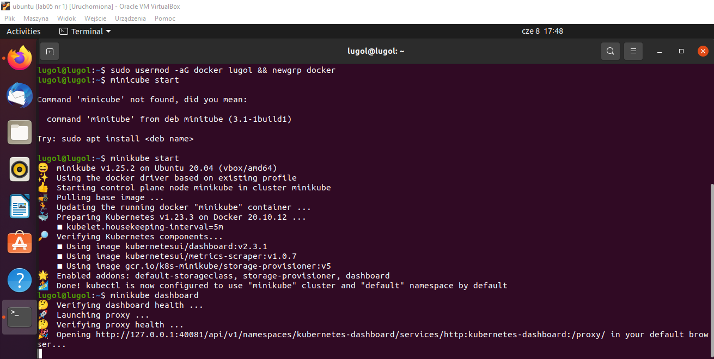
 - dashboard uruchomi automatycznie przeglądarkę na Wirtualnej maszynie, jeśli ta ma ustawioną jakąkolwiek jako podstawową. Jeśli nie, to zawsze wypisuje URL.
 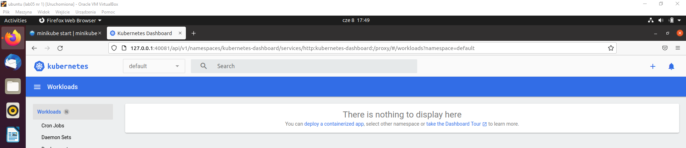
 - możne również wywołać komendę `alias kubectl="minikube kubectl --"`, która może tylko wspomóc na początku.
# 2. Analiza posiadanego kontenera i uruchomienie oprogramowania:
Projekt dotnet nie udostępniał portu do deploymentu, więc został on zmieniony na obraz nginx.
 - jeśli nie ma się w dockerze obrazu nginxa, należy go utworzyć dzięki komendzie: `sudo docker pull nginx:latest`
 - uruchomienie nginxa na stosie za pomocą komendy:
    ```
    minikube kubectl run -- <nazwa-wdrożenia> --image=<obraz-docker> --port=<wyprowadzany port> --labels app=<nazwa-wdrożenia>
    ```
    gdzie:
    - nazwa-wdrożenia można dać dowolną,
    - obraz-docker należy dać taką, jak się nazywa obraz nginxa

    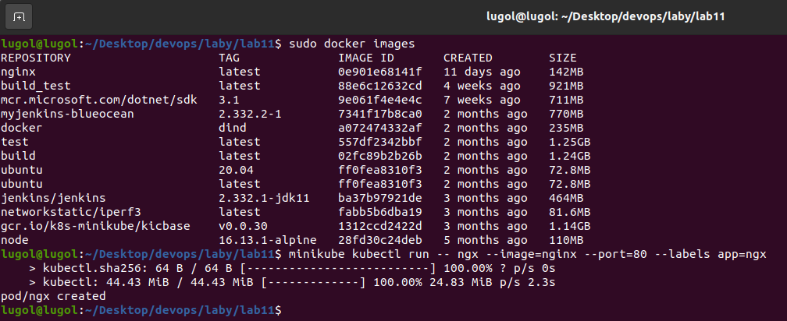
 - wyniki tego można zobaczyć również na stronie dashboardu:
 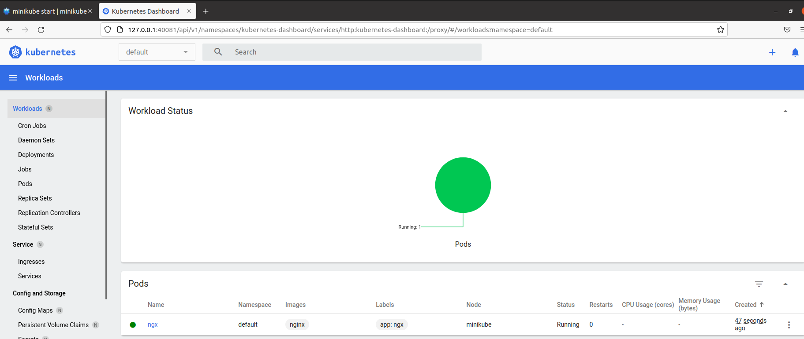
 - można też sprawdzić, czy nginx rzeczywiście działa na localhost:80
  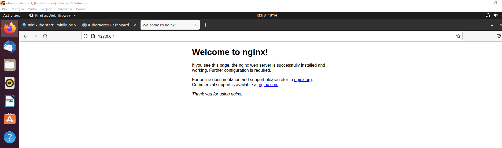
 - można też wprowadzić inny port, na którym będzie się dało zobaczyć funkcjonalność za pomocą port-forwardingu komendą:
    ```
    kubectl port-forward <nazwa-wdrożenia> <LO_PORT>:<PODMAIN_CNTNR_PORT>
    ```
    gdzie:
      - nazwa-wdrożenia musi być taka, jak przy wcześniejszej komendzie,
      - LO_PORT jest nowym portem,
      - PODMAIN_CNTNR_PORT jest portem podstawowym, gdzie w tym przypadku jest port 80.

    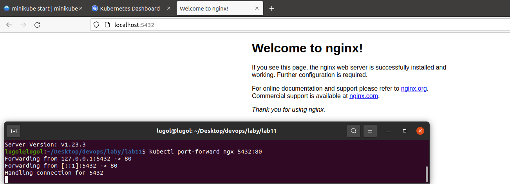
 - można zobaczyć też pods, czy widać tam nginxa:
 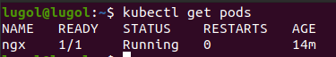
# 3. Przekucie wdrożenia manualnego w plik wdrożenia (wprowadzenie)
 - stworzenie pliku .yaml, w którym jest zawarte:
 ```yaml
apiVersion: apps/v1
kind: Deployment
metadata:
  name: nginx-deployment
spec:
  selector:
    matchLabels:
      app: nginx
  replicas: 2
  template:
    metadata:
      labels:
        app: nginx
    spec:
      containers:
      - name: nginx
        image: nginx
        ports:
        - containerPort: 80

 ```
 - następnie należy napisać komendę:
 ```
 kubectl apply -f plik.yaml
 ```
 - gdy się to zrobi, widać w pods, ze zostało to utworzone:
 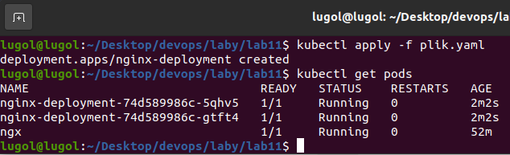
 - Końcowo można zobaczyć na stronie z `minikube dashboard` zmianę:
  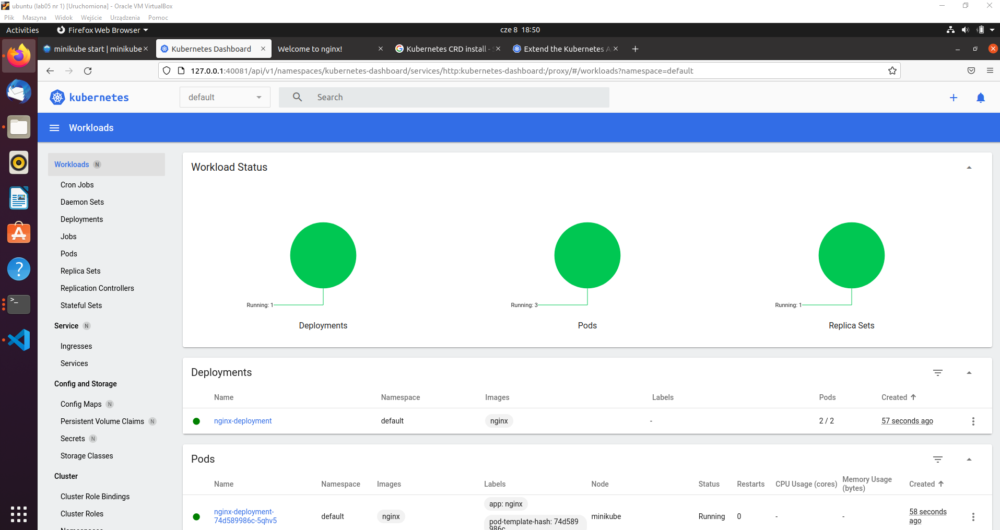
  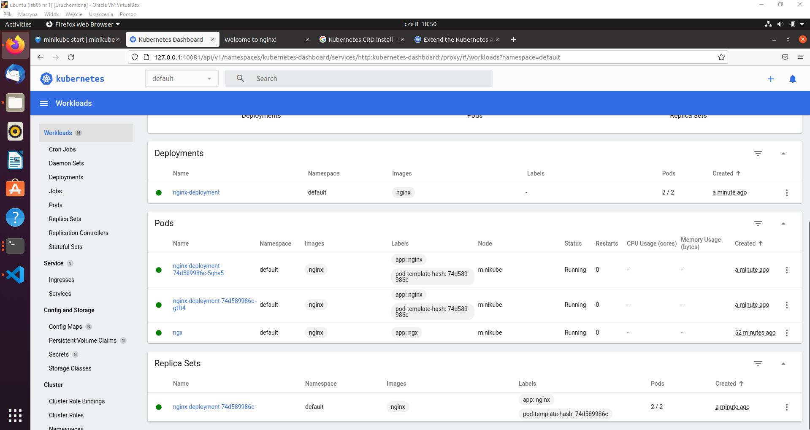