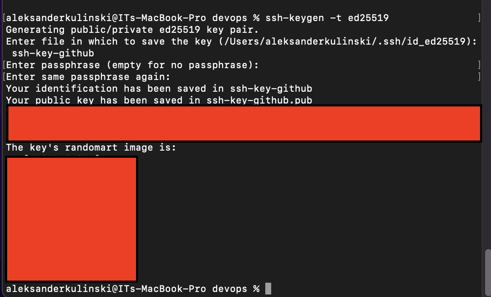
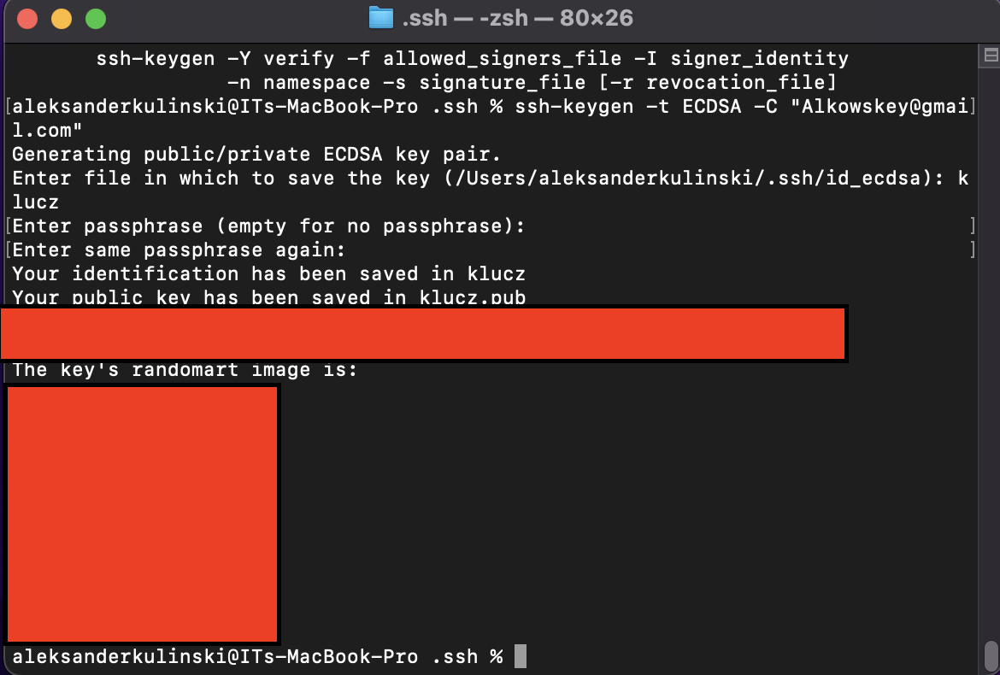
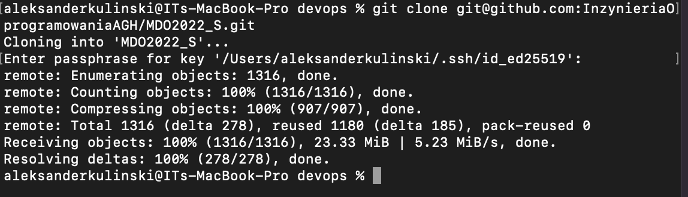
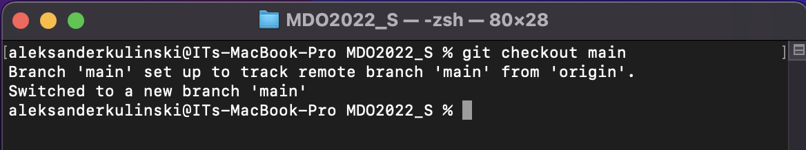
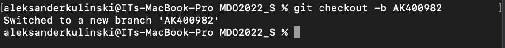
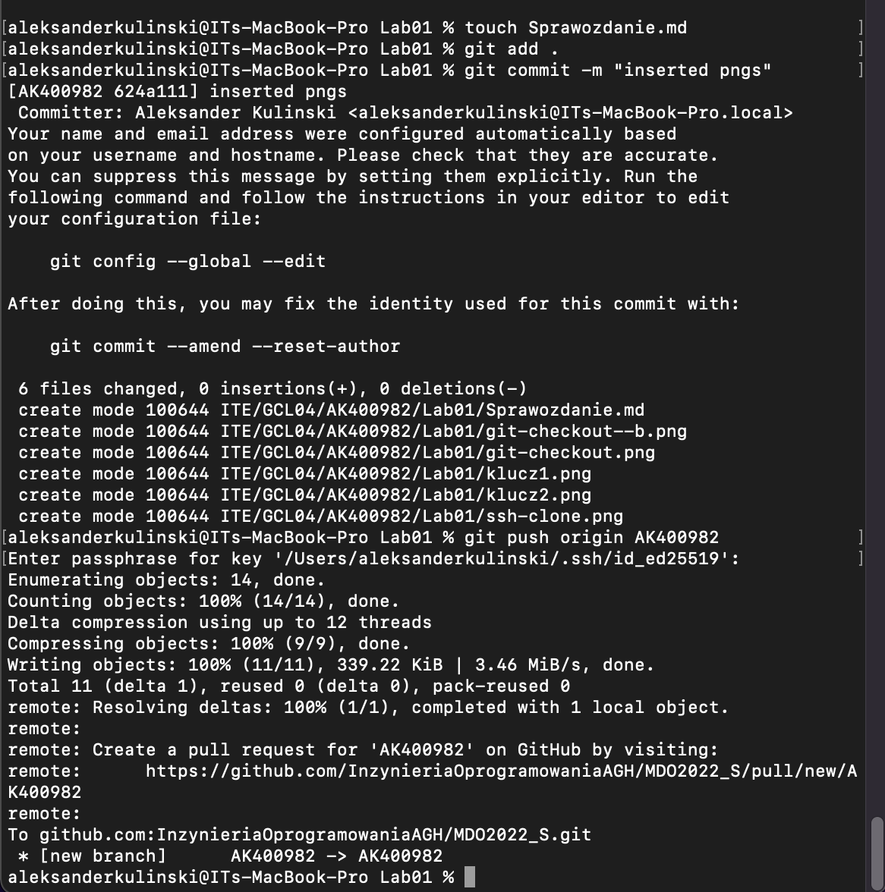

# Sprawozdanie z Lab01
### Wygenerowanie klucza ED25519 z passphrase
```
ssh-keygen -t ed25519
```


### Wygenerowanie klucza ECDSA z passphrase
```
ssh-keygen -t ECDSA -C "Alkowskey@gmail.com"
```


### Klonowanie repo SSH
```
git clone git@github.com: Inzynieria0]programowaniaAGH/MD02022_S.git
```


### Przełączenie brancha na main
```
git checkout main
```


### Stworzenie & przełączenie brancha
```
git checkout -b AK400982
```


### commit, oraz push na zdalne repo
```
git commit -m "inserted pngs"
git push origin AK400982
```

