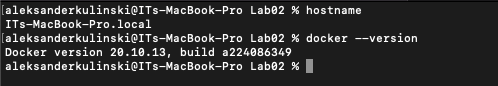
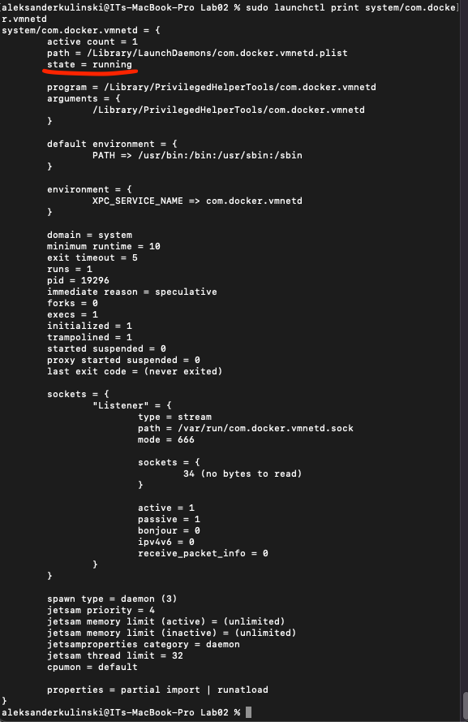
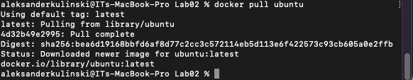
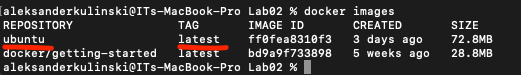

# Sprawozdanie z Lab02
### Hook sprawdzający poprawność commit-msg
```
Plik commit-msg
```
```bash
#!/bin/bash

MSG="$1"

PREFIX="AK400982"

TITLE=$(head -n 1 $MSG)
if [ "$TITLE" != "$PREFIX" ]; then
    echo "Title has to be: AK400982"
    exit 1
fi
if ! grep -qE "lab0[0-9]" "$MSG";then
    cat "$MSG"
    echo "Your commit does not contain 'lab0x'"
    exit 1
fi
```

### Wykazanie, że nie jest stosowany VM, oraz pokazanie wczesniej zainstalowanego dockera (miałem już na komputerze)
```
hostname
```
oraz
```
docker --version
```


### Wykazanie dziłajacego dockera
```
sudo launchctl print system/com.docker.vmnetd
```


### Pobranie dockerowej wersji ubuntu
```
docker pull ubuntu
```


### Wyświetlenie numeru wersji obrazu
```
docker images
```


### Założone konto na hub.docker.com

