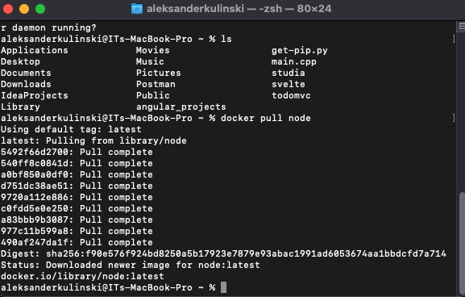
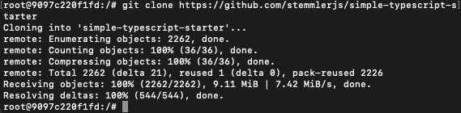
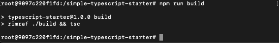
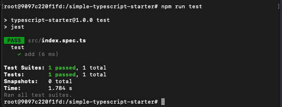
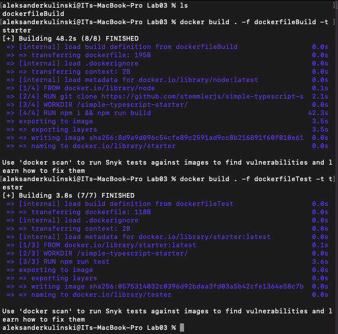
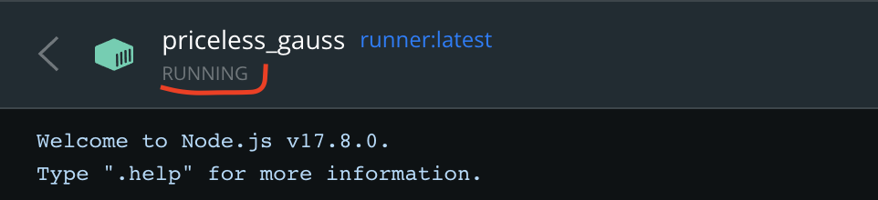

# Sprawozdanie z Lab03
### Pobranie bazowego obrazu
```
docker pull node
```


### Uruchomienie kontenera w trybie interaktywnym
```
docker run -it node /bin/bash
```


### Sklonowanie repo


### Build projektu
```
npm run build
```


### Uruchomienie testów
```
npm run test
```


### Build dockerfile

```dockerfile
FROM node
RUN git clone https://github.com/stemmlerjs/simple-typescript-starter.git
WORKDIR /simple-typescript-starter/
RUN npm i && npm run build
```

### Test dockerfile

```dockerfile
FROM starter:latest
WORKDIR /simple-typescript-starter/
RUN npm run test
```

### Zbudowanie obrazów na podstawie obu plików



### Wykazanie, że kontener działa



#### Do wykazania tej części wykorzystałem trzeci dockerfile, który został zbudowany i uruchomiony

```dockerfile
FROM tester:latest
WORKDIR /simple-typescript-starter/
RUN npm run start
```


