# Sprawozdanie z Lab04
# Woluminy
### Utworzenie i podłączenie woluminów (in, out)
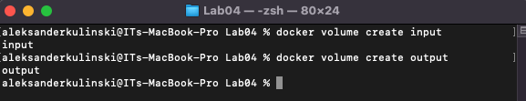
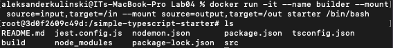

### Uruchomienie kontenera na bazie alpine z woluminem input

.png)

### sklonowanie repo do input przy użyciu kontenera z poprzednich zajęć
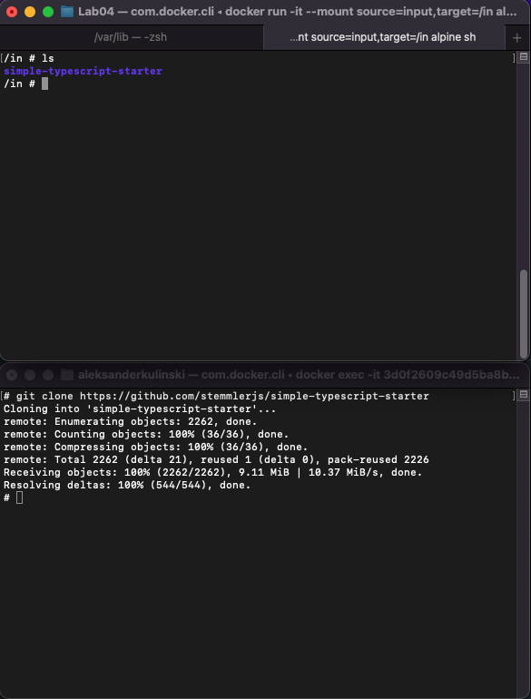

### Budowanie aplikacji z poziomu buildera
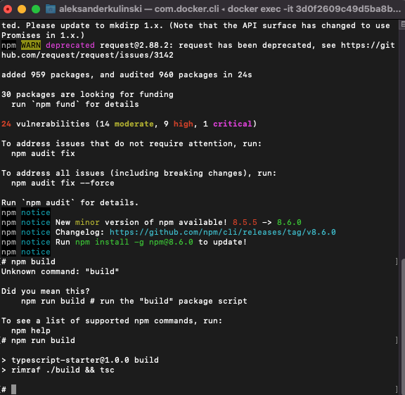

### Przeniesienie zbudowanego projektu do out
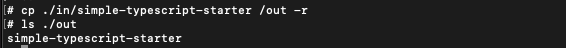

# Porty

### Stworzenie kontenerów na bazie ubuntu (server i client)
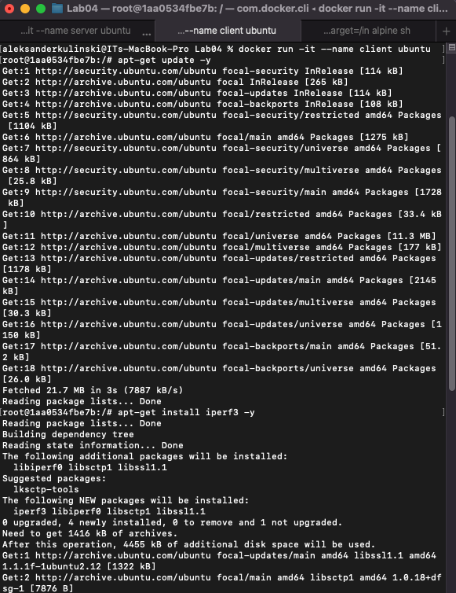

### Odpalenie serwera w jednym z kontenerów
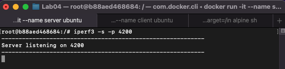

### Odpalanie testu na kontenerze klienta
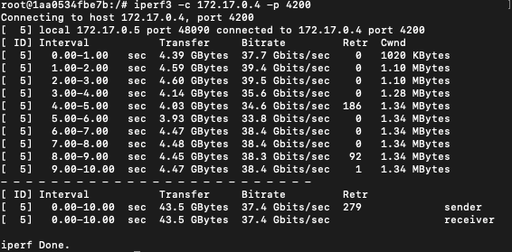

### Nie udało mi sie uruchomić iperfa ze względu na ustawienia firmowe, których nie moge zmienić
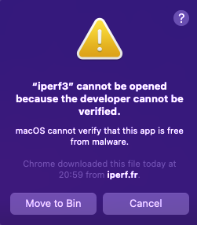

# Jenkins

### Utworzenie sieci jenkinsa
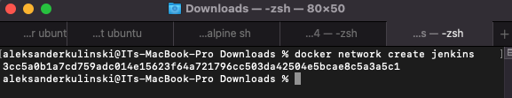

### Utworzenie kontenera docker:dind
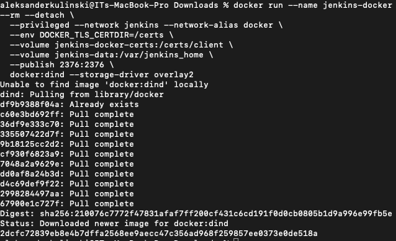

### Stworzonie dockerfile'a z dokumentacji Jenkinsa
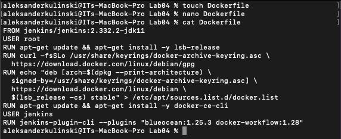

### Zbudowanie obrazu z dockerfile'a wyżej
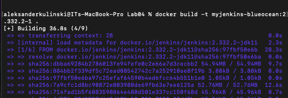

### Uruchomienie obrazu 
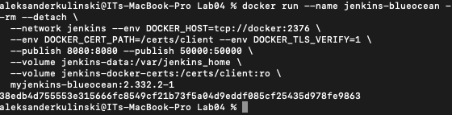

### Screen działającego kontenera
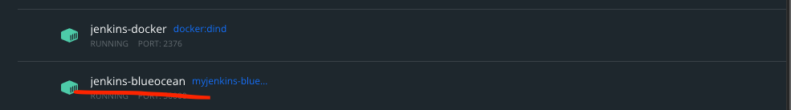

### Udokumentowane okno logowania
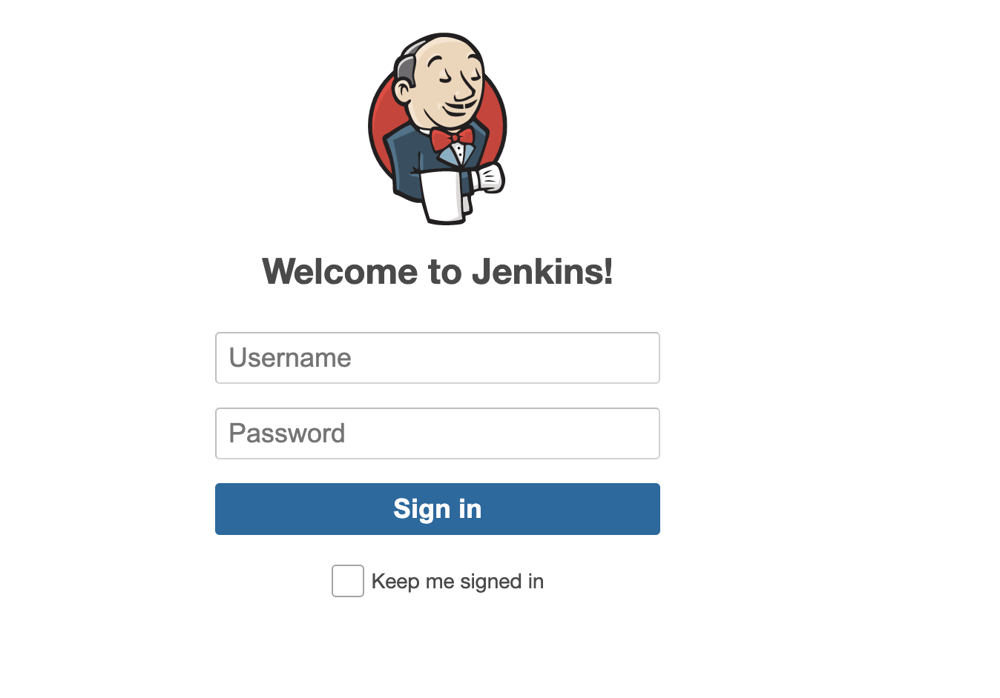
