# Sprawozdanie z Lab11
### Instalacja minikube'a
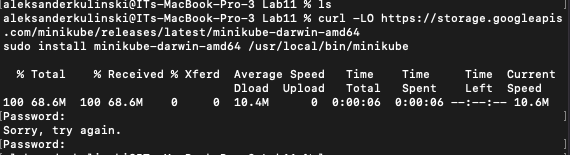
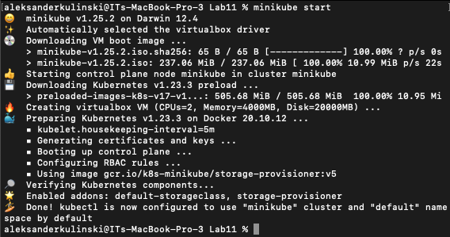

### Uruchomienie minikube w dashboardzie
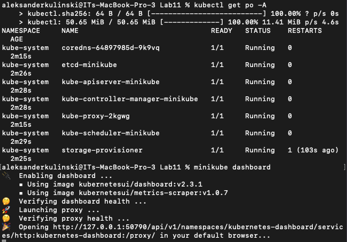
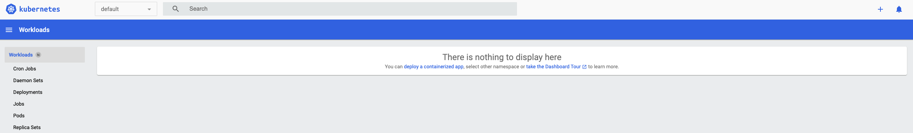

### Uruchomienie mongo bezpośrednio z obrazu
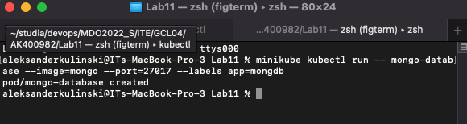

### Screen z działającego poda
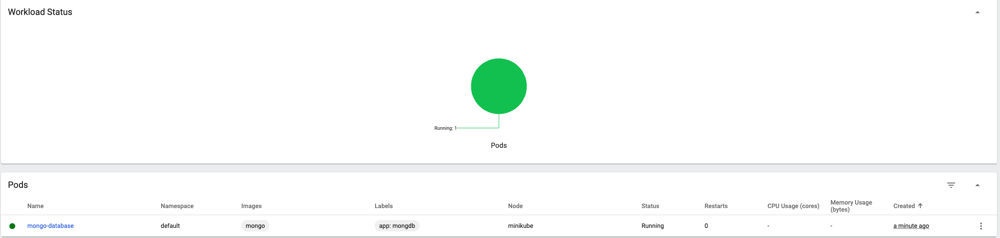

### Przekierowanie portów
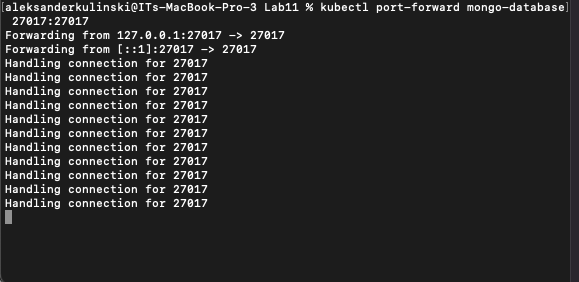

### Podłaczenie do hostowanej bazy


## Część druga

### Plik .yaml z configiem deploymentu
```
apiVersion: apps/v1
kind: Deployment
metadata:
  name: mongo-database
  labels:
    app: mongo-database
spec:
  replicas: 4
  selector:
    matchLabels:
      app: mongo-database
  template:
    metadata:
      labels:
        app: mongo-database
    spec:
      containers:
      - name: mongo-database
        image: mongo:latest
        ports:
        - containerPort: 27017
```
### Wersja z 4 replikami
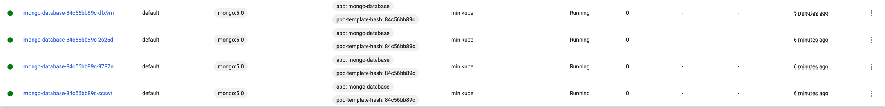

### Wersja z pojedynczym podem
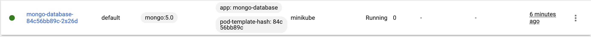

### Wersja z zerem replik
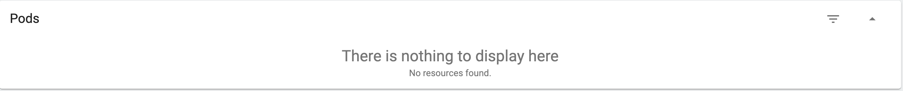

### Uruchomienie ze zmienioną wersja obrazu na latest
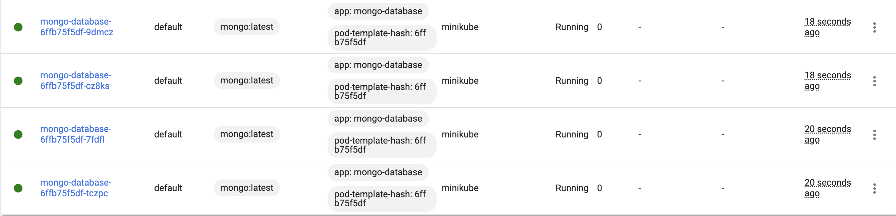

### Rollout status z poprawnie wdrożonym deploymentem
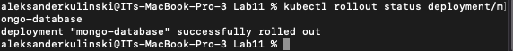

### Zmieniona wersja obrazu, na taką która wywoła crash
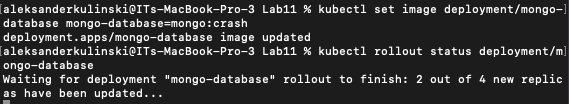

### Odwołanie wykonanych czynności przez rollout undo
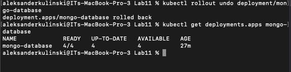
