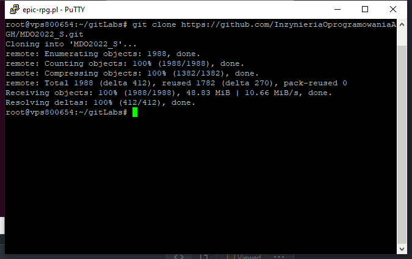
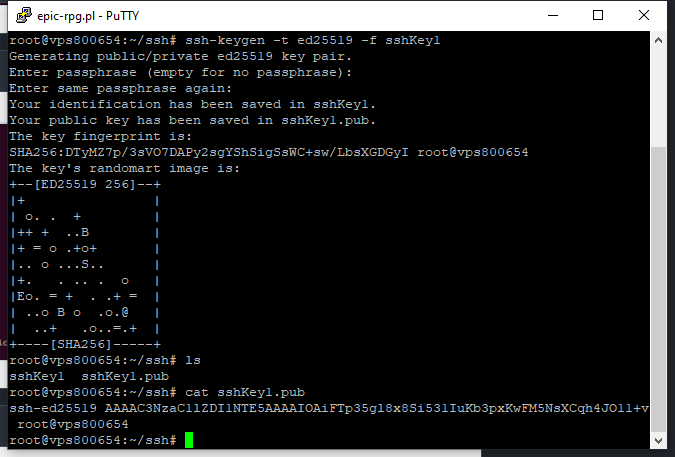
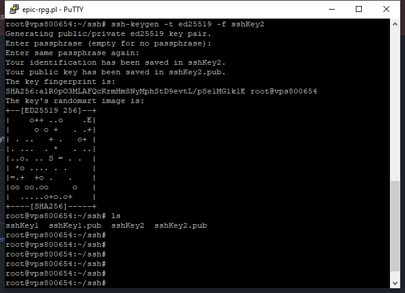
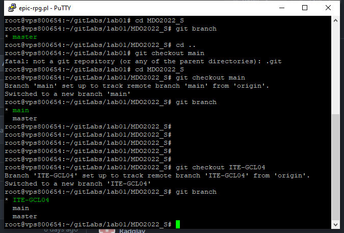
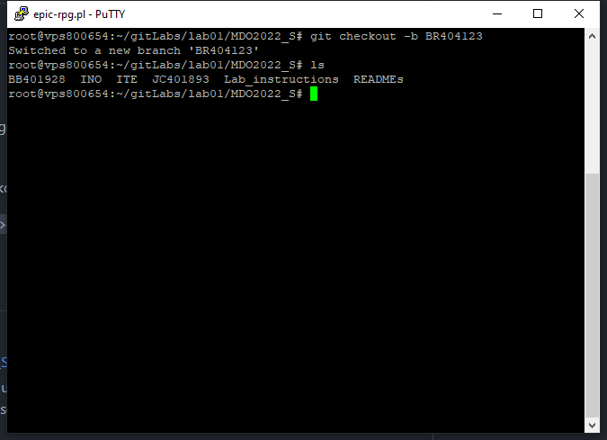
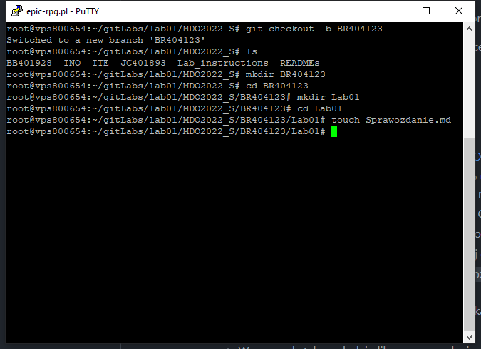
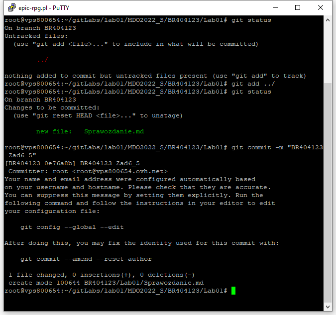
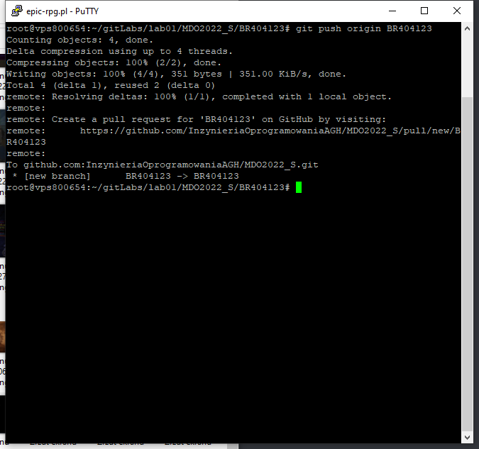

1. Zainstaluj klienta Git i obs³ugê kluczy SSH
2. Sklonuj repozytorium https://github.com/InzynieriaOprogramowaniaAGH/MDO2022_S za pomoc¹ HTTPS
  
3. Upewnij siê w kwestii dostêpu do repozytorium jako uczestnik i sklonuj je za pomoc¹ utworzonego klucza SSH
   - Utwórz dwa klucze SSH, inne ni¿ RSA, w tym co najmniej jeden zabezpieczony has³em
    
    
   - Skonfiguruj klucz SSH jako metodê dostêpu do GitHuba
    
   - Sklonuj repozytorium z wykorzystaniem protoko³u SSH
    
4. Prze³¹cz siê na ga³¹Ÿ ```main```, a potem na ga³¹Ÿ swojej grupy (pilnuj ga³êzi i katalogu!)
  
5. Utwórz ga³¹Ÿ o nazwie "inicja³y & nr indeksu" np. ```KD232144```. Miej na uwadze, ¿e odga³êziasz siê od brancha grupy!
  
6. Rozpocznij pracê na nowej ga³êzi
   - W katalogu w³aœciwym dla grupy utwórz nowy katalog, tak¿e o nazwie "inicja³y & nr indeksu" np. ```KD232144```
   - W nim tak¿e utwórz katalog: Lab01
   - W nowym katalogu dodaj plik ze sprawozdaniem
   
   - Dodaj zrzuty ekranu (jako inline)
   - Wyœlij zmiany do zdalnego Ÿród³a
   
   
   - Spróbuj wci¹gn¹æ swoj¹ ga³¹Ÿ do ga³êzi grupowej
   
   - Zaktualizuj sprawozdanie i zrzuty o ten krok i wyœlij aktualizacjê do zdalnego Ÿród³a (na swojej ga³êzi)