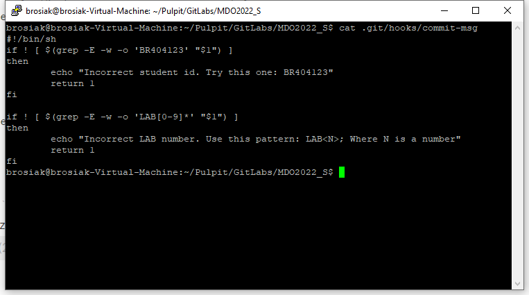
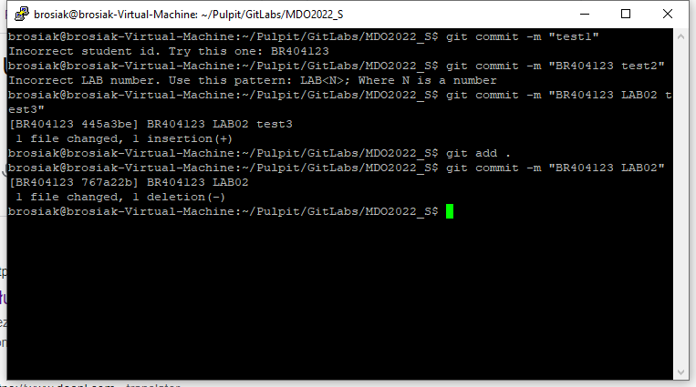
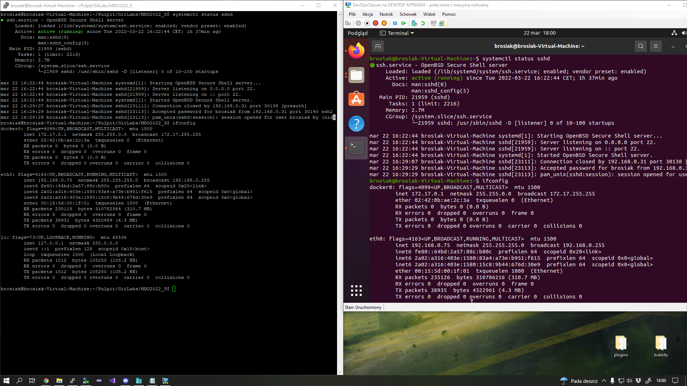
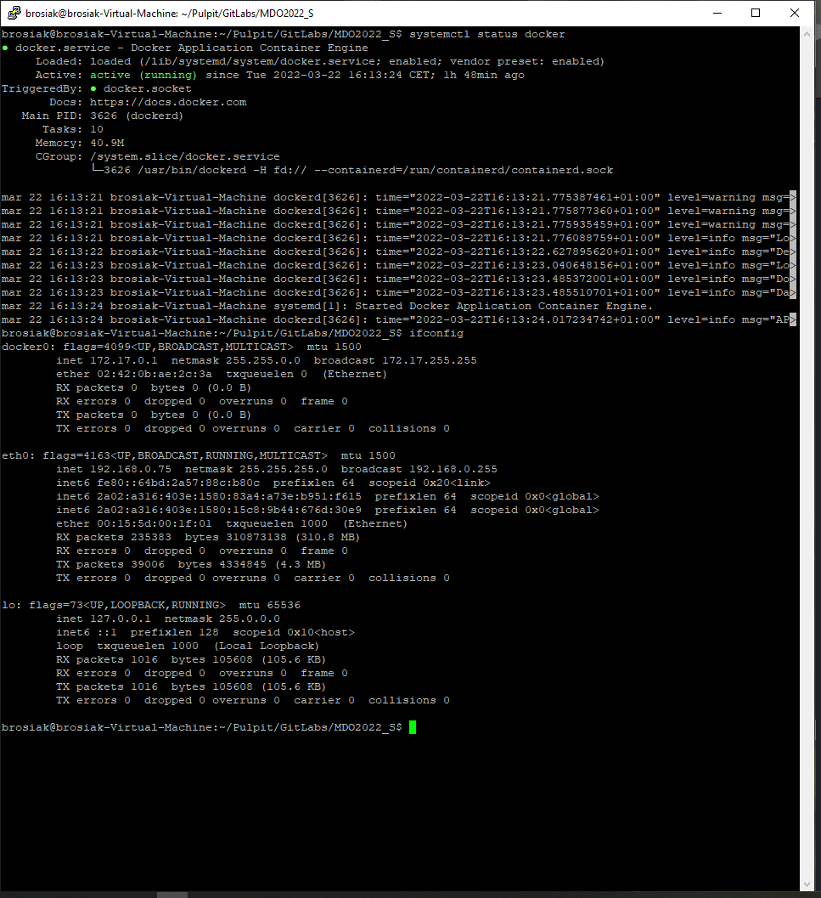
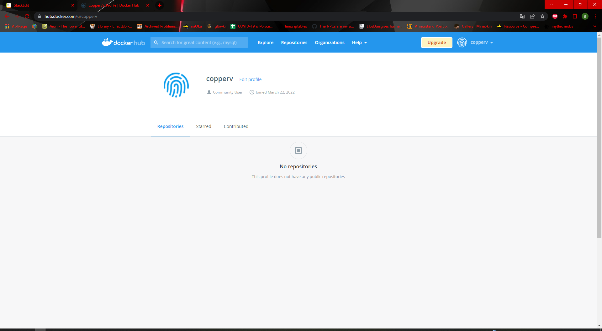

# Zajęcia 02 
## Rosiak Błażej
## Hooks, heterogeniczne środowisko pracy, instancja Dockera
- Przygotowanie GitHook'a rozwiązującego pewne problemy z commitami
 - [ ] hook sprawdzający czy tytuł commita zgadza się ze wzorem `<inicjały><nr indeksu>`, czyli w tym przypadku `BR404123`,
 - [ ] hook sprawdzający czy w treści commita pada numer labu (właściwy dla zadania), czyli w tym przypadku `LAB02`,
Stworzono w katalogu `.git/hooks/` plik commit-msg, w którym umieszczono następujący skrypt:
```
#!/bin/sh
if ! [ $(grep -E -w -o 'BR404123' "$1") ]
then
        echo "Incorrect student id. Try this one: BR404123"
        return 1
fi
if ! [ $(grep -E -w -o 'LAB[0-9]*' "$1") ]
then
        echo "Incorrect LAB number. Use this pattern: LAB<N>; Where N is a number"
        return 1
fi
```
Zrzut ekranu przedstawiający zawartość pliku `commit-msg`:

Mając tak przygotowany hook przetestowano go pod kątem poprawności tworząc następujące commity:
`git commit -m "test1"` - `niepoprawne`
`git commit -m "BR404123"` - `niepoprawne`
`git commit -m "BR404123 test2"` - `niepoprawne`
`git commit -m "BR404123 LAB02 test3"`-`poprawne`
`git commit -m "BR404123 LAB02"`-`poprawne`

- Właściwie cały czas pracuję na PuTTY. Na LAB01 wykorzystywałem to oprogramowanie do łączenia się z serwerem VPS `51.38.*.*`, na LAB02 do łączenia się do VM. Fakt ten "uwieczniono" na zrzucie ekranu:

- Przygotowując się do zajęć praktycznie od razu, intuicyjnie sprawdzając czy działa komenda `docker` zainstalowałem go przez co procesu instalacji nie dałem rady uchwycić. Zrobiłem to przy użyciu komendy `sudo apt install docker.io`.
Działanie samego Dockera wykazano z definicji wyświetlając działający interfejs tego serwisu oraz wyświetlając jego interfejs sieciowy (IP: *172.17.0.1*).

- Na sam koniec utworzono konto w serwisie *Docker Hub* o nazwie copperv.

