# Zajęcia 03 
## Rosiak Błażej
## Docker files, kontener jako definicja etapu
- W ramach laboratorium wykorzystano repozytorium *[LastCalc](https://github.com/sanity/LastCalc)*. Repozytorium to zostało sklonowane, a następnie uruchomiono (*w katalogu*) polecenie ***mvn test***, dzięki któremu nie tylko przeprowadzono testy, ale również pobrano automatycznie zależności.

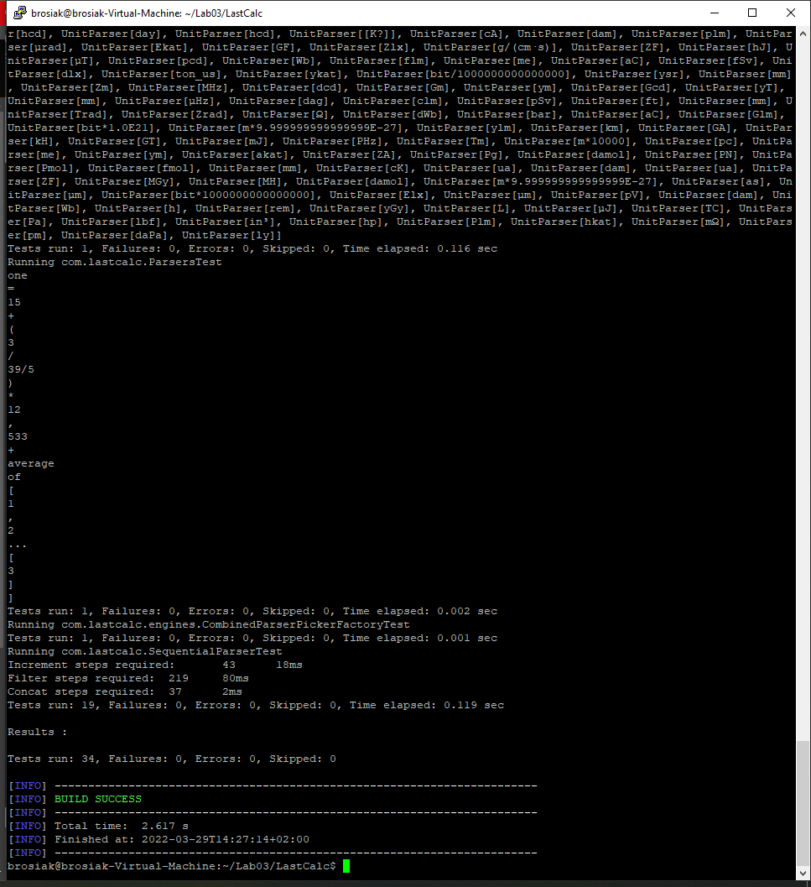
Po pomyślnie przeprowadzonych testach zbudowano projekt przy użyciu polecenia ***mvn package***.
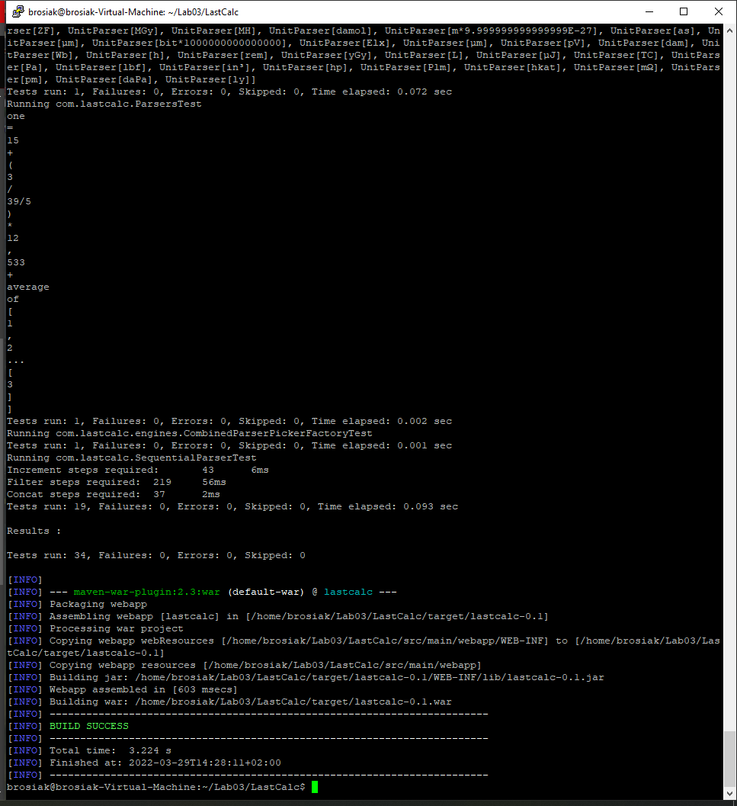
- Przy pomocy strony *[Docker Hub](https://hub.docker.com/_/maven)* pobrano obraz Maven'a używając komendy ***sudo docker pull maven:3.8.4-jdk-11***, by nasz obraz korzystał z Javy 11 (nie najnowszej). Na zrzucie ekranu widać *pull* Mavena bez określenia jdk.
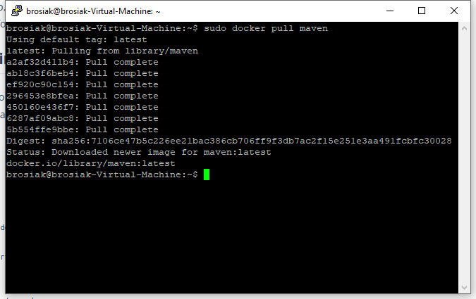
Obrazy zainstalowane zostały wylistowane, a następnie uruchomiono kontener komendą ***sudo docker run -it maven:3.8.4-jdk-11 sh***. Opcja *-it* została użyta, by uruchomić kontener w trybie interaktywnym.

Wewnątrz kontenera sklonowano wcześniejsze repozytorium, zbudowano go, a następnie przeprowadzono testy (zakończone pomyślnie).
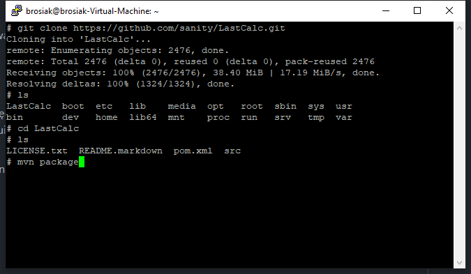
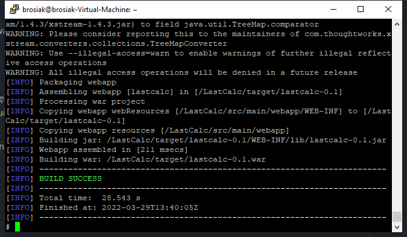
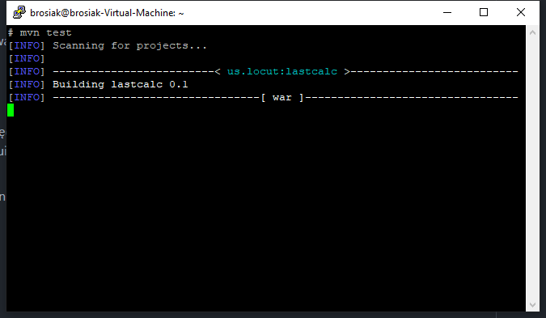
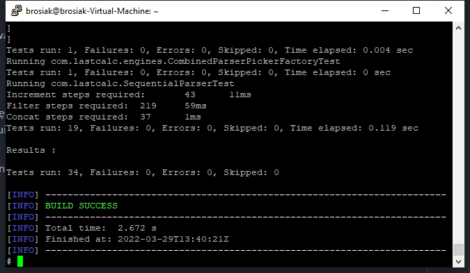
- Stworzono dwa pliki Dockerfile, które miały za zadanie zautomatyzować kroki wykonane powyżej. Pierwszy, do budowania projektu - *dockerfile_builder*; drugi - do testowania projektu - *dockerfile_tester*.
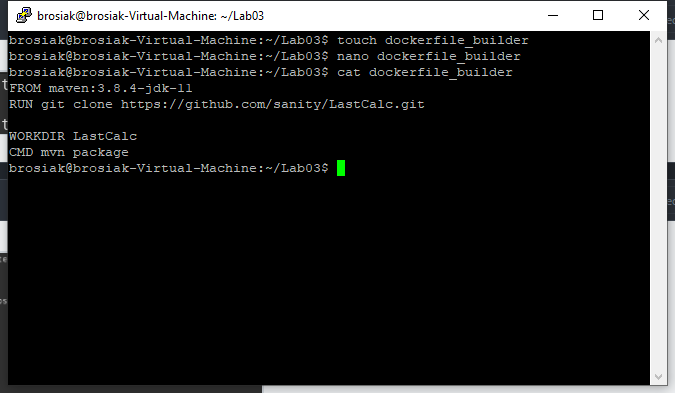
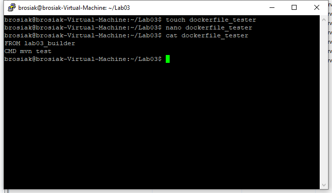
Obraz do budowania projektu został zbudowany przez ***sudo docker build -t lab03_builder -f ./dockerfile_builder .***, a obraz do testowania projektu - ***sudo docker build -t lab03_tester -f ./dockerfile_tester .***.
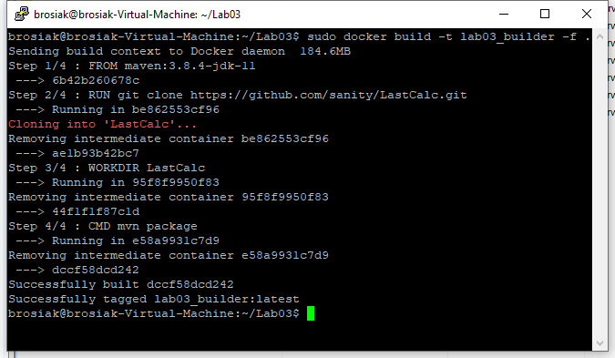

Uruchomiono kontenery na bazie nowo powstałych obrazów przez ***sudo docker run [TAG]***.

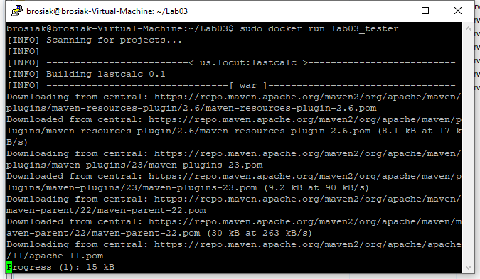
