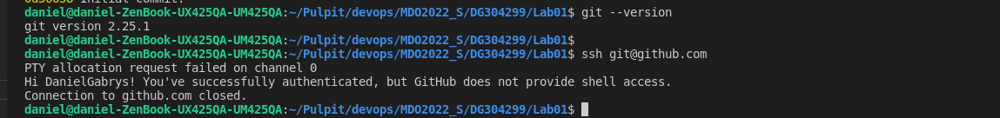
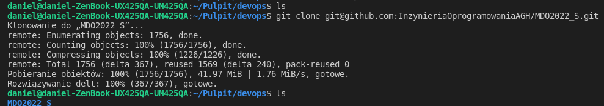
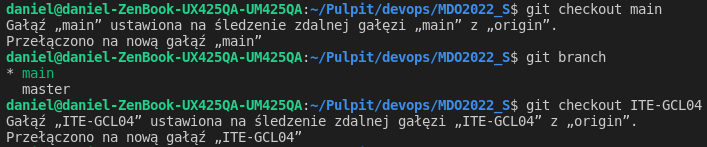
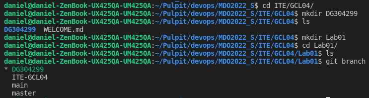

# Sprawozdanie Lab 1

## 1. Instalacja Git, obsługi kluczy SSH
- Zainstalowano wcześniej program git oraz skonfigurowano klucze SSH.
  + sprawdzenie wersji git
  > git --version

  + sprawdzenie działania kluczy ssh poprzez próbę połączenia z github.com
  > ssh git@github.com

  

## 2. Sklonowanie repozytorium za pomocą HTTPS
  > git clone https://github.com/InzynieriaOprogramowaniaAGH/MDO2022_S.git

  

## 3. Sklonowanie repozytorium za pomocą protokołu SSH
  > git clone git@github.com:InzynieriaOprogramowaniaAGH/MDO2022_S.git

  

## 4. Przełącz się na gałąź main, nastepnie na gałąź grupy
> cd MDO2022_S  
> git checkout main  
> git checkout ITE-GCL04 

  

## 5. Utworzono gałąź o nazwie DG304299, katalog o tej samej nazwie oraz folder Lab01 wewnątrz
- utworzenie nowej gałęzi
  > git checkout -b DG304299 
  > cd ITE/GCL04    
  > mkdir DG304299    
  > mkdir Lab01    
  > cd DG304299/Lab01 

- sprawdzamy aktualny branch

  > git branch

  

  

  