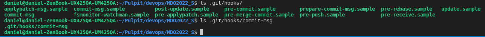
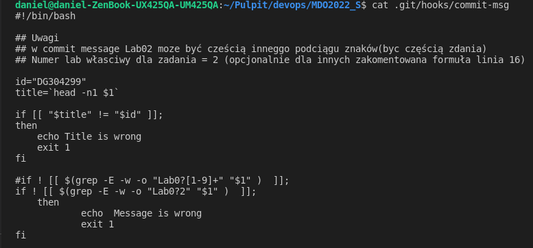
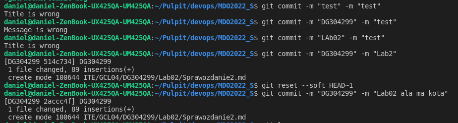
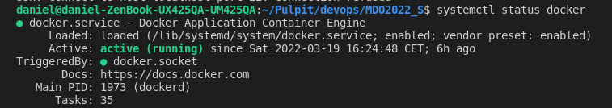
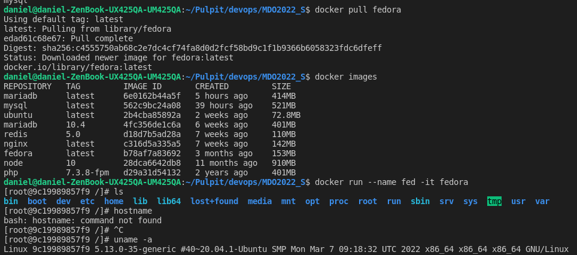
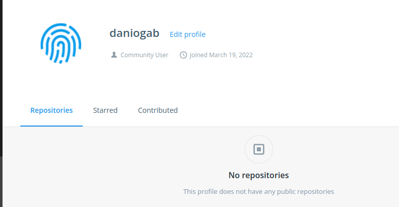

# Sprawozdanie Lab 1
###  Daniel Gabryś
#


## 1. Githook sprawdzający, czy tytuł commita nazywa się DG304299 oraz czy w treści commita pada numer lab, właściwy dla zadania

</br>

### Stworzenie pliku commit-msg w katalogu .git/hooks/





```
#!/bin/bash

## Uwagi
## w commit message Lab02 moze być cześcią inneggo podciągu znaków(byc częścią zdania)
## Numer lab własciwy dla zadania = 2 (opcjonalnie dla innych zakomentowana formuła linia 16)

id="DG304299"
title=`head -n1 $1`

if [[ "$title" != "$id" ]];
then
    echo Title is wrong
    exit 1
fi

#if ! [[ $(grep -E -w -o "Lab0?[1-9]+" "$1" )  ]];
if ! [[ $(grep -E -w -o "Lab0?2" "$1" )  ]];
    then
            echo  Message is wrong
            exit 1
fi

```

### Działanie dla źle zdefiniowanych commitów
> git commit -m "test" -m "test"

> git commit -m "DG304299" -m "test"

> git commit -m "LAb02" -m "test"


  Działanie dla dobrze zdefiniowanych commitów
> git commit -m "DG304299" -m "Lab2"

> git commit -m "DG304299" -m "Lab02 ala ma kota"

  *Użyto ponizszego polecenia w celu wycofania ostatniego commita z zachowaniem stage
  >git reset --soft HEAD~1

   
  
  </br>

## 2 Konfiguracja środowiska dockerowego

</br>

Z powodu pracy na na natywnym linuksie pominięto dane kroki, docker został wcześniej zainstalowany

>hostname

>docker -v

  

## 4. Działanie środowiska

</br>

Działający serwis docker
>systemctl status docker 



Wykazanie praktyczne poprzez pobranie obrazu i uruchomienie kontenera (fedora)

Pobrano obraz fedora
>docker pull fedora

Sprawdzono liste obrazów
>docker images

Uruchomienie kontenera
>docker run --name fed -it fedora

Wersja (polecenie podało jądro zewnętrzeno systemu)
>uname -a



## 5. Utworzenie konta na serwisie Docker Hub




  


  


  

  


  