# Sprawozdanie Lab 3
###  Daniel Gabryś
#


## Wybór oprogramowania na zajęcia

</br>

Sklonowanie dowolnego repozytorium dysponującego otwartą licencją, posiadającego narzędzia do budowania(java, gradle) oraz testy

https://github.com/LondonJim/Guess-Word-Game

- sklonowanie repozytorium
  > git clone [git@github.com:LondonJim/Guess-Word-Game.git](https://github.com/LondonJim/Guess-Word-Game.git)

  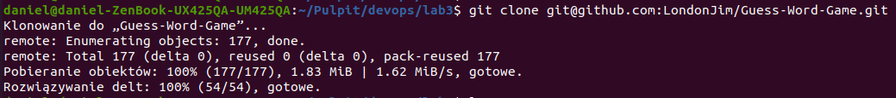

- zainstalowanie zależności (doinstalowanie lub jeśli zainstalowane wcześniej dowód poprzez sprawdzenie wersji)

  > apt install default-jdk

  > apt install gradle

  lub

  > java --version

  > gradle -v


  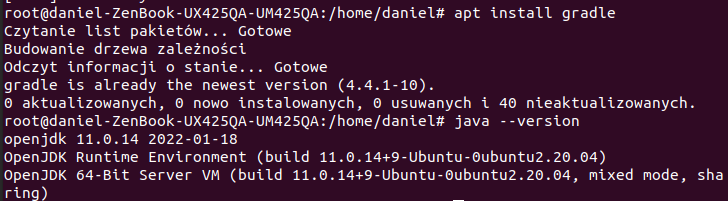


- build programu 
  
  > gradle build

- *uruchomienie programu (uruchomienie aplikacji z GUI)
  
  > java -jar ./build/libs/guess.jar

  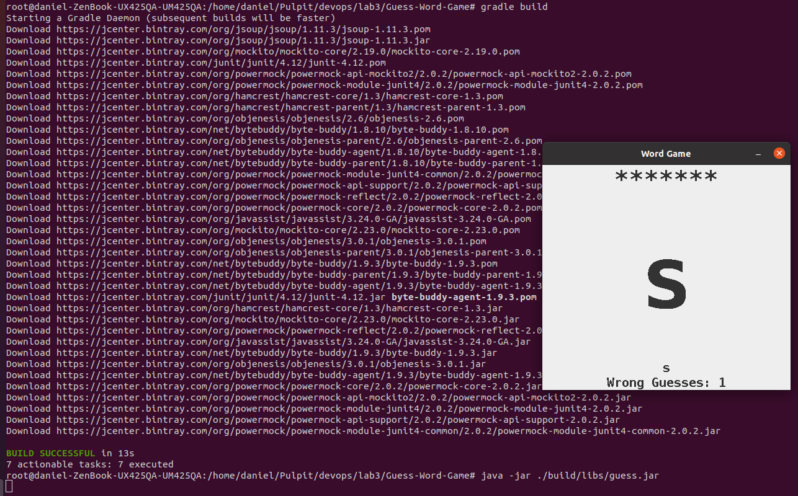

- uruchomienie testów
  
  > gradle test

  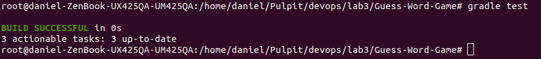

 </br>

## 1. Przeprowadzenie buildu w kontenerze

 </br>

- Pobranie obrazu i uruchomienie kontenera
    > docker run debian

- Uruchomienie kontenera interaktywne
  
    > docker run --name debian -it debian

    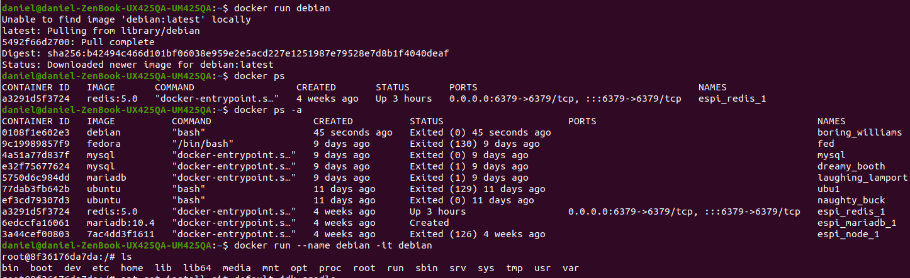

- doinstalowanie zależności (git,jdk, gradle)
  
    > apt update

    > apt install git

    > apt install default-jdk

    > apt install gradle


- Potwierdzenie poprawności instalacji wymaganego oprogramowania

    > git --version
    > java --version
    > gradle --version
  
   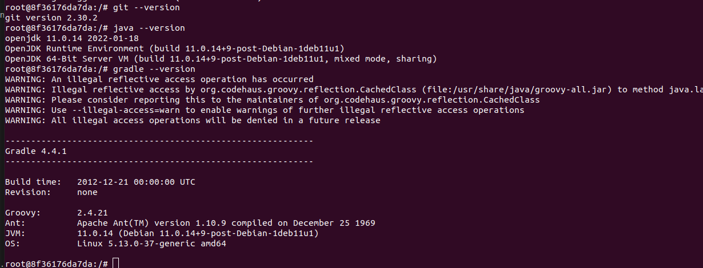

- sklonowanie repozytorium

    > git clone https://github.com/LondonJim/Guess-Word-Game.git

    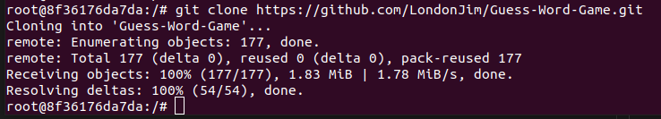


- zbudowanie programu w kontenerze
     
    > gradle build

    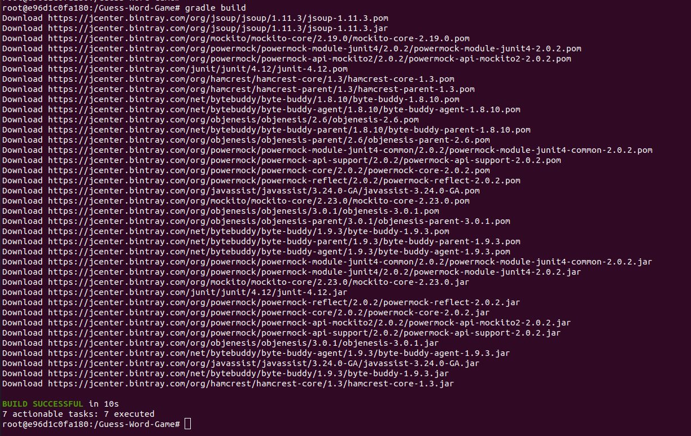

- uruchomienie testów w kontenerze

    > gradle test

    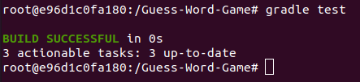

- *próba uruchomienia aplikacji w kontenerze
  
  z powodu braku srodowiska granicznego kontenera zakończyła się niepowodzeniem

    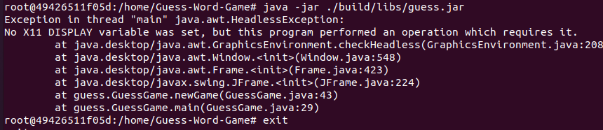 

    </br>

    ### *Przykład dla aplikacji bez środowiska graficznego
    ```
    git clone https://github.com/macagua/example.java.helloworld.git
    cd example.java.helloworld/
    javac HelloWorld/Main.java
    javac HelloWorld/Main.java
    jar cfme Main.jar Manifest.txt HelloWorld.Main HelloWorld/Main.class
    java -jar Main.jar

    ```   

    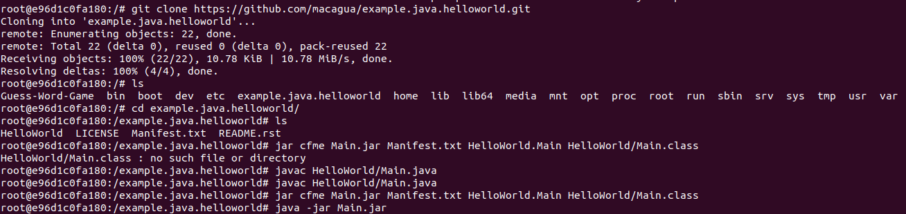 

    </br>

## 1. Utworzenie 2 plików Dockerfile automatyzujących powyższe kroki

- plik przeprowadzający wszystkie kroki aż do builda (docker_build)

   ```
    FROM debian:latest

    RUN apt update
    RUN apt install -y git default-jdk gradle

    RUN git clone https://github.com/LondonJim/Guess-Word-Game.git
    WORKDIR Guess-Word-Game

    RUN gradle build

   ```

- plik przeprowadzający testy (docker_test)

    ```
   FROM app_build:latest

   RUN gradle test
    
   ```

- build
    > docker build . -f docker_build -t app_build

     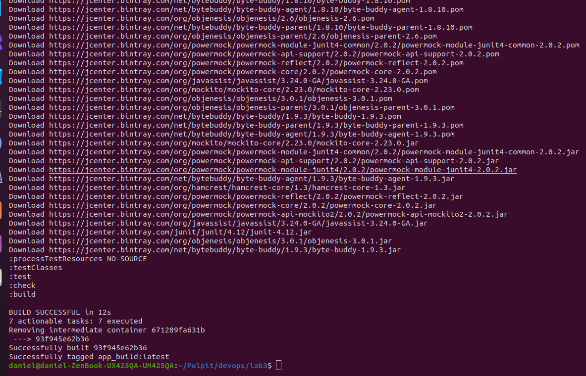 

- testy
    > docker run --name build_test -it app_build

     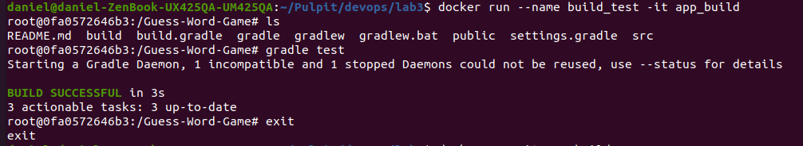 

## 3. Wykaż, że kontener wdraża się i pracuje poprawnie.

- sprawdzenie czy kontener się uruchomił 

    Kontener uruchomił się poprawnie, ale wyłączył się zaraz po przeprowadzeniu buildów i testów gdyż nie miał innych zadań do wykonania, kod wyniósł 0, czyli uruchomienie przebiegło pomyślnie.

    > docker ps -a

    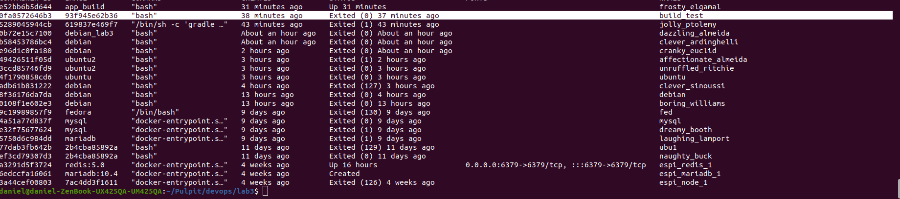 


- sprawdzenie czy zmiany zaszły w obrazie 
    
    Uruchamiamy kontener na bazie utworzonego obrazu. Widać że repozytorium istnieje w kontenerze, więc zależności zostały zainstalowane

    > docker run --name build_test -it app_build

     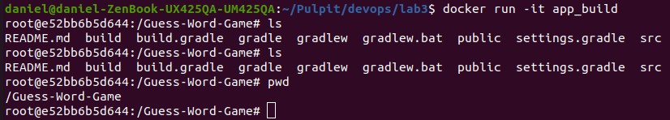 


  


  


  

  


  