# Sprawozdanie Lab 4
###  Daniel Gabryś
#


## 1. Zachowywanie stanu

 </br>

- Przygotowano wolumin wejściowy i wyjściowy
  
     > docker volume  create --name InVolumine
     > docker volume  create --name OutVolumine

     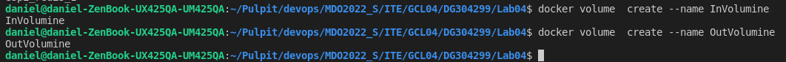

- Uruchomienie kontenera z woluminami
  
    > docker run -it --name ub --mount source=InVolumine,target=/in --mount source=OutVolumine,target=/out ubuntu

    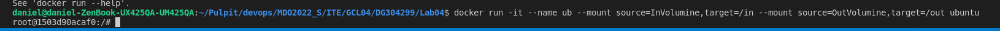

- Sprawdzenie poprawności zamontowania woluminów
  
    > docker inspect ubu

    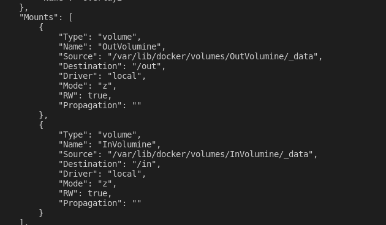


- Instalacja wymagań wstępnych (jak w poprzednich zajęciach)

    > apt update
    > apt install default-jdk
    > apt install gradle
  
   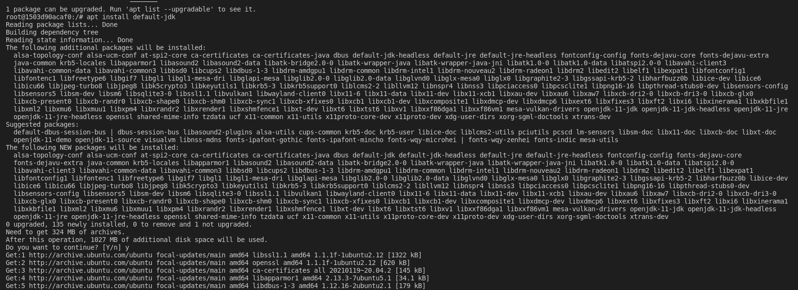

- Sklonowanie repozytorium do woluminu wejściowego

    > sudo -s
    > cd /var/lib/docker/volumes/inputVol/_data/ 
    > git clone https://github.com/LondonJim/Guess-Word-Game.git

    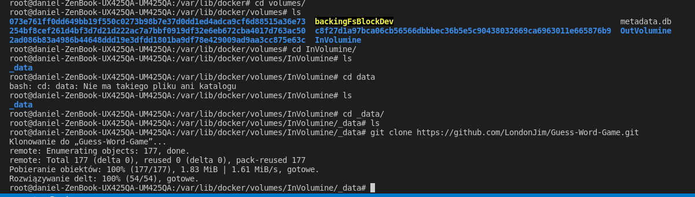


- Uruchomienie buildu w kontenerze
     
     przejście do katalogu z załączonym repo(wolumin wejściowy)

    >cd in/Guess-Word-Game/

    build z zapisaniem na kontenerze wyjściowym

    > gradle build -g ../../out/

    pliki zapisane na woluminie wyjściowym

    > ls ../../out/

    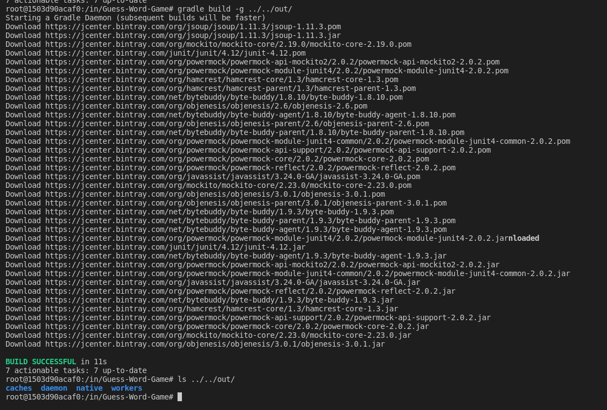


    </br>


## 2. Eksponowanie portu

- Zainstalowanie iperf3 oraz net-tools w kontenerze celu uzyskania adresu ip kontenera

    > apt install net-tools iperf3 -y 

- Uruchomiono iperf3 w trybie serwera (s-server, port 4000)
 
    > ifconfig eth0

    > iperf3 -s -p 4000

    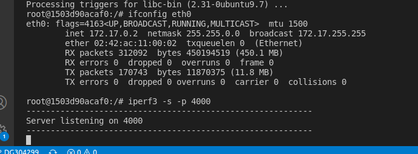 


- Uruchomiono 2 kontener w roli klienta i połączono z pierwszym
  
    > docker run -it --name ub_server ubuntu

    > apt update

    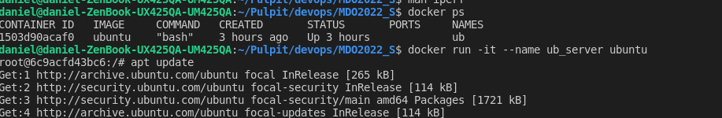 

    > apt install net-tools iperf3 -y

    > ifconfig eth0

    > iperf3 -c 172.17.0.2 -p 4000

    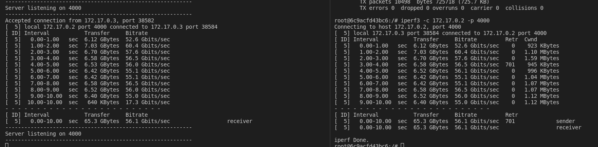 


- Połączenie się z serwerem z systemu hosta
  
     >  iperf3 -c 172.17.0.2 -p 4000 

      
    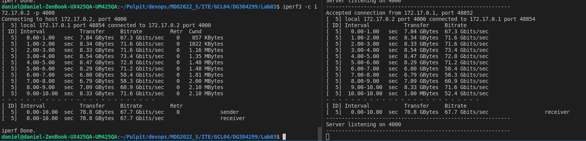 


    ### Z powodu pracy na natywnym linuksie hostem był system zatem pominięto łaczęnie się z poza hosta
  

</br>

- Zestawienie wyników
  
    
    | Typ   | Przepustowość | 
    |--------|----------|
    | kontener-kontener | 56.1 Gbits/s  | 
    | kontener-host | 67.7  Gbits/s | 

    ###  Wnioski:

    Najszybszy przesył danych uzyskaliśmy komunikując się z hosta do kontenera, zbliżone,ale niższe wyniki otrzymaliśmy wykonując połączenie kontener-kontener 

 </br>

 ## 3. Jenkins

 - Utworzenie sieci
  
    > docker network create jenkins

     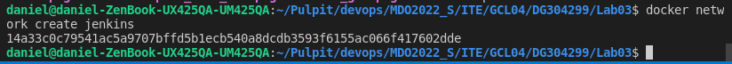 

- Pobranie i uruchomienie obrazu DIND
  
    ```
    docker run \
  --name jenkins-docker \
  --rm \
  --detach \
  --privileged \
  --network jenkins \
  --network-alias docker \
  --env DOCKER_TLS_CERTDIR=/certs \
  --volume jenkins-docker-certs:/certs/client \
  --volume jenkins-data:/var/jenkins_home \
  --publish 2376:2376 \
  docker:dind \
  --storage-driver overlay2

    ```

     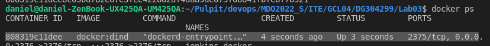   

- Utworzenie Dockerfile dla Jenkins  

    ```
    FROM jenkins/jenkins:2.332.1-jdk11
    USER root
    RUN apt-get update && apt-get install -y lsb-release
    RUN curl -fsSLo /usr/share/keyrings/docker-archive-keyring.asc \
    https://download.docker.com/linux/debian/gpg
    RUN echo "deb [arch=$(dpkg --print-architecture) \
    signed-by=/usr/share/keyrings/docker-archive-keyring.asc] \
    https://download.docker.com/linux/debian \
    $(lsb_release -cs) stable" > /etc/apt/sources.list.d/docker.list
    RUN apt-get update && apt-get install -y docker-ce-cli
    USER jenkins
    RUN jenkins-plugin-cli --plugins "blueocean:1.25.3 docker-workflow:1.28"

    ```

- Stworzenie obrazu na podstawie Dockerfile

    > docker build . -f Dockerfile -t myjenkins-blueocean:2.332.1-1

    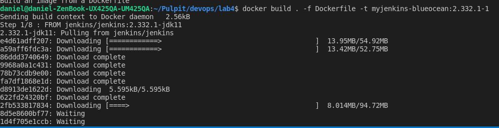  

    > docker images

    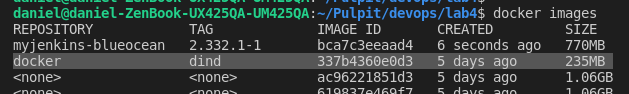  

-  Uruchomienie kontenera
  
    ```
    docker run \
        --name jenkins-blueocean \
        --rm \
        --detach \
        --network jenkins \
        --env DOCKER_HOST=tcp://docker:2376 \
        --env DOCKER_CERT_PATH=/certs/client \
        --env DOCKER_TLS_VERIFY=1 \
        --publish 8080:8080 \
        --publish 50000:50000 \
        --volume jenkins-data:/var/jenkins_home \
        --volume jenkins-docker-certs:/certs/client:ro \
        myjenkins-blueocean:2.332.1-1 
    ```

    Potwierdzenie działania kontenera

    > docker ps

     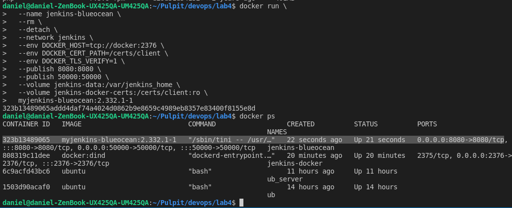 

  - Odblokowanie Jenkinsa (uzyskanie hasła)

    > docker exec jenkins-blueocean cat /var/jenkins_home/secrets/initialAdminPassword

  - Pomyślnie zakończona konfiguracja, główny panel Jenkinsa 

    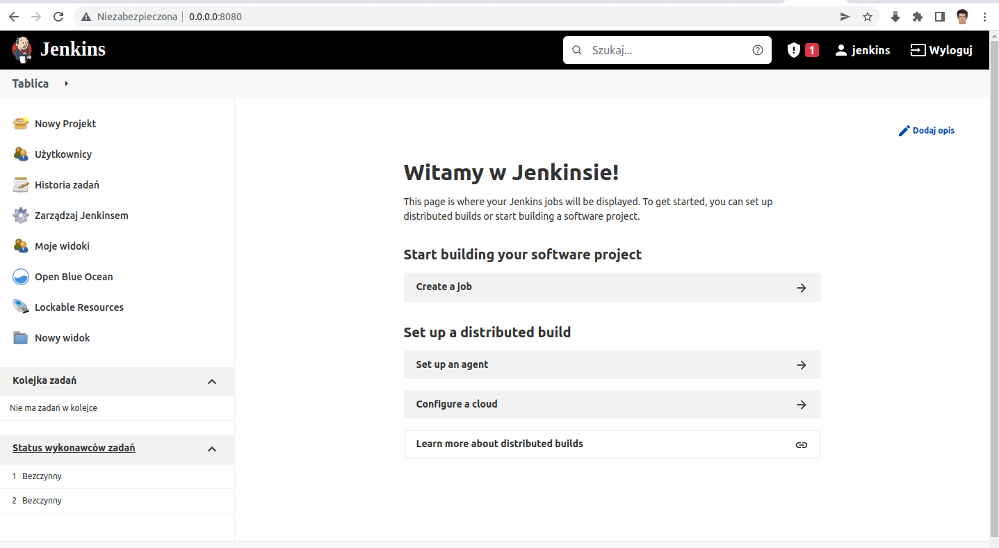 


     


  
 
 


  


  


  

  


  