cd # Sprawozdanie Lab 9
###  Daniel Gabryś
#

# Przygotowanie systemu pod uruchomienie

## 1. Przeprowadź instalację systemu Fedora w VM, skonfiguruj użytkowników (użyj haseł, które można bezkarnie umieścić na GitHubie!), sieć, wybierz podstawowy zbiór oprogramowania, optymalnie bez GUI

 </br>

- Pobranie obraz fedory i zainstalowanie systemu na maszynie wirtualnej
  https://getfedora.org/en/server/download/

- Konfiguracja

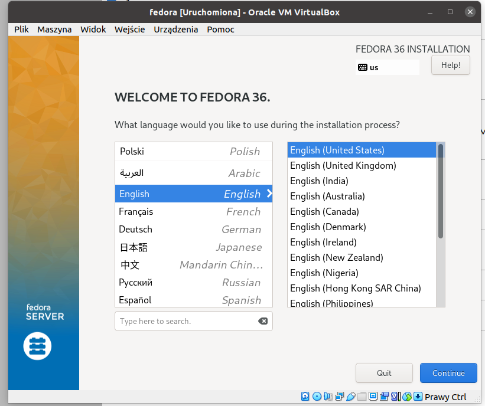 

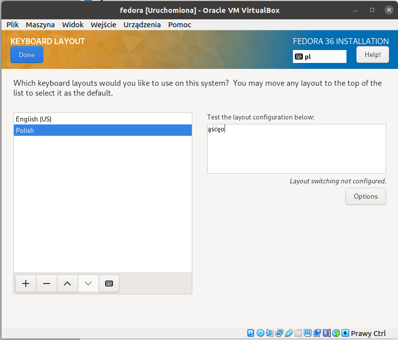 

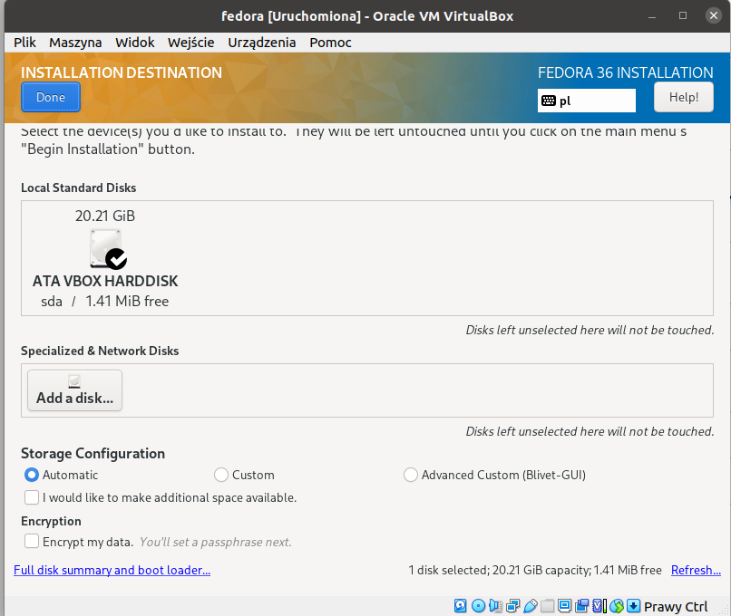 

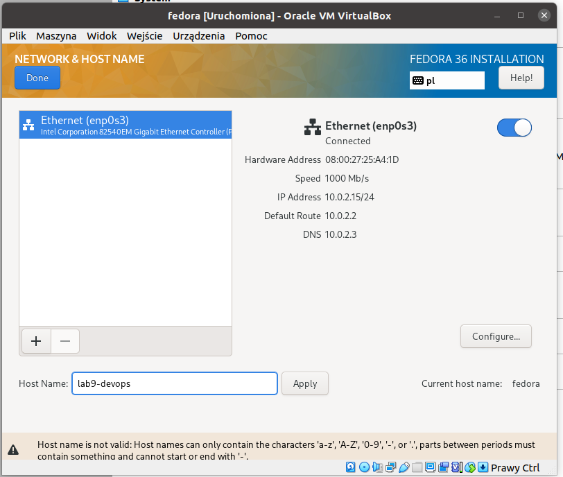 

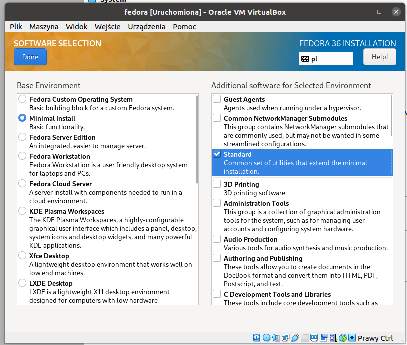 

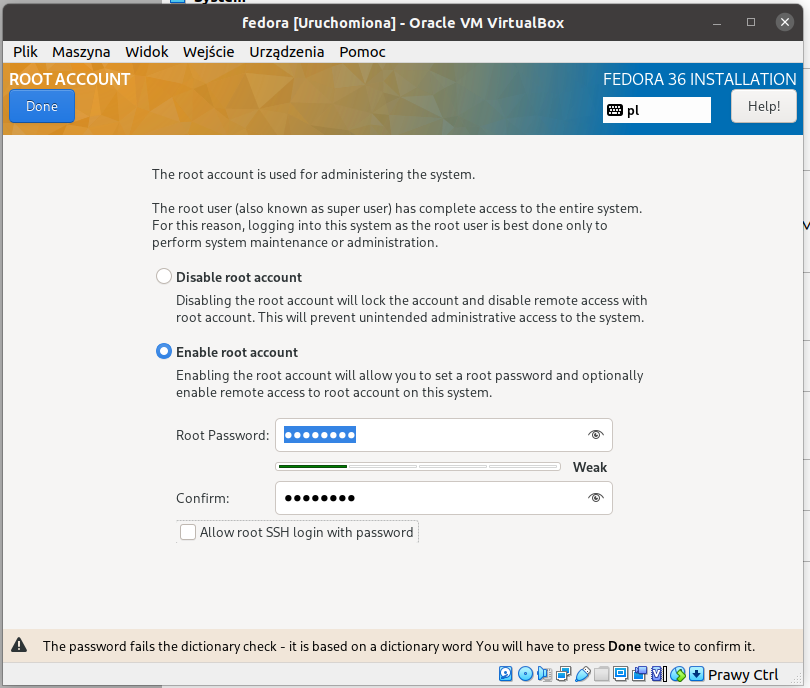 

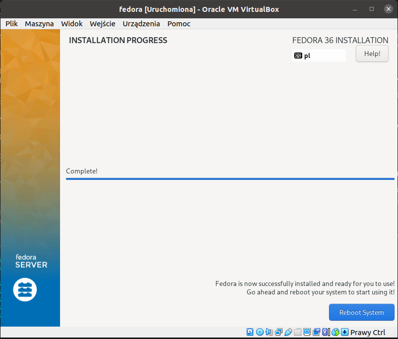 

</br>

## 2. Przeprowadź drugą instalację systemu Fedora w VM - celem drugiego systemu będzie wyłącznie serwowanie repozytorium przez HTTP
    

Drugi system został zainstalowany podobnie jak poprzedni. 

- Konfiguracja serwera httpd na drugiej fedorze.

  ```
  sudo dnf install httpd
  sudo systemctl enable httpd --now
  sudo systemctl status httpd 

  ```

  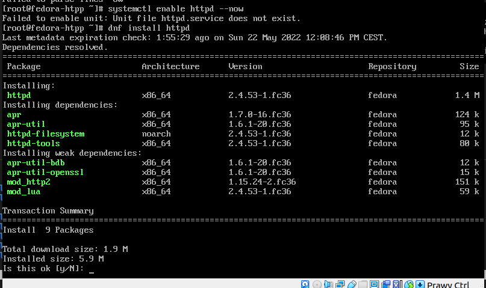 


- skonfigurowanie firewall (Dodanie wyjątków do zapory):

  ```

  sudo firewall-cmd --permanent --zone=public --add-service=http
  sudo firewall-cmd --permanent --zone=public --add-service=https
  sudo firewall-cmd --reload

  ```

 - Aby oba serwery się widziały muszą sie znaleźć tej samej sieci.
  W zakładce sieć na obu maszynach ustawiono mostkowaą kartę sieciową, aby maszyny były widoczne miedzy sobą oraz umożliwisć przesył plików z hosta na maszynę 
  
  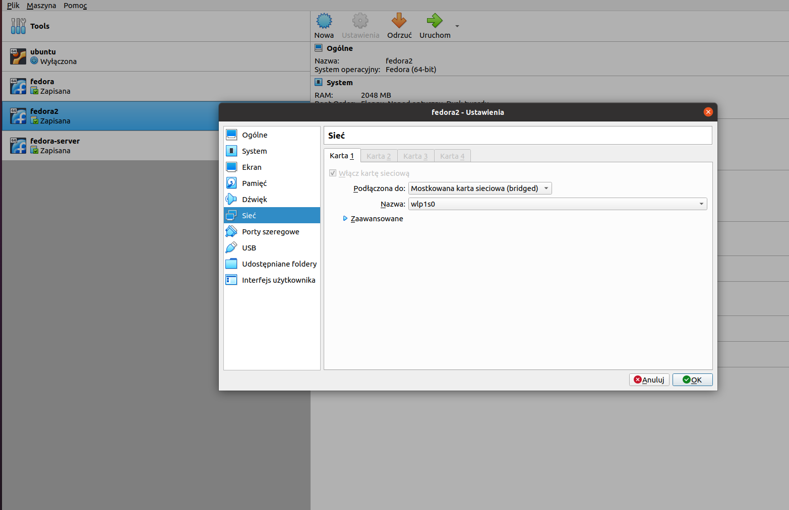 
    
  - Sprawdzamy czy maszyna z httpd jest osiągalna dla pierwszej maszyny polecieniem ping 

   
  
  
  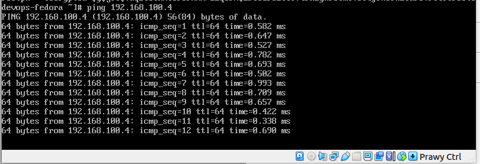 

  </br>

## 3. Umieść artefakty z projektu na serwerze HTTP
  
  W celu przeniesienia plików na serwer posłużono się Fillezilla

  - Utworzono na drugiej maszynie nowego użytkownika z uprawnieniami root

  ```
  sudo adduser -G wheel daniel
  sudo passwd daniel

  ```
  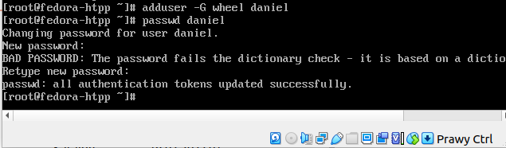 


  - Zainstalowanie FileZillii i przeniesienie artefaktu z hosta na drugą fedorę (serwer), zmieniono uprawnienia katalogu /var/www/html w celu przesłania pliku

  > sudo 777 /var/www/html

  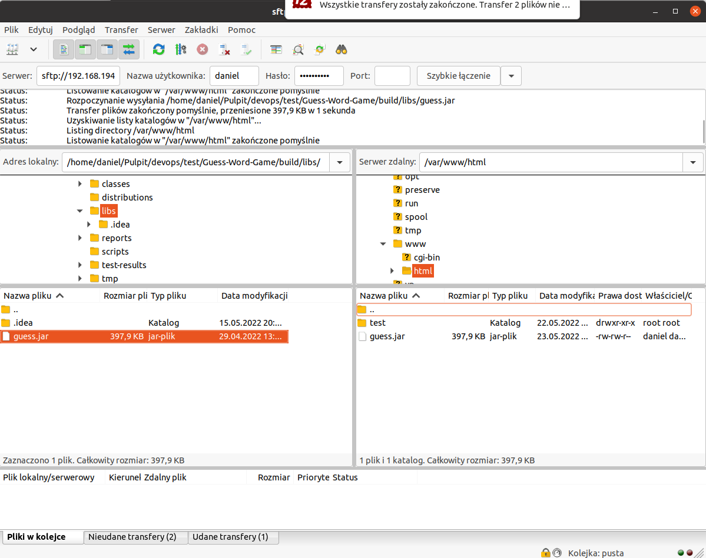 

  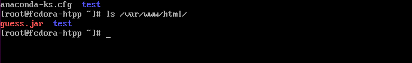 

  ## 3. Na zainstalowanym systemie wykonaj zbiór poleceń umożliwiających pobranie artefaktu, zapisz polecenia

  - Zaintalowanie na pierwszej maszynie potrzebnych pakietów: wget

  > yum install wget -y

  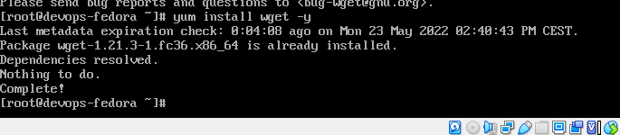 

  > wget 192.168.1.21/guess.jar

  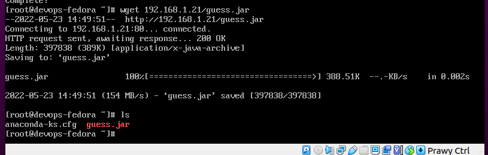 

  </br>

  # Instalacja nienadzorowana

- Zlokalizowanie pliku odpowiedzi z instalacji. 

  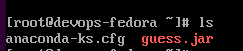 

- Dodanie elemententów odpowiedzialnych za wszystkie potrzebne dependencje
  
    Dodano

    ```
    %packages
    @^minimal-environment
    @standard
    wget

    %end

    ```

- Zdefiniowanie repozytoriów (co najmniej OS i aktualizacji, najlepiej też depednecji, optymalnie także repozytorium z własnym oprogramowaniem)
  
     Dodano
     ```
     # Repo
    url --mirrorlist=http://mirrors.fedoraproject.org/mirrorlist?repo=fedora-$releasever&arch=x86_64
    repo --name=updates --mirrorlist=http://mirrors.fedoraproject.org/mirrorlist?repo=updates-released-f$releasever&arch=x86_64

    ```

- Dodano proces pobierania artefaktu

    ```
     wget 192.168.1.21/guess.jar

    ```

</br>

# Infrastructure as a code

- Połączenie się z maszyną wirtualną w celu przesłania pliku anaconda-ks.cfg (Filezilla) na hosta, następnie push na repozytorium

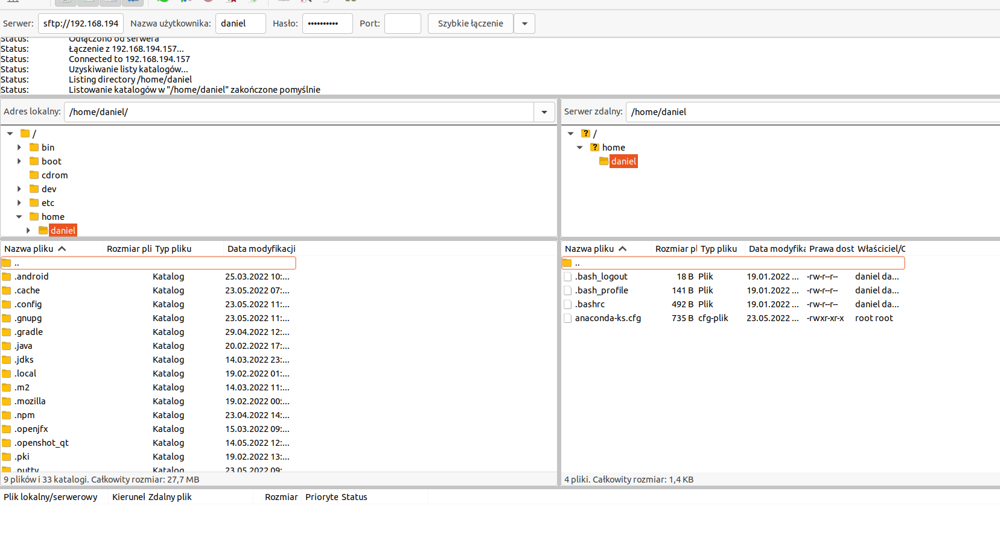 

- Skonfigurowanie nowej maszyny na podstawie pliku odpowiedzi


     


  
 
 


  


  


  

  


  