cd # Sprawozdanie Lab 9
###  Daniel Gabryś
#

# Instalacja klastra Kubernetes

## 1. Zaopatrz się w implementację stosu k8s: minikube

 </br>

- Instalacja minikube, wykazanie bezpieczeństwa instalacji

    ```
    curl -LO https://storage.googleapis.com/minikube/releases/latest/minikube-linux-amd64
    sudo install minikube-linux-amd64 /usr/local/bin/minikube

    ```

    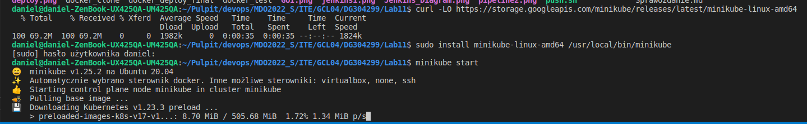


- Pobranie kubectl,pobranie checksum kubectl, sprawdzenie oraz instalacja:

    ```
    curl -LO "https://dl.k8s.io/release/$(curl -L -s https://dl.k8s.io/release/stable.txt)/bin/linux/amd64/kubectl"

    curl -LO "https://dl.k8s.io/$(curl -L -s https://dl.k8s.io/release/stable.txt)/bin/linux/amd64/kubectl.sha256"

    echo "$(cat kubectl.sha256) kubectl" | sha256sum --check

    sudo install -o root -g root -m 0755 kubectl /usr/local/bin/kubectl

    kubectl version --client

    ```

    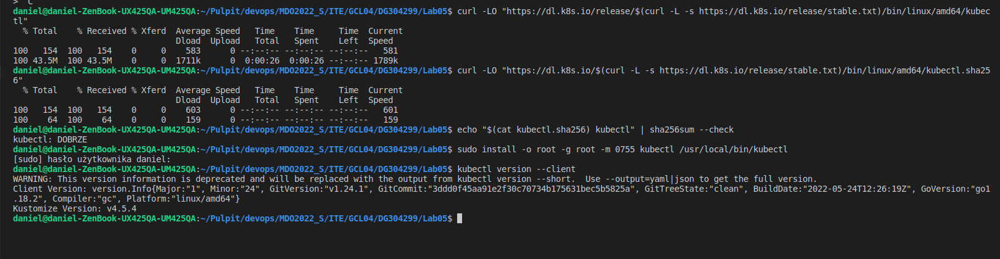

- Uruchomienie Kubernetes, pokazanie działającego kontenera/workera

    Aby poprawnie uruchomić Kubernetes, dodano użytkownika do nowo utworzonej grupy docker

    ```
    sudo minikube start

    sudo usermod -aG docker $USER

    newgrp docker

    ```

    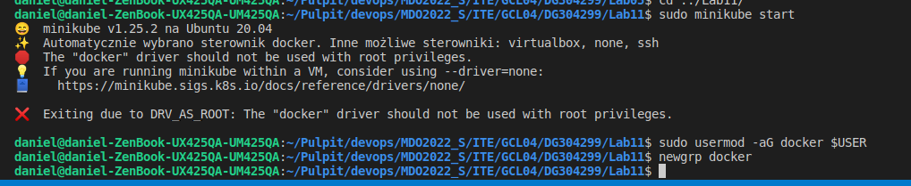


    Uruchomienie Kubernetes, sprawdzenie dostępu do klastra i dodanie aliasu:

    ```
    minikube start

    kubectl get po -A

    alias kubectl="minikube kubectl --"

    ```

     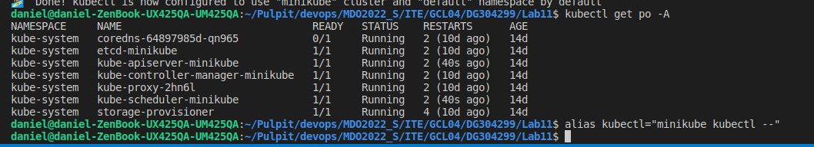

    Działający kontener

     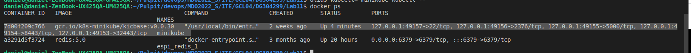

- Uruchomienie Dashboard w przeglądarce

    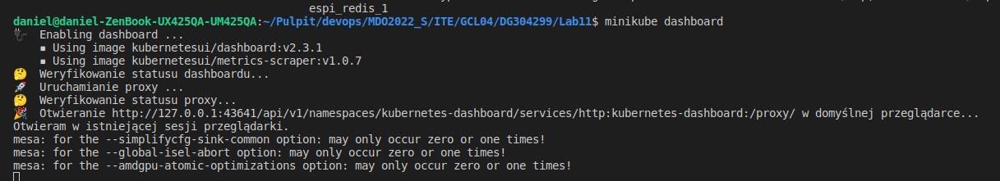

    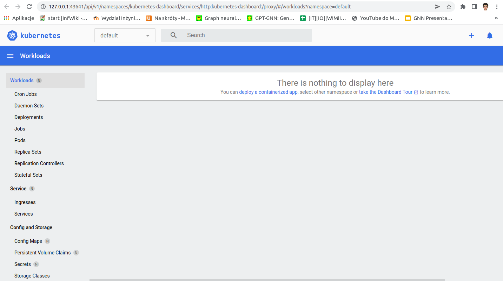
     
    </br> 

## 2. Analiza posiadanego kontenera

Wybrana wcześniej aplikacja nie nadaje się do wdrożenia jej w tym laboratorium. Jest to prosta aplikacja napisana w javie, która nie udostępnia żadnych portów, dlatego wybrano obraz gotowiec (mysql)

</br>

## 3. Uruchamianie oprogramowania
+ Uruchom kontener na stosie k8s
+ Kontener uruchomiony w minikubie zostanie automatycznie ubrany w pod.
minikube kubectl run -- <nazwa-wdrożenia> --image=<obraz-docker> --port=<wyprowadzany port> --labels app=<nazwa-wdrożenia>

+ Przedstaw że pod działa (via Dashboard oraz kubectl)
+ Wyprowadź port celem dotarcia do eksponowanej funkcjonalności
kubectl port-forward <nazwa-wdrożenia> <LO_PORT>:<PODMAIN_CNTNR_PORT>
+ Przedstaw komunikację z eskponowaną funkcjonalnością
  
  </br>

    Kroki:
    uruchomienie kontenera w minikube z parametrami okreslającymi dane dostępu do bazy dannych

    ```
    kubectl run mysql-devops --image=mysql:5.6 --port 3306 --labels app=mysql_devops --env="MYSQL_ROOT_PASSWORD=password"

    kubectl get pods

    ```

 - Przedstawienie działania (via Dashboard oraz kubectl)

    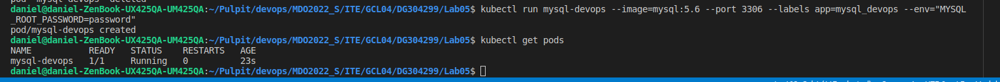

    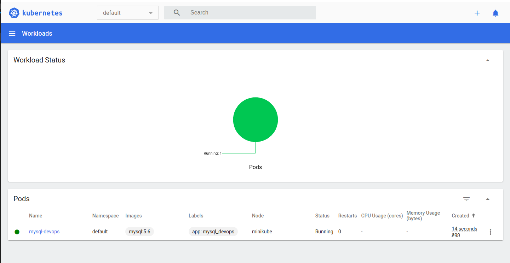
 
- Wyprowadzenie portu
  
    ```
    kubectl port-forward mysql-devops 3000:3306
    
    ```
    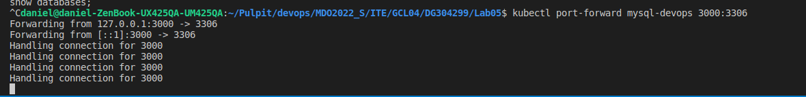

- Przedstawienie poprawności komunikacji z wyeksponowanym portem

    W tym celu uruchamiamy mysql w kontenerze i tworzymy testową bazę danych

    

    Wykorzystamy także program "dbeaver" w celu połączenia się z wyekponowaną bazą.
    Widzimy ze połączenie zakończyło się powodzeniem, widzimy naszą stworzoną bazę danych

    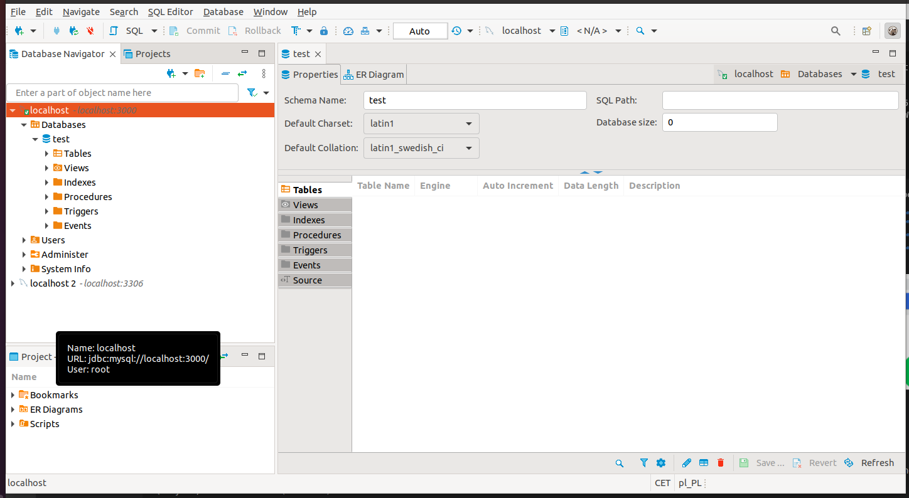

## 4. Przekucie wdrożenia manualnego w plik wdrożenia 

> kubectl apply -f deploy.yml

Plik .yml

```
apiVersion: apps/v1 
kind: Deployment
metadata:
  name: mysql
spec:
  replicas: 3
  selector:
    matchLabels:
      app: mysql
  template:
    metadata:
      labels:
        app: mysql
    spec:
      containers:
      - image: mysql:5.6
        name: mysql
        env:
        - name: MYSQL_ROOT_PASSWORD
          value: password
        ports:
        - containerPort: 3306
          name: mysql
        
```

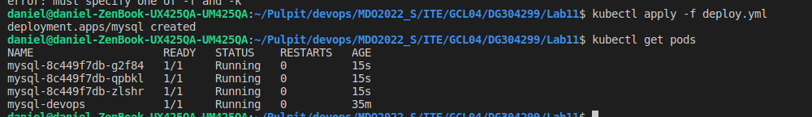

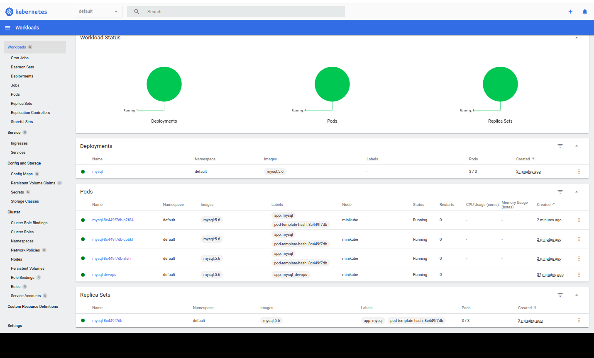


  


  


  

  


  