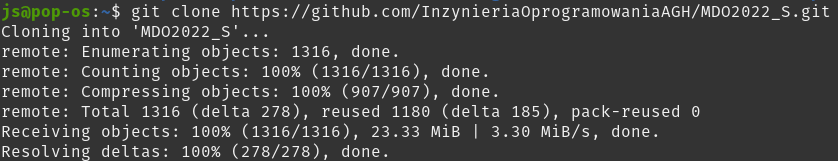
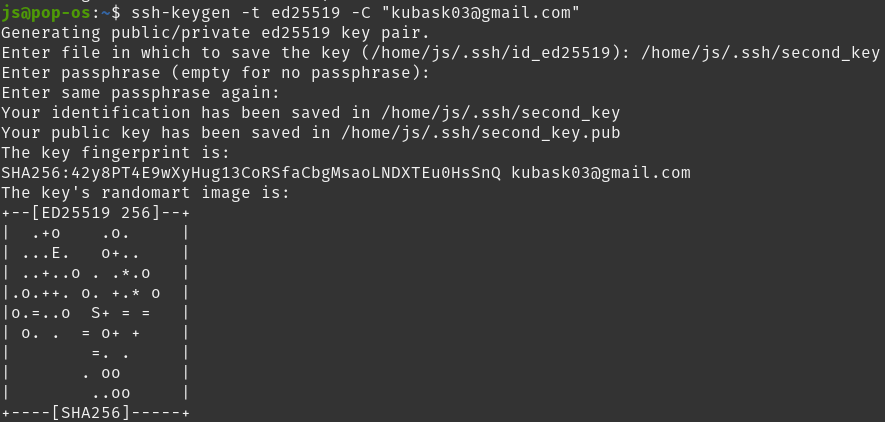
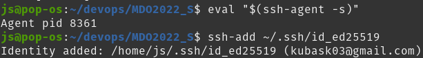
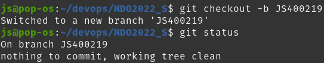
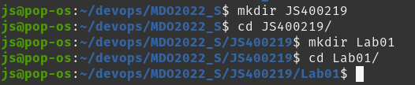
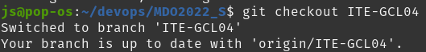
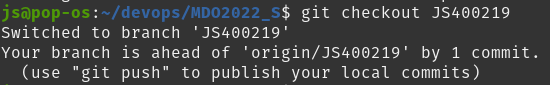
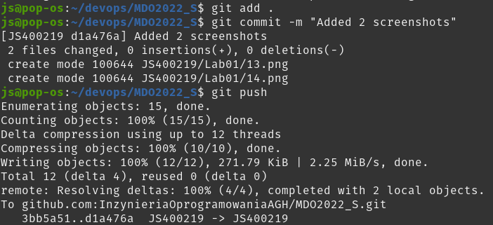

# Sprawozdanie Lab nr 1

## 1. Instalacja klienta git i kluczy SSH

Pracowałem na linuxie zainstalowanym bezpośrednio na moim PC. Git był zainstalowany już wcześniej.

```
sudo apt install git
```



Ponieważ nie jest to maszyna wirtualna nie łączyłem się przez SSH, a jedynie korzystałem domyślnego emulatora terminalu.

## 2. Skolonowanie repozytorium

Utworzono dwa klucze SSH.

Pierwszy bez passphrase oraz z domyślną nazwą


oraz drugi zabezpieczony z nazwą `second_key`



```
ssh-keygen -t ed25519 -C "kubask03@gmail.com"
```

Następnie uruchamiany został ssh agent oraz pierwszy klucz został dodany.



```
eval "$(ssh-agent -s)"
ssh-add ~/.ssh/id_ed25519
```

Klucz dodany do SSH agenta został, także dodany na stronie Githuba.

Na koniec repozytorium zostało sklonowane przy użyciu protokołu SSH.


```
git clone git@github.com:InzynieriaOprogramowaniaAGH/MDO2022_S.git
```

## 3. Tworzenie gałęzi

Na wstępie przełączono się na gałąź `main`.


```
git checkout main
```

Następnie utworzono gałąź, która odgałęzia się od gałęzi mojej grupy.





```
git checkout ITE-GCL04
git checkout -b JS400219
```

## 4. Praca na utworzonej gałęzi

Utworzono potrzebne katalogi



```
mkdir JS400219
cd JS400219/
mkdir Lab01
cd Lab01/
```

Utworzono commit zawierający wszystkie pliki, które wcześniej nie istniały na gałęzi z wiadomością `Init`


```
git add .
git commit -m "Init"
```

i wysłano zmiany do zdalnego źródła


```
git push --set-upstream origin JS400219
```

Następnie spróbowano wciągnąć moją gałąź do gałęzi grupowej. W tym celu najpierw zmieniono aktualną gałąź na gałąź grupową (`ITE-GCL04`)



```
git checkout ITE-GCL04
```

oraz wcalono moją gałąź


```
git merge JS400219
```

Wykonane operacje zostały udokumentowane oraz dodane w kolejnym commicie.





```
git checkout JS400219
git add .
git commit -m "Added 2 screenshots"
git push
```

