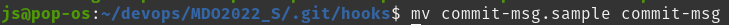
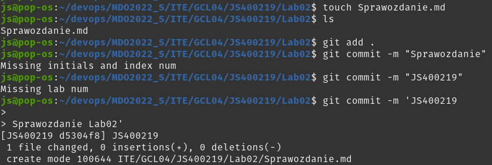
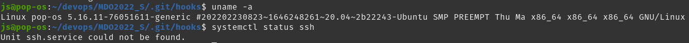
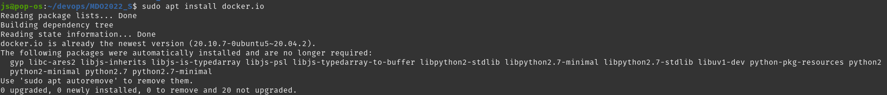
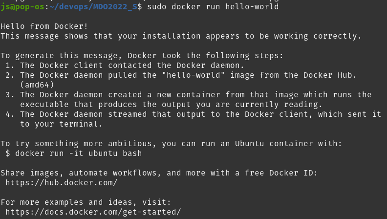
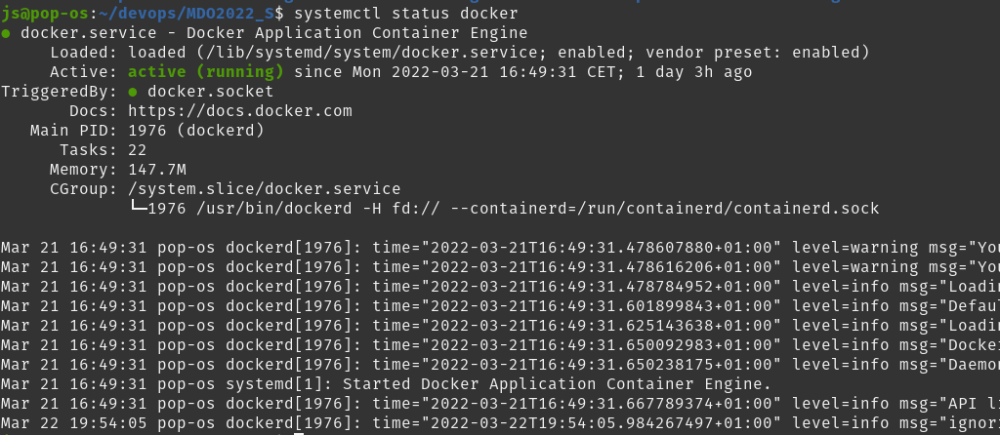
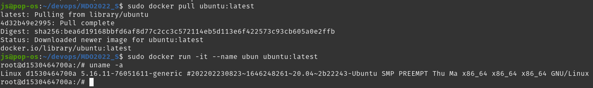

# Sprawozdanie Lab nr 2

## 1. Przygotowanie git hook

W folderze `.git/hooks` z pliku `commit-msg.sample` usunięty został postfix `.sample`.

```
mv commit-msg.sample commit-msg
```



Następnie plik ten został uzupełniony o skrypt bashowy sprawdzający czy commit message zawiera inicjały i numer indeksu w tytule oraz numer labu w treści.

```
#!/bin/bash

PATTERN1=".*JS400219.*"
PATTERN2=".*Lab[0-9]+.*"
IFS='\n'
readarray -t ADDR < "$1"

if ! [[ ${ADDR[0]} =~ $PATTERN1 ]]
then
	echo "Missing initials and index num"
	exit 1
fi

for i in "${ADDR[@]}"
do
	if [[ $i =~ $PATTERN2 ]]
	then
		exit 0
	fi
done

echo "Missing lab num"
exit 1

```

Próby wykonania commitów:

```
git add .
git commit -m "Sprawozdanie"
git commit -m "JS400219"
git commit -m 'JS400219

Sprawozdanie Lab02'
```



# 2. Przygotowanie środowiska Dockerowego

Praca wykonywana była na natywnym linuxie

```
uname -a
systemctl status ssh
```



oraz środowisko Dockerowe były wcześniej zainstalowane

```
sudo apt install docker.io
```



# 3. Działanie środowiska Dockerowego

Uruchomiony został przykładowy kontener z obrazu `hello-world`

```
sudo docker run hello-world
```



Dodatkowo sprawdzony został serwis Dockera

```
systemctl status docker
```



Pobrano najnowszy obraz ubuntu oraz uruchomiono kontener

```
sudo docker pull ubuntu:latest
sudo docker run -it --name ubun ubuntu:latest
uname -a
```



# 5. Utworzono konto Docker Hub

