# Sprawozdanie Lab nr 3

## 1. Wybór projektu

W celu przetestowania oraz zbudowania projekty wybrany został projekt [nydus-snapshotter](https://github.com/containerd/nydus-snapshotter)

Repozytorium projektu zostało sklonowane w środowisku lokalnym

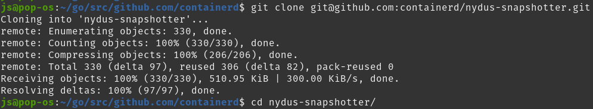

następnie włączono testy

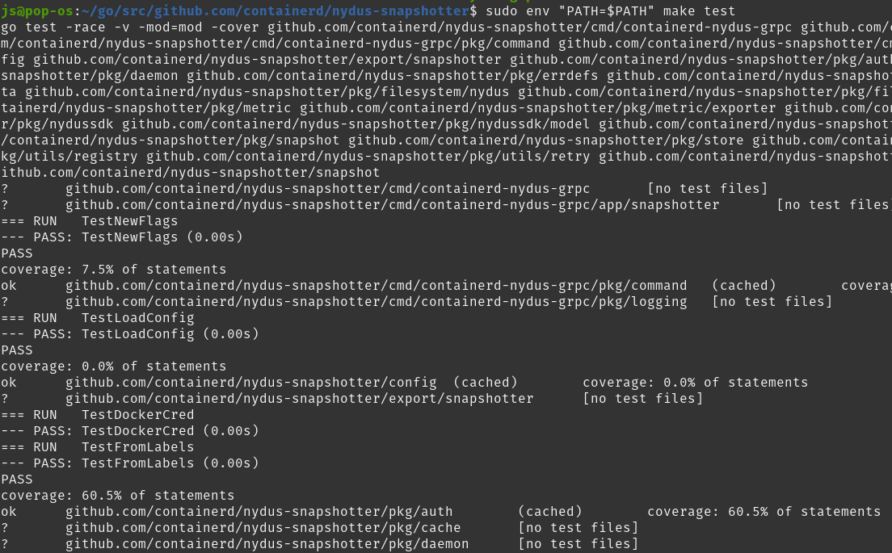


oraz zbudowano projekt

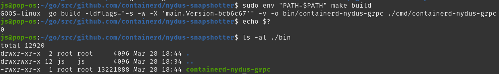

Pobieranie i instalowanie koniecznych zależności nie było konieczne ponieważ wszystkie były już zainstalowane jednak gdyby było to potrzebne należałoby wykonać komendę ```go mod tidy```, która pobiera i instaluje zależności.

Komenty budujące i testujące kod musiały być dodatkowo uruchamiane przy pomocy ```sudo env "PATH=$PATH"```.

```
git clone git@github.com:containerd/nydus-snapshotter.git
cd nydus-snapshotter/
sudo env "PATH=$PATH" make test
echo $?
sudo env "PATH=$PATH" make build
echo $?
ls -al ./bin
```

# 2. Przeprowadzenie buildu w kontenerze

Podstawowy obraz zawierający zainstalowane środowisko języka Go został pobrany z Docker Hub, a następnie uruchomiony kontener w trybie interaktywnym z TTY.

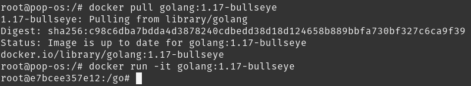

W konterze sklonowane zostało wcześniej urzywane repozytorium

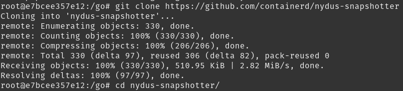

Włączone zostały testy, które automatycznie pobrały wymagane zależności

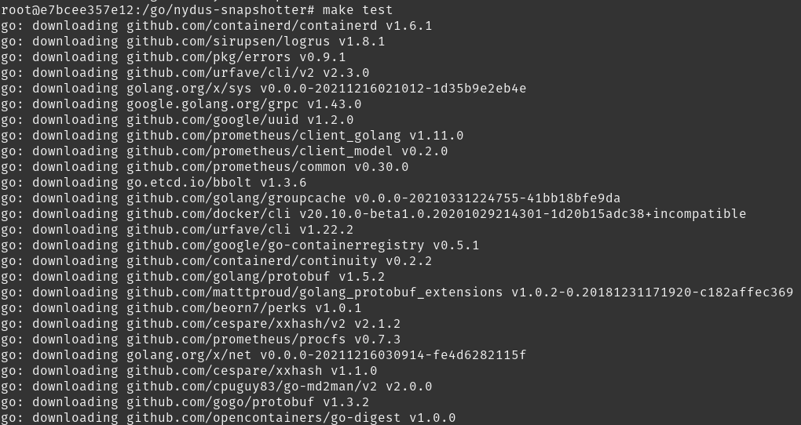
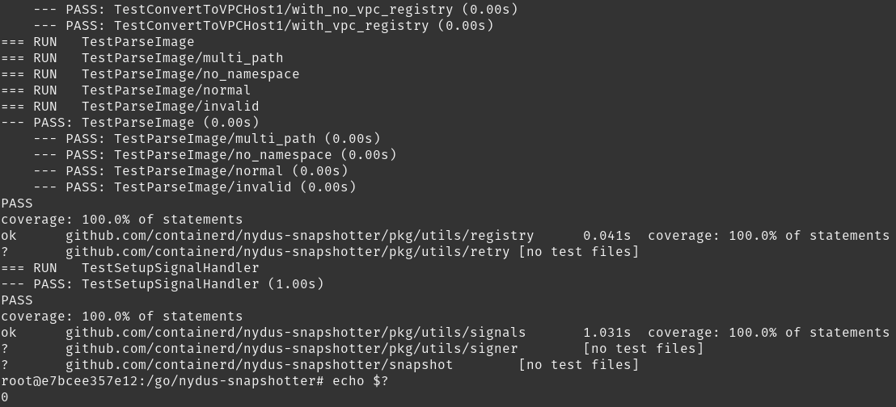

natępnie zbudowano projekt

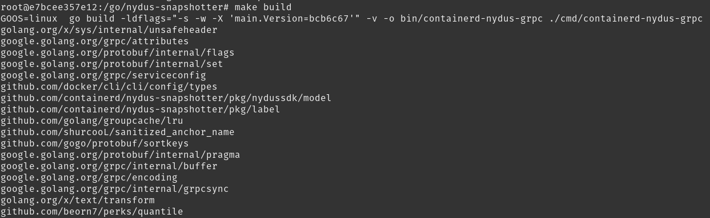
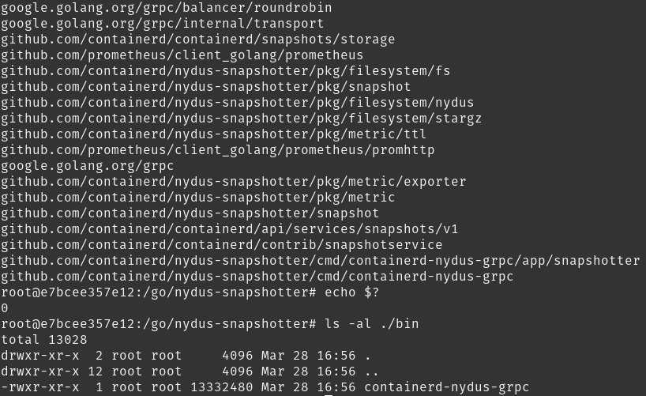

```
sudo docker pull golang:1.17-bullseye
sudo docker run -it golang:1.17-bullseye
git clone https://github.com/containerd/nydus-snapshotter
cd nydus-snapshotter
make test
echo $?
make build
echo $?
ls -al ./bin
```

# 3. Utworzenie plików Dockerfile

Pierwszy plik Dockerfile odpowiedzialny był za przygotowanie środowiska, a następnie wykonanie buildu.

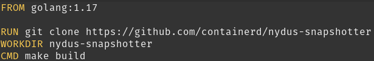

Tak jak wcześniej przy pomocy podstawy, którą jest ```golang:1.17-bullseye``` podczas budowania obrazu klonowane jest repozytorium oraz ustwiane working directory jako folder zawierający sklonowany projekt. Potem jako pierwsza komenda gdy zostanie utworzony kontener z obrazu ma zostać wywołane polecenie ```make build```.

Obraz był zbudowany

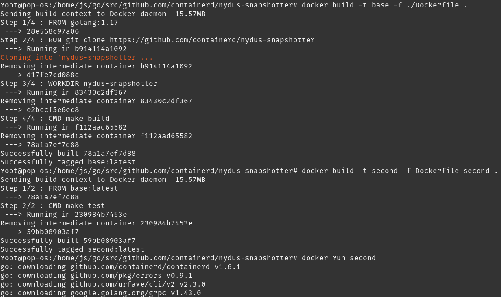

oraz na podstawie zbudowanego obrazu zbudowano kolejny, którego zadaniem było testowanie projektu

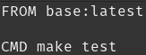

Zbudowano obraz

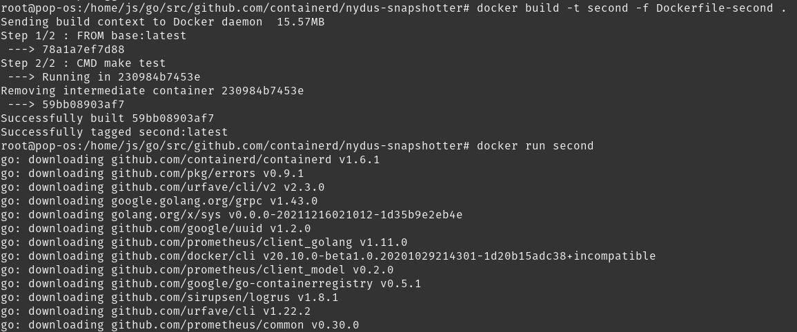

Uruchomiony został kontener na bazie stworzonego obrazu

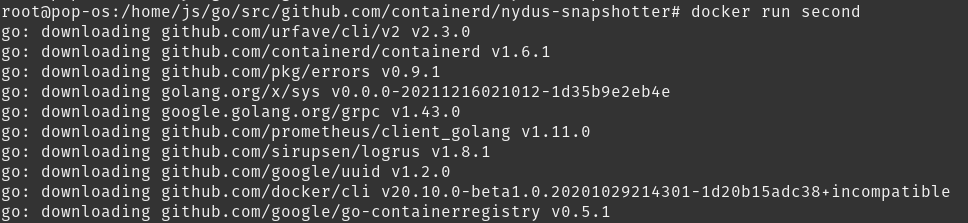

Poprawność jego wykonania potwierdza jego exit code jego statusu

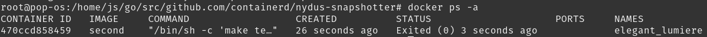

Dodatkowo widać, że ostatnio wykonaną komendą w kontenerze jest ```/bin/sh -c make test```

```
docker build -t base -f Dockerfile .
docker build -t second -f Dockerfile-second .
docker run second
docker ps -a
```