# Sprawozdanie Lab nr 4

## 1. Zachowywanie stanu

Utworzono dwa woluminy (wejściowy i wyjściowy) o nazwach `input` i `output`.

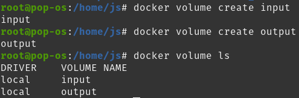

```
docker volume create input
docker volume create output
docker volume ls
```

Uruchomiono bazowy kontener `golang:1.17-bullseye` oraz podłączono do niego wcześniej utworzone woluminy pod takimi samymi nazwami.

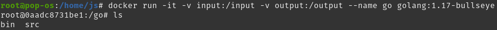

```
docker run -it -v input:/input -v output:/output --name go golang:1.17-bullseye
```

Następnie w nowym okine terminalu, sklonowane zostało repozytorium z projektem.

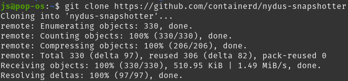

oraz zostało ono skopiowane za pomocą Dockerowego cli do woluminu we wcześniej utworzonym kontenerze.

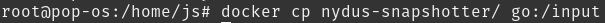

```
git clone https://github.com/containerd/nydus-snapshotter
docker cp nydus-snapshotter/ go:/input
```

Skopiowane repozytrium jest teraz widoczne w kontenerze.

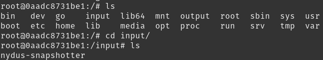

Uruchomiono build oraz skopiowano zbudowany plik do woluminu wyjściowego


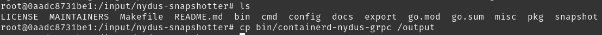

```
cd /input/nydus-snapshotter/
make build
cp bin/containerd-nydus-grpc /output
```

Skopiowany plik jest widoczny na maszynie host.

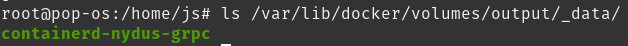
#
## 2. Eksponowanie portu

Utworzono kontener z serwerem `iperf3` na bazie obrazu `ubuntu:20.04`. Zainstalowano wymagane paczki oraz sprawdzono adres ip kontenera z utworzonym serwerem.

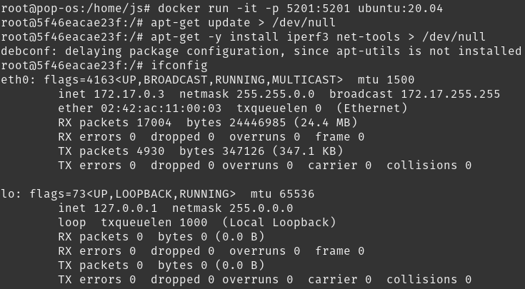

```
docker run -it -p 5201:5201 ubuntu:20.04
apt-get update > /dev/null
apt-get -y install iperf3 net-tools > /dev/null
ifconfig
```

Serwer `iperf3` był uruchamiany na standardowym porcie 5201.

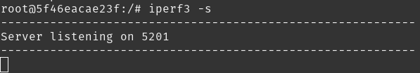

```
iperf3 -s
```

Połączenie klienta wykonywane było za pomocą komendy

```
iperf3 -c <server-ip>
```

# a) Połączenie z kontenera

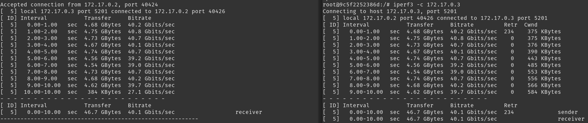

# b) Połączenie z hosta


# c) Połączenie z innej maszyny

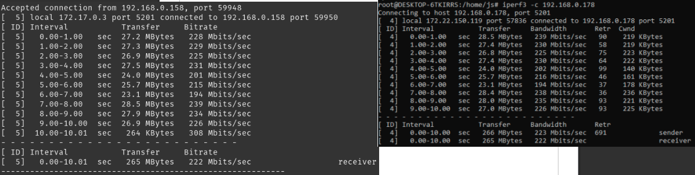

Przepustowość w pierwszych dwóch przypadkach była porównywalna z lekką przewagą dla połączenia z kontenera. Jest to spowodowane tym, że Docker działa w systemie jako serwis co sprawia, że posiada on większy priorytet. Połączenie nr 3 wykonane było z laptopa w sieci lokalnej, który połączony był do sieci przez Wi-Fi, odbiło się to znacząco na przepustowości.

## 3. Instancja Jenkins

Uruchomiono kontener na podstawie obrazu `docker:bind`.

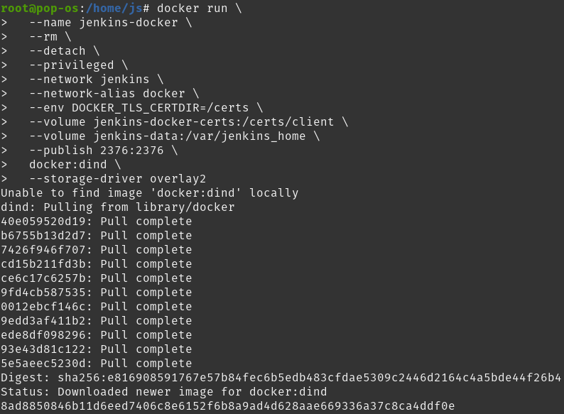

Następnie według zaleceń stworzono Dockerfile

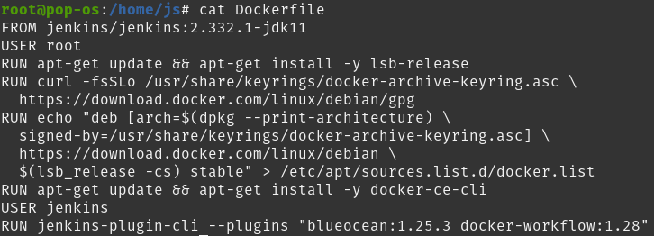

oraz po zbudowaniu go został uruchomiony

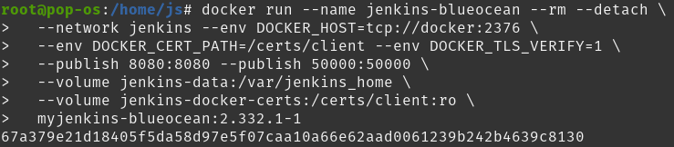

Uruchomiono stronę konfiguracyjną Jenkins

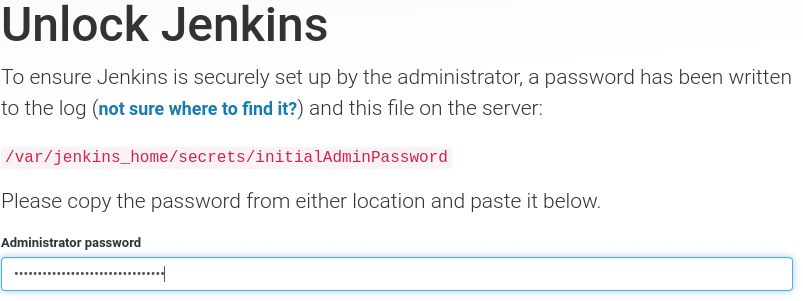

Odpowiedni kod został pozyskany z logów kontenera Jenkinsa.

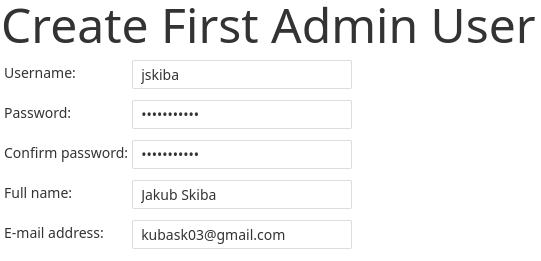

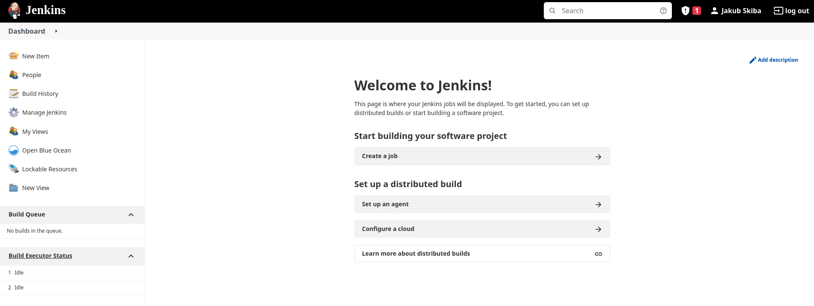

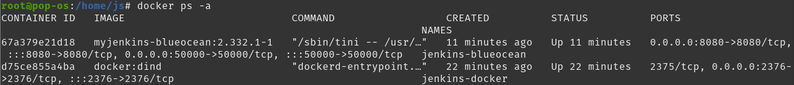

```
docker network create jenkins

docker run --name jenkins-docker --rm --detach \
  --privileged --network jenkins --network-alias docker \
  --env DOCKER_TLS_CERTDIR=/certs \
  --volume jenkins-docker-certs:/certs/client \
  --volume jenkins-data:/var/jenkins_home \
  --publish 2376:2376 \
  docker:dind --storage-driver overlay2

# prepare Dockerfile

docker build -t myjenkins-blueocean:2.332.1-1 .
docker run --name jenkins-blueocean --rm --detach \
  --network jenkins --env DOCKER_HOST=tcp://docker:2376 \
  --env DOCKER_CERT_PATH=/certs/client --env DOCKER_TLS_VERIFY=1 \
  --publish 8080:8080 --publish 50000:50000 \
  --volume jenkins-data:/var/jenkins_home \
  --volume jenkins-docker-certs:/certs/client:ro \
  myjenkins-blueocean:2.332.1-1

docker logs <jenkins-container-id> # find password for jenkins configuration
```