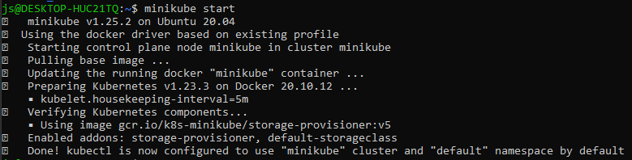
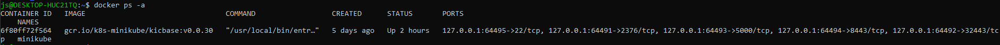
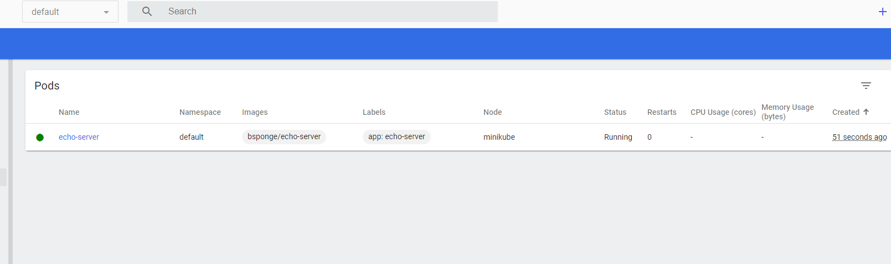
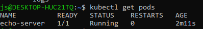
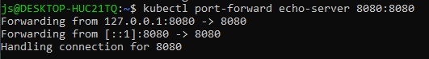

# Sprawozdanie - Laboratorium nr 11

## Instalacja klastra

Przy instalacji `minikube` skorzystano z zalenej ścieżki instalacji poprzez pobranie pliku przy pomocy `curl` oraz instalacja

```
curl -LO https://storage.googleapis.com/minikube/releases/latest/minikube-linux-amd64
sudo install minikube-linux-amd64 /usr/local/bin/minikube
```

oraz wystartowano klaster

```
minikube start
```




Następnie uruchomiono dashboard 

```
minikube dashboard
```



## Wybór nowego projektu

Ponieważ mój wcześniejszy projekt był zwykłym toolem do przerabiania plików z kodem źródłowym Go postanowiłem zmienić projekt, na taki z którym można łatwo komunikować się poprzez sieć. Wybór padł na [echo-server](https://github.com/bsponge/echo-server). Projekt ten to serwer http odpowiadający na nasze zapytania w postaci informacji o wykonanym zapytaniu. Projekt został zbudowany i umieszczony w obrazie dockera.

Przykładowa odpowiedź z aplikacji działającej w [obrazie dockera](https://hub.docker.com/repository/docker/bsponge/echo-server).


# Korzystanie z kubernetes

Uruchomiono kontener ze zbudowanego obrazu w podzie.

```
minikube kubectl -- run echo-server --image=bsponge/echo-server --port=8080 --labels="app=echo-server"
```




Wyprowadzono port `8080`.

```
kubectl port-forward echo-server 8080:8080
```



Całe wdrożenie zapisano w pliku yaml oraz dodano 5 replik.

```
apiVersion: apps/v1
kind: Deployment
metadata:
  name: echo-server
  labels:
    app: echo-server
spec:
  replicas: 5
  selector:
    matchLabels:
      app: echo-server
  template:
    metadata:
      labels:
        app: echo-server
    spec:
      containers:
      - name: echo-server
        image: bsponge/echo-server:latest
        ports:
        - containerPort: 8080

```

oraz zastosowano je

```
kubectl apply -f deployment.yaml
```