# Sprawozdanie: Projekt pipeline

## Zmiana projektu

Postanowiłem zmienić projekt z [nydus-snapshotter](https://github.com/containerd/nydus-snapshotter) na [gomodifytags](https://github.com/fatih/gomodifytags). Na początku nie byłem świadomy tego, że wybrałem projekt, który jest pluginem do `containerd`. Myślałem, że to zwykły demon linuxowy. Co więcej, oprócz tego, że jest to plugin, to posiada on parę dependencji, o którym jak zacząłem czytać to wiedziałem mniej niż na początku. Doszedłem do momentu, w którym chciałem zbudować obraz do kroku deploy i nie wiedziałem co zrobić i wtedy popatrzyłem jak jest on budowany w Github Actions na stronie projektu. Wtedy stwierdziłem, że to bez sensu bo nie rozumiem za bardzo co się dzieje. Dlatego mój wybór padł na [gomodifytags](https://github.com/fatih/gomodifytags), które jest prostym programem do dodawania tagów w plikach źródłowych pisanych w języku Go.

## Budowa Pipeline'u

Na początku projekt został zforkowany ([fork](https://github.com/bsponge/gomodifytags)).

Tworząc `Pipeline definition` skorzystałem z opcji `Pipeline script from SCM`

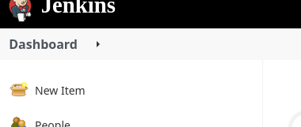
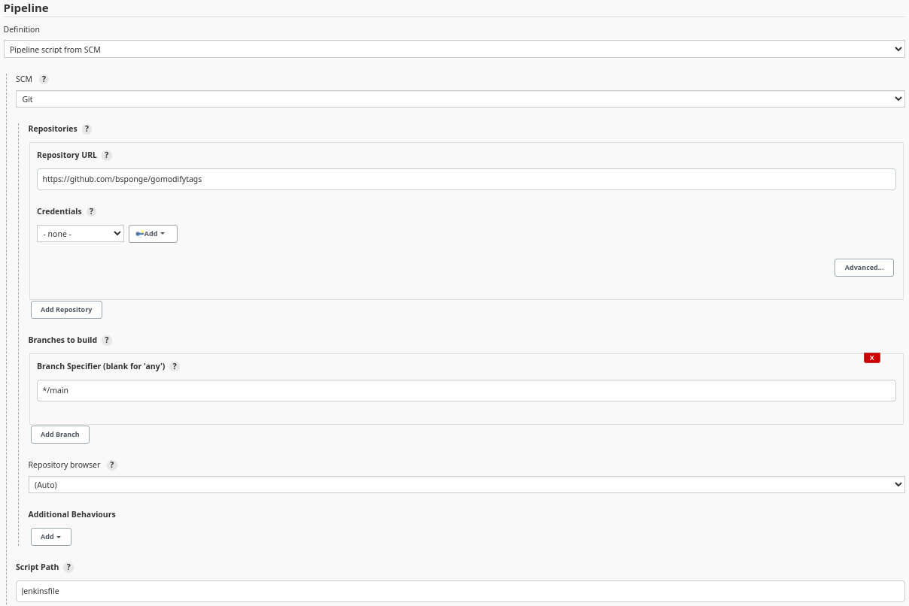

Ustawiona została gałąź, z której ma trafiać do pipeline'u oraz pod jaką ścieżką znajduje się `Jenkinsfile`.

## Jenkinsfile

### Docker images

Podczas budowania pipeline'u korzystam z kilku obrazów dockera, które trzeba było skądś wziąć. Ja postanowiłem zbudować potrzebne obrazy, a następnie udostępnić je w repozytoriach na [Docker Hub](https://hub.docker.com/u/bsponge). Wybrałem to podejście bo do tej pory nie używałem Docker Huba w ten sposób i chciałem go przetestować.

Przygotowane zostały 3 obrazy:
- [builder](https://hub.docker.com/r/bsponge/builder)
- [tester](https://hub.docker.com/r/bsponge/tester)
- [deployment-image](https://hub.docker.com/r/bsponge/deployment-image)

### Kroki

Pipeline składał się z 9 kroków (wliczając `Declarative: Checkout SCM`, który Jenkins robi automatycznie przez wybranie projektu na Githubie jako źródło).
- Declarative: Checkout SCM
- Prepare
- Build
- Copy bin file
- Test
- Create log artifacts
- Deploy
- Test deploy
- Publish
- Post actions

### Deklaracja zmiennych

Na samym początku skryptu zdefiniowane zostały zmienne na przechowywanie nazw obrazów umieszczonych na Docker Hub.

```
def builderImage = "bsponge/builder:1.0.5"
def testerImage = "bsponge/tester:1.0.5"
def deploymentImage = "bsponge/deployment-image"
```

### Builder Dockerfile

```
FROM golang:1.18.1-bullseye

CMD	cp -r /input /gomodifytags && \
	cd /gomodifytags && \
	ls /gomodifytags && \
	go build . && \
	cp ./gomodifytags /output
```

### Tester Dockerfile

```
FROM golang:bullseye

WORKDIR /input
CMD go test ./...
```

### Deploymentj-image Dockerfile

Tutaj jest mała różnica ponieważ dwa kolejne pliki Dockerfile były budowane podczas trwania pipeline'u. Było to spowodowane tym, że obrazy te wymagały skorzystania z np. z pliku wykonywalnego budowanego w etapie `Build`.

```
FROM alpine:latest

COPY gomodifytags /usr/local/bin
```

###	Test-deploy Dockerfile

Skorzystano tutaj z argumentu, który podawany był do pliku Dockerfile dopiero podczas budowania go. Argumentem tym był obraz budowany w kroku `Deploy`.

```
ARG image

FROM $image

COPY ./jenkins/example .
CMD gomodifytags -file example -all -add-tags json
```

### Parameters

Zdefiniowane zostały odpowiednie parametry tak jak zostało to określone w instrukcji.

```
parameters {
		string(name: 'version', defaultValue: 'latest', description: '')
		booleanParam(name: 'promote', defaultValue: 'true', description: '')
}
```

### Environment

Chciałem zastosować różne opcje Jenkinsa dlatego stwierdziłem, że skorzystam też z publikowania zbudowanego artefaktu w obrazie dockera na Docker Hub. Do wykonania tego potrzebne były kredencjały do mojego konta.

```
environment {
		DOCKERHUB_CREDENTIALS=credentials("docker-hub-creds")
}
```

### Prepare

Na początku tworzone zostały 2 woluminy. `input` był przeznaczony do przechowywania repozytorium, z którego korzystały kontenery. `output` przeznaczony był do przetrzymywania zbudowanego pliku wykonywalnego.

Następnie tworzony był kontener `copier` na podstawie obrazu `alpine:latest` jego jedynym zadaniem było klonowanie repozytorium na wolumin.

```
stage('Prepare') {
	steps {
		sh "docker volume create output"
		sh "docker volume create input"
		sh "docker run --name cloner -dit -v input:/input -v output:/output alpine:latest"
		sh "docker cp . cloner:/input"
	}
}
```

### Build

Uruchamiano kontener na podstawie obrazu `bsponge/builder`, który miał podpięte 2 woluminy, na jednym (`input`) było repozytorium, a na drugim (`output`) miał wylądować zbudowany plik wykonywalny.

```
stage('Build') {
			steps {
				sh "docker run --name builder -v input:/input -v output:/output ${builderImage}"
			}
}
```

### Copy bin file

Krok odpowiedzialny za wyciągnięcie pliku binarnego z woulminu poniważ później plik ten będzie potrzebny podczas budowania obrazu pod deploy.

```
stage('Copy bin file') {
	steps {
		sh "docker cp cloner:output/gomodifytags ."
	}
}
```

### Test

Krok `Test` uruchamia kontener na podstawie wcześniej opisywanego Dockerfile. Do kontenera podłączany jest wolumen z repozytorium.

```
stage('Test') {
	steps {
		sh "docker run --name tester -v input:/input ${testerImage}"
	}
}
```

### Create log artifacts

Po wykonaniu kroku `Test` tworzony był plik z logami pozyskiwanymi z konteneru budującego i testującego.

```
stage('Create artifacts') {
	steps {
		sh "docker logs builder >> pipeline-${env.version}.log"
		sh "docker logs tester >> pipeline-${env.version}.log"
	}
}
```

### Deploy

W tym kroku budowany jest obraz, który będzie zawierał plik binarny zbudowanego proujektu. Korzysta on z pliku, który został skopiowany z woluminu w kroku `Copy bin file`.

```
stage('Deploy') {
	steps {
		sh "docker build -t ${deploymentImage}:${env.version} -f Dockerfile-deploy ."
	}
}
```

### Test deploy

W celu przetestowania działania obrazu zbudowanego w poprzednim kroku budowany jest kolejny obraz na podstawie wcześniejszego, który uruchamia program i sprawdza czy otrzymano spodziewany wynik.

```
stage('Test deploy') {
	steps {
		sh "docker build -t test-deploy -f Dockerfile-test-deploy --build-arg image=${deploymentImage}:${env.version} ."
		sh "docker run --name test-deployment test-deploy"
		sh "docker logs test-deployment >> testoutput.log"
		sh "diff testoutput.log jenkins/expected"
	}
}
```

### Publish

Przed ostatni krok, w którym obraz zbudowany w kroku `Deploy` zostaje pushwoany do repozytrium na Docker Hub jeżeli odpowiednia zmienna środowiskowa jest ustawiona na `true`. W tym kroku skorzystano z `DOCKERHUB_CREDENTIALS` ponieważ wymagane jest uwierzytelnienie się przed pushowaniem czegokolwiek do repozytorium na Docker Hub.

```
stage('Publish') {
	steps {
		script {
			if (env.promote == "true") {
				sh "echo $DOCKERHUB_CREDENTIALS_PSW | docker login -u $DOCKERHUB_CREDENTIALS_USR --password-stdin"
				sh "docker push ${deploymentImage}:${env.version}"
			} else {
				sh "echo NOT PUBLISHING"
			}
		}
	}
}
```

### Post always

Po każdym pozytywnym i negatywnym zakończeniu działania pipeline'u wykonywane były poniżej listowane kroki czyli: 
- utworzenie artefaktu z logami
- usunięcie pliku z logami
- usunięcie wszystkich obrazów i woluminów
- usunięcie wszystkich kontenerów
- wylogowanie się z Docker Hub

```
post {
	always {
		archiveArtifacts artifacts: '*.log' 
		sh "rm -f *.log"
		sh 'docker rm -f $(docker ps -a -q)'
		sh 'docker system prune -af'
		sh 'docker logout'
	}
}
```

### Dodawanie kredencjałów

W zakładce `Manage Jenkins`

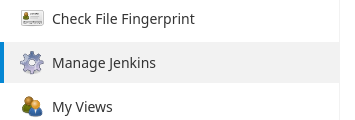

Przechodzimy do `Manage Credentials`

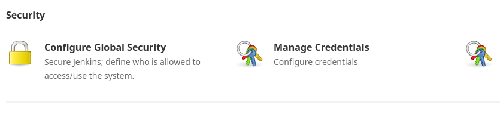

Klikamy w `Jenkins`

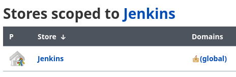

i `Global credentials`

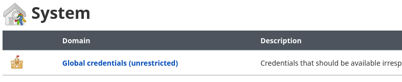

oraz w `Add credentials` w pasku po lewej stronie.

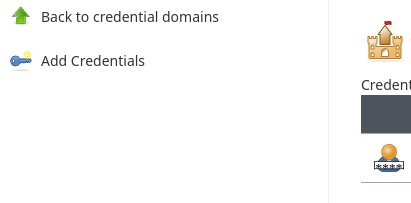

Uzupełniamy formularz

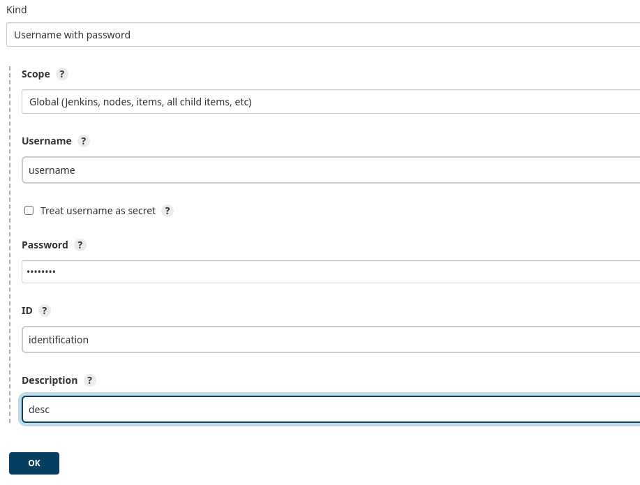

pole `ID` odpowiada za to pod jaką nazwą będą dostępne dodane kredencjały.

### Uruchamianie pipeline'u

Wchodząc do pipeline'u w menu po lewej stronie wybieramy opcje `Build`

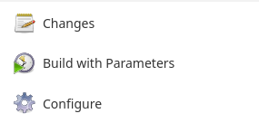

początkowo nazwa tej opcji może być inna, tak było w moim przypadku, dodatkowo nie mogłem wybrać parametrów, można to było zrobić dopiero po drugim uruchomieniu pipeline'u.

Jeżeli już będzie można podać parametry wpisujemy nazwę wersji jaką chcemy wykorzystać oraz wybieramy czy zbudowany artefakt ma być pushowany do repozytorium na Docker Hub.


Po kliknięciu `Build` można przejść do obserwowania logów pipeline'u

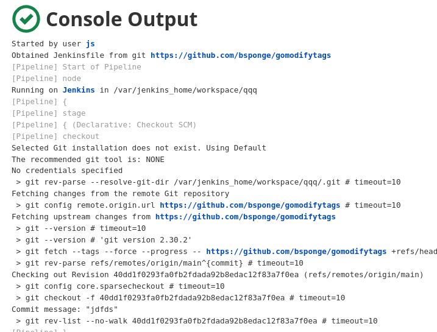

Jeżeli wszystko się powiedzie na końcu logów otrzymamy odpowiedni komunikat

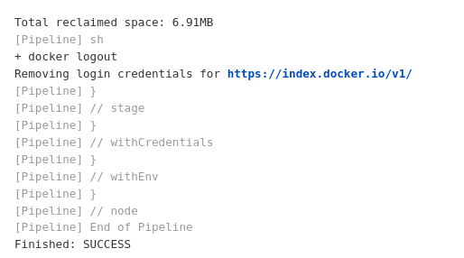

Na Docker Hub można zobaczyć, że obraz został opublikowany

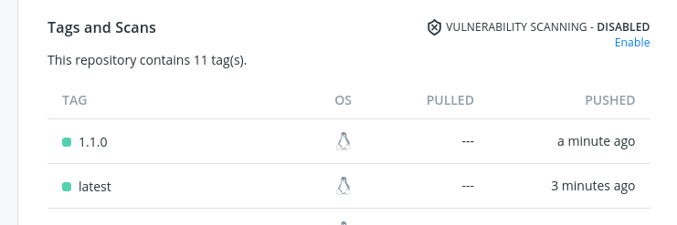

### Napotkane problemy


### Cały Jenkinsfile

```
def builderImage = "bsponge/builder:1.0.5"
def testerImage = "bsponge/tester:1.0.5"
def deploymentImage = "bsponge/deployment-image"

pipeline {
	agent any
	parameters {
		string(name: 'version', defaultValue: 'latest', description: '')
		booleanParam(name: 'promote', defaultValue: 'true', description: '')
	}

	environment {
		DOCKERHUB_CREDENTIALS=credentials("docker-hub-creds")
	}

	stages {
		stage('Prepare') {
			steps {
				sh "docker volume create output"
				sh "docker volume create input"
				sh "docker run --name cloner -dit -v input:/input -v output:/output alpine:latest"
				sh "docker cp . cloner:/input"
			}
		}
		stage('Build') {
			steps {
				sh "docker run --name builder -v input:/input -v output:/output ${builderImage}"
			}
		}
		stage('Copy bin file') {
			steps {
				sh "docker cp cloner:output/gomodifytags ."
			}
		}
		stage('Test') {
			steps {
				sh "docker run --name tester -v input:/input ${testerImage}"
			}
		}
		stage('Create log artifact') {
			steps {
				sh "docker logs builder >> pipeline-${env.version}.log"
				sh "docker logs tester >> pipeline-${env.version}.log"
			}
		}
		stage('Deploy') {
			steps {
				sh "docker build -t ${deploymentImage}:${env.version} -f Dockerfile-deploy ."
			}
		}
		stage('Test deploy') {
			steps {
				sh "docker build -t test-deploy -f Dockerfile-test-deploy --build-arg image=${deploymentImage}:${env.version} ."
				sh "docker run --name test-deployment test-deploy"
				sh "docker logs test-deployment >> testoutput.log"
				sh "diff testoutput.log jenkins/expected"
			}
		}
		stage('Publish') {
			steps {
				script {
					if (env.promote == "true") {
						sh "echo $DOCKERHUB_CREDENTIALS_PSW | docker login -u $DOCKERHUB_CREDENTIALS_USR --password-stdin"
						sh "docker push ${deploymentImage}:${env.version}"
					} else {
						sh "echo NOT PUBLISHING"
					}
				}
			}
		}
	}
	post {
		always {
			archiveArtifacts artifacts: '*.log' 
			sh "rm -f *.log"

			sh 'docker rm -f $(docker ps -a -q)'
			sh 'docker system prune -af'
			sh 'docker volume prune -f'

			sh 'docker logout'
		}
	}
}
```