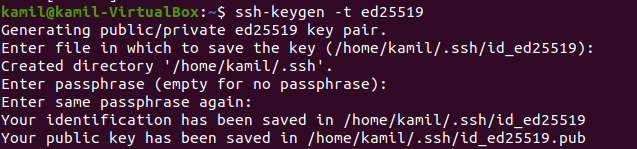
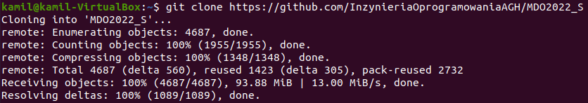
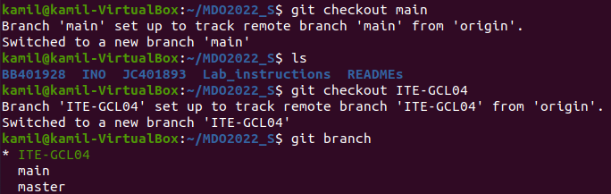
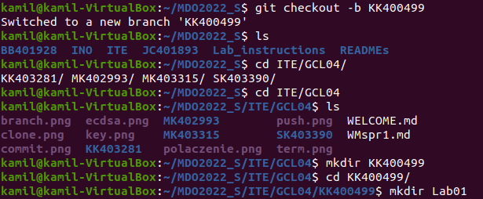
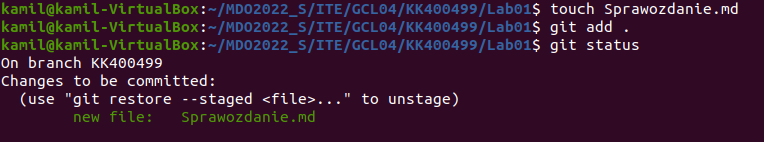
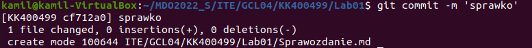

# Sprawozdanie
### Kamil Kruczek GCL04
## Wykonanie ćwiczenia
1. Wygenerowanie kluczy SSH i przypisanie ich do konta na GitHUB

2. Sklonowanie repozytorium

3. Przełączenie na gałąź ```main```, a następnie na gałąź ```ITE-GCL04```

4. Utworzenie własnej gałęzi ```KK400499``` i katalogu o tej samej nazwie oraz katalogu ```Lab01```

5. Utworzenie pliku ```Sprawozdanie.md``` i dodanie go do poczekalni

6. git commit



