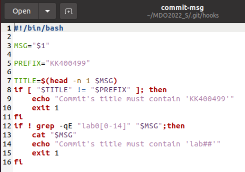
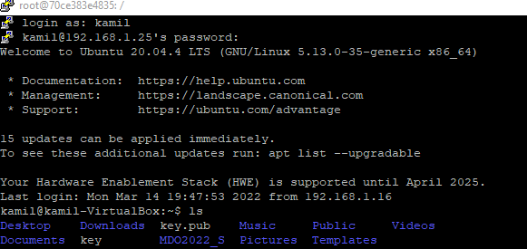
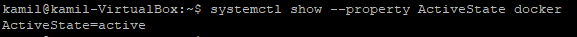
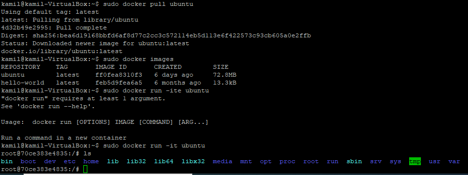

# Sprawozdanie
### Kamil Kruczek GL04
## Wykonanie ćwiczenia

1. Hook sprawdzający poprawność tytułu commita

2. Uzyskanie dostępu do maszyny wirtualnej poprzez zdalny terminal

3. Instalacja i działanie środowiska dockerowego

4. Pobranie ubuntu, wyświetlenie jego wersji i uruchomienie

5. Założone konto na Docker Hub

