<h1>Sprawozdanie z Lab01</h1>

<h3>Konrad Krzempek</h3>

grupa lab 4

Wykonanie ćwiczenia:

    1. Zainstalowanie ssh

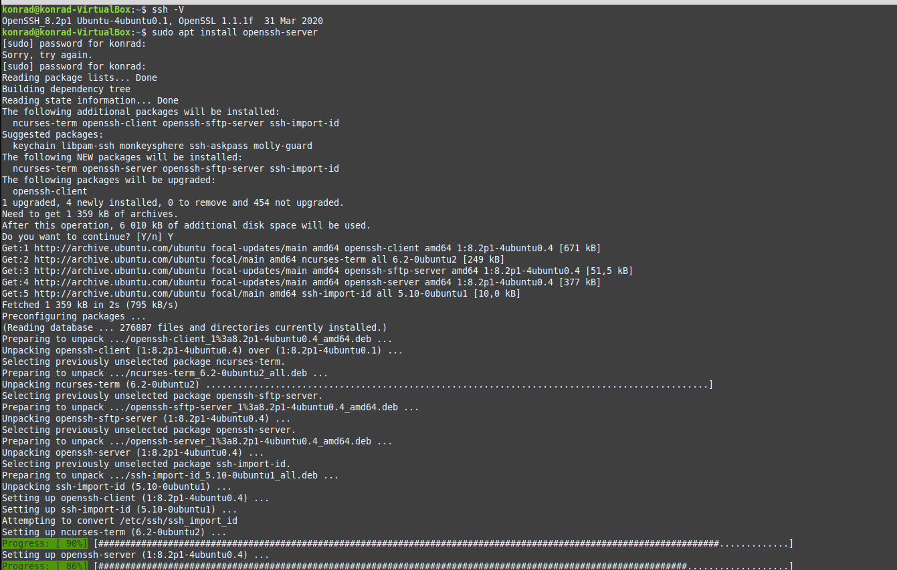

    2. Sprawdzenie statusu ssh.
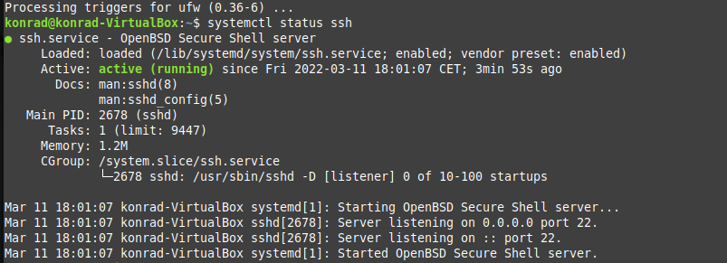
    
    3. Instalacja gita
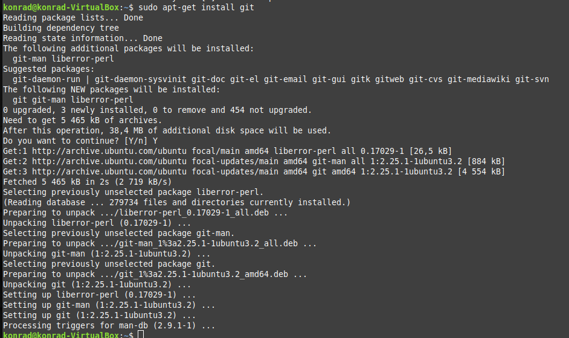

    4. Wygenerowanie kluczy ssh    
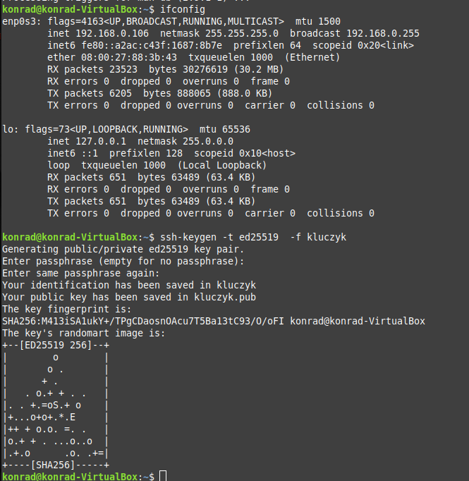

    5. Połączenie się przez windowsa z maszyną wirtualną.
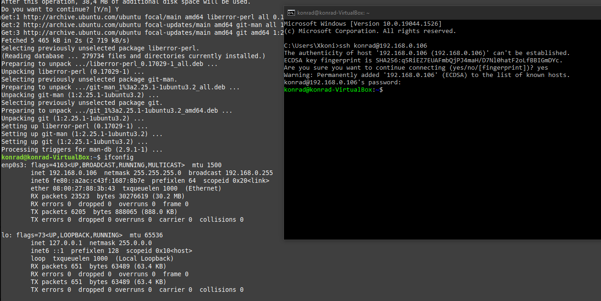

    6. Przeniesienie kluczy ssh
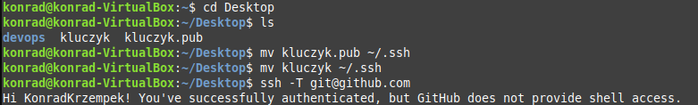

    7. Przypisanie klucza ssh do konta na githubie
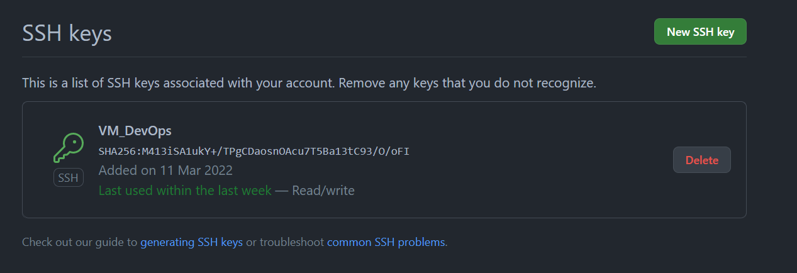

    8. Wykonanie git clone
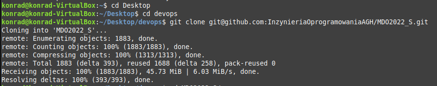

    9. Przejście do odpowiedniej gałęzi: git_checkout main
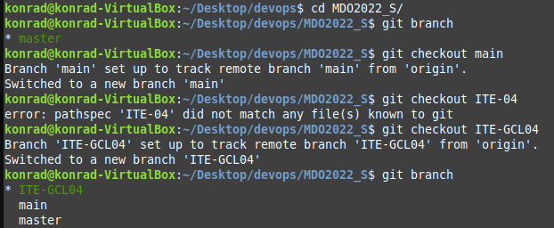

    10. Utworzenie własnego brancha KK403281, 
     utworzenie katalogu o tej samej nazwie i katalogu Lab01
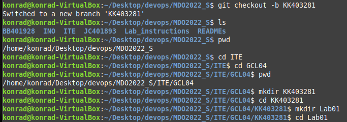

    11. Przejscie do katalogu Lab01 utworzenie pliku Sprawozdanie.md i wykonanie commita
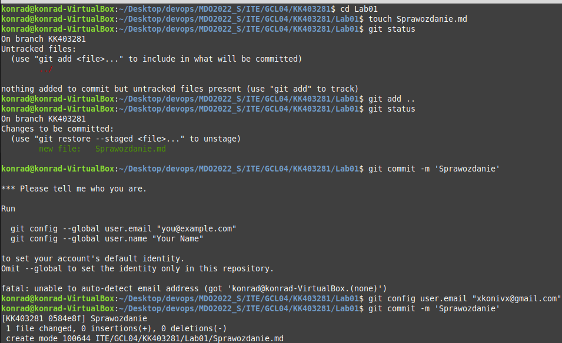

    12. Git push do zdalnego repozytorium
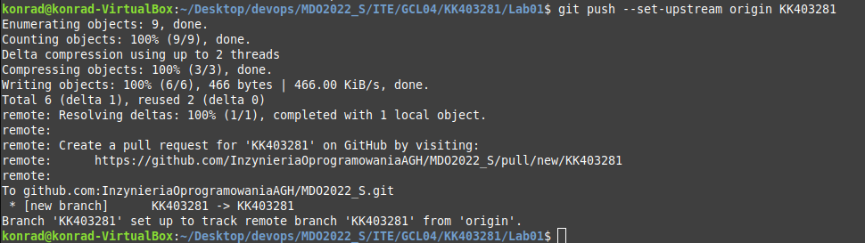
