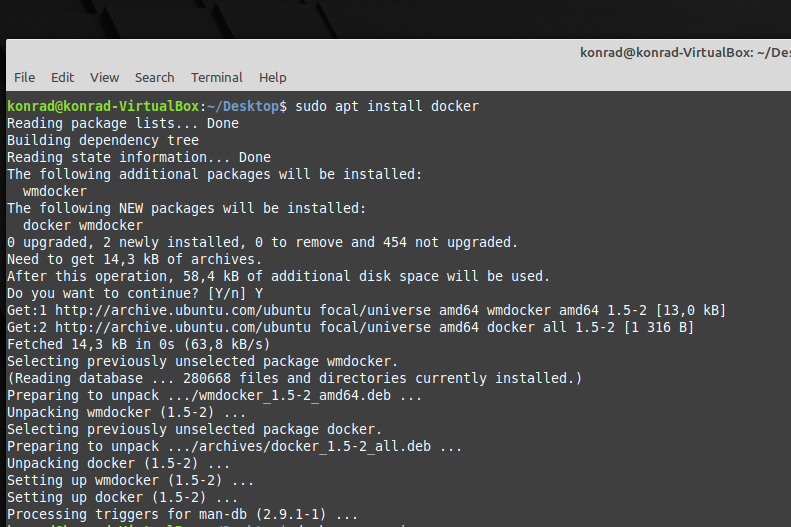
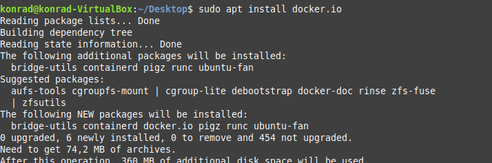
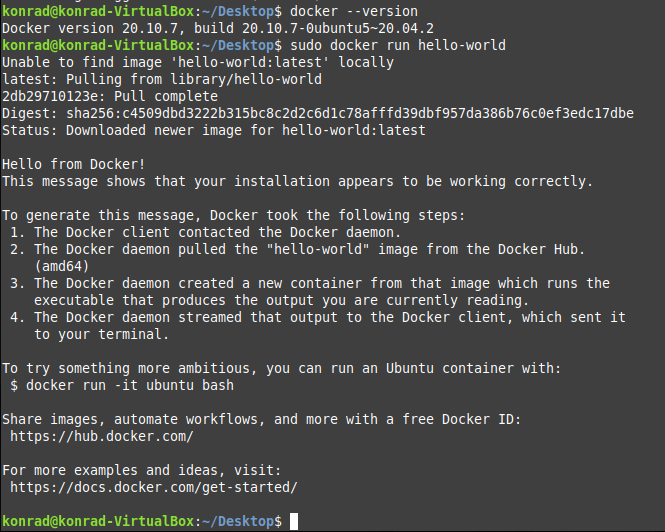
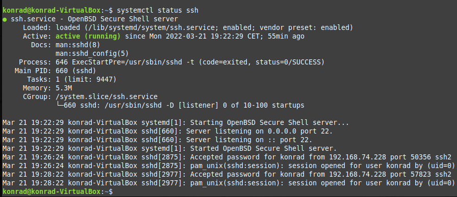
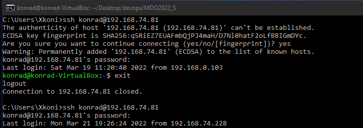
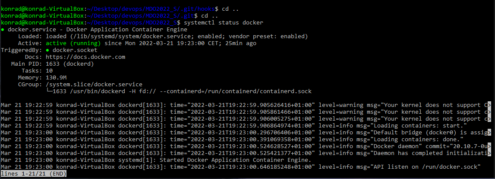
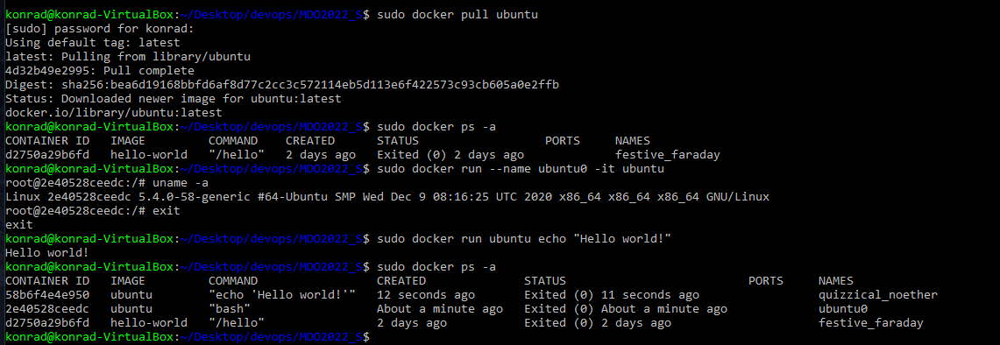
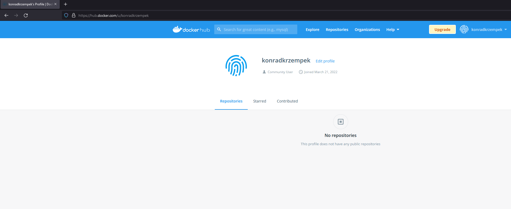

<h1>Sprawozdanie z Lab2</h1>

<h3> Konrad Krzempek</h3>
grupa lab 4

Wykonanie ćwiczenia:

    1. Githook sprawdzający poprawność nazwy i treści commita
    edytowany plik commit_msg:
```
#!/bin/sh

tit=`head -n1 $1`
if [[ "$tit" != "KK403281" ]]; then
        echo "bledny tytul"
        exit 1
fi
if ! [["$msg" =~ "lab02" ]]; then
        echo "bledny komentarz"
        exit 1
f1
```

    2. Instalacja dockera






    3. Wersja dockera i uruchomienie hello world:




    4. Sprawdzenie statusu ssh:




    5. Połączenie z VM za pomocą cmd:




    6. Sprawdzenie statusu dockera:




    7. Pobranie i uruchomienie obrazu ubuntu:




    8. Utworzenie konta na docker hub


