<h1>Sprawozdanie z Lab4</h1>

<h3> Konrad Krzempek</h3>
grupa lab 4

Wykonanie ćwiczenia:

<h3> Zachowanie stanu </h3>

    Przygotowanie woluminu wejsciowego i wyjsciowego:
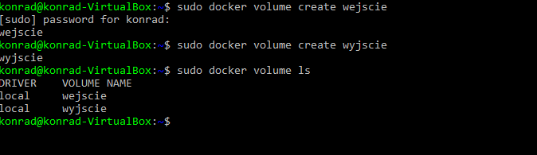

    Uruchomienie kontenera (kontener będzie służył tylko do budowania więc nie będzie na nim nigdy zainstalowany git):
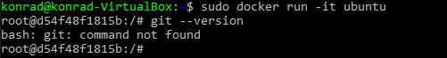

    Sprawdzenie poprawności utworzonych woluminów:
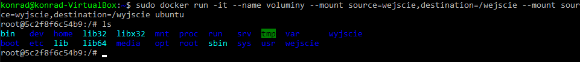

    Wykonanie inspecta w celu wyświetlenia szczegółowych informacji o woluminach:
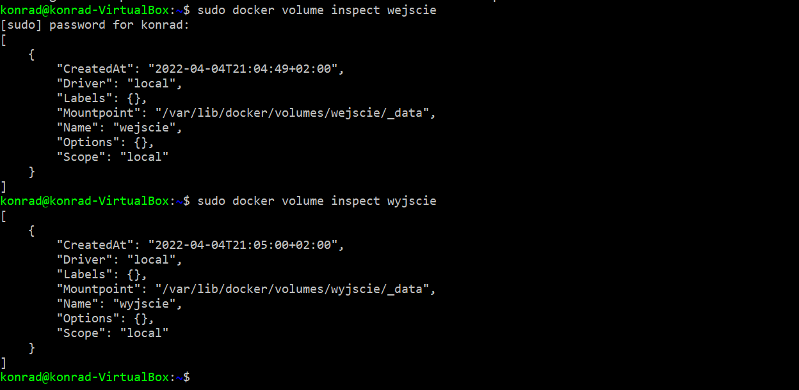

    Próba sklonowania z poziomu hosta na wolumin wejściowy repozytorium (odmowa dostępu)
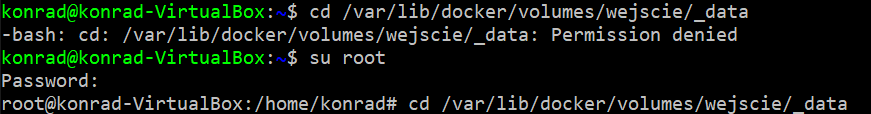

    Udane sklonowanie z poziomu hosta po przejściu na roota:
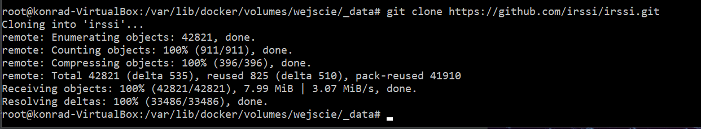

    Sprawdzenie czy sklonowane repo pojawiło się na kontenerze w woluminie wejscie:
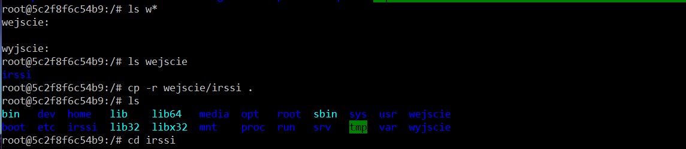

    Udany meson build, po zainstalowaniu wszystkich niezbędnych wymagań (tak jak w poprzednim ćwiczeniu ale bez gita)
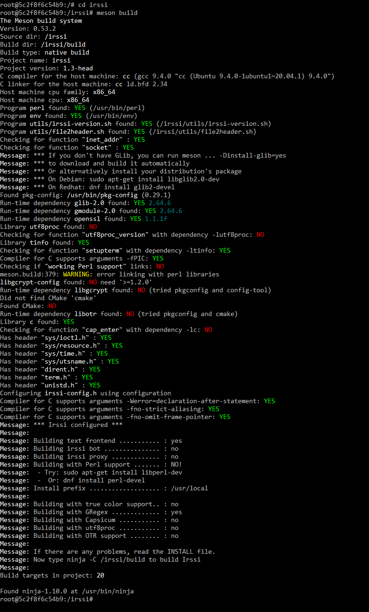

    Zapisanie powstałego builda na woluminie wyjscie:
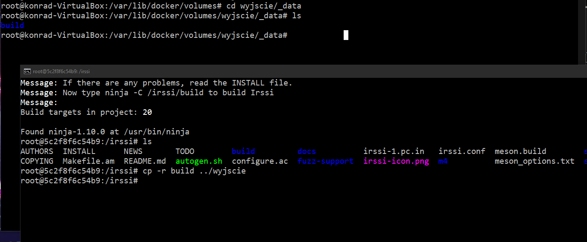

<h3> Eksportowanie portu </h3>
    
    Zainstalowałem iperf3 na 2 kontenerach, hoscie i poza hostem.
    Instalowanie apt install iperf3:
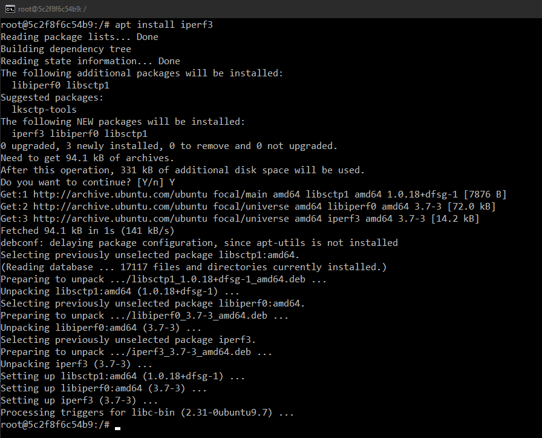

    Serwer uruchomiony wewnątrz kontenera:
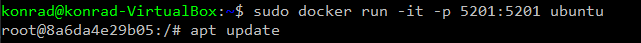

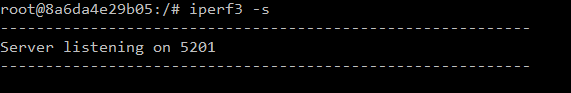

    Sprawdzenie adresu IP
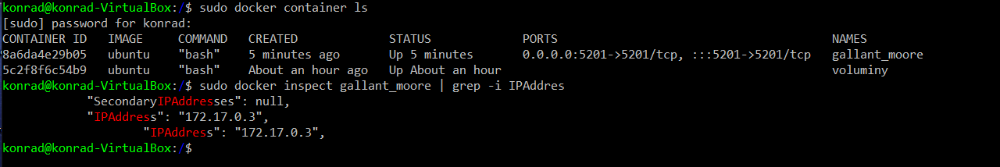

    Połączenie się z serwerem z drugiego kontenera:
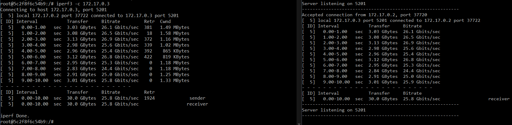

    Połączenie się z serwerem z poziomu hosta:
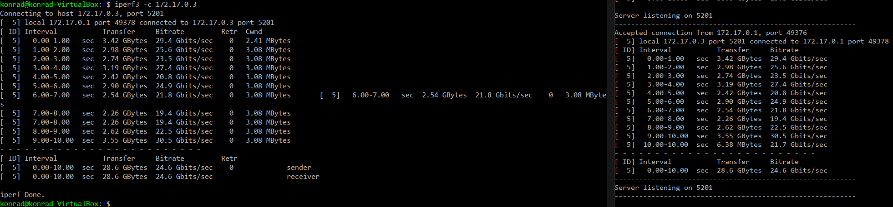

    Połączenie się z serwerem spoza hosta:
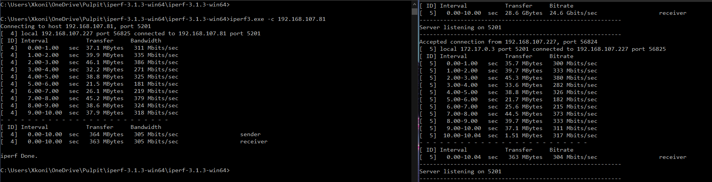

    Wyniki kolejnych połączeń na serwerze. Jakw widać najlepsze wyniki zostały uzyskane przy łączeniu się z serwerem z poziomu hosta, odrobinę gorsze przy łączeniu z drugiego kontenera,
    natomiast podczas łączenia spoza hosta uzyskane wyniki były bardzo niskie.
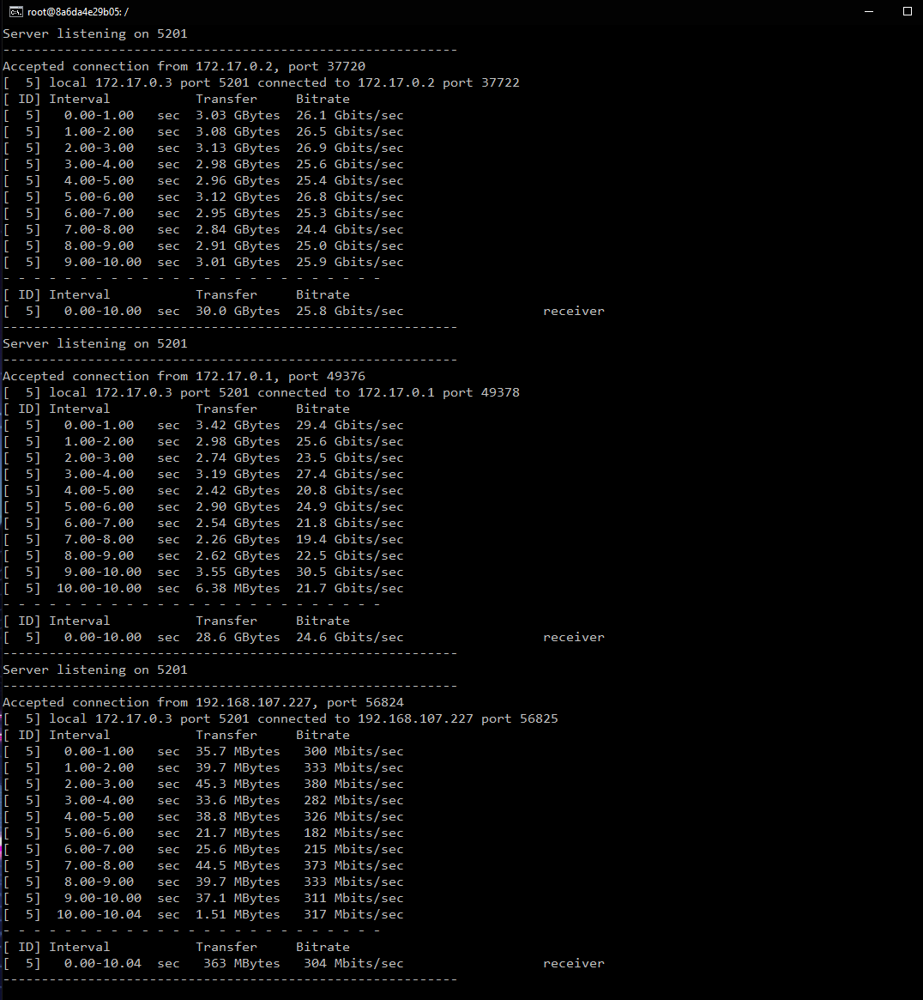

<h3> Instancja Jenkins </h3>

    Instalancja skonteryzowanej instancji Jenkinsa z pomockikiem DIND:
    docker run:
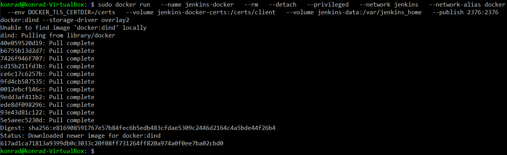

    Utworzenie dockerfile:
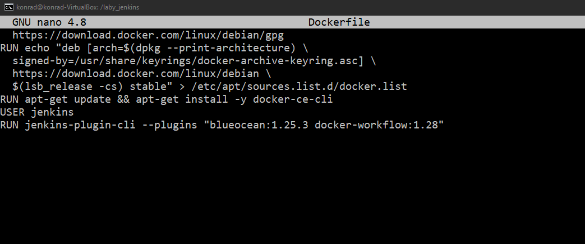

    Uruchomienie builda:
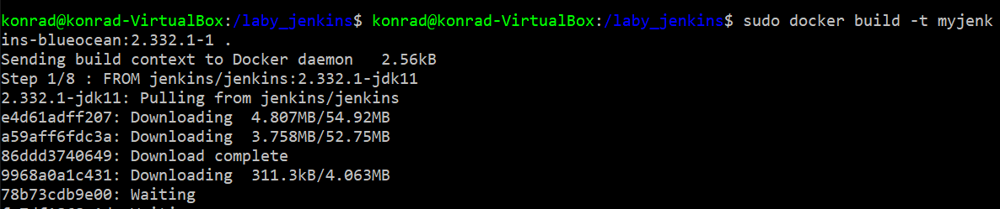

    Udany build:
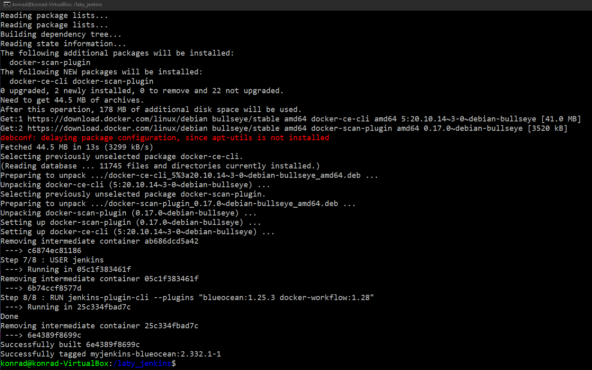

    Uruchomienie powstałego obrazu i udostępnienie go na portach 8080 i 50000:
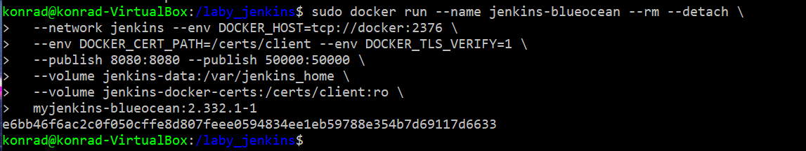

    Wejscie na adres localhost:8080:
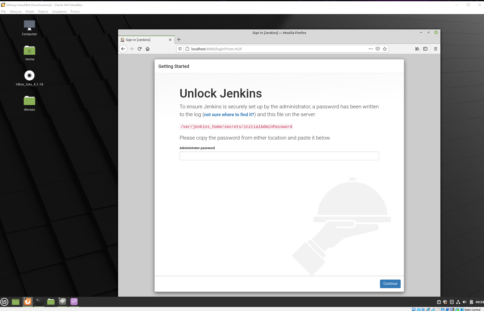

    Znalezienie hasla za pomocą docker exec:
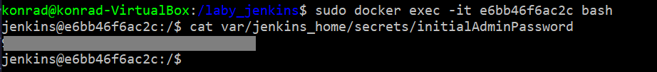

    Pobranie wtyczek (sugestowanych):
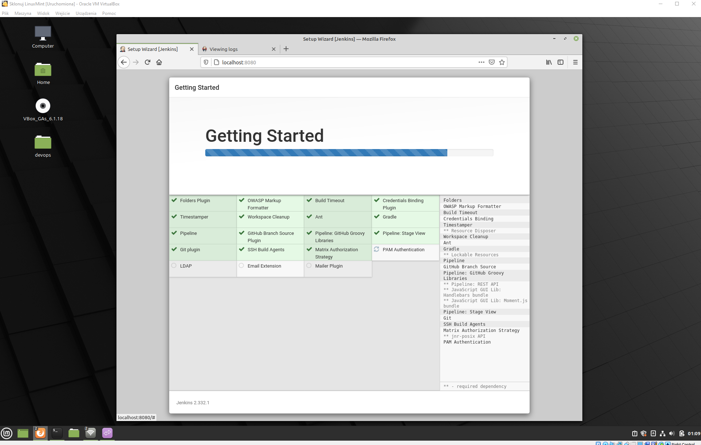

    Strona Logowania:
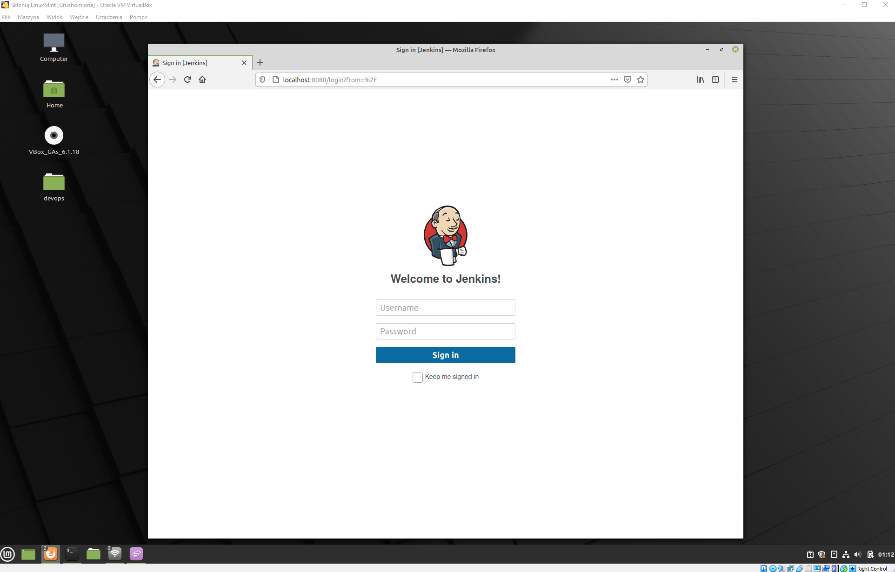

    Udane logowanie:
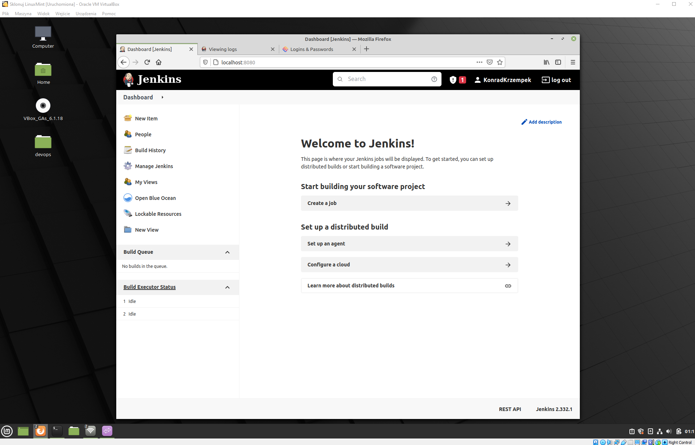

    Działanie kontenerów:
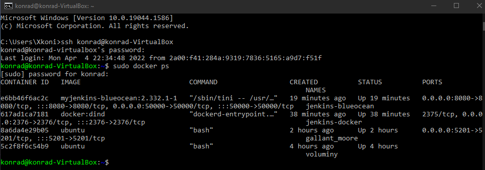

