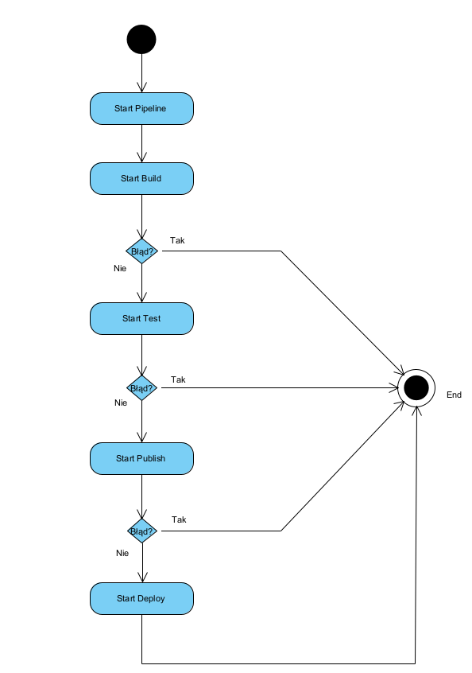
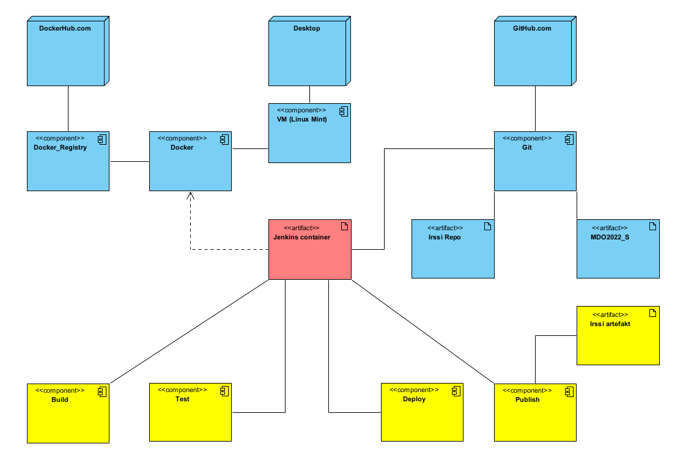
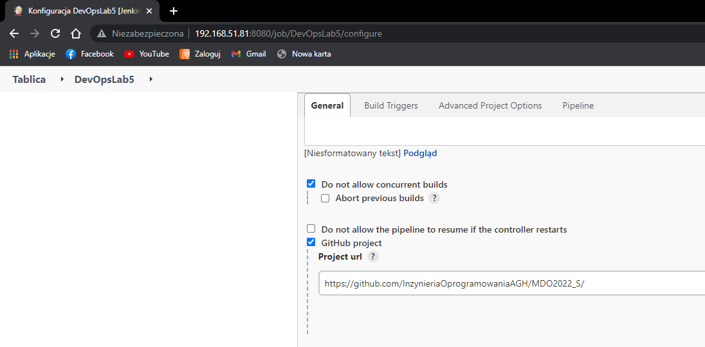
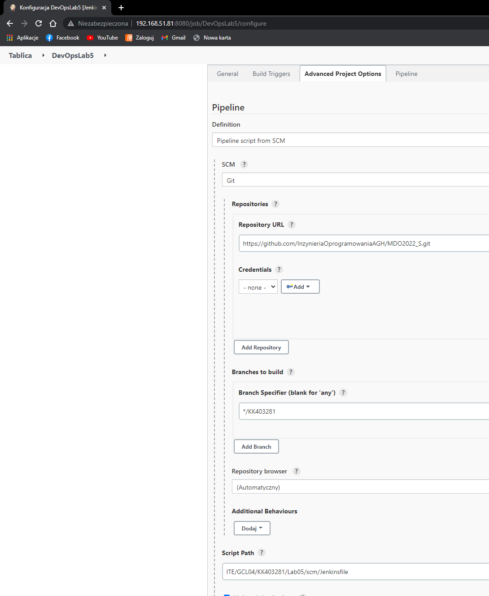
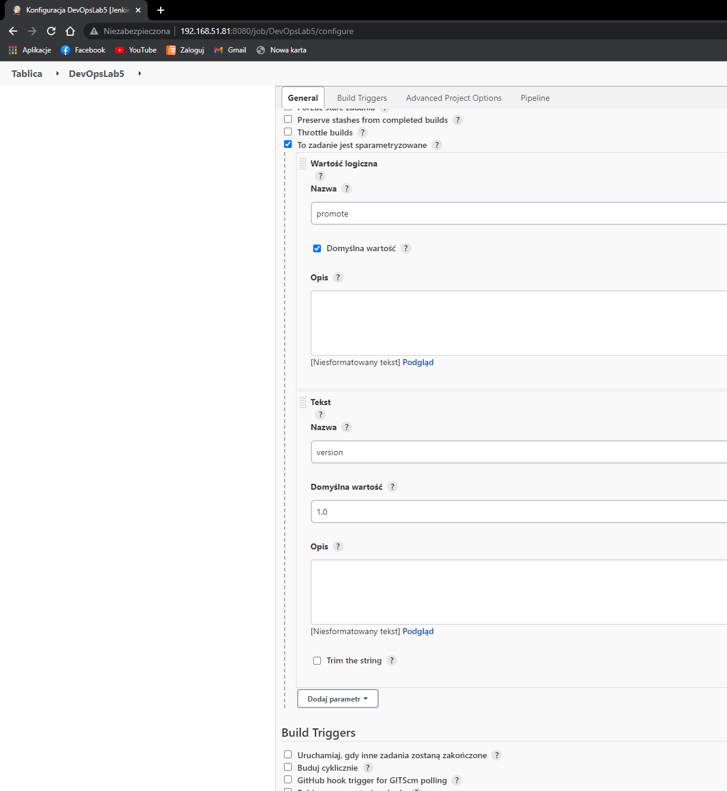
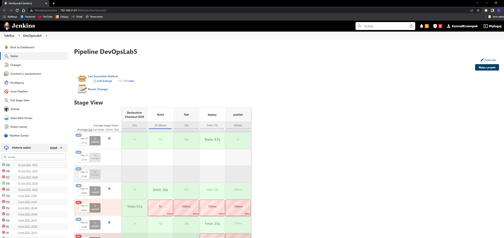

<h1>Sprawozdanie z Lab5</h1>

<h3> Konrad Krzempek</h3>
grupa lab 4


<h2>Cel</h2>

    Celem projektu jest utworzenie pipeline'a pozwalającego na zbudowanie wybranego programu ( w moim przypadku irssi) 
    wykonanie na nim testów, deploy'a i publish'a.

<h2>Streszczenie przeprowadzonego projektu</h2>

    Wybrana aplikacja - irssi
    
Pipeline stworzono z wykorzystaniem Jenkinsa. Na maszynie wirtualnej stworzone zostały kontenery jenkins-docker i jenkins-blueocean. Utworzony pipeline pobiera z repo githubowego plik Jenkinsfile z instrukcjami po czym tworzy nowy kontener, do którego są one kopiowane. 

Następnie wykonywane są wszystkie stage: 
<ul>
<li> build - budowanie aplikacji irssi, </li>
<li> test- wykonuje testy, </li>
<li> deploy - kopiuje i uruchamia na czystym systemie aplikacje, </li>
<li> publish- udostępnia zbudowaną apke jako artefakt (z rozszerzeniem tar.gz).</li>
</ul>


<h3>Diagram aktywności</h3>



<h3>Diagram wdrożenia</h3>




<h2> Utworzenie nowego pipeline'a </h2>

    Tworzenie pipeline'a:

Wybrane ustawienia:
<ul>
<li>Zablokowanie możliwości uruchamiania więcej niż 1 builda w tym samym czasie </li>
<li>Dodano repository URL (znazjduje się w nim adres repo przedmiotu </li>
<li>Podano ścieżkę do pliku oraz gałąź na której znajduje się Jenkinsfile </li>
<li>Wybrano opcję "to zadanie jest sparametryzowane" co pozwala na wersjonowanie wydawanych artefaktów</li>
</ul>

Plik Jenkinsefile znajduje się na mojej gałęzi (KK403281)

Screeny wybranych ustawień:








<h2>Stages</h2>

<h3>Build</h3>

Cel: Zbudowanie aplikacji.

W trakcie tego stage'a budowana jest aplikacja irssi na podstawie kodu z githuba.

Na podstawie Docker-BLDR tworzony jest obraz o nazwie irssi_budowanie.

Docker-BLDR:

```
FROM ubuntu:latest

RUN apt-get update && apt-get install -y git gcc make automake wget meson g++
RUN DEBIAN_FRONTEND='noninteractive' apt-get install -y libglib2.0-dev libssl-dev libtinfo-dev

RUN git clone https://github.com/irssi/irssi.git
WORKDIR irssi
RUN meson setup build
RUN ninja -C/irssi/build
```


Powyższy kod tworzy nową maszynę ubuntu, na której instalowany jest git oraz wszystkie zależności potrzebne do zbudowania irssi.


Kod stage Build:

```
stage('Build') {
            steps {
                sh 'docker build -t irssi_budowanie . -f ITE/GCL04/KK403281/Lab05/Docker-BLDR'
		sh 'docker run --name Kontenerek -dit --rm irssi_budowanie'
		sh 'rm irssi || true'
		sh 'docker cp Kontenerek:irssi/build/src/fe-text/irssi .'
		sh 'docker kill Kontenerek'
            }
        }
```


<h3>Test</h3>

Cel: Uruchomienie testów.

Kod stage Test:
```
 stage('Test') {
            steps {
                sh 'docker build -t irssi_tescik . -f ITE/GCL04/KK403281/Lab05/Docker-Tescik'
		sh 'docker run irssi_tescik'
            }
        }
```

Na podstawie stworzonego wcześniej obrazu irssi_budowanie tworzony jest obraz irssi_tescik, na którym uruchamiane są wszystkie testy.

Docker-Tescik:

```
FROM irssi_budowanie:latest

WORKDIR build

RUN meson test
```

<h3>Deploy</h3>

Cel:Uruchomienie wcześniej zbudowanej aplikacji na nowym kontenerze.

Kod stage Deploy:
```
stage('deploy'){
	    steps {
		sh "docker kill deployKontener || true"
		sleep 2
		sh 'docker run --rm --name deployKontener -dit ubuntu'
		sh 'docker cp irssi deployKontener:.'
		sh 'docker container exec deployKontener sh -c "apt-get update"'
		sh 'docker container exec deployKontener sh -c "DEBIAN_FRONTEND="noninteractive" apt-get install -y libglib2.0"'
		sh "docker container exec deployKontener sh -c 'apt-get install -y libutf8proc-dev'"
		sh "docker container exec deployKontener sh -c './irssi --version'"
		sh "docker container kill deployKontener"
	    }
	}
```
Aplikacja utworzona w etapie build zostaje przeniesiona na tworzony kontener Ubuntu, na którym doinstalowywane są niezbędne zależności, po czym sprawdzana jest wersja programu.
Sprawdzenie wersji programu pozwala nam na zweryfikowanie czy irrsi zostało zainstalowane poprawnie bez konieczności uruchamiania samego irrsi (w przypadku uruchamiania irssi konieczne jest wpisanie komendy /exit w celu jego zamknięcia)

Po zakończeniu tego etapu stworzony kontener zostaje zniszczony.

<h3>Publish</h3>

Cel: Udostępnienie gotowej wersji aplikacji.

Kod stage Publish:
```
stage('publish'){
	    when{
		expression{
			return params.promote==true;
		}
	    }
	    steps {
		sh 'rm -r IrssiFiles || true'
		sh 'mkdir IrssiFiles'
		sh 'echo "Zainstaluj przed uruchomieniem: libglib2.0  libutf8proc-dev" > ReadmePls'
		sh 'cp irssi IrssiFiles'
		sh 'cp ReadmePls IrssiFiles'
		sh "tar -zcf irsi${params.version}.tar.gz IrssiFiles"
		archiveArtifacts artifacts: "irsi${params.version}.tar.gz"
	    }
```

Na tym etapie tworzony jest artefakt gotowy do dostarczenia dla konsumenta. Przed utworzeniem artefaktu tworzony jest folder IrssiFiles, do którego dodawany jest wpis informujący o konieczności doinstalowania bibliotek.

<h3>Uwagi</h3>

Przy tworzeniu pliku tar wraz z wersjonowaniem wymagane było użycie ", w przypadku użycia ' nie działało.

W przypadku etapów na których tworzone są nowe kontenery dodane są komendy "kill nazwa_kontenera || true" dzięki którym nie występuje błąd w postaci próby stworzenia kontenera, który już istnieje. Jest to przydatne w momencie gdy któryś z tych etapów wykona się jedynie częściowo i stworzy kontener, którego nie usunie.

Średni czas trwania builda wynoszący prawie 3 godziny wynika z faktu, że raz wyłączyłem komputer w trakcie budowania w efekcie czego otrzymałem build, którego czas trwania wynosił ponad 16h.
<h2>Efekt końcowy</h2>




