# ***Ćwiczenia 3***

# Wybór oprogramowania na zajęcia 

## 1. Znalezienie repozytorium z kodem dowolnego oprogramowania

Znalezione repozytorium: 
[https://github.com/caolan/nodeunit]( https://github.com/caolan/nodeunit)

## 2. Sklonowanie repozytorium, przeprowadzenie build programu oraz doinstalowanie wymaganych zależności

- sklonowanie repozytorium komendą

``` git clone https://github.com/caolan/nodeunit```

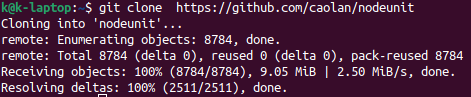


- instalacja Node.js i npm

``` sudo apt install nodejs ```


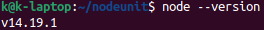

``` npm install ```

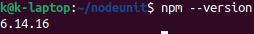

- instalacja zależności

``` npm install ```

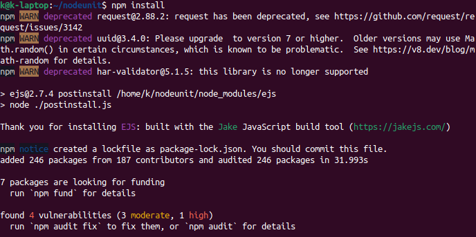

## 3. Uruchomienie testów jednostkowych dołączonych do repozytorium

Uruchomienie testów komendą 

``` npm test ```

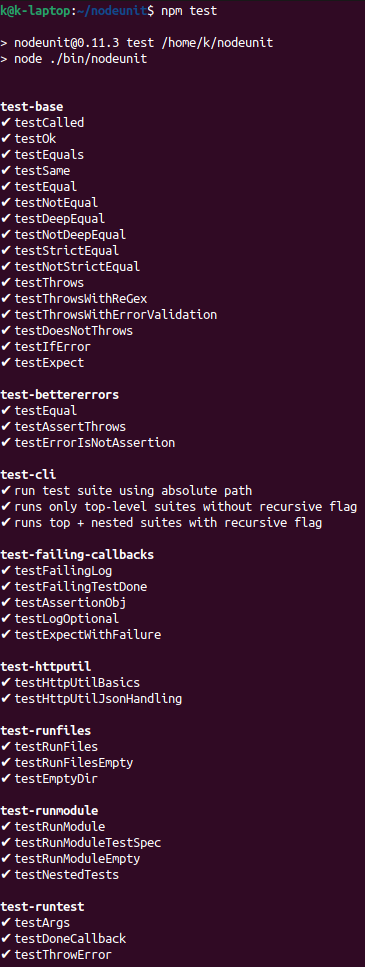

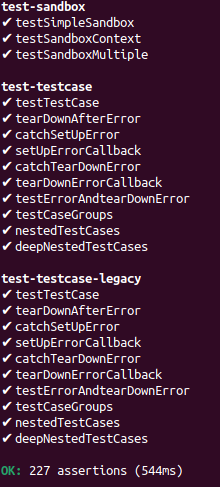

* * *
# Przeprowadzenie buildu w kontenerze

## 1. Wykonanie kroków build i test wewnątrz wybranego kontenera bazowego (ubuntu)

- uruchomienie kontenera

```  sudo docker run -it ubuntu ```

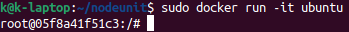

- podłączenie do niego TTY celem rozpoczęcia interaktywnej pracy


- zaopatrzenie kontenera w wymagania wstępne

``` apt update ```

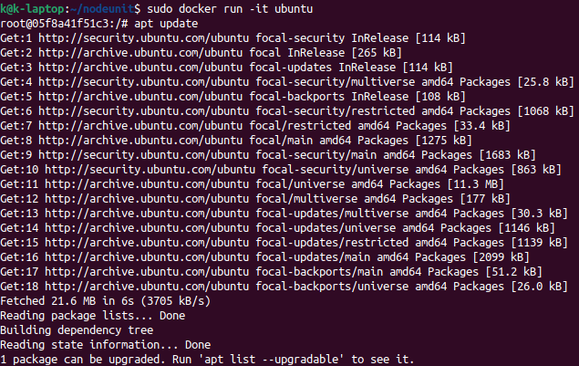

```apt upgrade ```

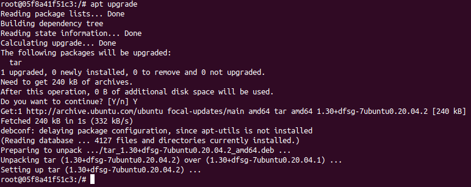

```apt install git```

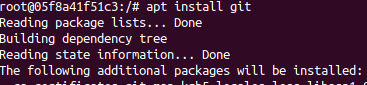

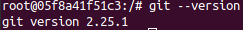

```apt install nodejs```

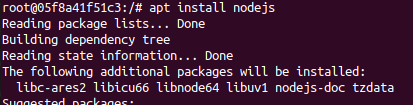

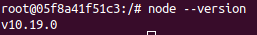

```apt install npm```

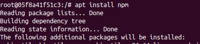

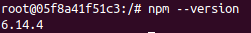

- sklonowanie repozytorium

``` git clone https://github.com/caolan/nodeunit```

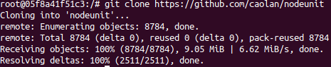

- uruchomienie build

    - konfiguracja środowiska 

    ``` npm install```

    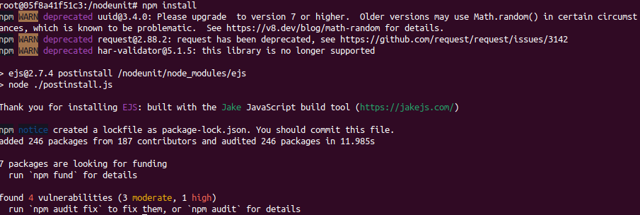


```npm build```

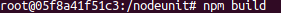

- uruchomienie testów

```npm test```

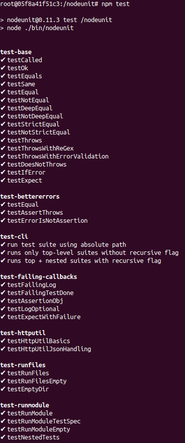

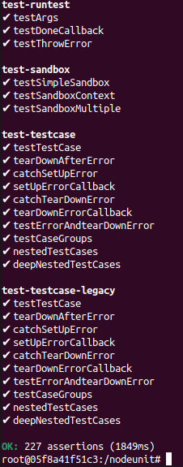

## 2. Stwozenie dwóch plików Dockerfile automatyzujących kroki powyżej, z uwzględnieniem następujących kwestii

- Kontener pierwszy ma przeprowadzać wszystkie kroki aż do builda
- Kontener drugi ma bazować na pierwszym i wykonywać testy

```
FROM node:latest
WORKDIR /app

RUN apt-get update -y
RUN apt-get install git -y

RUN git clone https://github.com/caolan/nodeunit
RUN cd /app/nodeunit && npm install
```

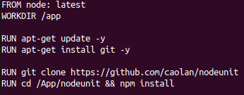


## 3. Wykazanie, że kontener wdraża się i pracuje poprawnie. Pamiętaj o różnicy między obrazem a kontenerem. Co pracuje w takim kontenerze?

- budowanie obrazu z testem:

```sudo docker build -t <nazwa_testu> -f <nazwa_dockerfile_test> .```

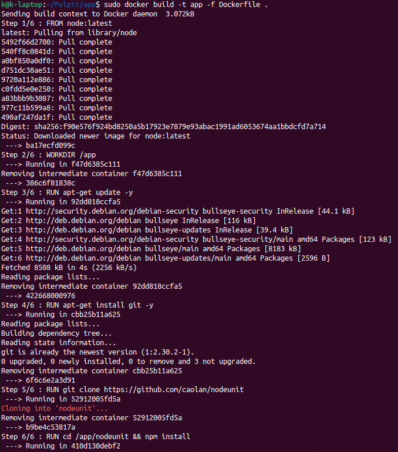


- stworzenie drugiego dockerfile'a, który uruchamia testy 

```
FROM app
WORKDIR  /app/nodeunit
CMD ["npm","test"]

```

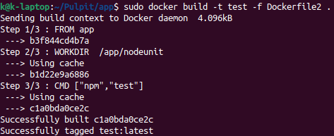

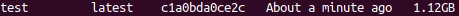

-uruchomienie testu 

```sudo docker run -it <nazwa_testu>```

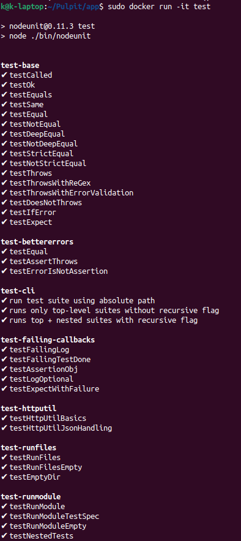

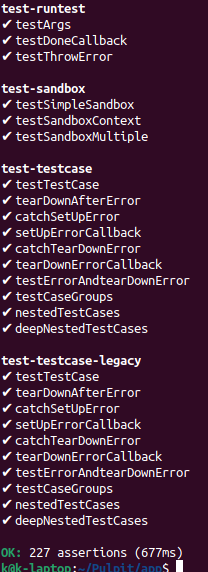
