# ***Ćwiczenia 4***

# Zachowywanie stanu

## Przygotowanie woluminów (wejściowy i wyjściowy), o dowolnych nazwach, i podłączenie ich do kontenera bazowego, z którego rozpoczynano poprzednio pracę

- Tworzenie woluminu wejściowego

```  
sudo docker volume create wolumin_wej
```

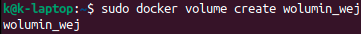

- Tworzenie woluminu wyjściowego

```  
sudo docker volume create wolumin_wyj
```


- Podłączanie do kontenera:

```  
sudo docker run --interactive --tty --mount source=wolumin_wej,destination=/wolumin_wej --mount source=wolumin_wyj,destination=/wolumin_wyj ubuntu
```

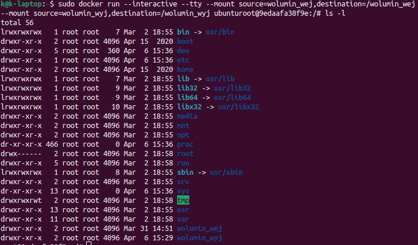

## Uruchomienie kontenera, zainstalowanie niezbędnych wymagań wstępnych

- uruchomienie kontenera wraz z podłączeniem woluminów w poprzednim punkcie komendą

```  
sudo docker run --interactive --tty --mount source=wolumin_wej,destination=/wolumin_wej --mount source=wolumin_wyj,destination=/wolumin_wyj ubuntu
```

## Sklonowanie repozytorium na wolumin wejściowy

- sklonowanie repo komendą 

```
git clone https://github.com/caolan/nodeunit
```

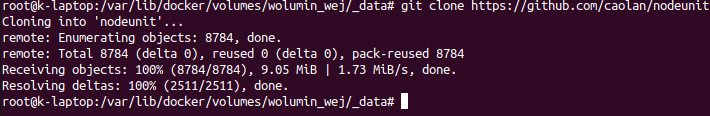

- zawartość woluminu

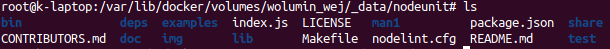

- zawartość woluminu z poziomu kontenera


## Uruchomienie build w kontenerze

- zbudowanie

Najpierw komenda:

```
npm install
```

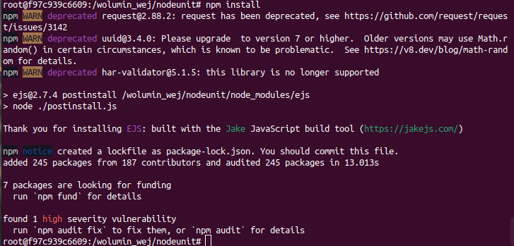

Następnie 

```
npm test
```

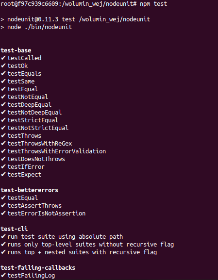


## Zapisanie powstałych/zbudowanych plików na woluminie wyjściowym

- Skopiowanie zbudowanego projektu do wyjściowego woluminu

```
cp -R /wolumin_wej/nodeunit /wolumin_wyj
```

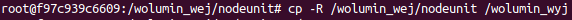

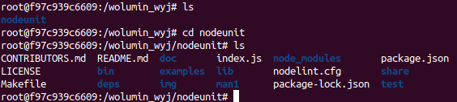

# Eksponowanie portu

## Uruchomienie wewnątrz kontenera serwera iperf (iperf3)

- instalacja iperf3

```
apt-get install iperf3
```

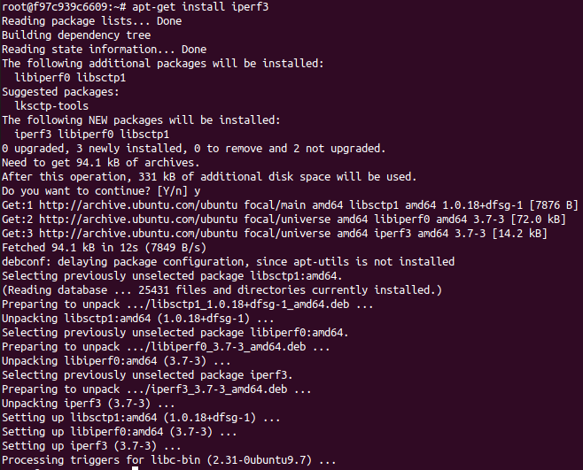

- instalacja net-tools

```
apt-get install net-tools
```

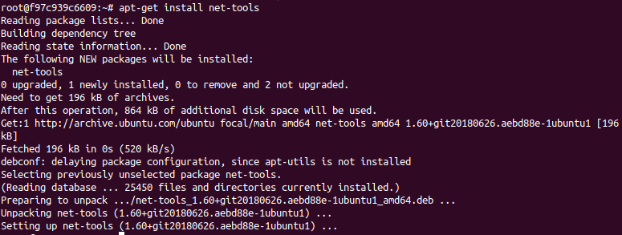

## Połączenie się z nim z drugiego kontenera, zbadanie ruchu. Połączenie się spoza kontenera (z hosta i spoza hosta). Przedstawienie przepustowości komunikacji lub problem z jej zmierzeniem (wyciągnij log z kontenera)

- między kontenerami:

```
iperf3 -s -p 2000
```

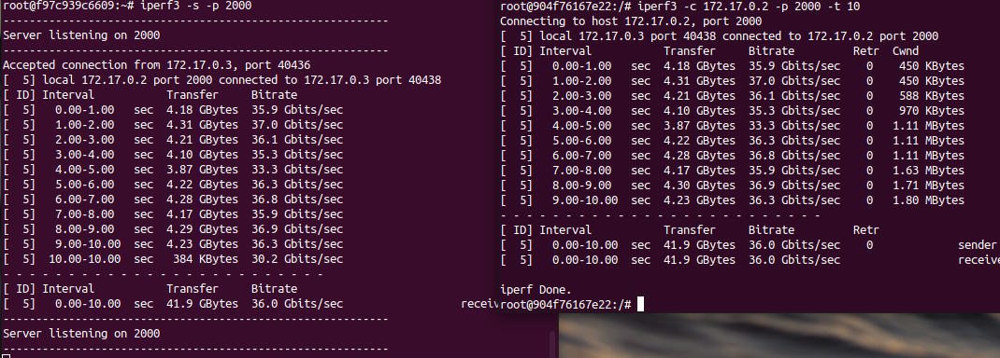


- między kontenerem a komputerem


# Instancja Jenkins

## Przeprowadzenie instalacji skonteneryzowanej instancji Jenkinsa z pomocnikiem DIND. Zainicjalizowanie instacji, wykazanie działających kontenerów, pokaż ekran logowania

 - instalacja jenkinsa

 ```
 sudo docker network create jenkins
 ```

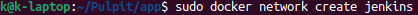

 - uruchomienie kontentera dockera DIND

```
sudo docker run \
  --name jenkins-docker \
  --rm \
  --detach \
  --privileged \
  --network jenkins \
  --network-alias docker \
  --env DOCKER_TLS_CERTDIR=/certs \
  --volume jenkins-docker-certs:/certs/client \
  --volume jenkins-data:/var/jenkins_home \
  --publish 2376:2376 \
  docker:dind \
  --storage-driver overlay2
```

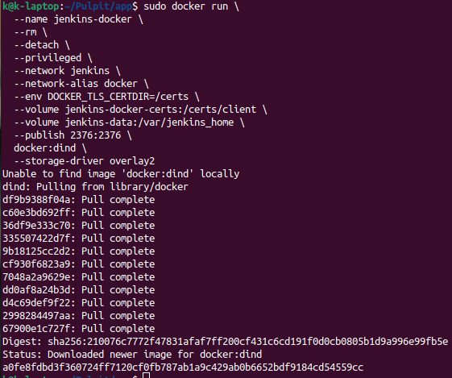

 - obraz jenkinsa na podstawie Dockerfile'a:

 ```
 FROM jenkins/jenkins:2.332.2-jdk11
USER root
RUN apt-get update && apt-get install -y lsb-release
RUN curl -fsSLo /usr/share/keyrings/docker-archive-keyring.asc \
  https://download.docker.com/linux/debian/gpg
RUN echo "deb [arch=$(dpkg --print-architecture) \
  signed-by=/usr/share/keyrings/docker-archive-keyring.asc] \
  https://download.docker.com/linux/debian \
  $(lsb_release -cs) stable" > /etc/apt/sources.list.d/docker.list
RUN apt-get update && apt-get install -y docker-ce-cli
USER jenkins
RUN jenkins-plugin-cli --plugins "blueocean:1.25.3 docker-workflow:1.28"
```

- zbudowanie obrazu

```
sudo docker build -t myjenkins-blueocean:2.332.2-1 -f Dockerfile2 .
```

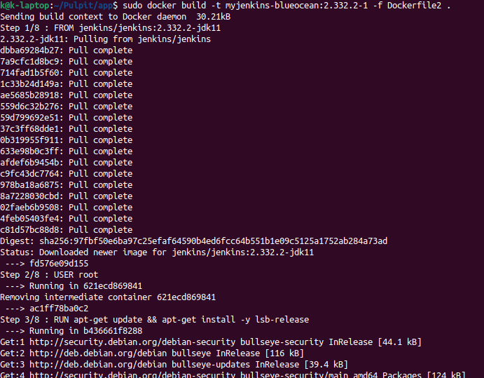

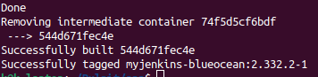


- zainicjalizowanie instacji

```
sudo docker run \
  --name jenkins-blueocean \
  --rm \
  --detach \
  --network jenkins \
  --env DOCKER_HOST=tcp://docker:2376 \
  --env DOCKER_CERT_PATH=/certs/client \
  --env DOCKER_TLS_VERIFY=1 \
  --publish 8080:8080 \
  --publish 50000:50000 \
  --volume jenkins-data:/var/jenkins_home \
  --volume jenkins-docker-certs:/certs/client:ro \
  myjenkins-blueocean:2.332.2-1 
```

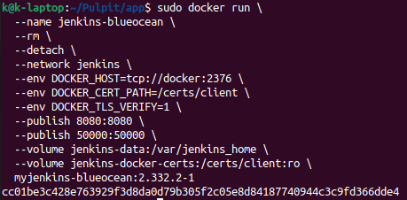

- wykazanie działających kontenerów

```
sudo docker ps
```

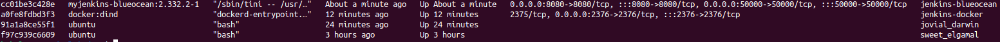


 - ekran logowania

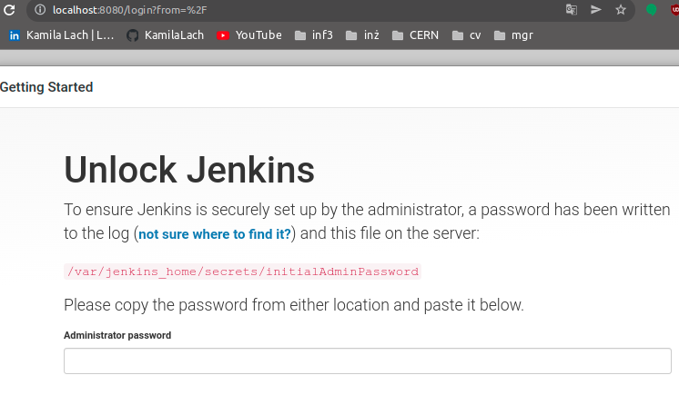

- uzyskanie hasła admina

```
sudo docker exec jenkins-blueocean cat /var/jenkins_home/secrets/initialAdminPassword
```

- widok strony po zalogowaniu 

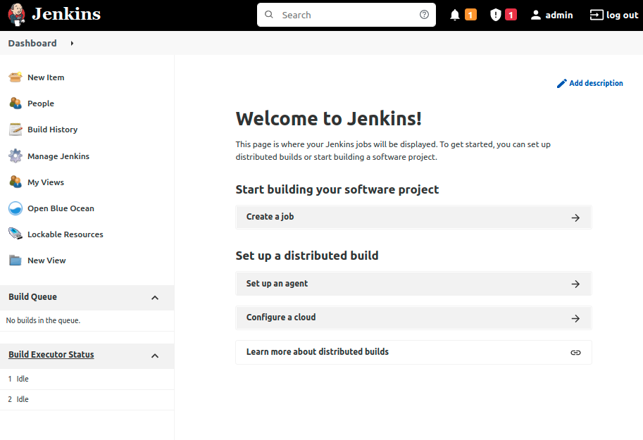