# ***Sprawozdanie***

## Przygotowanie systemu pod uruchomienie

- Instalację systemu Fedora w VM

  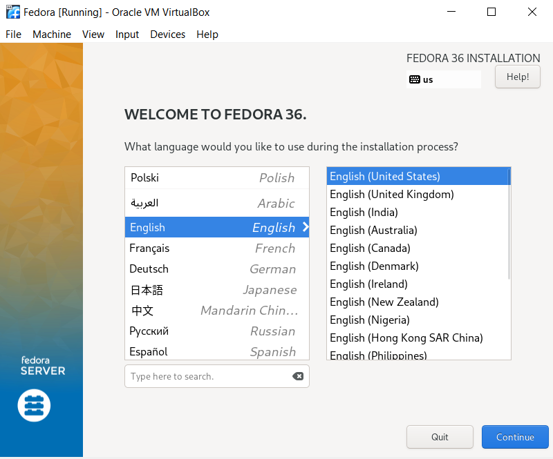

  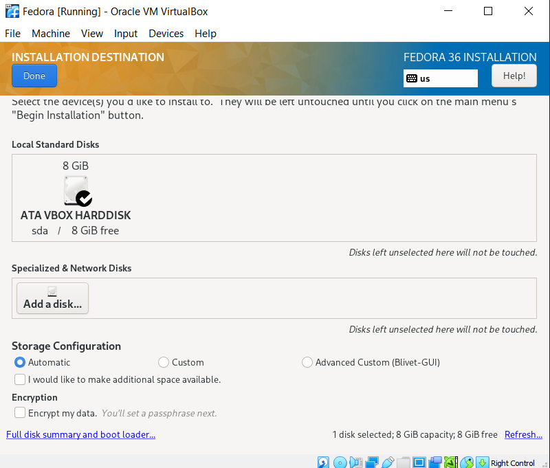

  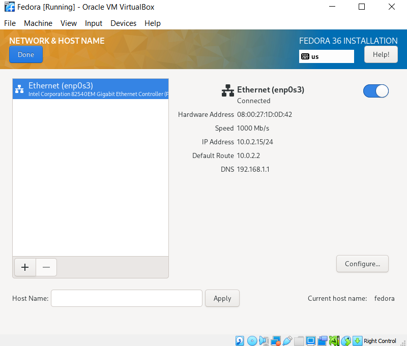

  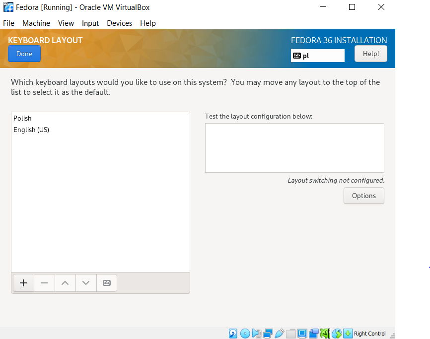

  

  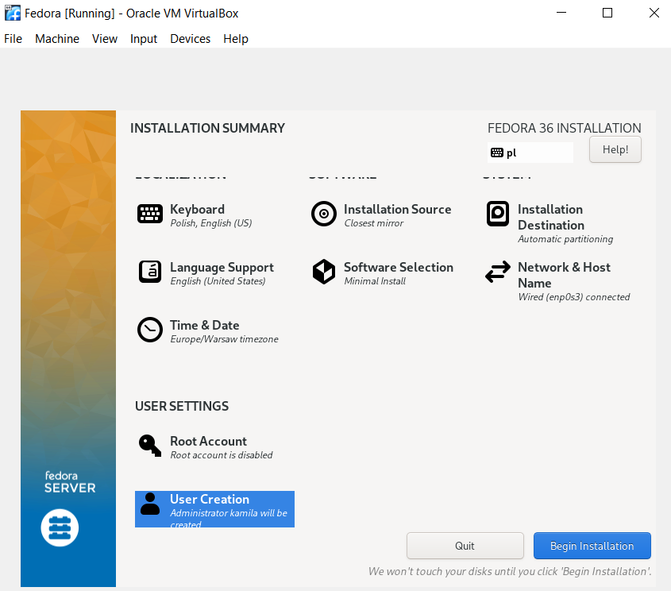

  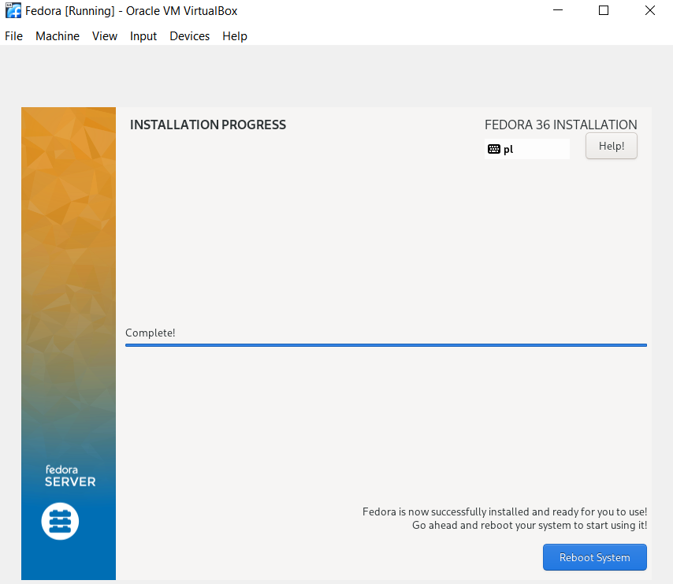

- Druga instalacja systemu Fedora w VM 

   Drugi system został zainstalowany tak samo jak poprzedni. Następnie skonfigurowano na nim serwer HTTP

   ```
  sudo dnf upgrade –refresh -y
  sudo dnf install httpd
  sudo systemctl enable httpd –now
  sudo systemctl status httpd
  ```

  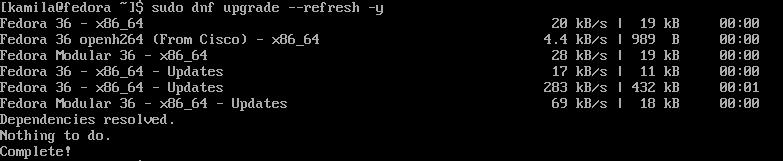

  

  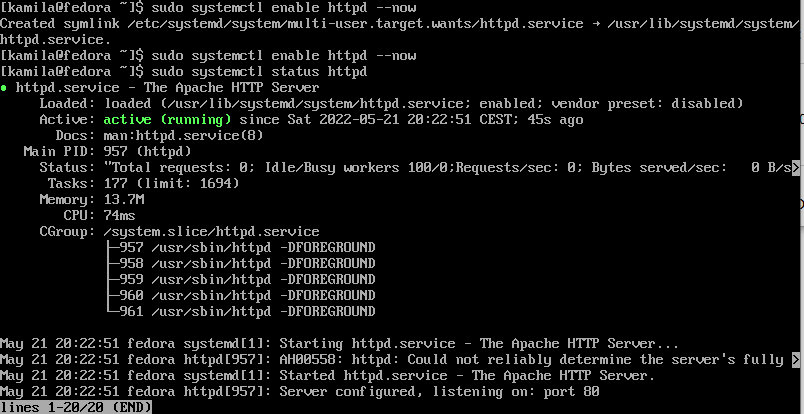

  ```
  sudo firewall-cmd –permanent –zone=public –add-service=http
  sudo firewall-cmd –permanent –zone=public –add-service=https
  sudo firewall-cmd –reload
  ```

  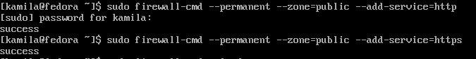

  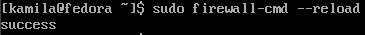

- Ustawienie sieci w obu maszynach

  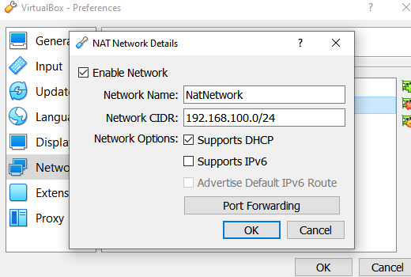

- Na drugiej maszynie 

  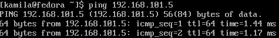

  Instalacja ftp

  ```
  sudo yum install vsftpd
  ```

  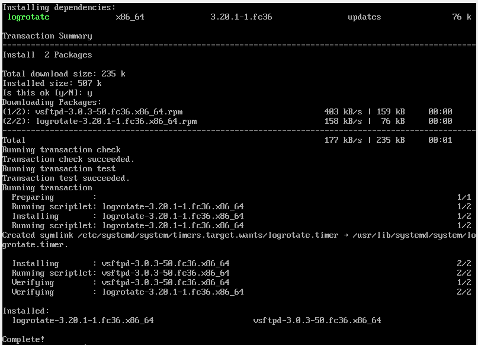

  ```
  sudo systemctl enable vsftpd
  sudo systemctl start vsftpd
  sudo systemctl status vsftpd
  ```

  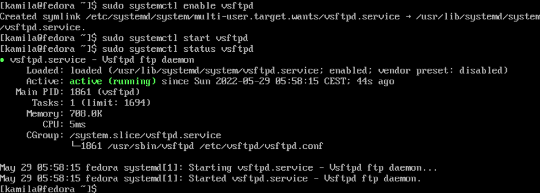


- Umieszczenie artefaktu przy pomocy WinScp

  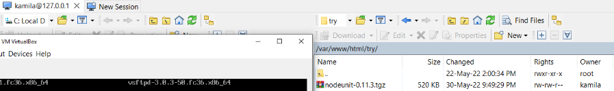


- Dla pierwszej maszyny wirtualnej:

  ```
  sudo yum install wget
  ```

  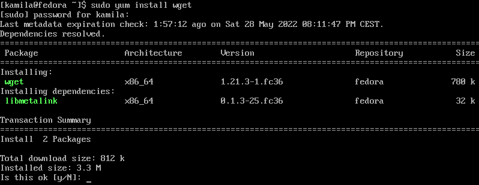

  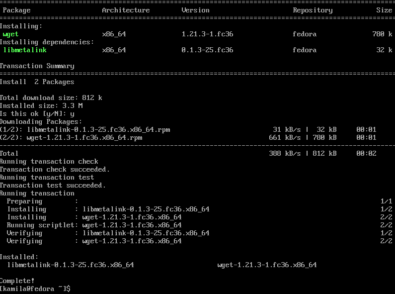

  ```
  wget http://192.168.101.4/try/nodeunit-0.11.3.tgz
  ```

  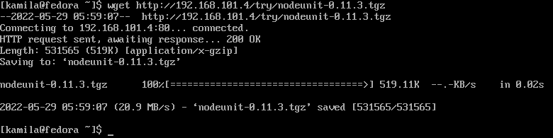

  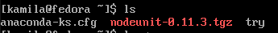


## Instalacja nienadzorowana

Plik odpowiedzi z instalacji:
  ```/root/anaconda-ks.cfg```

```
cp anaconda-ks.cfg /home/kamila
chown kamila /home/kamila/anaconda-ks.cfg
cd /home/kamila

```

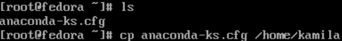

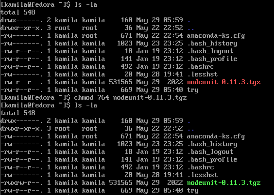

Dodanie do pliku wget, repozytoriów, pobieranie artefaktu z serwera

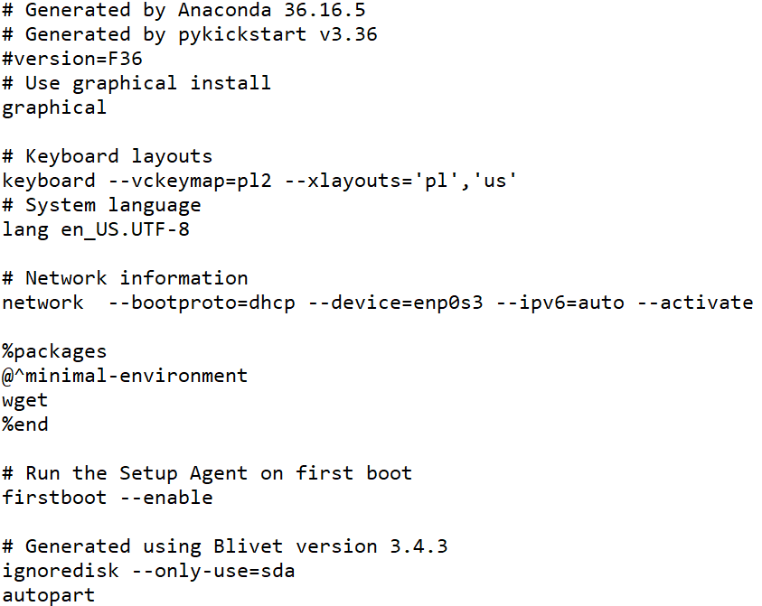

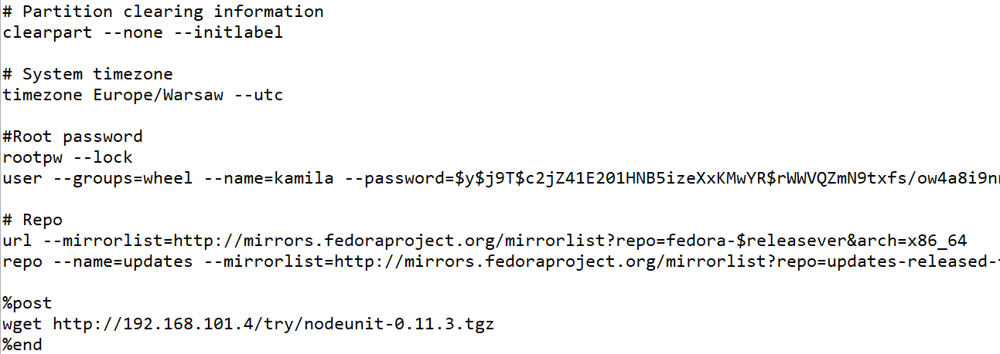


## Infrastructure as a code

Dodanie nowej maszyny w analogiczny sposób jak poprzednie lecz zmiana przy uruchamianiu

```
vmlinuz initrd=initrd.img inst.stage2=hd:LABEL=Fedora-S-dvd-x86_64-36 inst.ks=https://raw.githubusercontent.com/InzynieriaOprogramowaniaAGH/MDO2022_S/KL299629/ITE/GCL04/KL299629/Lab09/anaconda-ks.cfg

```

Po instalacji i uruchomieniu nowej maszyny widoczny jest pobrany artefakt

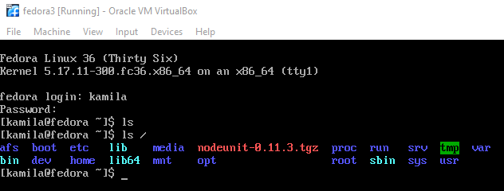