# ***Sprawozdanie***

## Instalacja klastra Kubernetes

- Instalacja minikube'a
  
  ```
  curl -LO https://storage.googleapis.com/minikube/releases/latest/minikube-linux-amd64

  sudo install minikube-linux-amd64 /usr/local/bin/minikube
  ```

  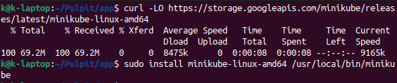

  ```
  minikube start
  ```

  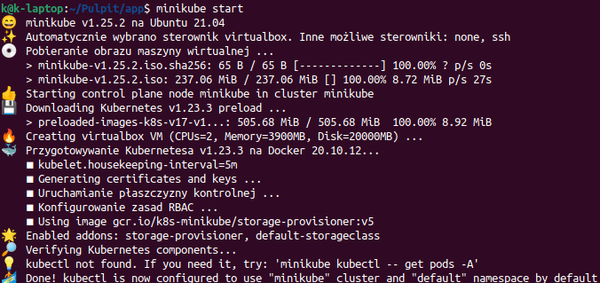

  ```
  minikube kubectl -- get po -A
  ```

  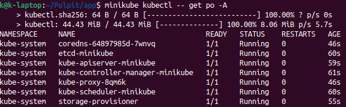

- instalacja kubectl

  ```
  curl -LO "https://dl.k8s.io/release/$(curl -L -s https://dl.k8s.io/release/stable.txt)/bin/linux/amd64/kubectl"
  ```

  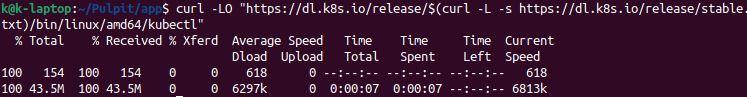

  Opcjonalne sprawdzenie poprawności binarnej

  ```
  curl -LO "https://dl.k8s.io/$(curl -L -s https://dl.k8s.io/release/stable.txt)/bin/linux/amd64/kubectl.sha256"
  ```

  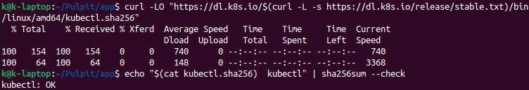

  instalacja kubectl

  ```
  sudo install -o root -g root -m 0755 kubectl /usr/local/bin/kubectl
  ```

  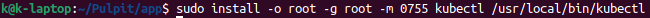

  sprawdzenie wersji

  ```
  kubectl version --client
  ```

  ```
  kubectl get po -A
  ```

  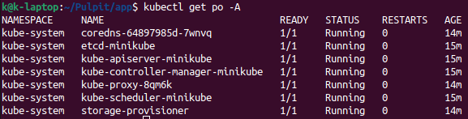

- ```
  minikube dashboard
  ```

  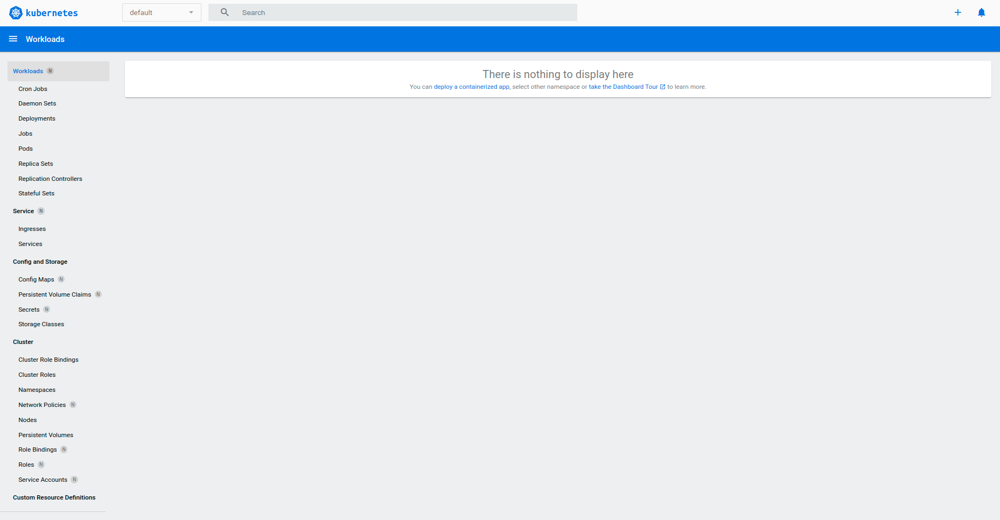
  
- Aplikacja z projektu nie uruchamia się jako osobna aplikacja w kontenerze. Dlatego wybrano obraz gotowiec ```nginx```

  ```
  minikube kubectl run -- nginx-dep --image=nginx --port 80 --labels app=nginx-dep
  ```

  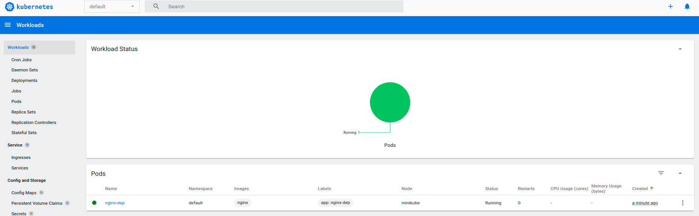

  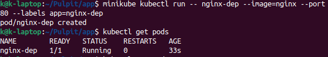

  ```
  kubectl port-forward nginx-dep 8000:80
  ```

  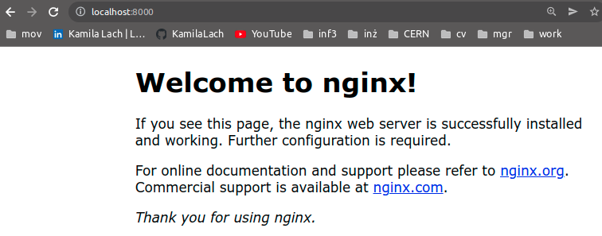

  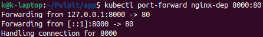


## Przekucie wdrożenia manualnego w plik wdrożenia

- Plik .yml 4 repliki

  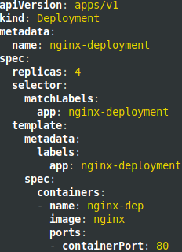

- ```
  kubectl apply -f nginx-deployment.yml
  ```

  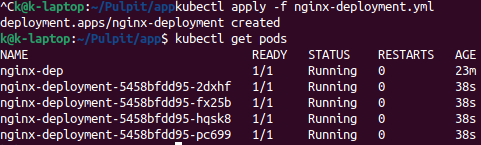

  