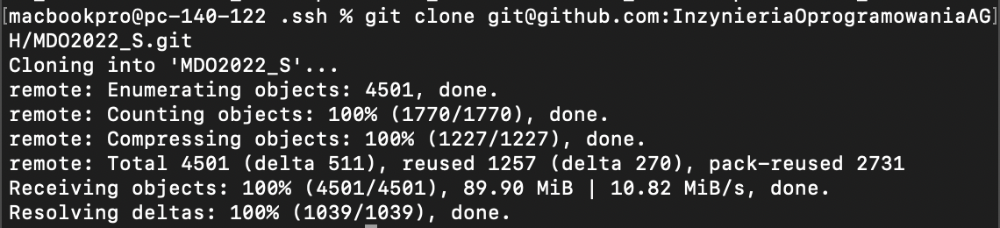
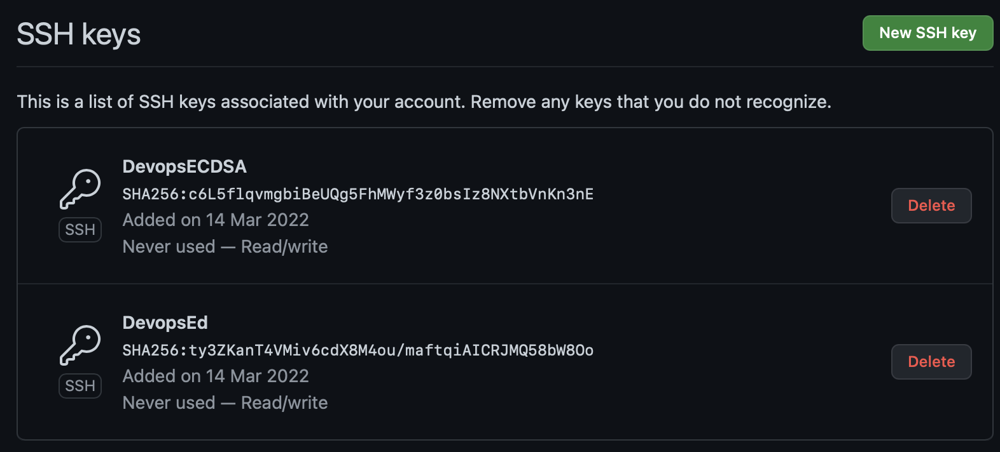

# Sprawozdanie Maciej Kucia
### Wykonanie zadania
1. Sklonowanie repozytorium za pomocą HTTPS:
```
macbookpro@MacBookPros-MacBook-Pro ~ % git clone https://github.com/InzynieriaOprogramowaniaAGH/MDO2022_S.git
Cloning into 'MDO2022_S'...
remote: Enumerating objects: 1271, done.
remote: Counting objects: 100% (1271/1271), done.
remote: Compressing objects: 100% (872/872), done.
remote: Total 1271 (delta 269), reused 1139 (delta 180), pack-reused 0
Receiving objects: 100% (1271/1271), 21.96 MiB | 2.21 MiB/s, done.
Resolving deltas: 100% (269/269), done.
```
2. Utworzenie kluczy ssh
- bez zabezpieczeń:
```
macbookpro@pc-140-122 Lab01 % ssh-keygen -t ed25519
Generating public/private ed25519 key pair.
Enter file in which to save the key (/Users/macbookpro/.ssh/id_ed25519): 
Enter passphrase (empty for no passphrase): 
Enter same passphrase again: 
Your identification has been saved in /Users/macbookpro/.ssh/id_ed25519.
Your public key has been saved in /Users/macbookpro/.ssh/id_ed25519.pub.
The key fingerprint is:
SHA256:ty3ZKanT4VMiv6cdX8M4ou/maftqiAICRJMQ58bW8Oo macbookpro@pc-140-122.customer.ask4.lan
The key's randomart image is:
+--[ED25519 256]--+
|=++              |
| *.+             |
|. = o            |
|.o .             |
|. .     S .      |
| o .    ..o*..o  |
|  E .   .=B==o o.|
|     . ..o*B+o...|
|      . .oX%=..  |
+----[SHA256]-----+

```
- zabezpieczonego hasłem:
```
macbookpro@pc-140-122 Lab01 % ssh-keygen -t ecdsa
Generating public/private ecdsa key pair.
Enter file in which to save the key (/Users/macbookpro/.ssh/id_ecdsa): 
Enter passphrase (empty for no passphrase): 
Enter same passphrase again: 
Passphrases do not match.  Try again.
Enter passphrase (empty for no passphrase): 
Enter same passphrase again: 
Your identification has been saved in /Users/macbookpro/.ssh/id_ecdsa.
Your public key has been saved in /Users/macbookpro/.ssh/id_ecdsa.pub.
The key fingerprint is:
SHA256:c6L5flqvmgbiBeUQg5FhMWyf3z0bsIz8NXtbVnKn3nE macbookpro@pc-140-122.customer.ask4.lan
The key's randomart image is:
+---[ECDSA 256]---+
| .**o.           |
| .=....          |
| . . =           |
|    + . .        |
|     + +S+.   . +|
|    . *o++*    =.|
|   . ooo ..*  +.E|
|    .  .oo+..+ .o|
|       o*+.oo.. .|
+----[SHA256]-----+
```
3. Skonfigurowanie klucza SSH jako metodę dostępu do GitHuba, sklonowanie repozytorium
 
 
4. Przełączenie na branch `main`
```
macbookpro@pc-140-122 .ssh % cd MDO*          
macbookpro@pc-140-122 MDO2022_S % git checkout main
Branch 'main' set up to track remote branch 'main' from 'origin'.
Switched to a new branch 'main
```
5. Przełączenie na branch grupy
```
macbookpro@pc-140-122 MDO2022_S % git checkout ITE-GCL04
Branch 'ITE-GCL04' set up to track remote branch 'ITE-GCL04' from 'origin'.
Switched to a new branch 'ITE-GCL04'
```
6. Utworzenie nowej gałęzi
```
macbookpro@pc-140-122 MDO2022_S % git checkout -b MK401058
Switched to a new branch 'MK401058'
```
7. Praca na branchu
- utworzenie katalogu w odpowiednim folderze grupy
```
macbookpro@pc-140-122 MDO2022_S % cd ITE
macbookpro@pc-140-122 ITE % ls
GCL04
macbookpro@pc-140-122 ITE % cd GCL04
macbookpro@pc-140-122 GCL04 % ls WELCOME.md
WELCOME.md
macbookpro@pc-140-122 GCL04 % ls         
KK403281	SK403390	branch.png	ecdsa.png	push.png
MK402993	WELCOME.md	clone.png	key.png		term.png
MK403315	WMspr1.md	commit.png	polaczenie.png
macbookpro@pc-140-122 GCL04 % mkdir MK401058
macbookpro@pc-140-122 GCL04 % cd MK401058
macbookpro@pc-140-122 GCL04 MK401058 % mkdir Lab01
```
- skopiowanie pliku sprawozdania do katalogu
```
macbookpro@pc-140-122 GCL04 MK401058 Lab01 % cp ~/Downloads/SprawozdanieMaciejKucia.md .
macbookpro@pc-140-122 GCL04 MK401058 Lab01 % ls
SprawozdanieMaciejKucia.md
```
- zmiana nazwy oraz adresu email w gicie
```
macbookpro@pc-140-122 ITE % git config --global user.name “Maciej”
macbookpro@pc-140-122 ITE % git config --global user.email “macikucia@onet.pl”
```
- stage zmian, commit oraz push do zdalnego repozytorium
```
macbookpro@pc-140-122 Lab01 % git add .
macbookpro@pc-140-122 Lab01 % git commit -am"init"
macbookpro@pc-140-122 Lab01 % git push origin MK401058
Enter passphrase for key '/Users/macbookpro/.ssh/id_ecdsa': 
Counting objects: 7, done.
Delta compression using up to 8 threads.
Compressing objects: 100% (5/5), done.
Writing objects: 100% (7/7), 1.62 KiB | 1.62 MiB/s, done.
Total 7 (delta 2), reused 0 (delta 0)
remote: Resolving deltas: 100% (2/2), completed with 2 local objects.
remote: 
remote: Create a pull request for 'MK401058' on GitHub by visiting:
remote:      https://github.com/InzynieriaOprogramowaniaAGH/MDO2022_S/pull/new/MK401058
remote: 
To github.com:InzynieriaOprogramowaniaAGH/MDO2022_S.git
 * [new branch]      MK401058 -> MK401058
```
8. Uzupełnienie sprawozdania i wysłanie Pull Requesta
