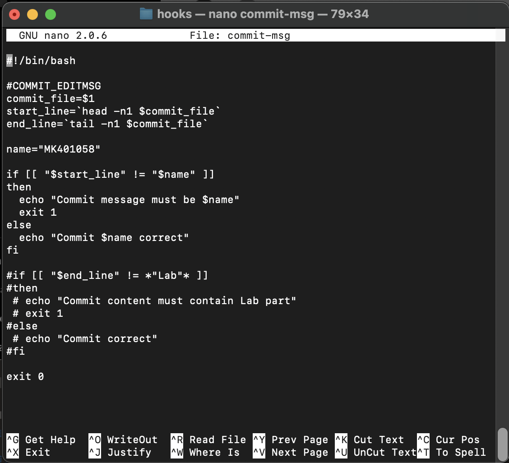
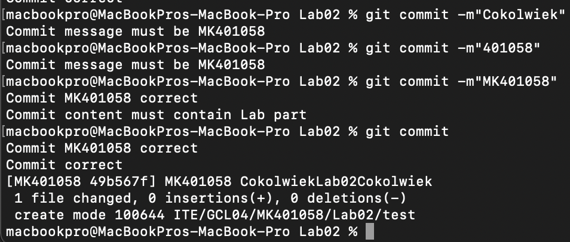
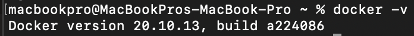
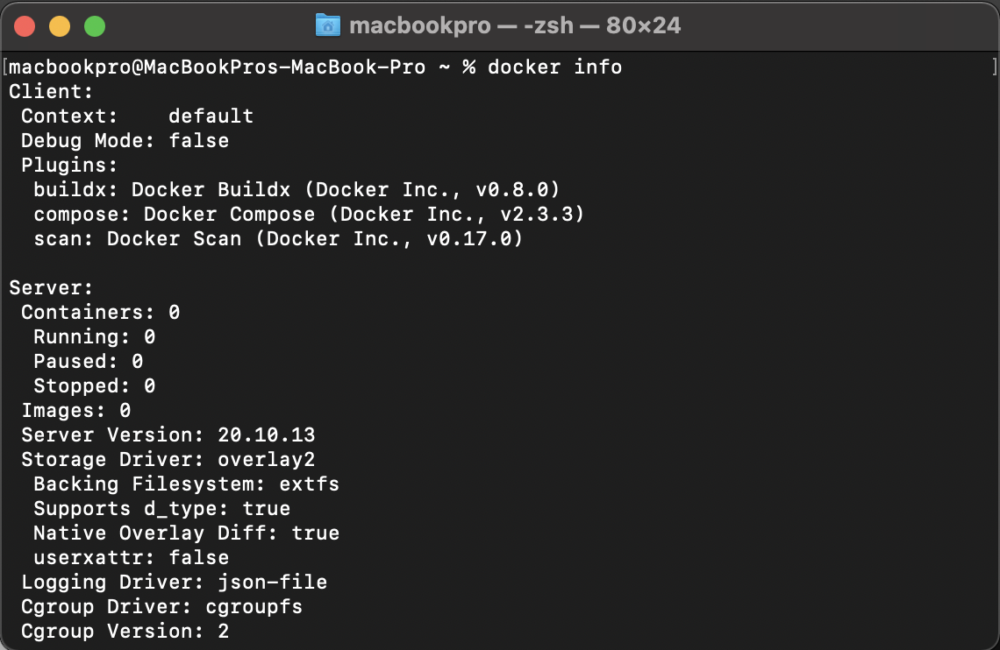
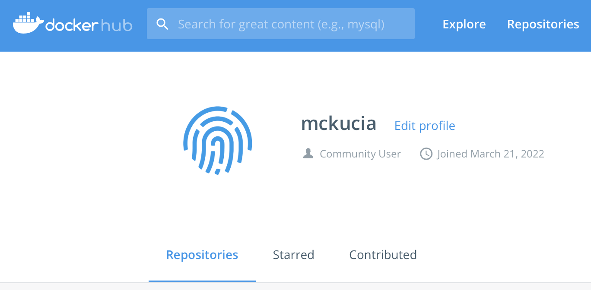

# Sprawozdanie Lab.02

### Hooks, heterogeniczne środowisko pracy, instancja Dockera

1. Przygotowanie git hook sprawdzającego, czy tytuł commita jest poprawnie nazwany, a więc składa się z moich inicjałów oraz numeru indeksu oraz sprawdzającego, czy w treści commita pada numer laboratorium, który jest właściwy dla zadania.
- modyfikacja pliku `commit-msg`
```
macbookpro@MacBookPros-MacBook-Pro MDO2022_S % git status
On branch MK401058
Your branch is up to date with 'origin/MK401058'.

nothing to commit, working tree clean
macbookpro@MacBookPros-MacBook-Pro MDO2022_S % ls -a
.			BB401928		JC401893
..			INO			Lab_instructions
.git			ITE			READMEs
macbookpro@MacBookPros-MacBook-Pro MDO2022_S % cd .git
macbookpro@MacBookPros-MacBook-Pro .git % cd hooks
macbookpro@MacBookPros-MacBook-Pro hooks % ls
applypatch-msg.sample		pre-push.sample
commit-msg.sample		pre-rebase.sample
post-update.sample		pre-receive.sample
pre-applypatch.sample		prepare-commit-msg.sample
pre-commit.sample		update.sample
macbookpro@MacBookPros-MacBook-Pro hooks % cp commit-msg.sample commit-msg
macbookpro@MacBookPros-MacBook-Pro hooks % nano commit-msg
```
- sprawdzenie działania





```
MK401058
# Please enter the commit message for your changes. Lines starting
# with '#' will be ignored, and an empty message aborts the commit.
#
# On branch MK401058
# Your branch is ahead of 'origin/MK401058' by 6 commits.
#   (use "git push" to publish your local commits)
#
# Changes to be committed:
#       new file:   test
#
CokolwiekLab02Cokolwiek
```

2. Przygotowanie środowiska Dockerowego (system macOS)
- pobranie i zainstalowanie dockera



- wykazanie, że środowisko dockerowe jest uruchomione i działa (z definicji)



- pobranie obrazu Linuxa z docker-huba

```
macbookpro@MacBookPros-MacBook-Pro ~ % docker pull ubuntu
Using default tag: latest
latest: Pulling from library/ubuntu
4d32b49e2995: Pull complete 
Digest: sha256:bea6d19168bbfd6af8d77c2cc3c572114eb5d113e6f422573c93cb605a0e2ffb
Status: Downloaded newer image for ubuntu:latest
docker.io/library/ubuntu:latest
macbookpro@MacBookPros-MacBook-Pro ~ % sudo docker images
Password:
REPOSITORY   TAG       IMAGE ID       CREATED      SIZE
ubuntu       latest    ff0fea8310f3   3 days ago   72.8MB
```

- utworzenie i uruchomienie kontenera o nazwie `Ubuntu` za pomocą komendy `sudo docker run --name Ubuntu -it ubuntu`

- wyświetlenie wersji Ubuntu
```
macbookpro@MacBookPros-MacBook-Pro ~ % sudo docker run --name Ubuntu -it ubuntu
root@2eeaa1b904f2:/# uname -a
Linux 2eeaa1b904f2 5.10.104-linuxkit #1 SMP Wed Mar 9 19:05:23 UTC 2022 x86_64 x86_64 x86_64 GNU/Linux
root@2eeaa1b904f2:/# exit
exit
macbookpro@MacBookPros-MacBook-Pro ~ % sudo docker start Ubuntu       
Ubuntu
macbookpro@MacBookPros-MacBook-Pro ~ % sudo docker ps     
CONTAINER ID   IMAGE     COMMAND   CREATED              STATUS         PORTS     NAMES
2eeaa1b904f2   ubuntu    "bash"    About a minute ago   Up 4 seconds             Ubuntu
```

