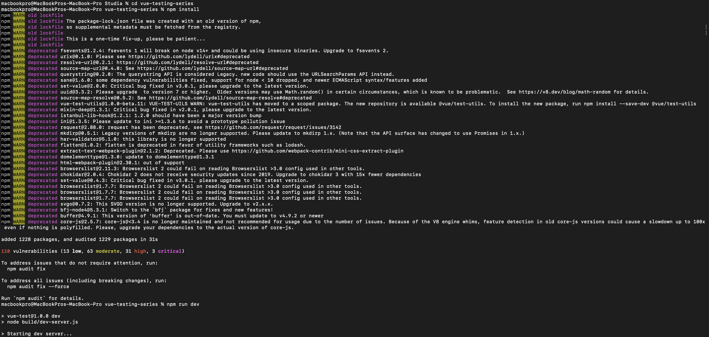
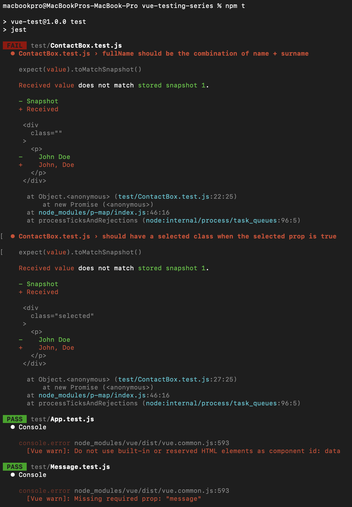
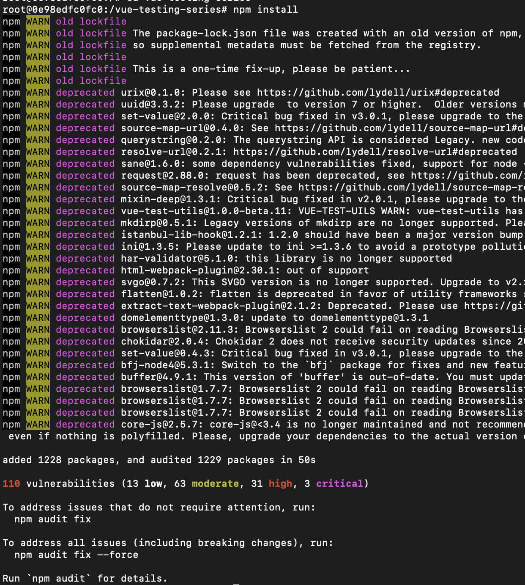
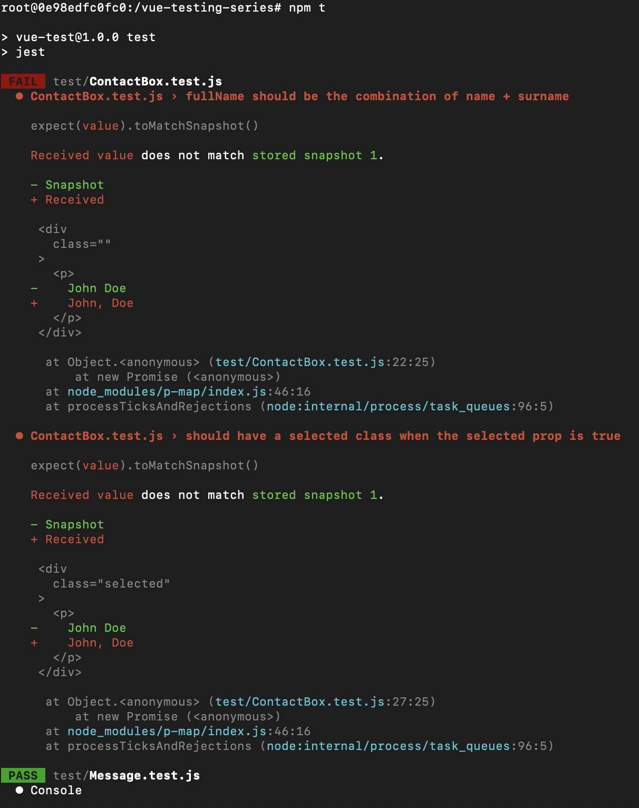
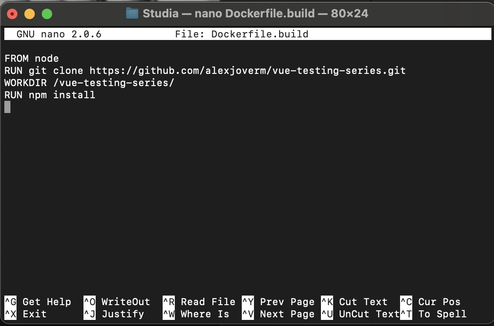
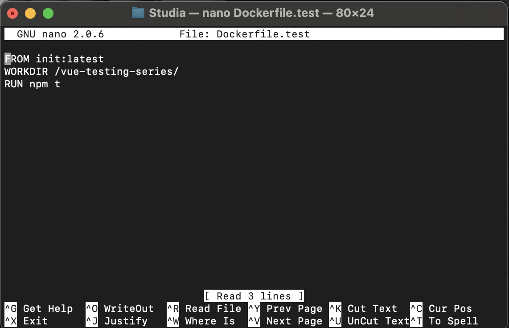
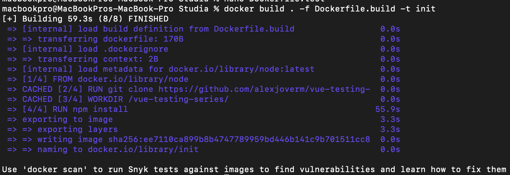
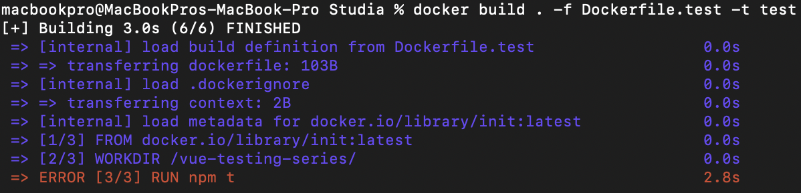
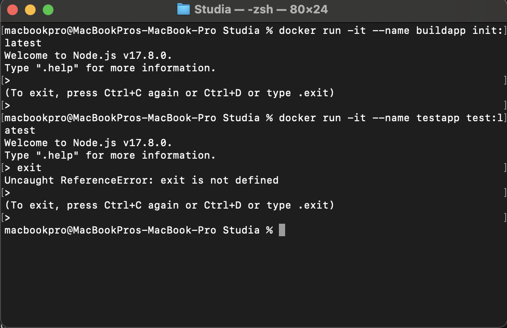

# Sprawozdanie Lab.03
### Docker files, kontener jako definicja etapu
1. Sklonowanie repozytorium zawierającego testy i menadżer instalacji `npm`
```
macbookpro@MacBookPros-MacBook-Pro Studia % git clone https://github.com/alexjoverm/vue-testing-series.git
Cloning into 'vue-testing-series'...
remote: Enumerating objects: 298, done.
remote: Total 298 (delta 0), reused 0 (delta 0), pack-reused 298
Receiving objects: 100% (298/298), 229.49 KiB | 1.54 MiB/s, done.
Resolving deltas: 100% (150/150), done.
```
2. Build programu i uruchomienie testów



```
macbookpro@MacBookPros-MacBook-Pro Studia % cd vue-testing-series
macbookpro@MacBookPros-MacBook-Pro vue-testing-series % npm install

 DONE  Compiled successfully in 2125ms                                  21:42:23

> Listening at http://localhost:8080
```

Testy nie przeszły, natomiast udało się je uruchomić



3. Pobranie bazowego obrazu `node`
```
macbookpro@MacBookPros-MacBook-Pro vue-testing-series % docker pull node
Using default tag: latest
latest: Pulling from library/node
5492f66d2700: Pull complete 
540ff8c0841d: Pull complete 
a0bf850a0df0: Pull complete 
d751dc38ae51: Pull complete 
9720a112e886: Pull complete 
c0fdd5e0e250: Pull complete 
a83bbb9b3087: Pull complete 
977c11b599a8: Pull complete 
490af247da1f: Pull complete 
Digest: sha256:f90e576f924bd8250a5b17923e7879e93abac1991ad6053674aa1bbdcfd7a714
Status: Downloaded newer image for node:latest
docker.io/library/node:latest
```
4. Uruchomienie kontenera w trybie interaktywnym, sklonowanie repozytorium
```
macbookpro@MacBookPros-MacBook-Pro vue-testing-series % docker run -it node /bin/bash
root@0e98edfc0fc0:/# ls
bin   dev  home  lib64	mnt  proc  run	 srv  tmp  var
boot  etc  lib	 media	opt  root  sbin  sys  usr
root@0e98edfc0fc0:/# git clone https://github.com/alexjoverm/vue-testing-series.git
Cloning into 'vue-testing-series'...
remote: Enumerating objects: 298, done.
remote: Total 298 (delta 0), reused 0 (delta 0), pack-reused 298
Receiving objects: 100% (298/298), 229.49 KiB | 1.57 MiB/s, done.
Resolving deltas: 100% (150/150), done.
root@0e98edfc0fc0:/# cd vue-testing-series
root@0e98edfc0fc0:/vue-testing-series# npm install
```



Testy



5. Utworzenie dwóch plików Dockerfile

`Dockerfile.build`



`Dockerfile.test`



6. Zbudowanie kontenerów






7. Utworzone obrazy

```
macbookpro@MacBookPros-MacBook-Pro Studia % docker images
REPOSITORY   TAG       IMAGE ID       CREATED         SIZE
init         latest    ee7110ca899b   4 minutes ago   1.2GB
test         latest    ee7110ca899b   4 minutes ago   1.2GB
node         latest    ba17ecfd099c   6 days ago      991MB
ubuntu       latest    ff0fea8310f3   11 days ago     72.8MB
```

8. Uruchomienie kontenerów

