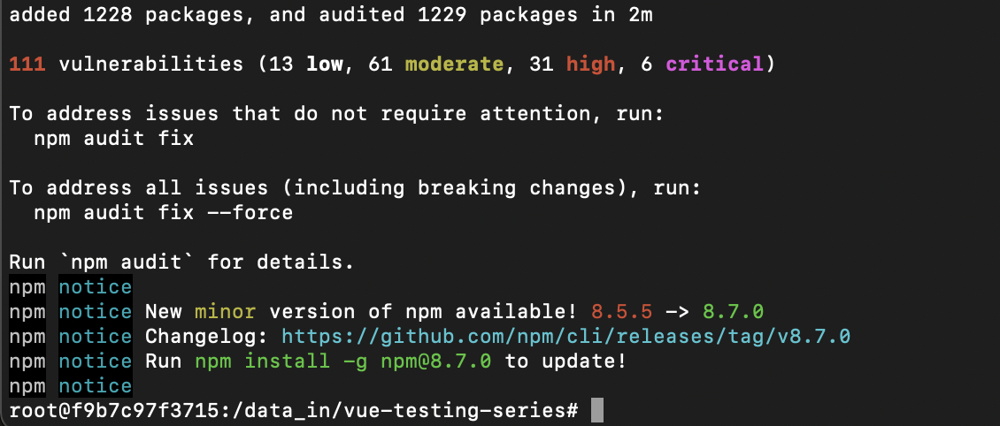
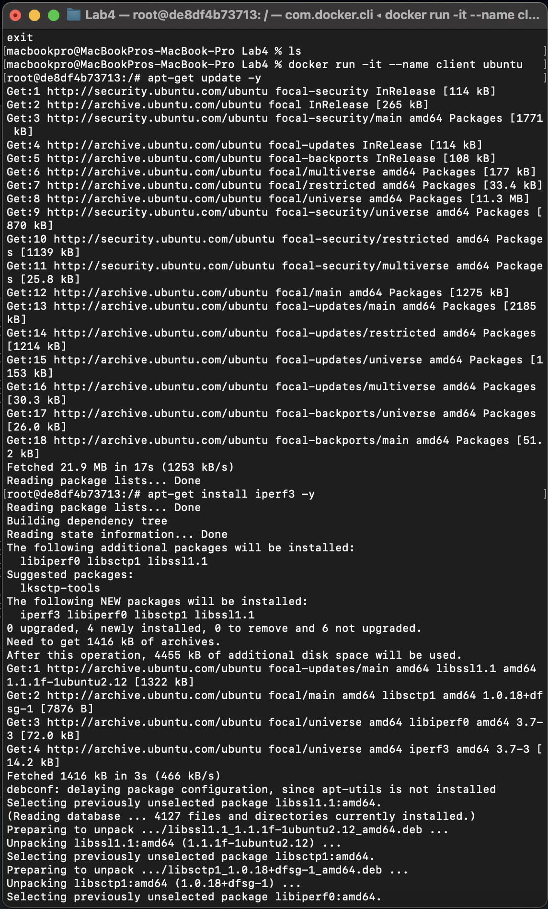
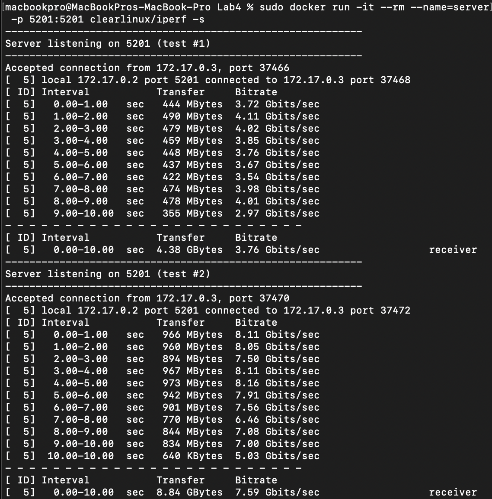
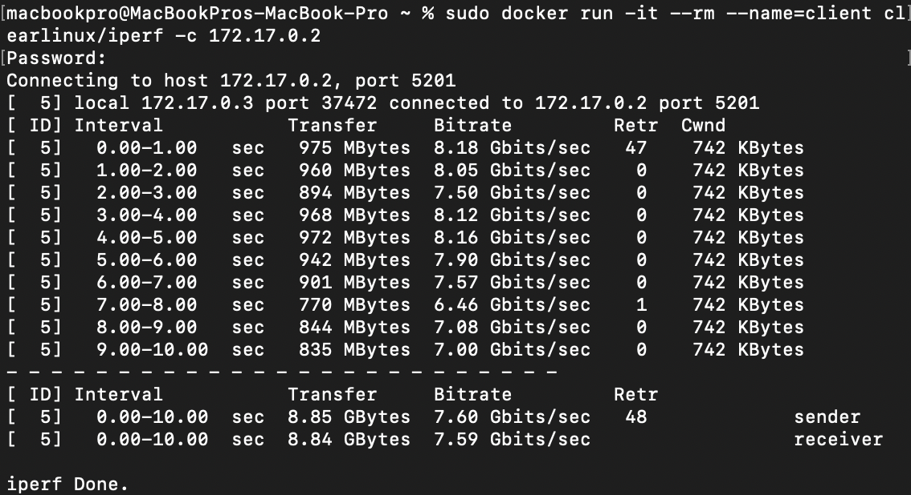
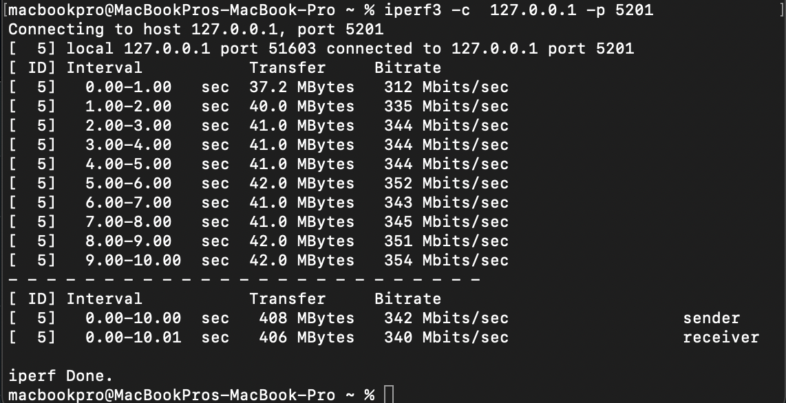
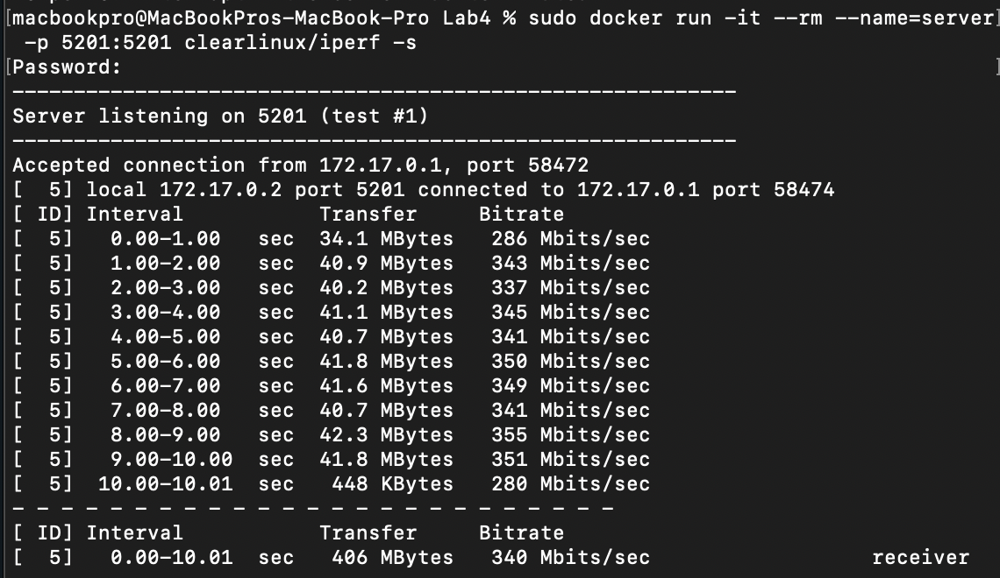
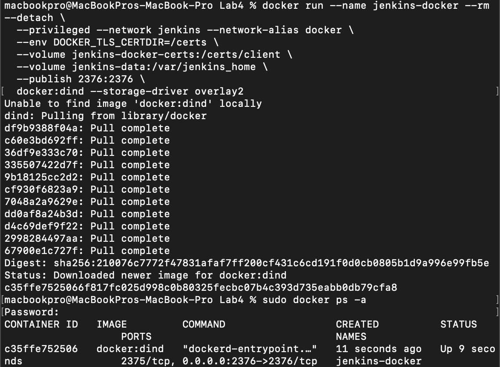
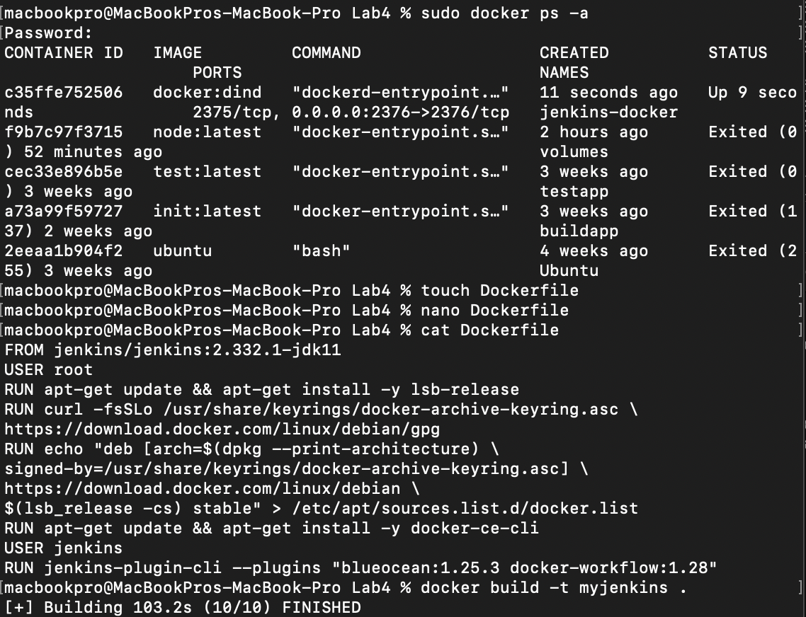
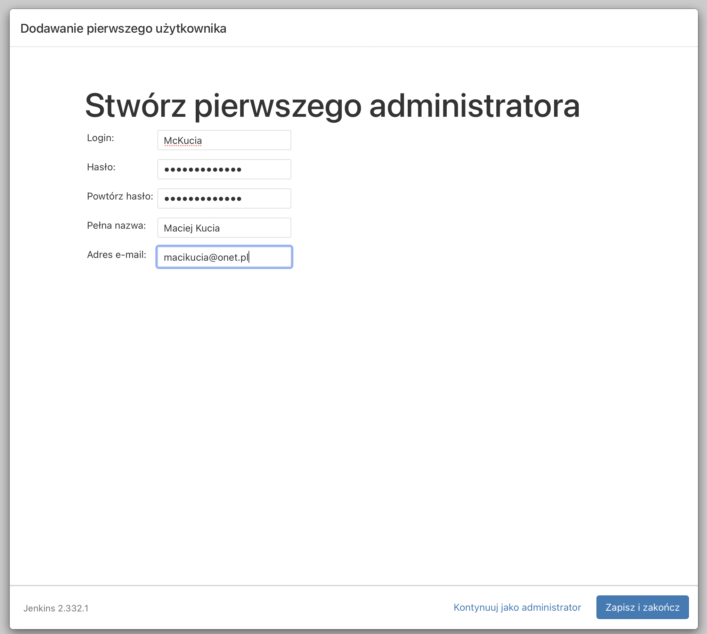

# Sprawozdanie Lab.04
### Dodatkowa terminologia w konteneryzacji, instancja Jenkins

#### Zachowywanie stanu

##### 1. Utworzenie woluminu wejściowego (input) oraz wyjściowego (output)
```
macbookpro@MacBookPros-MacBook-Pro Lab4 % docker volume create input
input
macbookpro@MacBookPros-MacBook-Pro Lab4 % docker volume create output
output
```
Wyświetlenie informacji o utworzonych woluminach za pomocą polecenia `docker inspect`
```
macbookpro@MacBookPros-MacBook-Pro Lab4 % docker inspect input
[
    {
        "CreatedAt": "2022-04-07T13:24:55Z",
        "Driver": "local",
        "Labels": {},
        "Mountpoint": "/var/lib/docker/volumes/input/_data",
        "Name": "input",
        "Options": {},
        "Scope": "local"
    }
]
macbookpro@MacBookPros-MacBook-Pro Lab4 % docker inspect output
[
    {
        "CreatedAt": "2022-04-07T13:25:02Z",
        "Driver": "local",
        "Labels": {},
        "Mountpoint": "/var/lib/docker/volumes/output/_data",
        "Name": "output",
        "Options": {},
        "Scope": "local"
    }
]
```

##### 2. Uruchomienie kontenera z utworzonymi wolumenami
```
macbookpro@MacBookPros-MacBook-Pro Lab4 % docker run -it --name volumes -v input:/data_in -v output:/data_out ubuntu   
root@cb3fa358e8c9:/# ls
bin   data_in   dev  home  lib32  libx32  mnt  proc  run   srv  tmp  var
boot  data_out  etc  lib   lib64  media   opt  root  sbin  sys  usr
```
##### 3. Sklonowanie repozytorium na wolumin wejściowy
```
root@f9b7c97f3715:/# ls
bin   data_in	dev  home  lib64  mnt  proc  run   srv	tmp  var
boot  data_out	etc  lib   media  opt  root  sbin  sys	usr
root@f9b7c97f3715:/# cd data_in
root@f9b7c97f3715:/data_in# git clone https://github.com/alexjoverm/vue-testing-series.git
Cloning into 'vue-testing-series'...
remote: Enumerating objects: 298, done.
remote: Total 298 (delta 0), reused 0 (delta 0), pack-reused 298
Receiving objects: 100% (298/298), 229.49 KiB | 359.00 KiB/s, done.
Resolving deltas: 100% (150/150), done.
```
##### 4. Zbudowanie projektu




##### 5. Przeniesienie zbudowanego projektu na wolumen wyjściowy
```
root@f9b7c97f3715:/# cp ./data_in/vue-testing-series ./data_out -r
root@f9b7c97f3715:/# cd data_out
root@f9b7c97f3715:/data_out# ls
vue-testing-series
```

#### Eksponowanie portu

##### 1. Zainstalowanie `iperf3` w kontenerze



##### 2. Uruchomienie `iperf3` na pierwszym kontenerze jako serwer



##### 3. Rozpoczęcie połączenia na drugim kontenerze - client



##### 4. Połączenie się spoza hosta

Server:



Klient:




#### Instalacja Jenkins

##### 1. Utworzenie sieci `bridge` dockera

```
macbookpro@MacBookPros-MacBook-Pro Lab4 % docker network create jenkins 
b8b09763b1f0a33ee73d806a756182e0f21349c5c936bbac1f2f2d0cc0327df8
```
##### 2. Utworzenie kontenera Jenkins na podstawie obrazu dind

```
docker run --name jenkins-docker --rm --detach \
  --privileged --network jenkins --network-alias docker \
  --env DOCKER_TLS_CERTDIR=/certs \
  --volume jenkins-docker-certs:/certs/client \
  --volume jenkins-data:/var/jenkins_home \
  --publish 2376:2376 \
  docker:dind --storage-driver overlay2
```



##### 3. Utworzenie Dockerfile

```
macbookpro@MacBookPros-MacBook-Pro Lab4 % cat Dockerfile
FROM jenkins/jenkins:2.332.1-jdk11
USER root
RUN apt-get update && apt-get install -y lsb-release
RUN curl -fsSLo /usr/share/keyrings/docker-archive-keyring.asc \
https://download.docker.com/linux/debian/gpg
RUN echo "deb [arch=$(dpkg --print-architecture) \
signed-by=/usr/share/keyrings/docker-archive-keyring.asc] \
https://download.docker.com/linux/debian \
$(lsb_release -cs) stable" > /etc/apt/sources.list.d/docker.list
RUN apt-get update && apt-get install -y docker-ce-cli
USER jenkins
RUN jenkins-plugin-cli --plugins "blueocean:1.25.3 docker-workflow:1.28"
```

##### 4. Zbudowanie kontenera



##### 5. Konfiguracja Jenkinsa, logowanie

