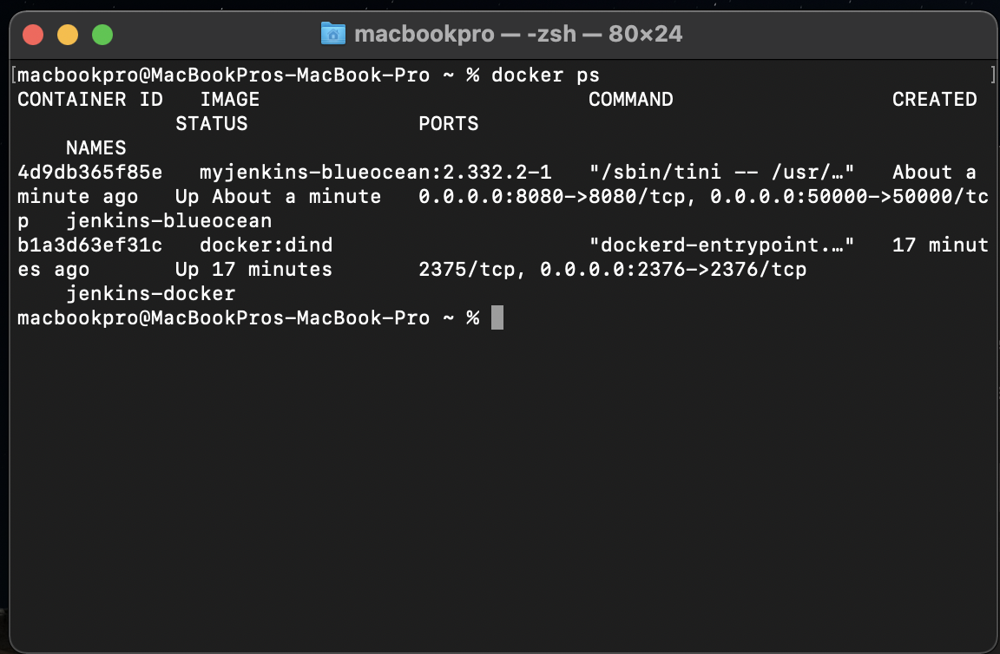
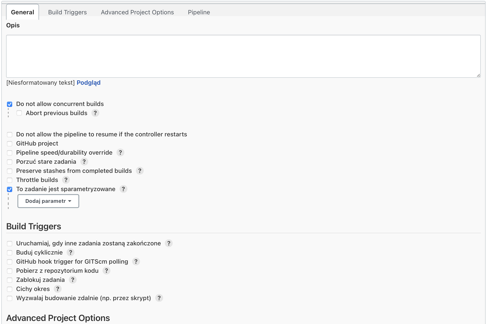
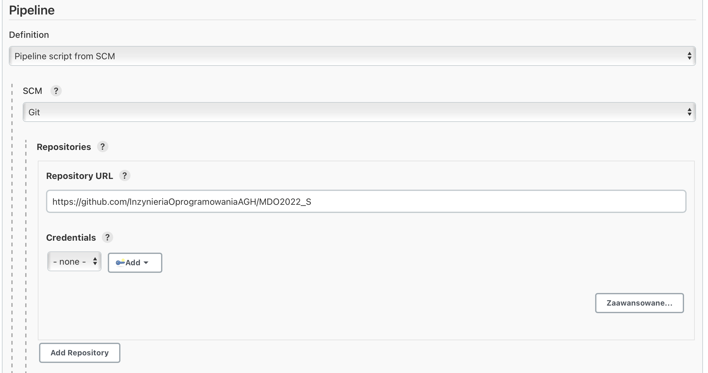
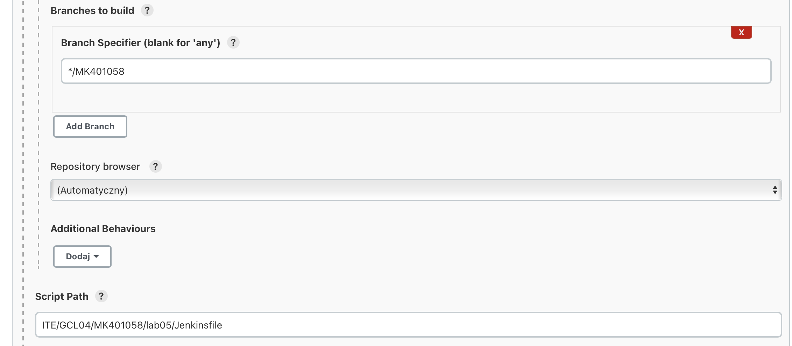

# Sprawozdanie Lab.05

### Opis projektu
Celem projektu było utworzenie pipeline'a z pomocą Jenkins. Miał on za zadanie zbudować, przetestować, wdrożyć oraz opublikować aplikację wybraną przez nas na poprzednich zajęciach laboratoryjnych - `https://github.com/alexjoverm/vue-testing-series.git`

### Wykonanie ćwiczenia
##### 1. Utworzenie kontenerów
Na początku utworzone zostały dwa kontenery dockerowe - pierwszy z Jenkinsem oraz drugi z obrazem DIND.




##### 2. Utworzenie projektu w Jenkinsie
Następnie utworzono projekt w Jenkinsie typu pipeline. Skonfigurowano projekt zaznaczając opcje ` Do not allow concurrent builds ` oraz ` To zadanie jest sparametryzowane` 



W opcjach zaawansowanych wybrano z listy rozwijanej opcję ` Pipeline script from SCM `, jako SCM wybrano Git i wpisano URL repozytorium



Jako branch wybrano własny (MK401058), na końcu wpisano ścieżkę do pliku Pipeline w repozytorium



##### 3. Dodanie plików Dockerfile do repozytorium
Aby rozpocząć pisanie Pipeline potrzebne są pliki Dockerfile w repozytorium, `Dockerfile_Build` oraz `Dockerfile_Test` 

DockerfileBuild
```
macbookpro@MacBookPros-MacBook-Pro Lab5 % cat DockerfileBuild
FROM node
RUN git clone https://github.com/alexjoverm/vue-testing-series.git
WORKDIR /vue-testing-series/
RUN npm install
RUN npm run build
```

DockerfileTest
```
macbookpro@MacBookPros-MacBook-Pro Lab5 % cat DockerfileTest 
FROM mk_build:latest
WORKDIR /vue-testing-series/
RUN npm test
```

Pipeline
```
dff
```