# Sprawozdanie Lab.09
#### Opis projektu
Celem ćwiczeń laboratoryjnych było zainstalowanie i skonfigurowanie Fedory na Virtualboxie. Następnie wykonanie podstawowych instrukcji w pliku odpowiedzi instalacji Fedory.

#### Wykonanie ćwiczenia
##### 1. Instalacja Fedory
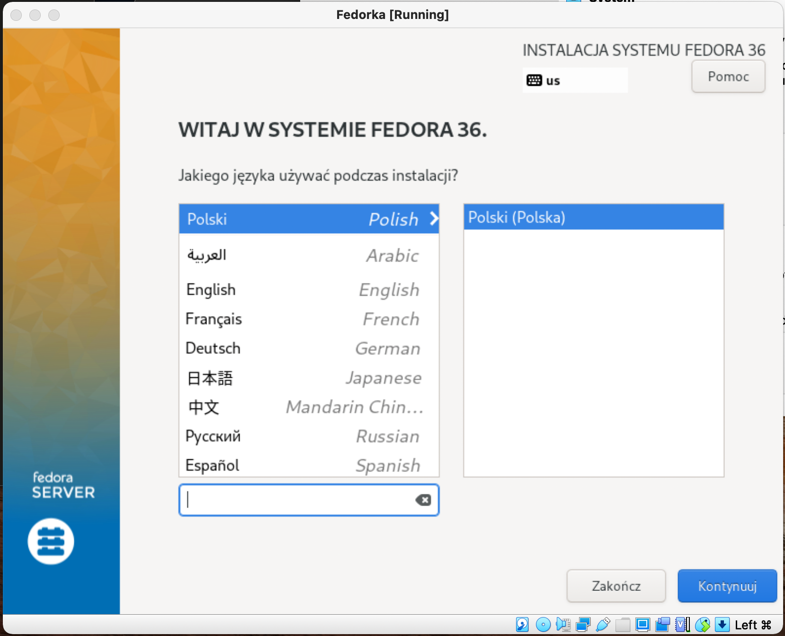

Stworzenie użytkownika
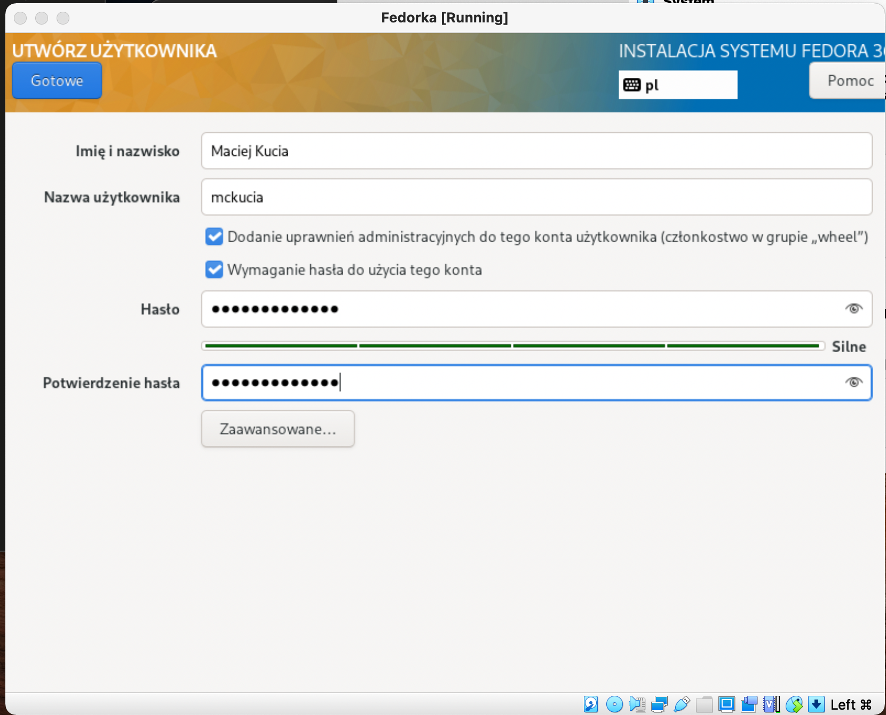

Logowanie
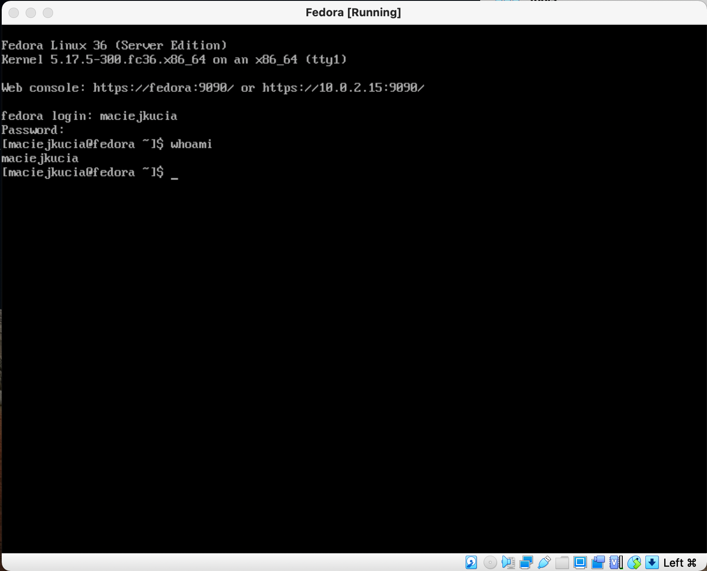

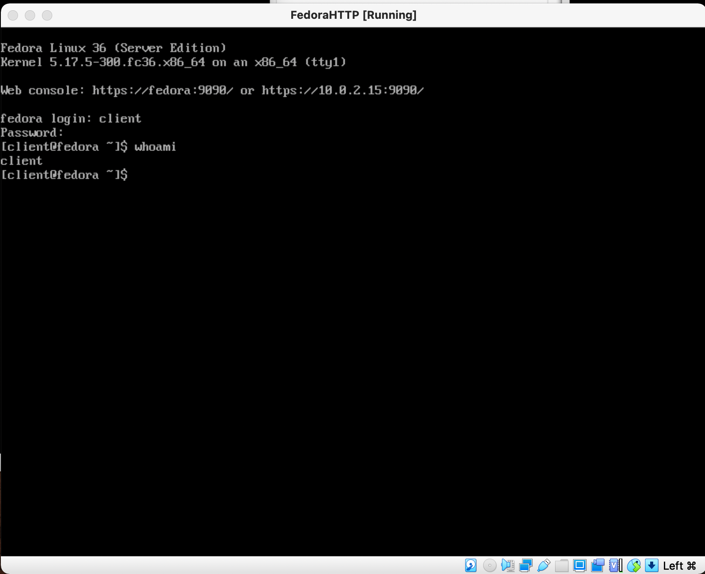

##### 2. Instalacja httpd
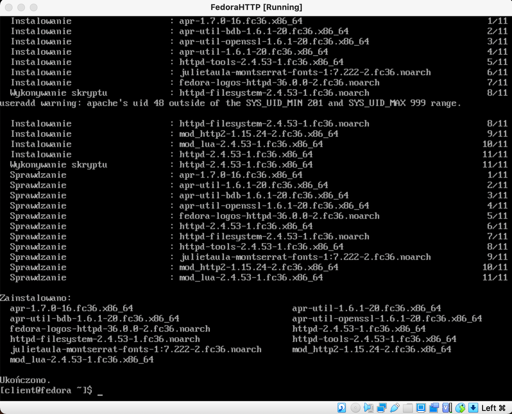

Uruchomienie usługi httpd poleceniem `systemctl enable httpd --now`
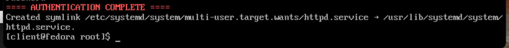

Sprawdzenie statusu servera
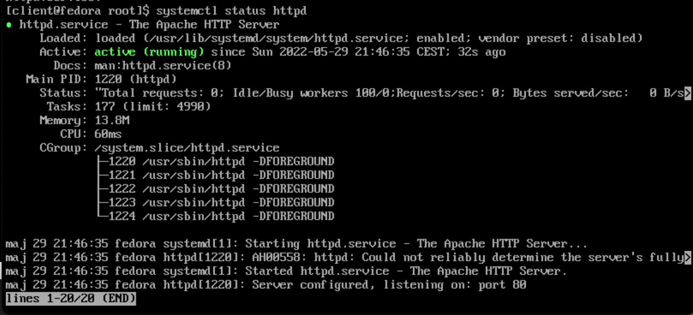

Wyłączenie zapory firewall
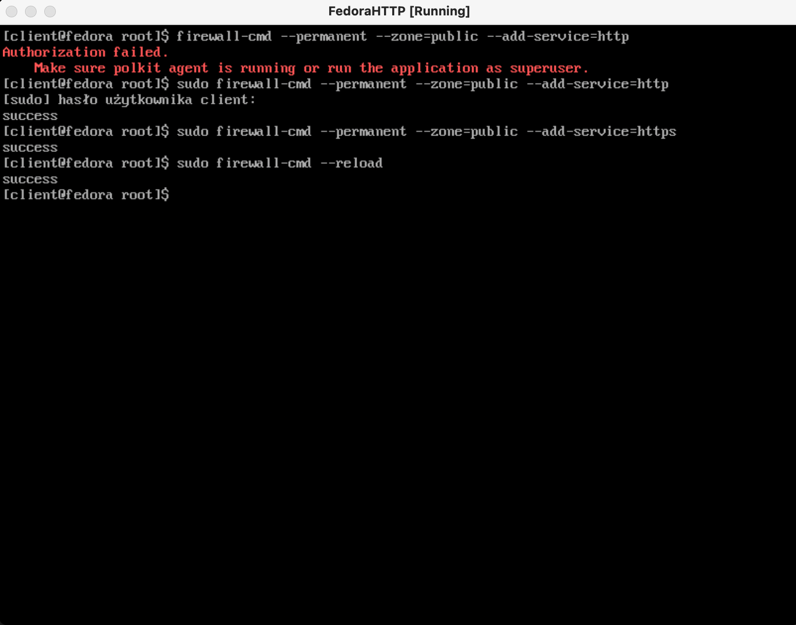

##### 3. Przesłanie pliku na server
Plik przesłany został przez maszyną ze skonfigurowanym serverem http. W celu pobrania go, wstawiłem plik `cmake_1.0.0.tar.xz` na dysk google, ponieważ miałem problem z wysłaniem go przez localhost.
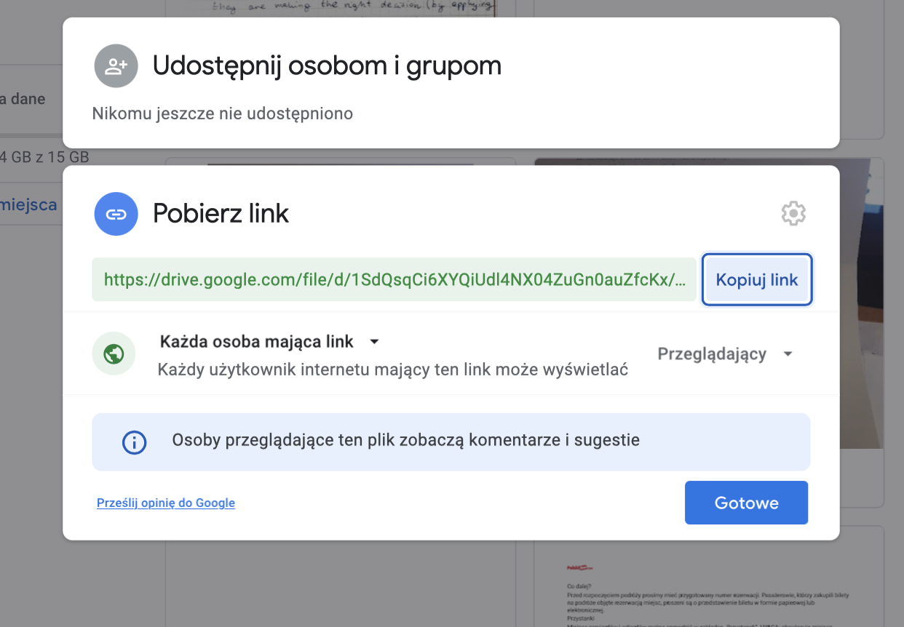

Plik wrzuciłem do katalogu `var/www/html/project`
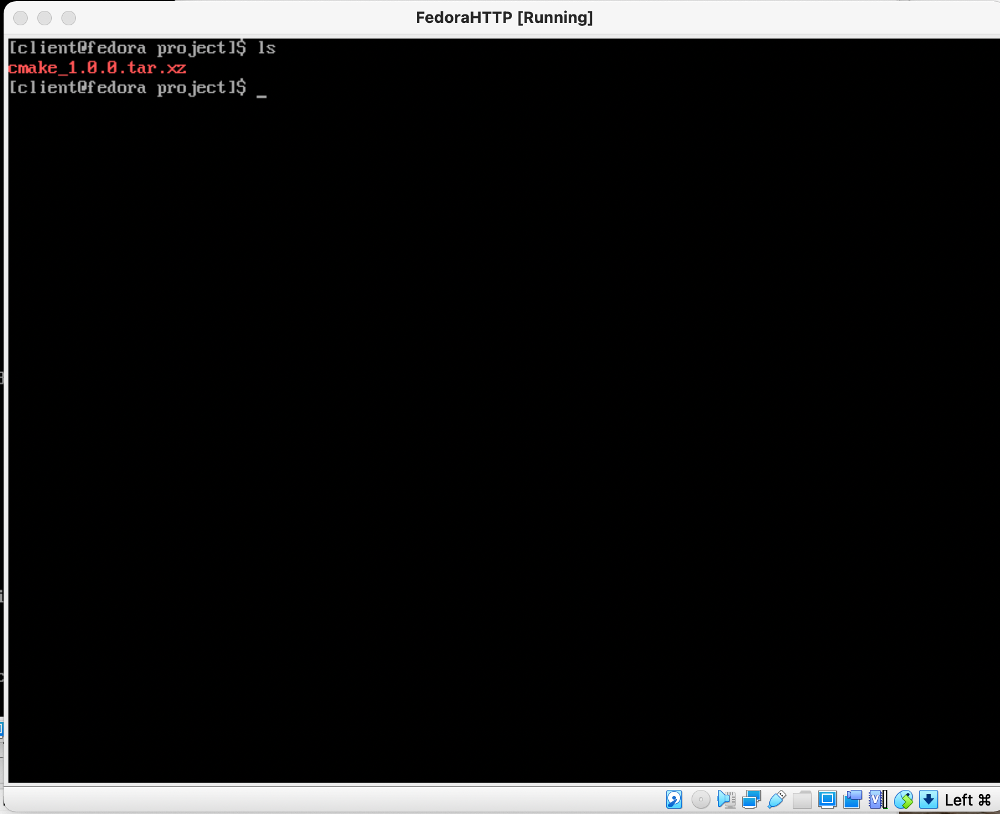

Znajduje się on już na localhost, następnie wystarczy na pierwszej maszynie wykonać komendę `wget`
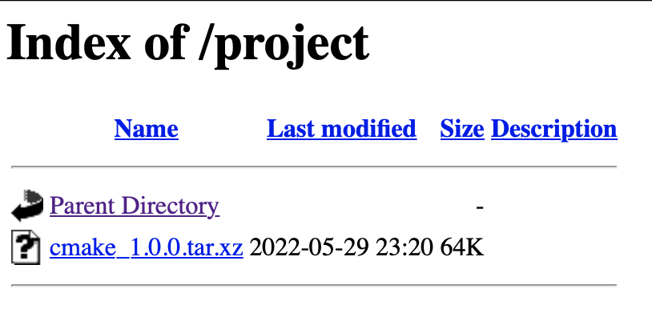

##### 4. Instalacja nienadzorowana
Plik anaconda-ks.cfg - zmieniony został typ instalacji z graficznej na tekstową, ustalono repozytoria z których pobrane zostaną pakiety oraz ustalno krok post, który pobierał artefakt za pomocą `wget`
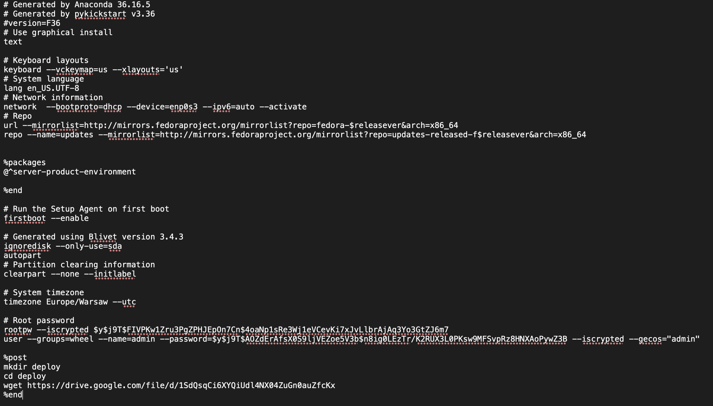

Instalacja uruchamiana jest z pliku odpowiedzi, który został umieszczony wcześniej na GitHubie
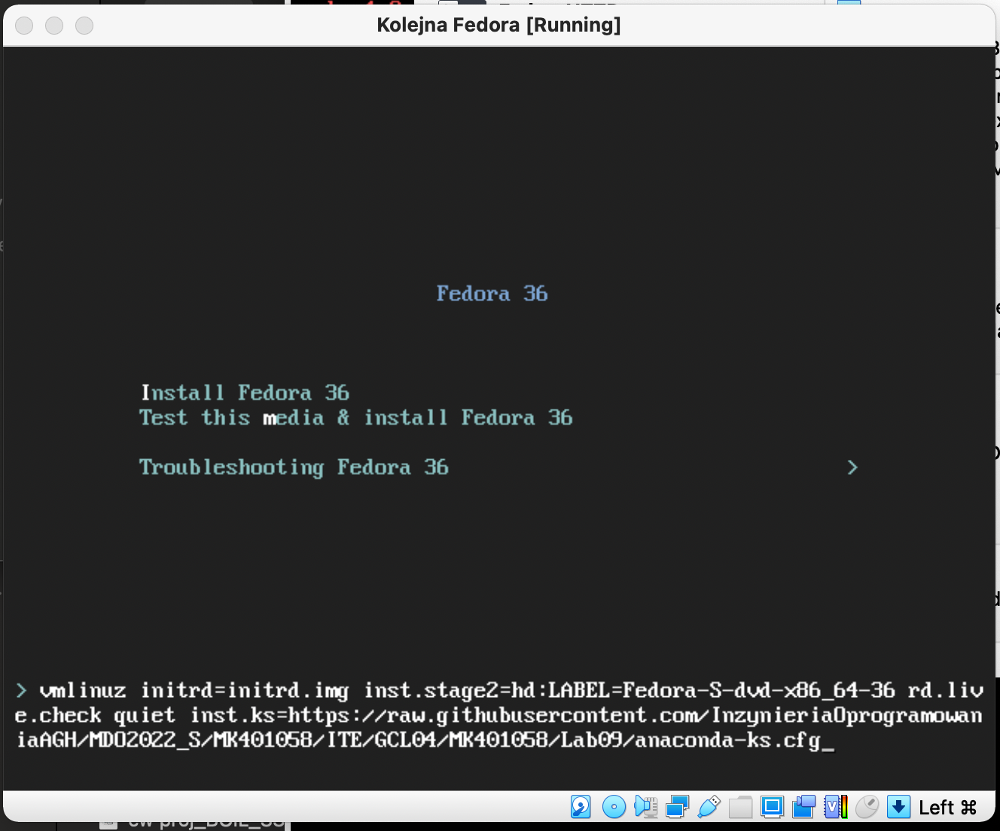

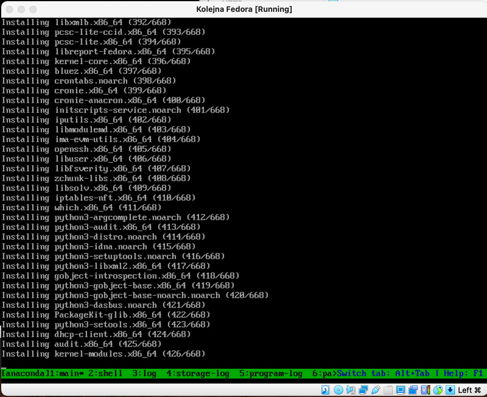

Po instalacji plik `cmake_1.0.0.tar.xz` znajduje się w folderze deploy
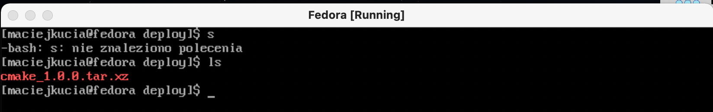
