# Sprawozdanie DevOps lab2
## Michał Krzemień
### Informatyka Techniczna 
#### Grupa laboratoryjna 4.  
<br />

## Git hook

1. Połaczono się z serwerem ssh przy użyciu aplikacji ssh z poziomu terminala Windows Powershell. Szczegóły połączenia maszyny hosta z maszyną gościa przedstawiono w sprawozdaniu 1.

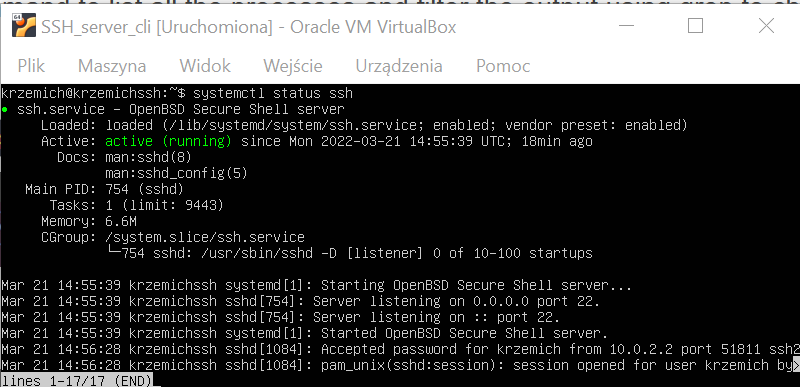
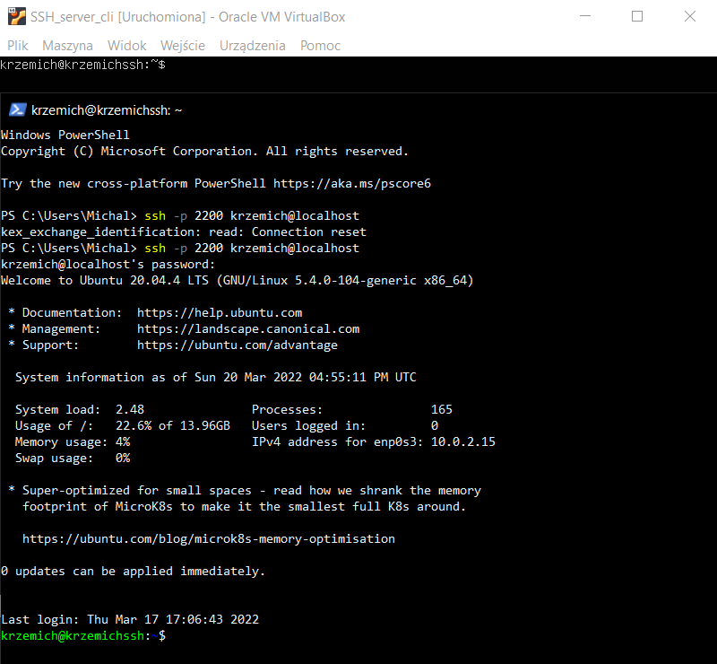

2. W pliku hooks znajdującym się w folderze .git repozytorium edytowano plik commit-msg w celu stworzenia hook'a wywołującego się w momencie wywołania funkcji commit. Poniższej przedstawiono składnię hook'a sprawdzającego czy commit jest odpowiednio zatytułowany oraz czy w opisie commita znajduje się odpowiedni numer laboratorium.

```                                          
#!/bin/bash
commit_file=$1
first_commit_line=`head -n1 $commit_file`
body_pattern=".*(Lab)[0-9][0-9]*."

if [[ "$first_commit_line" =~ "MK402993".* ]]; then
  echo "Valid commit title"
  echo $first_commit_line
else
  echo "Commit title has to start with: MK402993"
  exit 1
fi

while IFS= read -r line
do
  if [[ $line =~ $body_pattern ]]; then
    exit 0
  fi
done < <(sed 1d $commit_file)

echo "Invalid commit description, it has to contain correct LabXX where XX is number of current lab"

exit 1
```

3. Poprawność działania hook'a przetestowano dla niepoprawnego tytułu oraz opisu commita, oraz dla poprawnie utworzonego commita. Jako domyślny edytor dla gita ustawiono aplikację nano przy użyciu polecenia `git config --global core.editor nano`. Następnie przy pomocy polecenia `git commit` utworzono testowe commity.

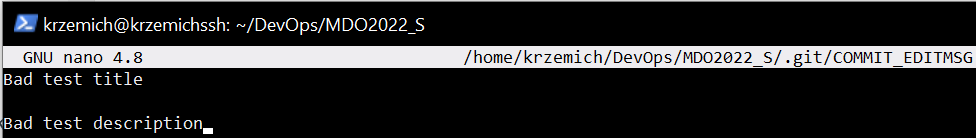
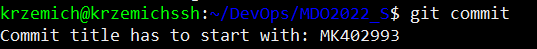

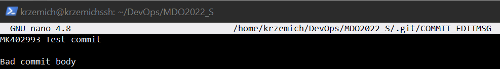


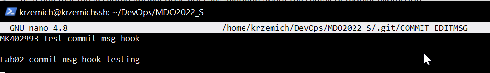
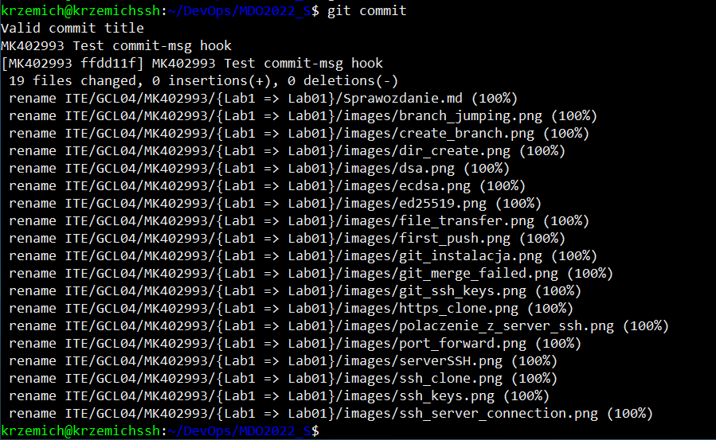

## Docker

1. Połączenie po ssh z maszyną wirtualną zostało opisane w sprawozdaniu z laboratorium numer 1.

2. Na maszynie hosta zainstalowano dockera według instrukcji z dokumentacji dockera według akapitu "[Install using the repository](https://docs.docker.com/engine/install/ubuntu/#install-from-a-package)".

3. Działanie środowiska sprawdzono z definicji. W celu sprawdzenia działania dockera na maszynie hosta wywołano polecenie `systemctl status docker`. Następnie sprawdzono czy została utworzona dla dockera warstwa sieciowa przy pomocy polecenia `ifconfig`.

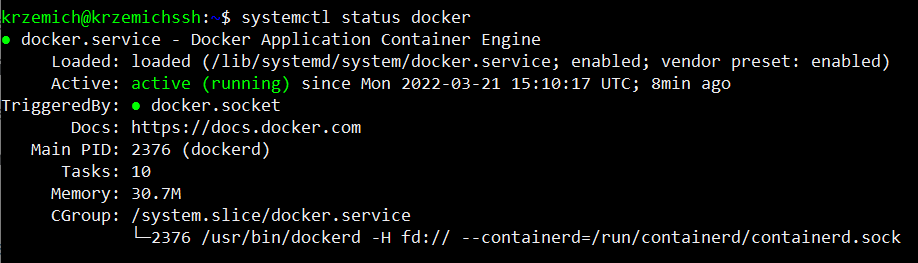
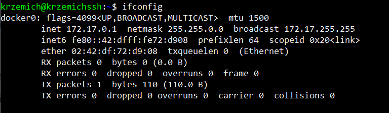

4. Dodatkowo sprawdzono działanie dockera w sposób praktyczny. Pobrano obraz ubuntu przy pomocy komendy `docker pull ubuntu`, sprawdzono czy obraz został utworzony przy pomocy polecenia `docker images`. Następnie uruchomiono obraz poleceniem `docker run ubuntu` i sprawdzono działanie kontenera poleceniem `docker ps -a`.

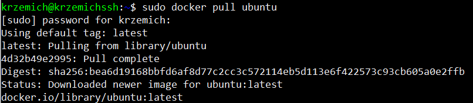
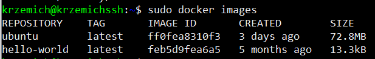
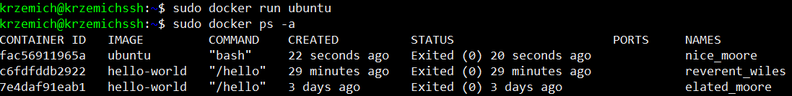

5. Założono konto na platformie dockerhub.

 