# Sprawozdanie DevOps lab2
## Michał Krzemień
### Informatyka Techniczna 
#### Grupa laboratoryjna 4.

<br>

## Build lokalny

1. Jako aplikację do wykonania ćwiczenia wybrano przykładową aplikację napisaną w języku Java dla której wykonano kilka przykładowych testów ```https://github.com/ThomasJaspers/java-junit-sample```. 
2. Utworzono lokalną kopię repozytorium przy pomocy polecenia ```git clone```.
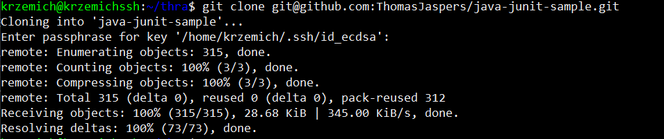
3. W trakcie pierwszej próby budowania okazało się, że aplikacja ta wymaga JDK w wersji 8, a lokalnie zainstalowana wersja JDK to wersja 11. Zainstalowano wersję 8 jdk przy użyciu następującej komendy ```sudo apt install openjdk-8-jdk```, a przełączenie się między konkretnymi wersjami odbywa się przy pomocy ```sudo update-alternatives --config java```
4. Wykonano build aplikacji używając polecenia ```mvn clean package -DSkipTests```. Flaga -DSkipTests pozwala na pominięcie testów w trakcie budowania. Jak można zauważyć na zrzucie ekranu zamieszczonym poniżej, build zakończył się sukcesem
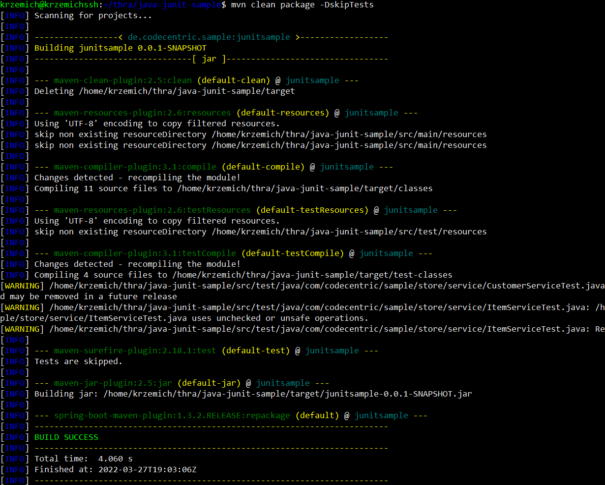
5. Uruchomiony testy aplikacji, przy użyciu polecenia ```mvn test```. Testy okazały się być przeprowadzane w interaktywnej formie dając użytkownikowi możliwość wyboru kilku opcji w prostym menu. Wybrano opcję uruchomienia wszystkich testów, które przeszły pomyślnie.
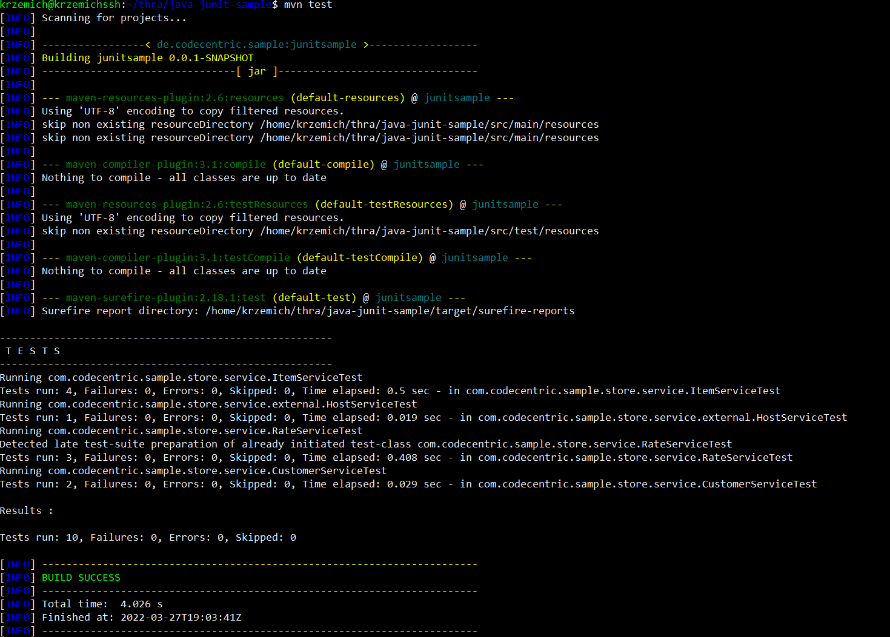

<br>

## Build z użyciem konetera

1. Przygotowano nowy kontener w celu przeprowadzenia wszystkich czynności w konterze. Skorzystano z specjalnie przeznaczonego dla jdk kontenera openjdk, którego obraz pobrano przy pomocy komendy ```sudo docker pull openjdk:8```.

2. Uruchomiono kontener przy pomocy polecenia z wykorzystaniem terminala sh, ponieważ domyślny terminal node'a nie obsługuje poleceń git. Wykorzystano komendę ```sudo docker run -it --name buildContainer openjdk:8 sh```. 
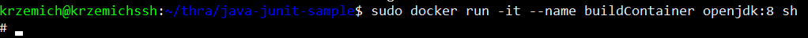
3. Sklonowano repozytorium do uruchomionego kontenera.
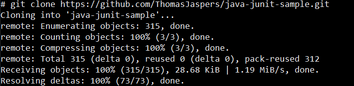
4. Podjęto próbę zbudowania aplikacji przy użyciu komendy ```mvn clean package -DSkipTests```, jednakże na pobranym obrazie nie znaleziono Mavena, dlatego pobrano go przy użyciu polecenia ```apt install maven```. 
5. Zainstalowano zależności, uruchomiono build i testy wewnątrz kontenera.

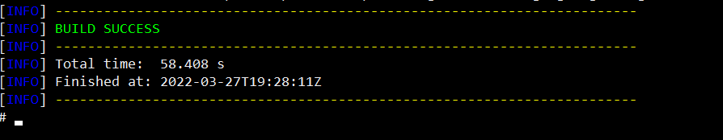
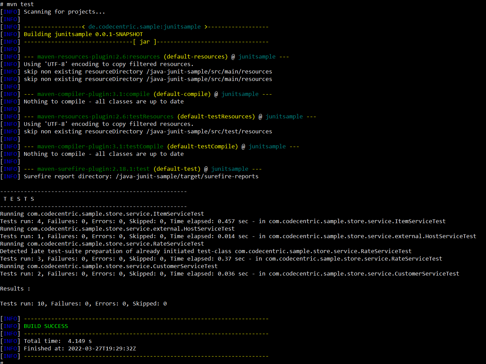


## Przygotowanie Dockerfile'a

1. Przygotowano pierwszego dockerfile'a o nazwie BuildDocker, który odpowiada za pobranie Maven'a, sklonowanie repozytorium oraz wykonanie buildu aplikacji.

```
FROM openjdk:8

RUN apt update
RUN apt -y upgrade
RUN apt -y install maven

RUN git clone https://github.com/ThomasJaspers/java-junit-sample.git

WORKDIR /java-junit-sample/

RUN mvn clean package -DSkipTests
```

2. Przygotowano drugi plik dokcerfile o nazwie TestDocker, który odpowiada za testy na podstawie obrazu budującego ze środowiskiem i zbudowaną aplikacją.
```
FROM testApp:latest
WORKDIR /java-junit-sample/
RUN mvn test
```
3. Zbudowano pierwszy obraz na podstawie dockerfile'a przy użyciu komendy ```sudo docker build -f BuildDocker -t testapp```
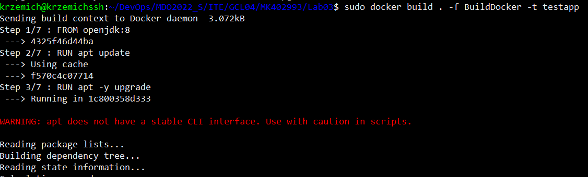
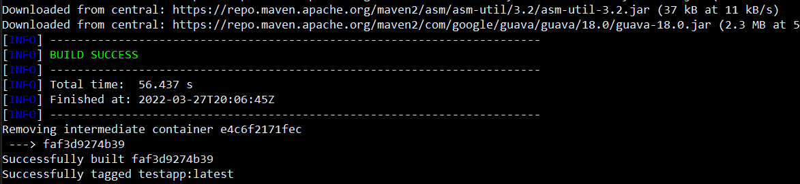
4. Zbudowano obra testujący poprzez wywołanie komendy ```sudo docker build -f TestDocker -t testimage```
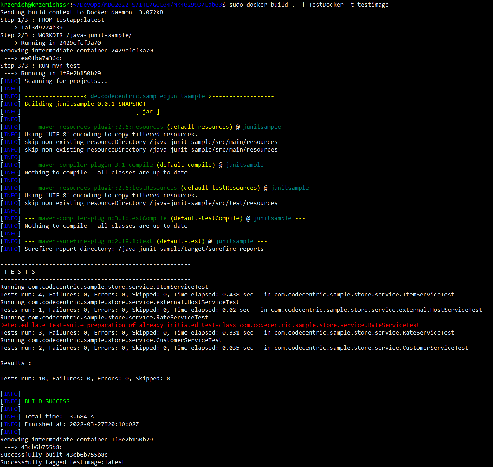
5. Wywołując komendę ```sudo docker images``` można zauważyć, że oba obrazy zbudowały się poprawnie.
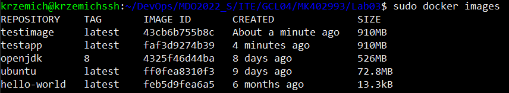
6. Na koniec na podstawie stworzonych obrazów z dockerfile uruchomiono kontenery. Oba kontenery uruchamiają się w tym samym folderze roboczym i z tym samym bashowym terminalem. Dzięki temu można stwierdzić, że obrazy na podstawie przygotowanych dockerfile zbudowały się poprawnie.
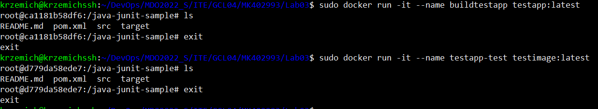
