# Sprawozdanie DevOps lab4
## Michał Krzemień
### Informatyka Techniczna 
#### Grupa laboratoryjna 4.

<br>

## Zachowywanie stanu

1. Przygotowano wolumin wejściowy i wyjściowy wykorzystując polecenie `docker volume create XXXX` gdzie w miejsce XXXX wpisano nazwy obu woluminów.

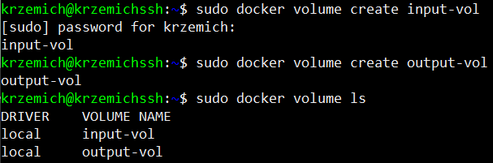

2. Uruchomiono kontener na podstawie obrazu bazowego z poprzedniego ćwiczenia (openjdk:8) i dodano do niego utworzone woluminy.
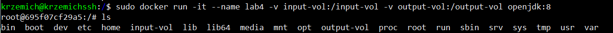

3. W kontenerze uruchomionym na podstawie wyżej wspomnianego obrazu doinstalowano mavena komendą `apt install maven`

4. Sklonowano repozytorium na wolumin wejściowy z poziomu maszyny hosta. W tym celu użyto konta root w celu dostania się do folderu w którym domyślnie przechowywane są woluminy dockera. Sklonowane repozytorium przeniesiono do folderu _data poleceniem `mv`
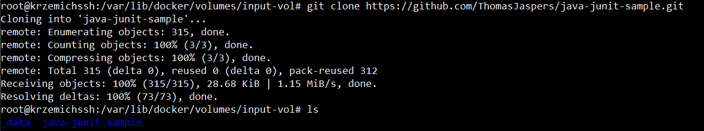
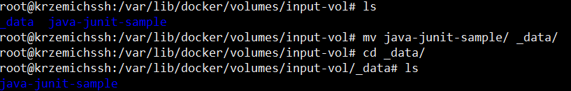

5. Po uruchomieniu kontenera sprawdzono czy zawartość repozytorium sklonowanego na wolumin wejściowy jest widoczny z poziomu kontenera.
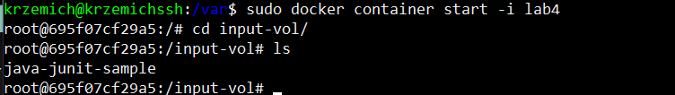

6. Zbudowano aplikację w kontenerza, a wynik kompilacji przeniesiono do woluminu wyjściowego.
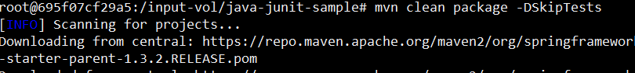
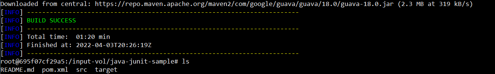
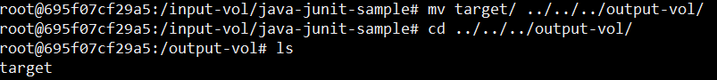

7. Sprawdzono czy pliki buildu są widoczne wewnątrz woluminu z poziomu hosta.


## Eksponowanie portu

1. Zainstalowano iperf wewnątrz kontenera poleceniem `apt install iperf3`. Następnie utworzono drugi kontener na podstawie obrazu openjdk:8 i na nim również zainstalowano iperf3. 

2. Na pierwszym kontenerze uruchomiomo iperf3 jako serwer w następujący sposób `iperf3 -s -p 5566`. Na drugim kontenerze rozpoczęto połączenie jako klient poleceniem `iperf3 -c 172.17.0.2 -t 30 -p 5566`


3. Następnie zainstalowano iperf na maszynie hosta i wykonano test identycznie jak w przypadku testu kontener do kontenera.
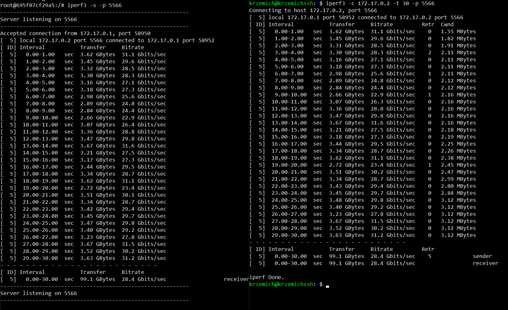

4. Na potrzeby połączenia się z kontenerem spoza hosta utworzono nowy kontener z wyeksportowanym portem 9080 dodając flagę `-p` do polecenia tworzącego kontener. Pomimo przekierowania portów w ustawieniach maszyny wirtualnej połączenie spoza hosta nie działało. Utworzono ponownie kontener i wyeksportowano port 5201, a nastepnie wykonano przekierowanie portów z virtualboxa na windowsa 5201:5201 i uruchomiono test. Tym razem iperf uzyskał połączenie i test się powiódł.
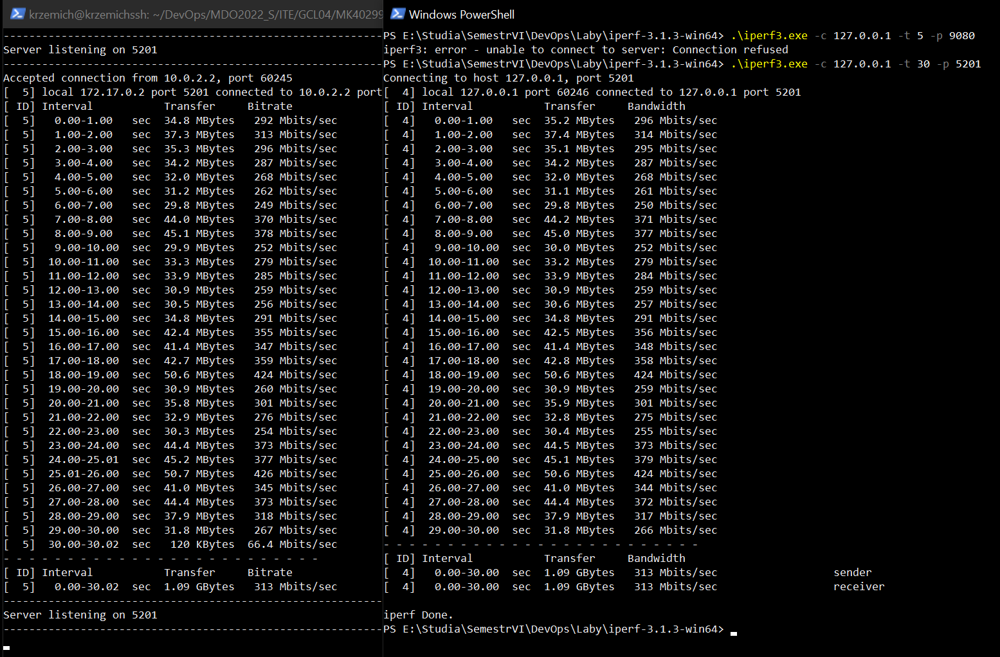
5. Poniżej przedstawione są wyniki przepustowości komunikacji. Wynik pierwszy to test przepustowości host - kontener, drugi to kontener-kontener, a na kolejnym screenie pokazane są logi z kontenera na którym testowanie połaczenie spoza hosta z kontenerem.
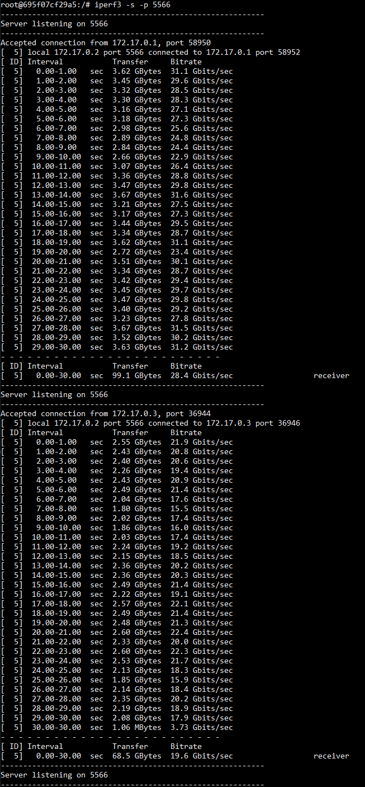
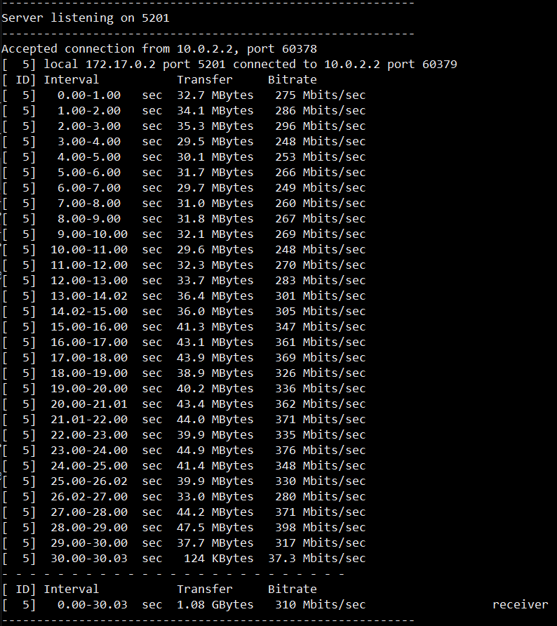

## Instancja Jenkins

1. Zgodnie z załączoną do instrukcji dokumentacja przeprowadzono instalację Jenkinsa.

2. Utworzono sieć bridge dockera poleceniem `docker network create jenkins`
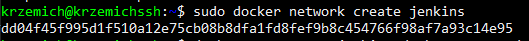

3. Następnie utworzono kontener jenkinsa na podstawie obrazu dind, który został automatycznie pobrany przy uruchomieniu polecenia
```
docker run --name jenkins-docker --rm --detach \
  --privileged --network jenkins --network-alias docker \
  --env DOCKER_TLS_CERTDIR=/certs \
  --volume jenkins-docker-certs:/certs/client \
  --volume jenkins-data:/var/jenkins_home \
  --publish 2376:2376 \
  docker:dind --storage-driver overlay2
  ```
  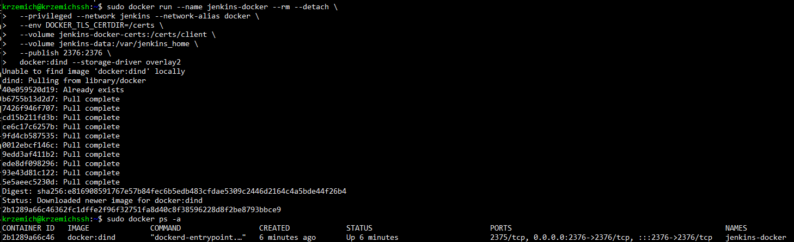

  4. Następnie utworzono dockerfile wyglądającego w następujący sposób
  ```
  FROM jenkins/jenkins:2.332.1-jdk11
USER root
RUN apt-get update && apt-get install -y lsb-release
RUN curl -fsSLo /usr/share/keyrings/docker-archive-keyring.asc \
  https://download.docker.com/linux/debian/gpg
RUN echo "deb [arch=$(dpkg --print-architecture) \
  signed-by=/usr/share/keyrings/docker-archive-keyring.asc] \
  https://download.docker.com/linux/debian \
  $(lsb_release -cs) stable" > /etc/apt/sources.list.d/docker.list
RUN apt-get update && apt-get install -y docker-ce-cli
USER jenkins
RUN jenkins-plugin-cli --plugins "blueocean:1.25.3 docker-workflow:1.28"
  ```
5. Na podstawie utworzonego dockerfile'a zbudowano obraz o nazwie myjenkins
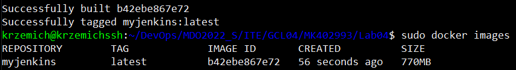
6. Następnie uruchomiono kontener z opublikowanymi portami 8080 i 50000 poleceniem
```
docker run --name jenkins-blueocean --rm --detach \
  --network jenkins --env DOCKER_HOST=tcp://docker:2376 \
  --env DOCKER_CERT_PATH=/certs/client --env DOCKER_TLS_VERIFY=1 \
  --publish 8080:8080 --publish 50000:50000 \
  --volume jenkins-data:/var/jenkins_home \
  --volume jenkins-docker-certs:/certs/client:ro \
  myjenkins:latest
```
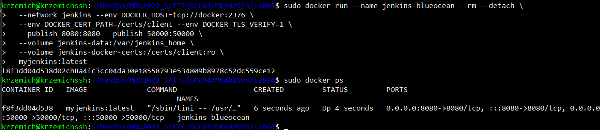

7. W ustawieniach maszyny wirtualnej wykonano przekierowanie portów 8080 gościa na porty 8080 hosta.
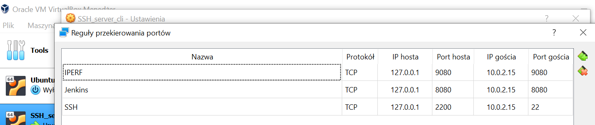

8. Uruchomiono jenkinsa z poziomu windowsa i wykonano wszystkie kroki procesu konfiguracyjnego Jenkinsa. Hasło zostało odszukane w logach kontenera dzięki wykorzystaniu polecenia `docker logs nazwa_kontenera`.
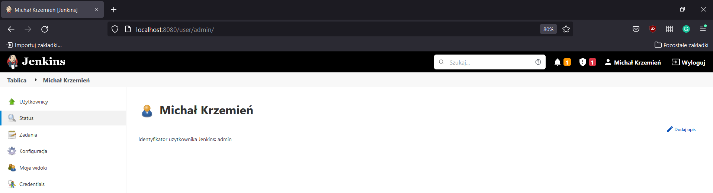