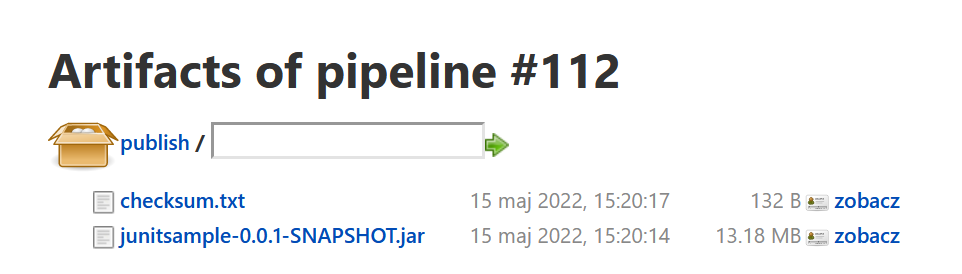
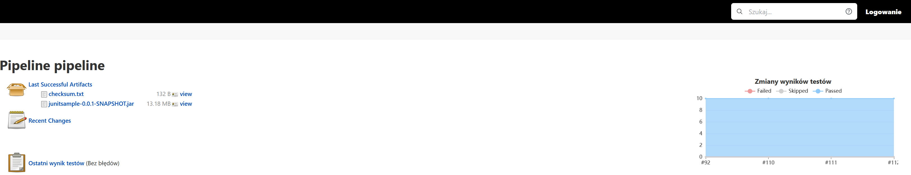
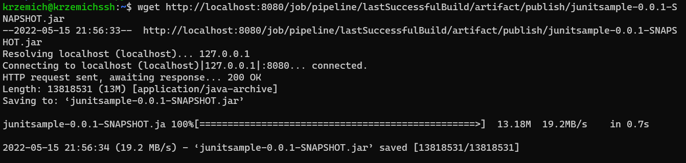
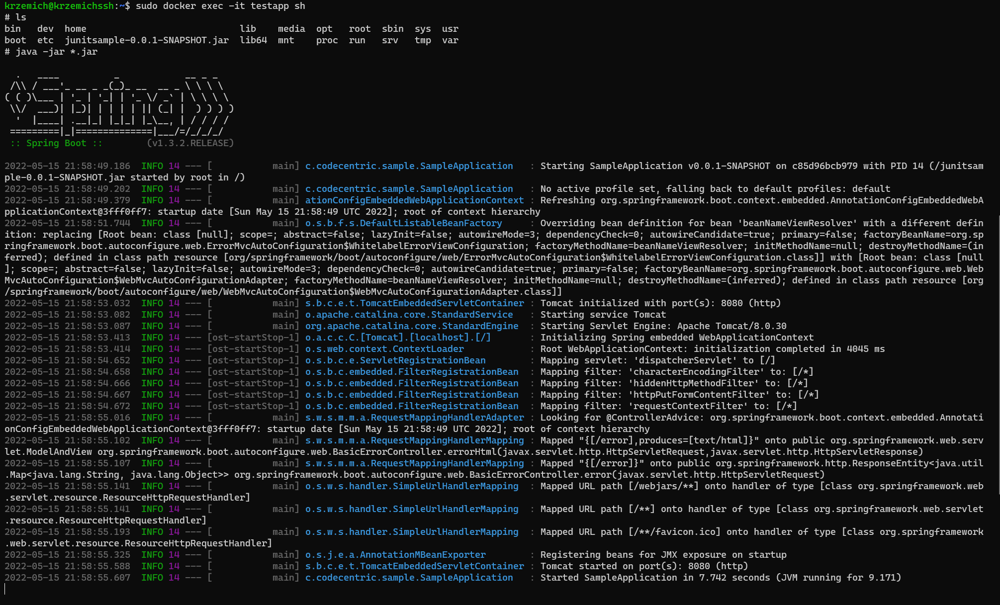

# Sprawozdanie - Pipeline

## 
Cel

 
Celem projektu jest utworzenie pipelinu służacego do automatyzacji buildu, testów, deploya oraz publisha przykładowego javowego projektu. 

## 
 Streszczenie 

 W ramach projektu utworzono pipeline z wykorzystaniem narzędzia jenkins. Opis pipeline'u został napisany w sposób deklaratywny i uruchamiany jest z pliku Jenkinsfile znajdującego się w repozytorium przedmiotu. Podzielony został na siedem etapów szczegółowo opisanych w sprawozdaniu. Artefaktem udostępnianym po pomyślnym wykonaniu pipeline'a jest plik .jar oraz suma kontrolna.  

## 
 Opis pipeline'u 

### 
 Definicja pipeline'u 

 Definicja pipeline'u pobierana jest z repozytorium projektu z gałęzi MK402993 z folderu Lab05/jkscript z pliku Jenkinsfile.  

### 
 Etapy pipeline'u 

1. Git connection
2. Environment
3. Download repo
4. Build
5. Test
6. Deploy
7. Artifact

### 
Git Connection 

Etap ten został utworzony w celu połączenia się z githubem z repozytorium przedmiotu w którym znajdują się pliki Dockerfile służące do przygotowania obrazów środowiska, builda oraz testów. Wewnątrz etapu zrealizowany jest krok klonujący repozytorium przy użyciu git plugin. Pole `git branch` definuje na którą gałąź projektu ma być wykonany checkout, `credentialsId` określa przy pomocy jakich danych należy użyć do połączenia. Credentiale zapisane są przy użyciu menadżera jenkinsa. Pole `url` określa link do repozytorium githuba.  
 

### 
 Environment 

 Etap ten został dodany w celu podstawowego przygotowania środowskia. W obszarze polecenia `dir` wywołano polecenie `docker build` uruchamiające budowę obrazu środowiska na podstawie którego tworzone są następne obrazy. Kolejnym krokiem wewnątrz tego etapu jest utworzenie katalogów publish i tests wewnątrz obszaru roboczego, które wykorzystywane są w dalszych etapach. W przypadku niepowodzenia tego etapu uruchamiane są dwie komendy `rm -rf` zarówno dla katalogu publish i tests w celu usunięcia zbędnych katalogów z obszaru roboczego.

Obraz środowiska to obraz zbudowany na podstawie openjdk:8 z zainstalowanym mavenem.
 

Krok usuwający zawartość woluminu przy użyciu polecenia rm został wykonany ze względu na błąd wynikający z zachowania danych na woluminach. Błąd polegał na tym, że polecenie `git clone` kopiuje repozytorium na wolumin wyjściowy i jeśli istnieje już taki katalog to kopia kończy się niepowdzeniem i błędem pipeline'u.

### 
 Download repo 

 W tym etapie wykorzystano agenta dockera, który tworzy kontener na podstawie obrazu openjdk:8 i podpina pod niego wolumin input, oraz uruchamia go z kontem root'a. Dodatkowo ustawiono opcję reuseNode agenta na true po to, aby agent nie tworzył osobnej przestrzeni roboczej. Następnie przy użyciu utworzonego kontenera wykonywane są dwa polecenia, pierwsze usuwające zawartość woluminu input w celu upewnienia się, że na woluminie nie znajdują się pozostałości z wcześniejszego uruchomienia pipeline'u. Następnym krokiem jest sklonowanie repozytorium 
wybranego projektu do katalogu /input, będącego odwzorowaniem woluminu.  

### 
 Build 

 Etap ten został stworzonony w celu wykonania buildu. Został wykorzystany agent dockerfile z następującymi parametrami: 

- filename "BuildDocker" - nazwa pliku dockerfile
- dir "ITE/GCL04/MK402993/Lab05" - ścieżka do pliku
- additionalBuildArgs "-t testapp" - dodatkowe atrybuty do budowy obrazu
- args '-v input:/input -v output:/output --user root' - atrybuty do uruchomienia kontenera
- reuseNode true - zapewnie użycia tego samego obszaru roboczego

Jako kroki utworzonego kontenera wykonywane jest przejście do katalogu z projektem i uruchomienie builda z pominięciem testów wykorzystując polecenie `mvn clean package -DskipTests`. Wynik buildu kopiowany jest do woluminu output.

### 
 Test 

Etap ten podobnie jak etap build wykorzystuje agenta dockerfile z następującymi parametrami:

-filename "TestDocker"
-dir "ITE/GCL04/MK402993/Lab05"
-additionalBuildArgs "-t testimage"
-args '-v output:/output --user root -v deploy:/deploy'
-reuseNode true

 Następnie w utworzonym w tym etapie kontenerze wykonywane są 3 kroki: 

1. `sh "cd /output/java-junit-sample && mvn surefire:test"` - przejście do katalogu ze zbudowanym projektem i uruchomienie testów
2. `sh 'cp -r /output/java-junit-sample/target/*.jar /deploy'` - skopiowanie zbudowanego pliku .jar do woluminu deploy.
3. `"cp /output/java-junit-sample/target/surefire-reports/*.xml ./tests"` - kopiowanie wyników testu do katalogu tests.

Następnie w etapie post wykonywanym zawsze przy użyciu wtyczki junit zbierane są wyniki testów w celu wyświetlenia ich w pipelinie

### 
 Deploy 

Etap deploy jak sama nazwa wskazuje został wykonany w celu sprawdzenia działania wyniku builda po udanych testach przed wypuszczeniem artefaktu. Ponownie wykorzystano agenta dockera, który tworzy kontener w oparciu o czysty obraz openjdk:8 z podpiętym woluminem deploy.

Wewnątrz kontenera wykonywane są nastepujące kroki:

1. sh "cd /deploy && nohup java -jar *.jar &" - przejście do katalogu z plikiem jar i uruchomienie aplikacji
2. sh "cp /deploy/*.jar ./publish" - kopia pliku wynikowego builda .jar do katalogu publish
### 
 Artifact 

Ostatni etap pipeline stworzony jest w celu opublikowania artefaktów. W tym etapie wykonane są 3 kroki:

1. archiveArtifacts artifacts:"publish/*.jar",
fingerprint: true - utworzenie artefaktu z pliku .jar
2. sh 'cat publish/*.jar | sha512sum > publish/checksum.txt' - utworzenie sumy kontrolnej 
3. archiveArtifacts artifacts:"publish/checksum.txt",
fingerprint: true - utworzenie artefaktu z sumy kontrolnej

### 
 Dodatkowe informacje 

Zmodyfikowano pliki dockerfile z lab03 i utworzono nowy plik środowiskowy ze względu na zmianę koncepcji pipeline'a. Początkowe założenie polegało na tym, że w dockerfile'u kopiowane jest repozytorium projektu i kolejne obrazy pracują w workspacie projektu wykonując swoje zadania. Jednakże zostało to zamienione na pracę na kontenerów na woluminach i dodanie kontenera tymczasowego kopiującego repozytorium na wolumin. Wykorzystanie takiego podejścia niweluje potrzebę wykonywania wszystkich operacji wewnątrz dockerfilów, dzięki czemu budowane są tylko lekkie obrazy z zależnościami, a odpowiednie komendy uruchamiane są z poziomu kontenera.

 
Artefakt jest dostępny do pobrania z hostowanej strony Jenkinsa dzięki umożliwieniu niezalogowanym użytkownikom przeglądaniu pipelineów w sposób readonly. 

Przetestowano czy możliwe jest pobranie artefaktu na i uruchomienie aplikacji, wewnątrz czystego kontenera na podstawie obrazu openjdk:8

