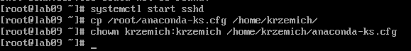
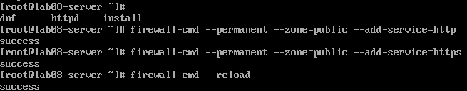
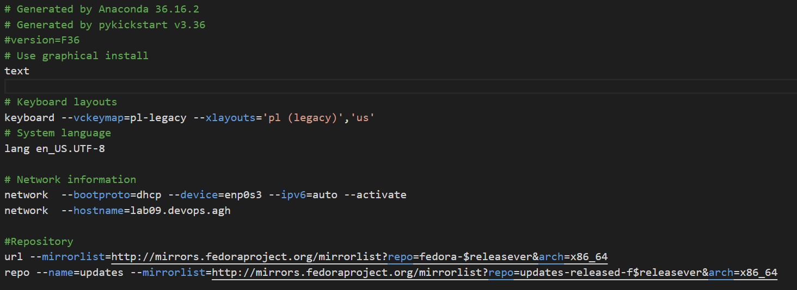
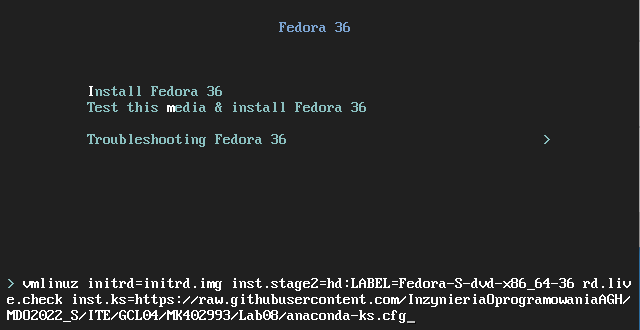
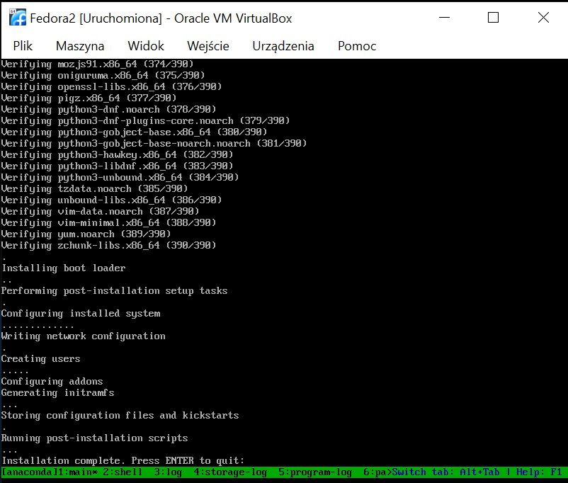
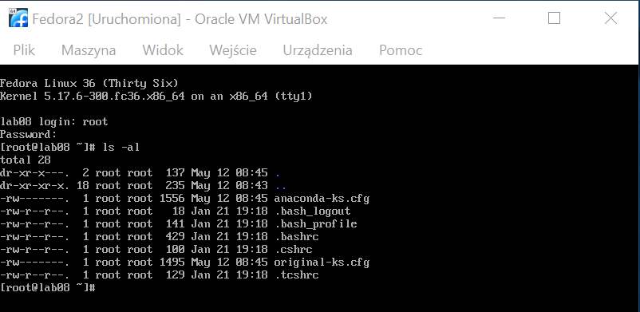

# Sprawozdanie DevOps lab8
## Michał Krzemień
### Informatyka Techniczna 
#### Grupa laboratoryjna 4.

 

## Przygotowanie systemu pod uruchomienie

1. Zainstalowano system Fedora w którym skonfigurowano użytkowników i z którego wyciągnięgo plik `anaconda-ks.cfg` przy pomocy programu filezilla i połączeniu po SSH przy pomocy przekierowanych portów maszyny wirtualnej. W celu umożliwienia przenoszenia pliku `anaconda-ks.cfg` zmieniono jego właściciela na utworzonego użytkownika nie będącego rootem przy pomocy komendy `chown`.

2. Utworzono nową maszynę, której instalacja przebiegła tak jak pierwszej maszyny z tym wyjątkiem, że po instalacji zainstalowano httpd komendą `dnf install httpd`.

3. Skonfigurowano firewalla na maszynie będącej serwerem.

4. Utworzono przekierowanie portów z maszyny wirtualnej z serwerem fedora do hosta w celu połączenia się po ssh, tak jak to opisano w sprawozdaniu z lab1. Następnie przy pomocy porgramu FileZilla umieszczono artefakt na serwerze.

## Instalacja nienadzorowana

1. Dokonano zmian w pliku `anaconda-ks.cfg` polegających na dodaniu repozytoriów oraz na zmianie instalacji z graficznej na tekstową.

2. Plik `anaconda-ks.cfg` umieszczono na repozytorium na githubie, a następnie uruchomiono instalację systemu na nowej maszynie wirtulanej z kickstartem określonym na plik `anaconda-ks.cfg` znajdującym się w repozytorium.

3. Sprobówano pobrać artefakt z serwera przy użyciu polecenia wget, ale ze względu na komplikację wynikające z przekierowania portów między maszynami wirtualnymi próba się nie powiodła. Nie znaleziono rozwiązania dla tego problemu.