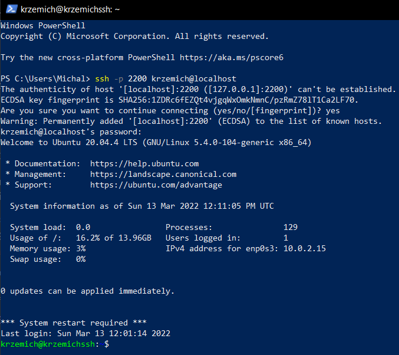
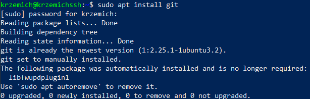
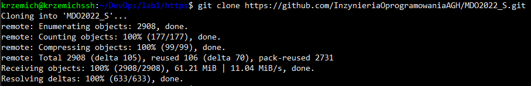
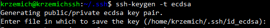
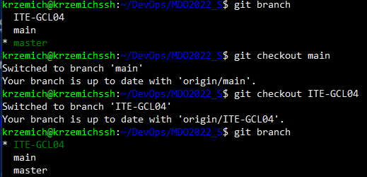
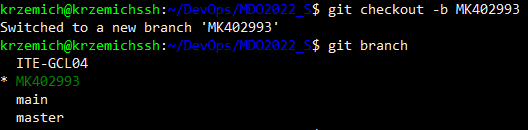
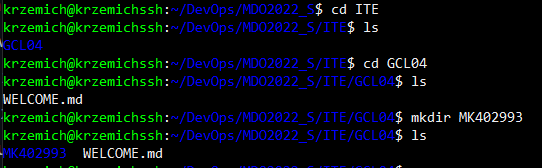
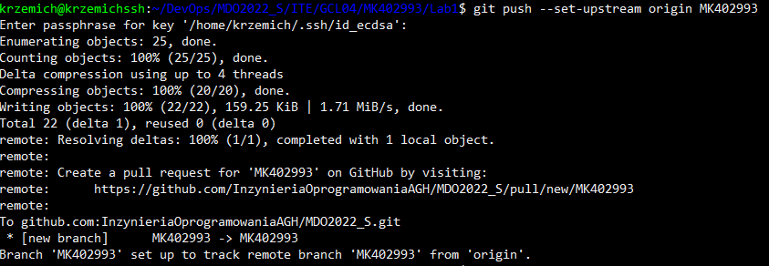
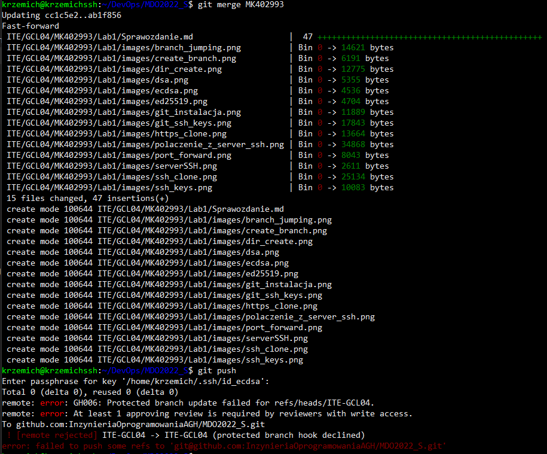

# Sprawozdanie DevOps lab1
## Michał Krzemień
### Informatyka Techniczna 
#### Grupa laboratoryjna 4.

W celu wykonania zadania skorzystano z maszyny wirtualnej z systemem Ubuntu 20.04.4 live server z wcześniej zainstalowanym serwerem ssh. 

1. Połączono się z serwerem ssh z maszyny hosta poprzez wykorzystanie narzędzia ssh z poziomu terminala Windows PowerShell. Połączenie zostało zrealizowane poprzez forward portu 22 z maszyny gościa.

2. Podjęto próbę instalacji obsługi gita na serwerze ssh, poprzez wykorzystanie polecenia: `sudo apt install git` . Instalacja nie została wykonana z powodu istniejącej na serwsze aktualnej wersji obsługi git.

3. Do specjalnie przygotowanego folderu sklonowano repozytorium po HTTPS przy użyciu polecenia: `git clone link-do-repozytorium`.

4. Utworzono dwa klucze ssh przy pomocy polecenia `ssh-keygen` z wykorzystaniem ecdsa oraz ed25519. W trakcie tworzenia obu kluczy dodano hasło.

5. Utworzone klucze dodano do konta na githubie przy wykorzystaniu opcji githuba dostępnych z poziomu przeglądarki.

6. Sklonowano repozytorium przy użyciu połączenia po ssh wykorzystując polecenie `git clone`

7. Przełączono się na gałąź grupy ITE-GCL04 przechodząc poprzez gałąź main wykorzystując polecenie `git checkout`

8. Przy użyciu polecenia `git checkout -b` utworzono brancha MK402993 i przeniesiono się na niego.

9. Na nowo utworzonej gałęzi przeniesiono się do folderu grupy w którym utworzono katalog o nazwie MK402993.

10. Częściową wersję sprawozdania przesłano na serwer ssh przy pomocy oprogramowania FileZilla. 

11. Wprowadzone zmiany na gałęzi dodano poleceniem `git add .`, a następnie utworzono commita przy pomocy komendy `git commit -m`. Zmiany zostały wysłane do zdalnego źródła poleceniem `git push --set-upstream`.

12. Wykonano próbę połączenia utworzonej gałęzi MK402993 z gałęzią grupową. Na poziomie lokalnym próba zakończyła się powodzeniem, ale przy próbie wysłania zmian do źródła próba została odrzucona ze względu na to, że gałąź grupowa jest gałęzią chronioną.

13. Zaktualizowano sprawozdanie, przesłano je do repozytorium i wystawiono pull request'a.