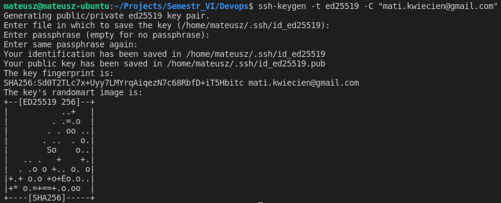
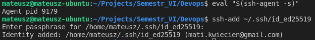
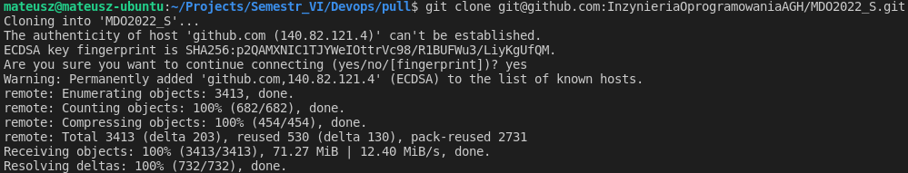
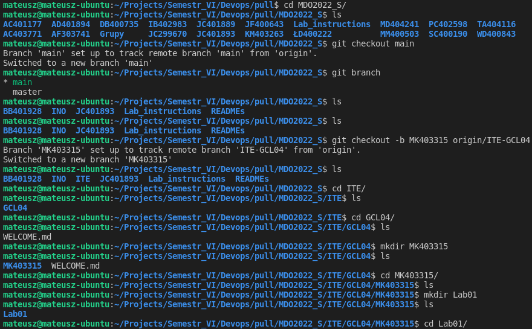
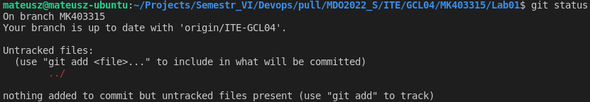
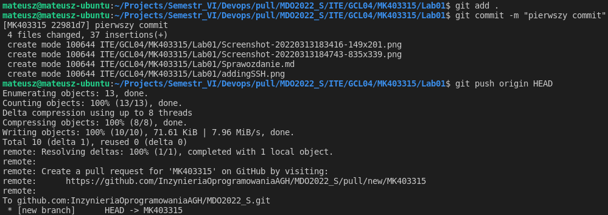
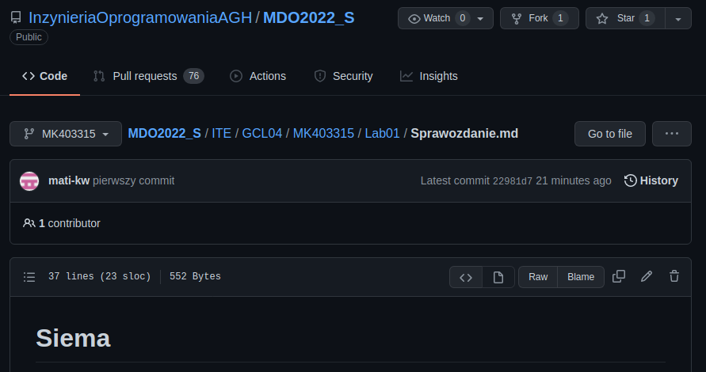

# Sprawozdanie Lab01
## Mateusz Kwiecień, Informatyka Techniczna 
### Realizacja laboratorium

1. Na początku wygenerowano klucz SSH za pomocą komendy: ssh-keygen -t ed25519 -C "your_email@example.com"



2. Następnie dodano klucz do agenta ssh za pomocą następujących komend:



3. Następnie sklonowano repozytorium do folderu roboczego **pull**



4. Następnie stworzono nowy branch z odpowiednią nazwą, oraz folder roboczy **Lab01**



5. Upewniono się, że pracowano na odpowiednim branchu



6. Następnie dodano wszystkie pliki oraz stworzono pierwszy commit



7. Sprawdzono czy commit został poprawnie dodany w przeglądarce



8. Wprowadzono zmiany w sprawozdaniu z dokumentacją oraz screenshotami inline, dodano wszystkie pliki oraz stworzono final commit

### Historia terminalu
```
 1740  git
 1741  ssh
 1742  ssh-keygen -t ed25519 -C "mati.kwiecien@gmail.com"
 1743  eval "$(ssh-agent -s)"
 1744  ssh-add ~/.ssh/id_ed25519
 1745  cd pull/
 1746  ls
 1747  git clone git@github.com:InzynieriaOprogramowaniaAGH/MDO2022_S.git
 1748  ls
 1749  cd MDO2022_S/
 1750  ls
 1751  git checkout main 
 1752  git branch 
 1753  ls
 1754  git checkout -b MK403315 origin/ITE-GCL04
 1755  ls
 1756  cd ITE/
 1757  ls
 1758  cd GCL04/
 1759  ls
 1760  mkdir MK403315
 1761  ls
 1762  cd MK403315/
 1763  ls
 1764  mkdir Lab01
 1765  ls
 1766  cd Lab01/
 1767  git status
 1768  git add .
 1769  git commit -m "pierwszy commit"
 1770* 
 1771  git add .
 1772  git commit -m "pierwszy commit"
 1773  git add .
 1774  git commit -m "final commit"
 1775  history

```
