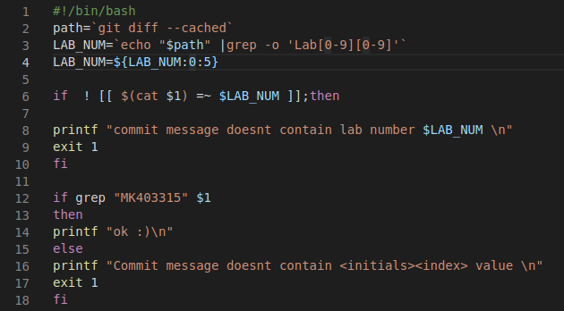
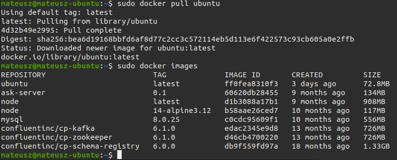
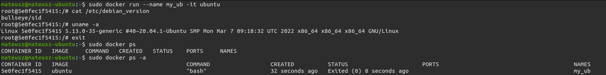
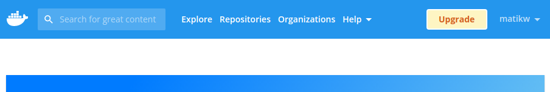

# Sprawozdanie Lab02
## Mateusz Kwiecień, Informatyka Techniczna 
### Realizacja laboratorium

1. By sprawdzić poprawność commitu odnaleziono folder **.git/hooks** oraz wprowadzono zmiany w pliku commmit-msg.sample, następnie plik zapisano bez końcówki .sample oraz nadano mu uprawnienia *chmod 774*



2. Pracowano na systemie operacyjnym Ubuntu gdzie zainstalowano już wcześniej Dockera. By udowodnić jego działanie pobrano do dockera obraz ubuntu.



3. Następnie stworzono oraz uruchomiono kontener za pomocą *sudo docker run --name my_ub -it ubuntu*



4. Założono konto na stronie dockerhub



5. Na koniec przetestowano poprawne działanie hooke'a

### Historia terminalu
```
 1862  nano commit-msg.sample
 ...
 1913  sudo docker run --name my_ub -it ubuntu
 1914  sudo docker ps
 1915  sudo docker ps -a
 
```
