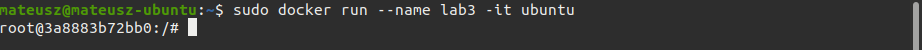
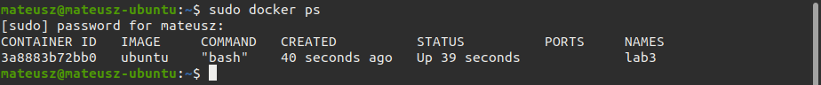
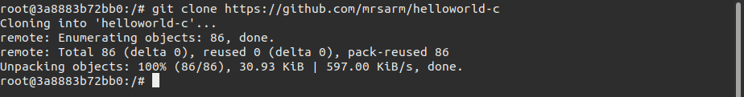
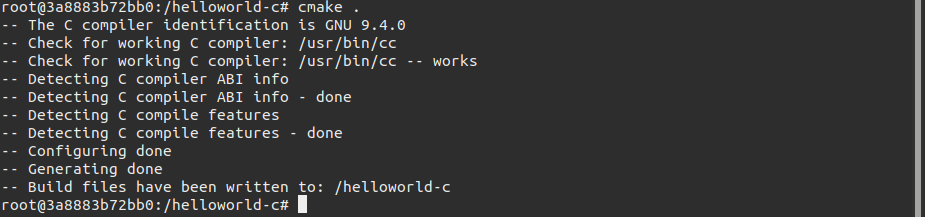
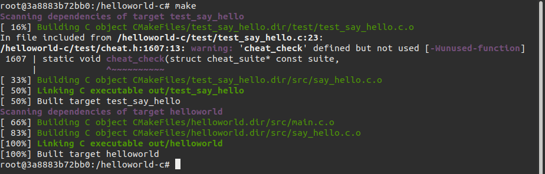
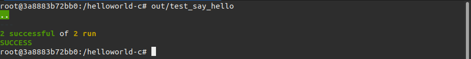
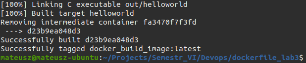
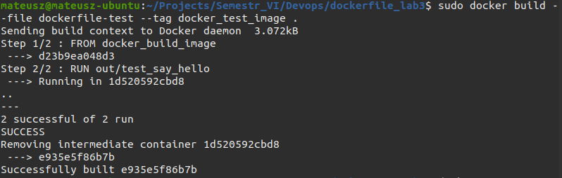
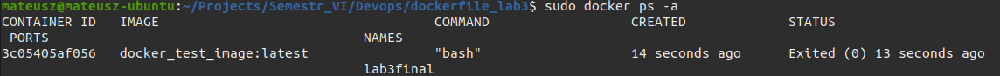

# Sprawozdanie Lab03
## Mateusz Kwiecień, Informatyka Techniczna 
### Realizacja laboratorium

1. Na początek znaleziono odpowiednie repozytorium, w którym oprogramowanie zawierało testy. Repozytorium to można znaleźć pod poniższym adresem url: https://github.com/mrsarm/helloworld-c


2. Następnie stworzono w dockerze kontener ubuntu.




3. Sklonowano wybrane repozytorium (Przed sklonowaniem wykonano `apt-get install git`)



4. wygenerowano makefile za pomocą `cmake .`



5. Następnie w folderze **helloword-c** uruchomiono `make`, by stworzyć wykonywalny program



6. Następnie uruchomiono testy za pomocą polecenia `out/test_say_hello`



7. Stworzono dockerfile służący do buildowania

```
FROM ubuntu:latest

RUN apt-get update && apt-get -y install cmake
RUN apt-get -y install git 
RUN git clone https://github.com/mrsarm/helloworld-c


WORKDIR "/helloworld-c"
RUN cmake .
RUN make 
```

sudo docker build --file dockerfile-build --tag docker_build_image .

sudo docker build --file dockerfile-test --tag docker_test_image .

8. Stworzono dockerfile służący do testowania
```
FROM docker_build_image
RUN out/test_say_hello
```
9. Uruchomiono komendę `sudo docker build --file dockerfile-build --tag docker_build_image .` by utworzyć obraz do buildowania.



10. Następnie `sudo docker build --file dockerfile-test --tag docker_test_image .` by utworzyć obraz do testów.



11. Na koniec sprawdzono kontenery komendą `docker ps -a`. Poprawnie zwróciły status exit 0.



### Historia terminalu
```
historia terminalu została przedstawiona w powyższych punktach 
```
