# Sprawozdanie Lab04
## Mateusz Kwiecień, Informatyka Techniczna 
### Realizacja laboratorium

1. Stworzono wolumin wejściowy za pomocą komendy `sudo docker create --name temp -v in_volume:/data busybox` oraz wolumen wyjściowy, zmieniając delikatnie komendę.

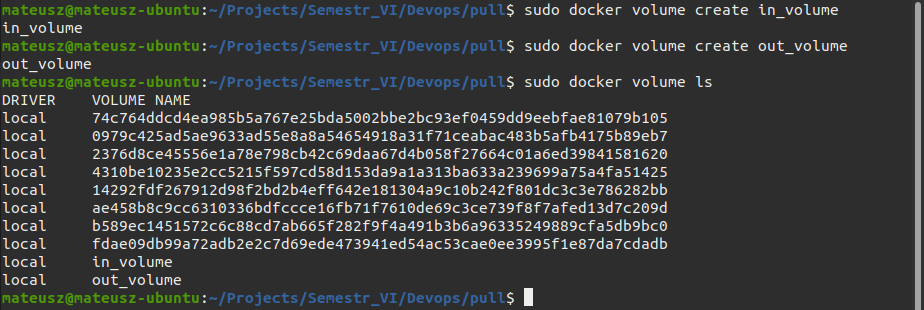

2. Z wolumenu stworzono kontener.

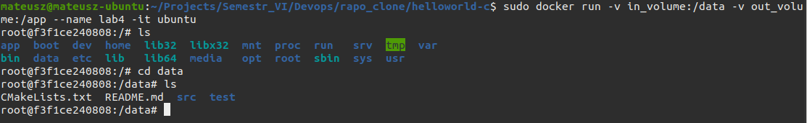

4. Stworzono kontener z dwoma wolumenami `sudo docker run -v in_volume:/data -v out_volume:/app --name lab4 -it ubuntu`.

3. Następnie skopiowano do app z build `sudo docker cp . temp:/data`.

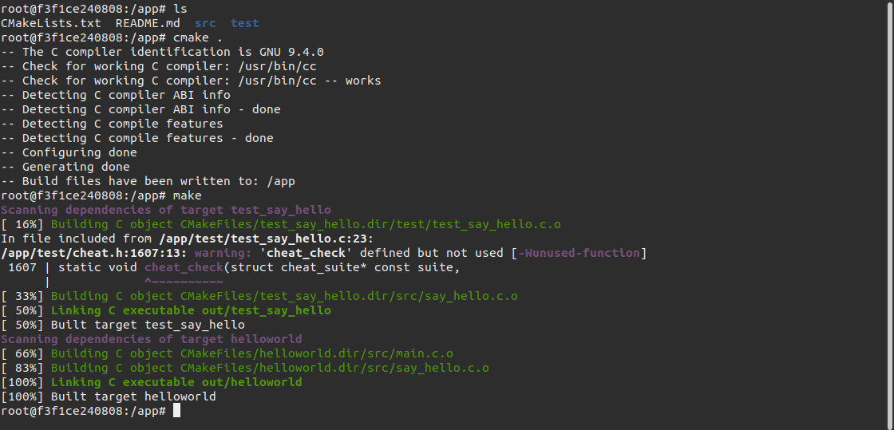

4. Uruchomiono testy.

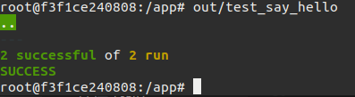

5. Stworzono sieć za pomocą `docker network create NETWORK`.

6. Następnie korzystając z iperf3 stworzono serwer `docker run --name lab4_serwer  --network NETWORK  -p 5201:5201  -it networkstatic/iperf3 -s`.

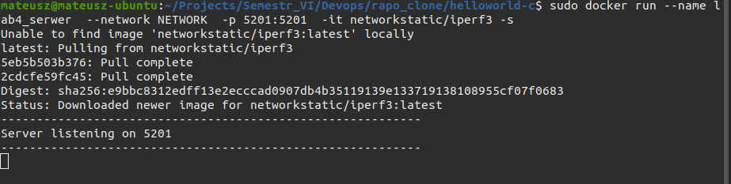

7. Stworzono także klienta łączącego się z serwerem `sudo docker run --name lab4_klient   --network NETWORK  -it networkstatic/iperf3 -c lab4_serwer`.

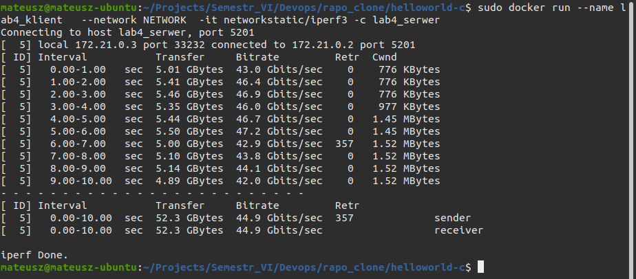

8. Następnie połączono sie z lokalnej maszyny z serwerem `iperf3 -c 172.21.0.2`.

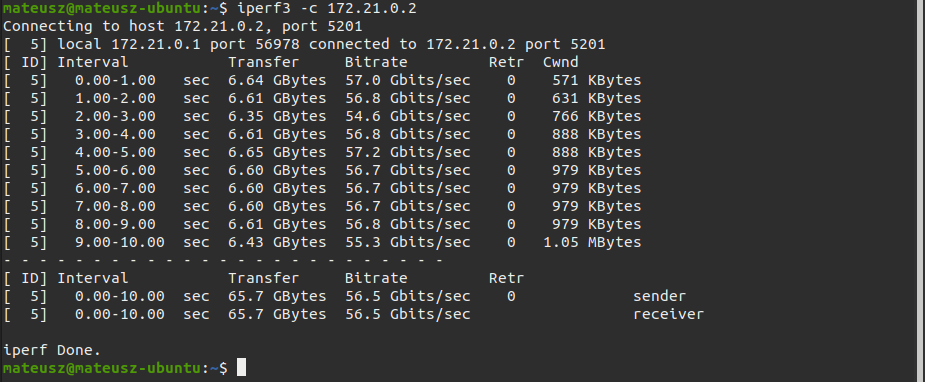

9. Logi serwera.

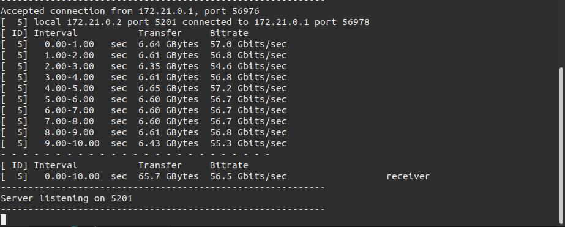

10. Zauważono, że prędkość transferu była szybsza w przypadku łączenia się z maszyny lokalnej niż z kontenera.

11. Stworzono "bridge network" za pomocą `docker network create jenkins`. 

12. Pobrano i uruchomiono docker:dind za pomocą poniższej komendy `docker run \
  --name jenkins-docker \
  --rm \
  --detach \
  --privileged \
  --network jenkins \
  --network-alias docker \
  --env DOCKER_TLS_CERTDIR=/certs \
  --volume jenkins-docker-certs:/certs/client \
  --volume jenkins-data:/var/jenkins_home \
  --publish 2376:2376 \
  docker:dind \
  --storage-driver overlay2`

13. Stworzono następujący Dockerfile oraz zbudowano go za pomocą komendy: `docker build -t myjenkins-blueocean:2.332.2-1 .
`

14. Następni wywołano następujący docker run:

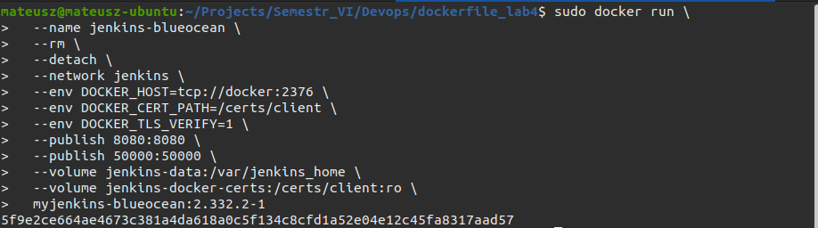

15. Po zalogowaniu się do Jenkinsa zainstalowano wtyczki a następnie dodano pierwszego administratora.

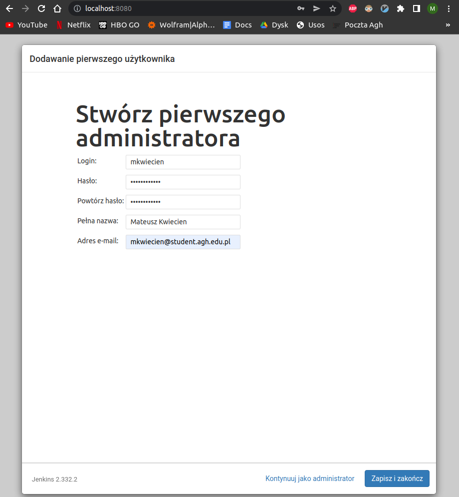

16. Działający jenkins na maszynie.

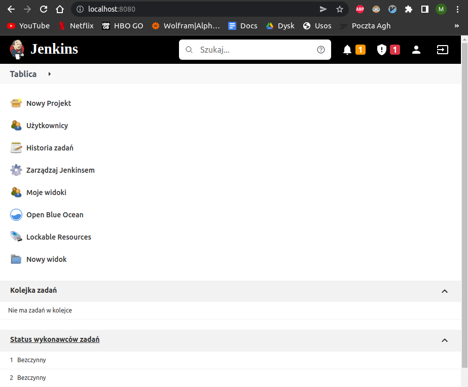.